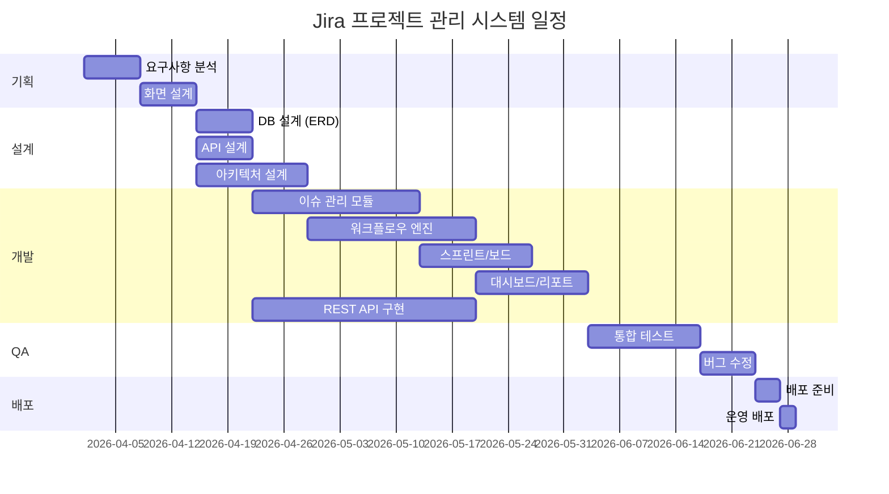

# Jira 프로젝트 관리 시스템 프로젝트 스케줄

## 1. 프로젝트 개요

| 항목 | 내용 |
|------|------|
| 프로젝트명 | Jira 프로젝트 관리 시스템 |
| 시작일 | 2026-04-01 |
| 종료일 | 2026-07-31 |
| 총 기간 | 18주 |

## 2. 마일스톤

| 마일스톤 | 목표일 | 산출물 | 상태 |
|----------|--------|--------|------|
| M1. 기획 완료 | 2026-04-14 | 요구사항 정의서, 화면 설계서 | 대기 |
| M2. 설계 완료 | 2026-05-05 | ERD, API 정의서, 아키텍처 정의서 | 대기 |
| M3. 개발 완료 | 2026-06-30 | 소스코드, 단위 테스트 결과 | 대기 |
| M4. QA 완료 | 2026-07-21 | 테스트 리포트 | 대기 |
| M5. 배포 | 2026-07-31 | 배포 완료 보고서 | 대기 |

## 3. 주차별 상세 일정

## 4. 담당자별 업무 배분

| 담당자 | 역할 | 주요 업무 |
|--------|------|-----------|
| PM | 프로젝트 관리 | 일정 관리, 이해관계자 소통, 스프린트 운영 |
| 백엔드 개발자 | API/서버 개발 | REST API, 워크플로우 엔진, DB 설계 |
| 프론트엔드 개발자 | UI 개발 | 보드, 대시보드, 이슈 관리 화면 |
| QA 엔지니어 | 품질 보증 | 테스트 계획/실행, 결함 관리 |

## 변경 이력

| 버전 | 날짜 | 작성자 | 변경 내용 |
|------|------|--------|-----------|
| v1.0 | 2026-03-21 | 팀 | 최초 작성 |
