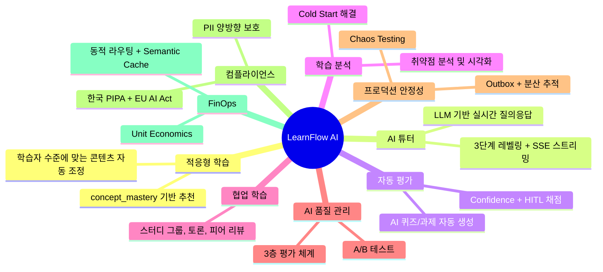
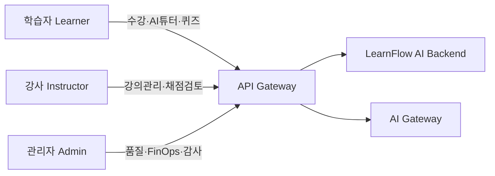
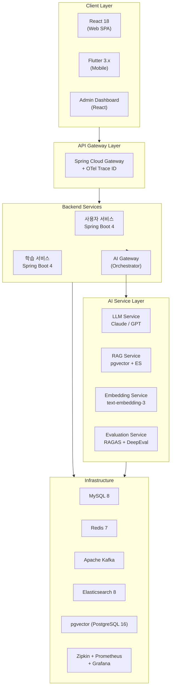
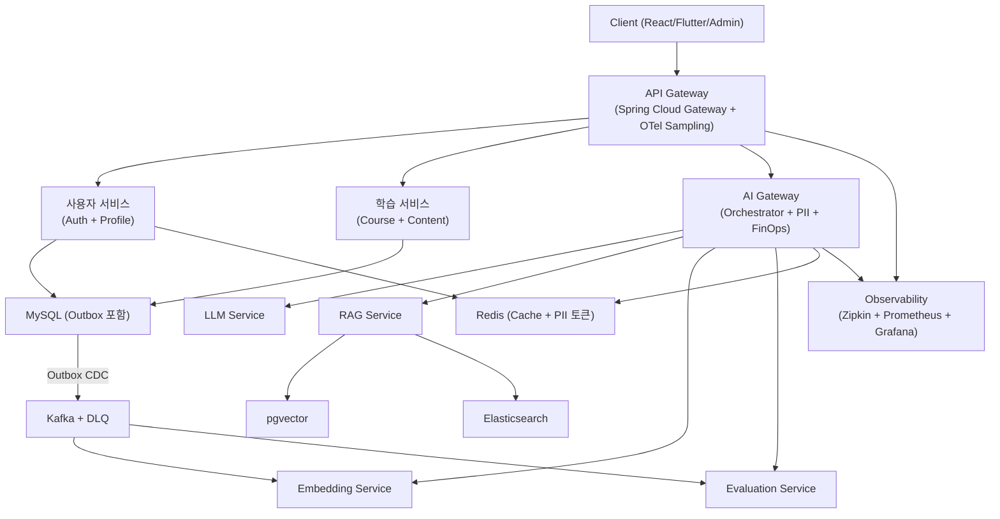
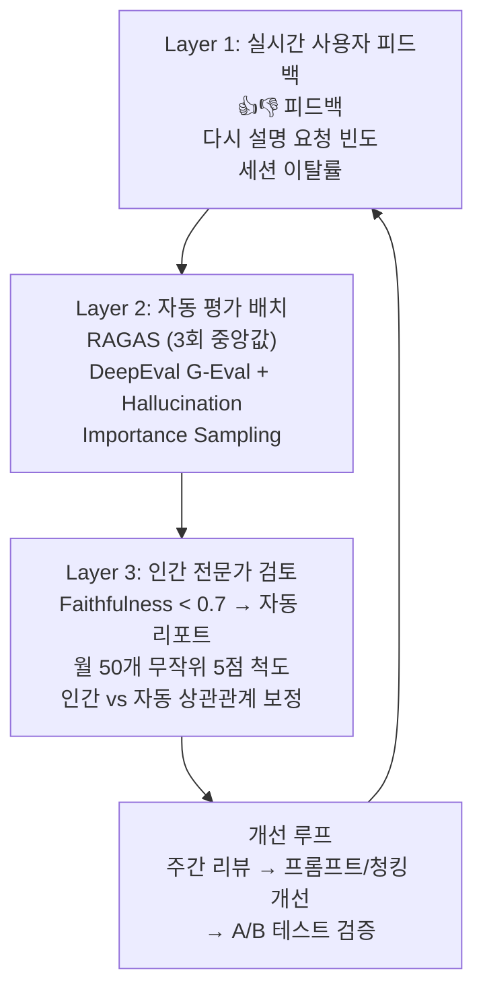

# LearnFlow AI — 프로젝트 계획서 v4.0

## 변경 이력

| 버전 | 날짜 | 변경 내용 | 작성자 |
|------|------|-----------|--------|
| v1.0 | 2025-09-01 | 초기 프로젝트 계획 작성 | AI Assistant |
| v2.0 | 2025-11-15 | AI 서비스 분리, RAG 고도화 반영 | AI Assistant |
| v3.0 | 2026-01-20 | Outbox, RAGAS, PII, FinOps 추가 | AI Assistant |
| v4.0 | 2026-04-02 | 3층 평가, Semantic Chunking, Output PII, Unit Economics, OTel 반영 | AI Assistant |

---

## 1. 프로젝트 배경 및 목표

### 1.1 프로젝트 배경

기존 LMS(학습 관리 시스템)는 모든 학습자에게 동일한 콘텐츠를 동일한 순서로 제공하는 일방향 구조를 취하고 있다. 학습자의 이해도, 취약점, 학습 속도에 대한 개인화가 부재하여 학습 효율이 낮고, 강사는 수강생 개개인의 학습 상태를 파악하기 어렵다.

AI/LLM 기술의 발전으로 학습자 맞춤형 콘텐츠 추천, 자동 퀴즈 생성, 실시간 질의응답, 학습 분석 등이 가능해졌다. LearnFlow AI는 이를 접목하여 능동적이고 적응형인 학습 경험을 제공하는 차세대 LMS를 구축한다.

### 1.2 프로젝트 목표 (9개)



| # | 목표 | 핵심 지표 |
|---|------|-----------|
| ① | **적응형 학습** — 학습자 수준에 맞는 콘텐츠 자동 조정 | `concept_mastery` 향상률 |
| ② | **AI 튜터** — LLM 기반 실시간 질의응답 및 개념 설명 | 응답 만족도(👍 비율 ≥ 75%) |
| ③ | **자동 평가** — AI 퀴즈/과제 자동 생성 및 채점 | Confidence ≥ 0.8 자동 확정률 |
| ④ | **학습 분석** — 취약점 분석, 학습 패턴 시각화, AI 추천 | 추천 클릭률 |
| ⑤ | **협업 학습** — 스터디 그룹, 토론, 피어 리뷰 | DAU 커뮤니티 참여율 |
| ⑥ | **AI 품질 관리** — 3층 평가, A/B 테스트, 지속 개선 | Faithfulness ≥ 0.85 |
| ⑦ | **프로덕션 안정성** — Outbox, 분산 추적, Chaos Testing | 이벤트 손실 0건, P95 < 4s |
| ⑧ | **컴플라이언스** — PII 양방향 보호, 감사 추적 | PII 유출 0건 |
| ⑨ | **FinOps** — Unit Economics, 동적 라우팅, Semantic Cache | AI 비용/세션 < $0.15 |

---

## 2. 대상 사용자

| 역할 | 설명 | 주요 기능 접근 범위 |
|------|------|---------------------|
| **학습자 (Learner)** | 강의를 수강하고 학습하는 최종 사용자 | 강의 수강, AI 튜터 채팅, 퀴즈/과제 제출, 학습 분석 대시보드, 채점 이의 제기, 온보딩 진단 |
| **강사 (Instructor)** | 강의를 생성하고 관리하는 콘텐츠 제공자 | 강의/섹션/레슨 관리, AI 퀴즈 생성, 과제 출제, 수강생 분석, Manual Review Queue 처리 |
| **관리자 (Admin)** | 시스템 전체를 운영하는 플랫폼 관리자 | 사용자 관리, AI 품질 대시보드, FinOps Kill-switch, OTel 분산 추적, 감사 로그, A/B 테스트, 프롬프트 관리 |



---

## 3. 기술 스택

### 3.1 Backend

| 영역 | 기술 | 버전 | 용도 |
|------|------|------|------|
| Framework | Spring Boot | 4.x | 메인 애플리케이션 서버 |
| Language | Java | 21+ | Virtual Threads (Project Loom) |
| ORM | Spring Data JPA + QueryDSL | 5.x | 데이터 접근 계층 |
| Security | Spring Security | 7.x | JWT 인증/인가, RBAC |
| API 문서 | SpringDoc OpenAPI | 2.x | Swagger UI |
| Build | Gradle | 8.x | Kotlin DSL |
| DB | MySQL | 8.x | Source of Truth (Transactional) |
| Cache | Redis | 7.x | 세션, 캐시, Rate Limiting, PII 토큰 매핑 |
| 메시징 | Apache Kafka | 3.x | 이벤트 기반 비동기 처리 |
| CDC | Debezium | 2.x | Outbox → Kafka 릴레이 (Phase 2) |
| 검색 | Elasticsearch | 8.x | BM25 Hybrid Search |
| 스토리지 | MinIO / AWS S3 | - | 강의 파일, 영상 저장 |
| Resilience | Resilience4j | - | Circuit Breaker, Retry, Rate Limiter |
| Tracing | Micrometer + OpenTelemetry + Zipkin | - | 분산 추적, Business Context |
| PII | Presidio + KoNLPy | - | 개인정보 마스킹/역마스킹 |
| DB Migration | Flyway | - | 스키마 버전 관리 (V1~V12) |

### 3.2 AI / LLM

| 영역 | 기술 | 용도 |
|------|------|------|
| LLM API (Primary) | Claude API (Anthropic) | 메인 AI 엔진 (Tutor, Quiz, Grading) |
| LLM API (Fallback) | OpenAI GPT API | Circuit Breaker Fallback |
| Embedding | text-embedding-3-small | 콘텐츠 청크 임베딩 |
| Vector DB | pgvector (Phase 1) → Qdrant (Phase 2+) | RAG 벡터 저장 및 검색 |
| Re-ranking | CrossEncoder (ms-marco-MiniLM) | 검색 결과 재정렬 Top 5 |
| RAG 평가 | RAGAS + DeepEval | 자동 품질 평가 (3층 평가 Layer 2) |
| Chunking | Recursive + Semantic Boundary Detection | 의미 경계 보존 청킹 |
| Prompt 관리 | 자체 Template Engine + Version Registry | 프롬프트 버전 관리 및 A/B 테스트 |

### 3.3 Frontend

| 영역 | 기술 | 버전 | 용도 |
|------|------|------|------|
| Web Framework | React | 18.x | SPA 웹 클라이언트 |
| Language | TypeScript | 5.x | 타입 안전성 |
| 상태 관리 | Zustand | 4.x | 전역 상태 |
| API 캐싱 | TanStack Query | 5.x | 서버 상태 캐싱 |
| UI 컴포넌트 | shadcn/ui + Tailwind CSS | - | 디자인 시스템 |
| 차트 | Recharts | 2.x | 학습 분석 시각화 |
| 에디터 | TipTap | 2.x | 마크다운/리치텍스트 강의 편집 |
| Mobile | Flutter | 3.x | 크로스플랫폼 모바일 앱 |
| Mobile 상태 | Riverpod | 2.x | Flutter 상태 관리 |

### 3.4 인프라

| 영역 | 기술 | 용도 |
|------|------|------|
| 컨테이너 | Docker + Docker Compose | 개발/스테이징/배포 |
| CI/CD | GitHub Actions | 자동 빌드, 테스트, 배포 |
| 모니터링 | Prometheus + Grafana | 시스템 + AI + FinOps 메트릭 |
| 분산 추적 | Zipkin (OTel) | 서비스 간 분산 추적 |
| CDC | Debezium | Outbox 이벤트 릴레이 |
| 파일 스토리지 | MinIO (로컬) / AWS S3 (프로덕션) | 강의 콘텐츠 저장 |

### 3.5 기술 스택 다이어그램



---

## 4. 시스템 아키텍처 개요

### 4.1 전체 아키텍처 흐름



### 4.2 핵심 패턴

| 패턴 | 적용 위치 | 목적 |
|------|-----------|------|
| Transactional Outbox | 학습/퀴즈/과제 서비스 | 이벤트 무손실 발행 |
| Consumer 멱등성 (dedup_key) | 모든 Kafka Consumer | 중복 처리 방지 |
| Circuit Breaker (Resilience4j) | AI Gateway | LLM API 장애 격리 |
| PII 양방향 마스킹 | AI Gateway | 개인정보 보호 (Input + Output) |
| Semantic Cache | AI Gateway | LLM 비용 40~60% 절감 |
| OTel Distributed Tracing | API Gateway → 전 서비스 | 서비스 간 추적 |

---

## 5. 팀 구성

| 역할 | 인원 | 담당 영역 |
|------|------|-----------|
| Backend Engineer | 2명 | Spring Boot, Kafka, DB, Outbox, OTel |
| AI/ML Engineer | 1명 | AI Gateway, RAG, Embedding, PII, FinOps |
| Frontend Engineer | 1명 | React Web, 학습 분석 UI, 관리자 대시보드 |
| Mobile Engineer | 1명 | Flutter 3.x 앱 (Phase 6) |
| DevOps Engineer | 1명 | Docker, CI/CD, Prometheus, Grafana, Chaos Test |
| QA Engineer | 1명 | 통합 테스트, Chaos Test 시나리오, 보안 점검 |
| **합계** | **7명** | |

---

## 6. 프로젝트 범위

### 6.1 In-Scope (포함)

- 학습자/강사/관리자 3개 역할 기반 사용자 관리 및 JWT 인증
- 강의(Course) / 섹션(Section) / 레슨(Lesson) CRUD 및 수강 신청
- AI 튜터 — SSE 스트리밍, 3단계 레벨링, Short/Long-term 이중 메모리
- RAG 파이프라인 v4.0 — Semantic Chunking, Hybrid Search, Re-ranking, Context Compression
- 퀴즈/과제 자동 생성 및 AI 채점 (Confidence Score + HITL)
- 온보딩 — 진단 테스트 (Bloom's 배분) + 자가 진단 (confidence weight)
- 학습 분석 — concept_mastery, 취약점 분석, AI 추천
- Transactional Outbox + Debezium/Polling + Kafka (이벤트 인프라)
- AI Gateway — PII 양방향 마스킹 (Presidio + KoNLPy), FinOps Kill-switch
- OTel 분산 추적 (Sampling 10~30%, 에러 100%, Business Context)
- 3층 AI 품질 평가 (사용자 피드백 + RAGAS/DeepEval + 인간 검토)
- A/B 테스트 + 프롬프트 버전 관리
- FinOps — Unit Economics, 예산 동적 라우팅, Semantic Cache
- Flutter 3.x 모바일 앱 (강의 수강, AI 튜터, 학습 분석 핵심 화면)
- 커뮤니티 (토론, Q&A 게시판)
- 알림 시스템 (채점 완료, 이의 제기 결과, 비용 경고)
- AI 전용 Grafana 대시보드 (hallucination, RAG latency, PII, FinOps, Outbox)
- Docker Compose 기반 전체 스택 배포
- Chaos Testing (Kafka 다운, PII 대량 입력, 비용 폭주 시나리오)

### 6.2 Out-of-Scope (제외)

- 결제 시스템 (Stripe/PG 연동) — 별도 프로젝트
- 라이브 스트리밍 (실시간 강의 방송)
- 외부 LMS 데이터 마이그레이션 도구
- iOS/Android 앱스토어 배포 절차 (빌드까지만)
- 다국어(i18n) 지원 — 한국어 우선
- 소셜 로그인 (OAuth2 Google/Kakao) — Phase 후속
- Vector DB Qdrant 전환 실구현 — 로드맵 설계까지

---

## 7. v4.0 핵심 차별화 포인트

### 7.1 AI 품질 관리 — 3층 평가 체계



### 7.2 RAG v4.0 — Semantic Chunking + chunk_hash

- **Semantic Chunking 하이브리드**: Recursive Splitter (200~400 토큰, 20% overlap) + Semantic Boundary Detection (유사도 기반 병합/분리)
- **chunk_hash (SHA-256)**: 동일 내용 재임베딩 스킵 → 임베딩 비용 절감
- **Soft Delete 90일**: ACTIVE/INACTIVE 상태 관리, 90일 후 물리 삭제
- **Qdrant 전환 로드맵**: pgvector → Qdrant (대규모 Scale 시), 멀티모달 준비

### 7.3 PII 컴플라이언스 — Output 스캔 추가 (v4.0)

- **Input 마스킹**: Regex (한국 특화) + NER (Presidio + KoNLPy) + 토큰 치환
- **Output 스캔 (v4.0 신규)**: LLM이 새로 생성한 PII 감지 → 마스킹 + 감사 로그 `OUTPUT_PII_DETECTED`
- **Pseudonymization**: 완전 마스킹 외 가명화 옵션
- **한국 PIPA + EU AI Act**: 처리 목적 명시, 위탁 고지, AI 생성 결과 명시

### 7.4 FinOps — Unit Economics (v4.0)

| 지표 | 목표값 |
|------|--------|
| cost_per_tutor_session | < $0.15 |
| cost_per_quiz_generation | < $0.05 |
| cost_per_grading | < $0.03 |
| Soft Limit (일) | $80 → Slack/이메일 알림 |
| Hard Limit (일) | $150 → Opus 비활성 + Haiku 강제 |
| Semantic Cache 절감 | 40~60% |

### 7.5 OTel 분산 추적 (v4.0)

- **Sampling**: dev 100% / staging 50% / prod 10~30%, 5xx 에러 100%, AI API 호출 100%
- **Business Context Span Attributes**: `user.id`, `course.id`, `ai.model`, `ai.tokens.input/output`, `ai.cost_usd`, `rag.chunks_retrieved`, `rag.rerank_score`, `cache.hit`

---

## 8. 리스크 매트릭스

```mermaid
quadrantChart
    title 리스크 매트릭스 (영향도 vs 발생 가능성)
    x-axis 낮은 발생 가능성 --> 높은 발생 가능성
    y-axis 낮은 영향도 --> 높은 영향도
    quadrant-1 즉시 대응
    quadrant-2 모니터링
    quadrant-3 수용
    quadrant-4 예방
    LLM API 장애: [0.7, 0.9]
    API 비용 폭증: [0.6, 0.85]
    Prompt Injection: [0.5, 0.88]
    PII 유출(Output): [0.4, 0.9]
    Kafka 브로커 장애: [0.35, 0.85]
    할루시네이션: [0.65, 0.8]
    AI 채점 분쟁: [0.55, 0.6]
    RAGAS 점수 불안정: [0.6, 0.5]
    콜드 스타트: [0.5, 0.45]
    24주 일정 지연: [0.4, 0.6]
    pgvector 대규모 한계: [0.25, 0.4]
    Tracing 오버헤드: [0.3, 0.3]
```

| 리스크 | 영향도 | 발생 가능성 | 대응 방안 |
|--------|--------|-------------|-----------|
| LLM API 장애 | 높음 | 중간 | Resilience4j Circuit Breaker + OpenAI Fallback 자동 전환 |
| API 비용 폭증 | 높음 | 중간 | FinOps Kill-switch + Unit Economics + 동적 라우팅 + Semantic Cache |
| Prompt Injection | 높음 | 중간 | 7 Layer 다층 방어 (입력 필터링 ~ Tool 제한 ~ FinOps) |
| PII 유출 (Output) | 높음 | 낮음 | Output PII 스캔 (v4.0) + 감사 로그 `OUTPUT_PII_DETECTED` |
| Kafka 브로커 장애 | 높음 | 낮음 | Transactional Outbox DB 안전 저장 → DLQ 복구 |
| 할루시네이션 | 높음 | 중간 | 3층 평가 (RAGAS + DeepEval + 인간) + Importance Sampling |
| RAGAS 점수 불안정 | 중간 | 중간 | 3회 평가 중앙값 + DeepEval 병행 + 인간 보정 |
| AI 채점 분쟁 | 중간 | 중간 | Confidence (rubric_coverage 포함) + Appeal + Manual Queue |
| 콜드 스타트 | 중간 | 중간 | 온보딩 진단 (Bloom's 배분 + confidence weight) |
| Tombstone vector DB 부하 | 중간 | 낮음 | Soft Delete + chunk_hash 스킵 + 90일 보관 후 물리 삭제 |
| pgvector 대규모 한계 | 낮음 | 낮음 | Qdrant 전환 로드맵 + VectorStore 추상화 인터페이스 |
| Tracing 오버헤드 | 낮음 | 낮음 | Sampling 10~30% + 에러 100% (오버헤드 최소화) |
| 24주 일정 지연 | 중간 | 낮음 | Phase 6 버퍼 주차 + Phase별 독립 배포 가능 설계 |

---

## 9. 보안 설계 — 7 Layer

| Layer | 항목 | 구현 |
|-------|------|------|
| Layer 1 | 입력 필터링 | 길이 제한 + 위험 패턴 감지 (SQL Injection, XSS) |
| Layer 2 | PII Masking | Input + Output 양방향 스캔 (Presidio + KoNLPy + Regex) |
| Layer 3 | System Prompt 격리 | 절대 노출 금지, 별도 Template Registry 관리 |
| Layer 4 | Output Validation | 점수 범위 검증, JSON 스키마 검증, 이상값 필터링 |
| Layer 5 | 데이터 격리 | course_id 기반 RAG 검색 범위 제한 |
| Layer 6 | Tool 사용 제한 | DB 직접 조회 차단, 외부 URL 차단, 파일 시스템 차단 |
| Layer 7 | FinOps Kill-switch | Soft/Hard 한도 초과 시 자동 다운그레이드 + Admin 수동 해제 |

---

## 10. 성공 기준 (KPI)

| 카테고리 | 지표 | 목표값 |
|----------|------|--------|
| AI 품질 | Faithfulness (RAGAS) | ≥ 0.85 |
| AI 품질 | 사용자 만족도 (👍 비율) | ≥ 75% |
| AI 품질 | Hallucination Rate (DeepEval) | ≤ 10% |
| 성능 | AI 튜터 응답 P95 | < 4s |
| 성능 | 일반 API P95 | < 500ms |
| 성능 | 동시접속 지원 | 1,000명 |
| FinOps | AI 비용/튜터 세션 | < $0.15 |
| FinOps | Semantic Cache Hit Rate | ≥ 40% |
| 안정성 | 이벤트 손실 | 0건 |
| 안정성 | 서비스 가용성 | ≥ 99.9% |
| 보안 | PII 유출 | 0건 |
| 보안 | Chaos Test 통과 | 5개 시나리오 100% |
