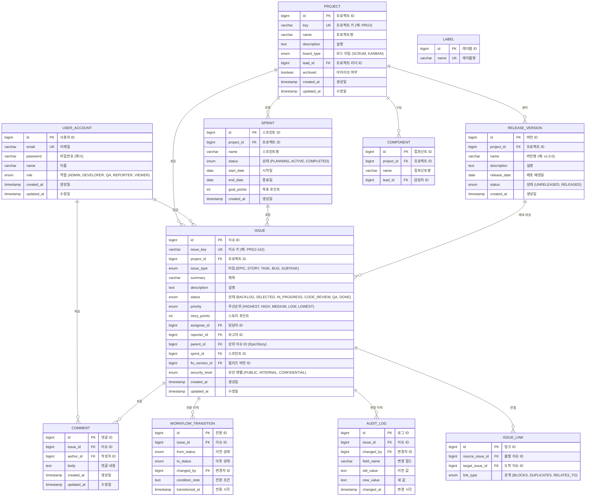

# Jira 프로젝트 관리 시스템 ERD (Entity-Relationship Diagram)

## 1. 개요

본 문서는 Jira 프로젝트 관리 시스템의 데이터베이스 구조를 정의한다.

### 1.1 데이터베이스 정보

| 항목 | 내용 |
|------|------|
| DBMS | PostgreSQL |
| 버전 | 16.x |
| 문자셋 | UTF-8 |
| Collation | ko_KR.UTF-8 |

## 2. ERD 다이어그램

## 3. 테이블 상세 명세

### 3.1 PROJECT (프로젝트)

| 컬럼명 | 타입 | 제약조건 | 기본값 | 설명 |
|--------|------|----------|--------|------|
| id | BIGINT | PK, AUTO_INCREMENT | - | 프로젝트 ID |
| key | VARCHAR(10) | UNIQUE, NOT NULL | - | 프로젝트 키 |
| name | VARCHAR(200) | NOT NULL | - | 프로젝트명 |
| description | TEXT | - | NULL | 설명 |
| board_type | ENUM('SCRUM','KANBAN') | NOT NULL | 'SCRUM' | 보드 타입 |
| lead_id | BIGINT | FK(USER_ACCOUNT) | - | 프로젝트 리더 |
| archived | BOOLEAN | NOT NULL | false | 아카이브 여부 |
| created_at | TIMESTAMP | NOT NULL | CURRENT_TIMESTAMP | 생성일 |
| updated_at | TIMESTAMP | NOT NULL | CURRENT_TIMESTAMP | 수정일 |

### 3.2 ISSUE (이슈)

| 컬럼명 | 타입 | 제약조건 | 기본값 | 설명 |
|--------|------|----------|--------|------|
| id | BIGINT | PK, AUTO_INCREMENT | - | 이슈 ID |
| issue_key | VARCHAR(20) | UNIQUE, NOT NULL | - | 이슈 키 |
| project_id | BIGINT | FK(PROJECT), NOT NULL | - | 프로젝트 ID |
| issue_type | ENUM('EPIC','STORY','TASK','BUG','SUBTASK') | NOT NULL | - | 이슈 타입 |
| summary | VARCHAR(500) | NOT NULL | - | 제목 |
| description | TEXT | - | NULL | 설명 |
| status | ENUM('BACKLOG','SELECTED','IN_PROGRESS','CODE_REVIEW','QA','DONE') | NOT NULL | 'BACKLOG' | 상태 |
| priority | ENUM('HIGHEST','HIGH','MEDIUM','LOW','LOWEST') | NOT NULL | 'MEDIUM' | 우선순위 |
| story_points | INT | - | NULL | 스토리 포인트 |
| assignee_id | BIGINT | FK(USER_ACCOUNT) | NULL | 담당자 |
| reporter_id | BIGINT | FK(USER_ACCOUNT), NOT NULL | - | 보고자 |
| parent_id | BIGINT | FK(ISSUE) | NULL | 상위 이슈 ID |
| sprint_id | BIGINT | FK(SPRINT) | NULL | 스프린트 ID |
| fix_version_id | BIGINT | FK(RELEASE_VERSION) | NULL | 릴리즈 버전 |
| security_level | ENUM('PUBLIC','INTERNAL','CONFIDENTIAL') | NOT NULL | 'PUBLIC' | 보안 레벨 |
| created_at | TIMESTAMP | NOT NULL | CURRENT_TIMESTAMP | 생성일 |
| updated_at | TIMESTAMP | NOT NULL | CURRENT_TIMESTAMP | 수정일 |

**인덱스**:
- `idx_issue_project` (project_id) - 프로젝트별 이슈 조회
- `idx_issue_assignee` (assignee_id) - 담당자별 이슈 조회
- `idx_issue_status` (status) - 상태별 이슈 조회
- `idx_issue_sprint` (sprint_id) - 스프린트별 이슈 조회

## 4. 관계 정의

| 부모 테이블 | 자식 테이블 | 관계 | FK 컬럼 | 설명 |
|------------|------------|------|---------|------|
| PROJECT | ISSUE | 1:N | project_id | 프로젝트에 속한 이슈 |
| PROJECT | SPRINT | 1:N | project_id | 프로젝트의 스프린트 |
| PROJECT | RELEASE_VERSION | 1:N | project_id | 프로젝트의 릴리즈 버전 |
| PROJECT | COMPONENT | 1:N | project_id | 프로젝트의 컴포넌트 |
| USER_ACCOUNT | ISSUE | 1:N | assignee_id | 담당자-이슈 |
| USER_ACCOUNT | COMMENT | 1:N | author_id | 작성자-댓글 |
| ISSUE | COMMENT | 1:N | issue_id | 이슈의 댓글 |
| ISSUE | WORKFLOW_TRANSITION | 1:N | issue_id | 이슈의 상태 전환 이력 |
| ISSUE | AUDIT_LOG | 1:N | issue_id | 이슈의 변경 이력 |
| ISSUE | ISSUE | 1:N | parent_id | 상위-하위 이슈 계층 (Epic→Story→Sub-task) |
| SPRINT | ISSUE | 1:N | sprint_id | 스프린트에 포함된 이슈 |
| RELEASE_VERSION | ISSUE | 1:N | fix_version_id | 릴리즈에 포함된 이슈 |

## 5. 데이터 마이그레이션 노트

- 초기 시딩: 기본 프로젝트 역할(ADMIN, DEVELOPER, QA, REPORTER, VIEWER) 생성
- 표준 워크플로우 상태 6단계 초기화
- 기본 우선순위(HIGHEST~LOWEST) 및 이슈 타입(EPIC~SUBTASK) 등록

## 변경 이력

| 버전 | 날짜 | 작성자 | 변경 내용 |
|------|------|--------|-----------|
| v1.0 | 2026-03-21 | 팀 | 최초 작성 |
