# LearnFlow AI — ERD 설계서 v5.0

## 변경 이력

| 버전 | 날짜 | 변경 내용 | 작성자 |
|------|------|-----------|--------|
| v1.0 | 2025-09-01 | 초기 ERD (사용자/강의/퀴즈 기본) | Architecture Team |
| v2.0 | 2025-11-01 | AI 채팅, 임베딩, 학습 분석 추가 | Architecture Team |
| v3.0 | 2026-01-15 | Outbox, RAGAS, PII, FinOps 테이블 추가 | Architecture Team |
| v4.0 | 2026-03-01 | Semantic Chunking(chunk_hash), dedup_key, destination_topic, Confidence, Appeal, Bloom 배분 | Architecture Team |
| v5.0 | 2026-04-02 | 전 도메인 Mermaid erDiagram 통합, 인덱스 전략 정형화, deepeval/ragas_evaluations 보완 | Architecture Team |

---

## 1. 개요

LearnFlow AI 전체 데이터 모델을 도메인별로 정의한다.
총 **30개 이상** 테이블을 10개 도메인으로 구성하며, 모든 설계는 v4.0 통합 완결본 기준이다.

### 1.1 도메인 목록

| # | 도메인 | 핵심 테이블 |
|---|--------|------------|
| 4.1 | 사용자 | users, user_profiles, user_learning_prefs |
| 4.2 | 강의 | courses, sections, lessons, enrollments |
| 4.3 | AI 채팅 | ai_chat_sessions, ai_chat_messages |
| 4.4 | 퀴즈/과제 | quizzes, quiz_questions, quiz_attempts, assignment_submissions |
| 4.5 | 학습 분석 | learning_activities, concept_mastery, weakness_analyses |
| 4.6 | 임베딩 | content_embeddings |
| 4.7 | 이벤트/운영 | outbox_events, audit_logs |
| 4.8 | AI 품질 관리 | ai_feedback_logs, prompt_versions, ab_tests, ab_test_results, ragas_evaluations |
| 4.9 | FinOps | ai_cost_logs, cost_thresholds |
| 4.10 | 온보딩 | diagnostic_tests, diagnostic_results |

---

## 2. 전체 ERD (Mermaid erDiagram)

```mermaid
erDiagram

    %% ─── 4.1 사용자 도메인 ───
    users {
        BIGINT id PK
        VARCHAR email UK
        VARCHAR password_hash
        ENUM role "LEARNER|INSTRUCTOR|ADMIN"
        ENUM status "ACTIVE|INACTIVE|SUSPENDED"
        DATETIME created_at
        DATETIME updated_at
    }

    user_profiles {
        BIGINT id PK
        BIGINT user_id FK
        VARCHAR nickname
        VARCHAR avatar_url
        TEXT bio
        INT level
        INT exp_point
        DATETIME updated_at
    }

    user_learning_prefs {
        BIGINT id PK
        BIGINT user_id FK
        ENUM preferred_pace "SLOW|NORMAL|FAST"
        INT daily_goal_min
        JSON interests
        ENUM difficulty "BEGINNER|INTERMEDIATE|ADVANCED"
        DATETIME updated_at
    }

    %% ─── 4.2 강의 도메인 ───
    courses {
        BIGINT id PK
        BIGINT instructor_id FK
        VARCHAR title
        TEXT description
        VARCHAR category
        ENUM level "BEGINNER|INTERMEDIATE|ADVANCED"
        VARCHAR thumbnail_url
        DECIMAL price
        ENUM status "DRAFT|PUBLISHED|ARCHIVED"
        DECIMAL avg_rating
        DATETIME created_at
        DATETIME updated_at
    }

    sections {
        BIGINT id PK
        BIGINT course_id FK
        VARCHAR title
        INT order_num
        DATETIME created_at
    }

    lessons {
        BIGINT id PK
        BIGINT section_id FK
        VARCHAR title
        ENUM type "VIDEO|TEXT|QUIZ|ASSIGNMENT"
        TEXT content
        VARCHAR video_url
        INT duration_min
        INT order_num
        DATETIME created_at
        DATETIME updated_at
    }

    enrollments {
        BIGINT id PK
        BIGINT user_id FK
        BIGINT course_id FK
        ENUM status "ACTIVE|COMPLETED|CANCELLED"
        DECIMAL progress
        DATETIME enrolled_at
        DATETIME completed_at
    }

    %% ─── 4.3 AI 채팅 도메인 ───
    ai_chat_sessions {
        BIGINT id PK
        BIGINT user_id FK
        BIGINT course_id FK
        VARCHAR title
        JSON context
        DATETIME created_at
        DATETIME updated_at
    }

    ai_chat_messages {
        BIGINT id PK
        BIGINT session_id FK
        ENUM role "USER|ASSISTANT|SYSTEM"
        TEXT content
        INT token_used
        ENUM feedback "GOOD|BAD"
        VARCHAR model_used
        DATETIME created_at
    }

    %% ─── 4.4 퀴즈/과제 도메인 ───
    quizzes {
        BIGINT id PK
        BIGINT lesson_id FK
        VARCHAR title
        ENUM difficulty "EASY|MEDIUM|HARD"
        BOOLEAN ai_generated
        VARCHAR prompt_version
        DATETIME created_at
    }

    quiz_questions {
        BIGINT id PK
        BIGINT quiz_id FK
        TEXT question
        ENUM type "MULTIPLE_CHOICE|SHORT_ANSWER|TRUE_FALSE|CODING"
        JSON options
        TEXT answer
        TEXT explanation
        ENUM bloom_level "REMEMBER|UNDERSTAND|APPLY|ANALYZE|EVALUATE|CREATE"
        INT order_num
    }

    quiz_attempts {
        BIGINT id PK
        BIGINT user_id FK
        BIGINT quiz_id FK
        DECIMAL score
        JSON answers
        TEXT ai_feedback
        ENUM status "IN_PROGRESS|SUBMITTED|GRADED"
        DATETIME started_at
        DATETIME submitted_at
        DATETIME graded_at
    }

    assignments {
        BIGINT id PK
        BIGINT lesson_id FK
        VARCHAR title
        TEXT description
        TEXT rubric
        DATETIME due_date
        DATETIME created_at
    }

    assignment_submissions {
        BIGINT id PK
        BIGINT assignment_id FK
        BIGINT user_id FK
        TEXT content
        VARCHAR file_url
        DECIMAL ai_score
        DECIMAL ai_confidence
        TEXT ai_feedback
        DECIMAL instructor_score
        TEXT instructor_feedback
        ENUM status "SUBMITTED|AI_GRADED|CONFIRMED|APPEALED|MANUAL_REVIEW"
        TEXT appeal_reason
        DATETIME appeal_at
        DATETIME reviewed_at
        DATETIME submitted_at
    }

    %% ─── 4.5 학습 분석 도메인 ───
    learning_activities {
        BIGINT id PK
        BIGINT user_id FK
        BIGINT lesson_id FK
        ENUM activity_type "LESSON_VIEW|QUIZ_ATTEMPT|CHAT_SESSION|VIDEO_WATCH"
        INT duration_sec
        BOOLEAN completed
        DATETIME created_at
    }

    concept_mastery {
        BIGINT id PK
        BIGINT user_id FK
        BIGINT course_id FK
        VARCHAR concept
        DECIMAL mastery_score
        DECIMAL confidence
        ENUM source "DIAGNOSTIC|QUIZ|MANUAL"
        INT attempt_count
        DATETIME last_updated
    }

    weakness_analyses {
        BIGINT id PK
        BIGINT user_id FK
        BIGINT course_id FK
        VARCHAR topic
        DECIMAL mastery_level
        TEXT suggestion
        DATETIME analyzed_at
    }

    %% ─── 4.6 임베딩 도메인 ───
    content_embeddings {
        BIGINT id PK
        BIGINT course_id FK
        BIGINT lesson_id FK
        INT chunk_index
        TEXT chunk_text
        VECTOR embedding "dim=1536"
        INT token_count
        VARCHAR chunk_hash "SHA-256 UK"
        JSONB metadata
        VARCHAR chunking_strategy "RECURSIVE|SEMANTIC|HYBRID"
        INT version
        ENUM status "ACTIVE|INACTIVE"
        DATETIME last_modified_at
        DATETIME created_at
        DATETIME updated_at
    }

    %% ─── 4.7 이벤트/운영 도메인 ───
    outbox_events {
        BIGINT id PK
        VARCHAR aggregate_type
        BIGINT aggregate_id
        VARCHAR event_type
        VARCHAR dedup_key UK "aggregate_id+event_type+version"
        VARCHAR destination_topic
        JSON payload
        ENUM status "PENDING|PUBLISHED|CONSUMED|DEAD_LETTER"
        INT retry_count
        INT max_retries "DEFAULT 5"
        TEXT error_message
        DATETIME created_at
        DATETIME published_at
        DATETIME consumed_at
    }

    audit_logs {
        BIGINT id PK
        BIGINT user_id FK
        VARCHAR action
        VARCHAR entity_type
        BIGINT entity_id
        JSON before_value
        JSON after_value
        VARCHAR ip_address
        VARCHAR user_agent
        DATETIME created_at
    }

    %% ─── 4.8 AI 품질 관리 도메인 ───
    ai_feedback_logs {
        BIGINT id PK
        BIGINT user_id FK
        BIGINT message_id FK
        ENUM feedback "GOOD|BAD"
        TEXT comment
        DATETIME created_at
    }

    prompt_versions {
        BIGINT id PK
        VARCHAR name
        INT version
        TEXT template
        JSON variables
        BOOLEAN is_active
        VARCHAR created_by
        DATETIME created_at
    }

    ab_tests {
        BIGINT id PK
        VARCHAR name
        JSON variant_a
        JSON variant_b
        ENUM target "TUTOR|QUIZ_GEN|GRADING|SUMMARY"
        ENUM status "DRAFT|RUNNING|COMPLETED|CANCELLED"
        DATETIME start_date
        DATETIME end_date
        DATETIME created_at
    }

    ab_test_results {
        BIGINT id PK
        BIGINT test_id FK
        BIGINT user_id FK
        ENUM variant "A|B"
        ENUM feedback "GOOD|BAD"
        INT latency_ms
        INT token_used
        DECIMAL mastery_delta
        DATETIME created_at
    }

    ragas_evaluations {
        BIGINT id PK
        BIGINT message_id FK
        DECIMAL context_precision
        DECIMAL context_recall
        DECIMAL faithfulness
        DECIMAL answer_relevancy
        DECIMAL deepeval_hallucination
        DECIMAL overall_score
        INT run_number "1~3"
        DATETIME evaluated_at
    }

    %% ─── 4.9 FinOps 도메인 ───
    ai_cost_logs {
        BIGINT id PK
        BIGINT user_id FK
        ENUM service "TUTOR|QUIZ_GEN|GRADING|SUMMARY"
        VARCHAR model
        INT input_tokens
        INT output_tokens
        DECIMAL cost_usd
        BOOLEAN cache_hit
        DATETIME created_at
    }

    cost_thresholds {
        BIGINT id PK
        ENUM period "DAILY|MONTHLY"
        DECIMAL soft_limit_usd
        DECIMAL hard_limit_usd
        DECIMAL current_usage_usd
        BOOLEAN is_killed
        DATETIME updated_at
    }

    %% ─── 4.10 온보딩 도메인 ───
    diagnostic_tests {
        BIGINT id PK
        BIGINT course_id FK
        VARCHAR title
        JSON questions
        JSON level_ranges
        JSON bloom_distribution
        DATETIME created_at
    }

    diagnostic_results {
        BIGINT id PK
        BIGINT test_id FK
        BIGINT user_id FK
        JSON answers
        ENUM diagnosed_level "BEGINNER|INTERMEDIATE|ADVANCED"
        JSON concept_scores
        DECIMAL confidence_weight
        DATETIME taken_at
    }

    %% ─── 관계 정의 ───
    users ||--o| user_profiles : "has"
    users ||--o| user_learning_prefs : "has"
    users ||--o{ enrollments : "enrolls"
    users ||--o{ ai_chat_sessions : "starts"
    users ||--o{ quiz_attempts : "attempts"
    users ||--o{ assignment_submissions : "submits"
    users ||--o{ learning_activities : "generates"
    users ||--o{ concept_mastery : "has"
    users ||--o{ weakness_analyses : "has"
    users ||--o{ ai_cost_logs : "incurs"
    users ||--o{ audit_logs : "generates"
    users ||--o{ ai_feedback_logs : "leaves"
    users ||--o{ ab_test_results : "participates"
    users ||--o{ diagnostic_results : "takes"

    courses ||--o{ sections : "contains"
    courses ||--o{ enrollments : "has"
    courses ||--o{ ai_chat_sessions : "scoped_to"
    courses ||--o{ content_embeddings : "has"
    courses ||--o{ concept_mastery : "tracks"
    courses ||--o{ weakness_analyses : "tracks"
    courses ||--o{ diagnostic_tests : "has"

    sections ||--o{ lessons : "contains"

    lessons ||--o{ quizzes : "has"
    lessons ||--o{ assignments : "has"
    lessons ||--o{ learning_activities : "tracked_in"
    lessons ||--o{ content_embeddings : "embedded_in"

    quizzes ||--o{ quiz_questions : "contains"
    quizzes ||--o{ quiz_attempts : "attempted_by"

    assignments ||--o{ assignment_submissions : "submitted_for"

    ai_chat_sessions ||--o{ ai_chat_messages : "contains"

    ai_chat_messages ||--o{ ai_feedback_logs : "has"
    ai_chat_messages ||--o{ ragas_evaluations : "evaluated_by"

    ab_tests ||--o{ ab_test_results : "collects"
```



---

## 3. 도메인별 상세 스키마

### 3.1 사용자 도메인

#### users
| 컬럼 | 타입 | 제약 | 설명 |
|------|------|------|------|
| id | BIGINT | PK, AUTO_INCREMENT | 사용자 ID |
| email | VARCHAR(255) | UNIQUE, NOT NULL | 로그인 이메일 |
| password_hash | VARCHAR(255) | NOT NULL | bcrypt 해시 |
| role | ENUM | NOT NULL | LEARNER / INSTRUCTOR / ADMIN |
| status | ENUM | DEFAULT 'ACTIVE' | ACTIVE / INACTIVE / SUSPENDED |
| created_at | DATETIME(6) | NOT NULL | 생성 일시 |
| updated_at | DATETIME(6) | NOT NULL | 수정 일시 |

#### user_profiles
| 컬럼 | 타입 | 제약 | 설명 |
|------|------|------|------|
| id | BIGINT | PK | 프로필 ID |
| user_id | BIGINT | FK(users), UNIQUE | 사용자 참조 |
| nickname | VARCHAR(50) | NOT NULL | 표시 이름 |
| avatar_url | VARCHAR(500) | | 프로필 이미지 URL |
| bio | TEXT | | 자기소개 |
| level | INT | DEFAULT 1 | 학습 레벨 |
| exp_point | INT | DEFAULT 0 | 경험치 |

#### user_learning_prefs
| 컬럼 | 타입 | 제약 | 설명 |
|------|------|------|------|
| id | BIGINT | PK | |
| user_id | BIGINT | FK(users), UNIQUE | |
| preferred_pace | ENUM | DEFAULT 'NORMAL' | 학습 속도 |
| daily_goal_min | INT | DEFAULT 30 | 일일 목표 학습 시간(분) |
| interests | JSON | | 관심 카테고리 배열 |
| difficulty | ENUM | DEFAULT 'BEGINNER' | 선호 난이도 |

---

### 3.2 강의 도메인

#### courses
| 컬럼 | 타입 | 제약 | 설명 |
|------|------|------|------|
| id | BIGINT | PK | 강의 ID |
| instructor_id | BIGINT | FK(users) | 강사 |
| title | VARCHAR(255) | NOT NULL | 강의 제목 |
| description | TEXT | | 강의 설명 |
| category | VARCHAR(100) | | 카테고리 |
| level | ENUM | NOT NULL | BEGINNER / INTERMEDIATE / ADVANCED |
| thumbnail_url | VARCHAR(500) | | 썸네일 |
| price | DECIMAL(10,2) | DEFAULT 0 | 가격 |
| status | ENUM | DEFAULT 'DRAFT' | DRAFT / PUBLISHED / ARCHIVED |
| avg_rating | DECIMAL(3,2) | | 평균 평점 |

#### lessons
| 컬럼 | 타입 | 제약 | 설명 |
|------|------|------|------|
| id | BIGINT | PK | 레슨 ID |
| section_id | BIGINT | FK(sections) | 섹션 참조 |
| title | VARCHAR(255) | NOT NULL | |
| type | ENUM | NOT NULL | VIDEO / TEXT / QUIZ / ASSIGNMENT |
| content | TEXT | | 텍스트 콘텐츠 |
| video_url | VARCHAR(500) | | 영상 URL |
| duration_min | INT | | 소요 시간(분) |
| order_num | INT | NOT NULL | 순서 |

#### enrollments
| 컬럼 | 타입 | 제약 | 설명 |
|------|------|------|------|
| id | BIGINT | PK | |
| user_id | BIGINT | FK(users) | 학습자 |
| course_id | BIGINT | FK(courses) | 강의 |
| status | ENUM | DEFAULT 'ACTIVE' | ACTIVE / COMPLETED / CANCELLED |
| progress | DECIMAL(5,2) | DEFAULT 0 | 진도율 0~100 |
| enrolled_at | DATETIME(6) | NOT NULL | |
| completed_at | DATETIME(6) | | |

**INDEX**: UNIQUE(user_id, course_id)

---

### 3.3 AI 채팅 도메인

#### ai_chat_sessions
| 컬럼 | 타입 | 제약 | 설명 |
|------|------|------|------|
| id | BIGINT | PK | 세션 ID |
| user_id | BIGINT | FK(users) | 사용자 |
| course_id | BIGINT | FK(courses) | 강의 컨텍스트 |
| title | VARCHAR(255) | | 세션 제목 |
| context | JSON | | 세션 메타 컨텍스트 |

#### ai_chat_messages
| 컬럼 | 타입 | 제약 | 설명 |
|------|------|------|------|
| id | BIGINT | PK | 메시지 ID |
| session_id | BIGINT | FK(ai_chat_sessions) | |
| role | ENUM | NOT NULL | USER / ASSISTANT / SYSTEM |
| content | TEXT | NOT NULL | 메시지 본문 |
| token_used | INT | | 사용 토큰 수 |
| feedback | ENUM | | GOOD / BAD / NULL |
| model_used | VARCHAR(100) | | 사용 LLM 모델명 |

**INDEX**: (session_id, created_at)

---

### 3.4 퀴즈/과제 도메인

#### quiz_questions
| 컬럼 | 타입 | 제약 | 설명 |
|------|------|------|------|
| bloom_level | ENUM | | REMEMBER / UNDERSTAND / APPLY / ANALYZE / EVALUATE / CREATE |
| options | JSON | | 객관식 보기 배열 |
| answer | TEXT | NOT NULL | 정답 |
| explanation | TEXT | | AI 해설 |

#### assignment_submissions
| 컬럼 | 타입 | 제약 | 설명 |
|------|------|------|------|
| ai_confidence | DECIMAL(4,3) | | AI 채점 신뢰도 0.000~1.000 |
| status | ENUM | | SUBMITTED → AI_GRADED → CONFIRMED / APPEALED / MANUAL_REVIEW |
| appeal_reason | TEXT | | 이의 제기 사유 |
| appeal_at | DATETIME(6) | | 이의 제기 일시 |
| reviewed_at | DATETIME(6) | | 강사 검토 완료 일시 |

**채점 흐름**: ai_confidence ≥ 0.8 → CONFIRMED 자동 확정 / < 0.8 → MANUAL_REVIEW 이관

---

### 3.5 학습 분석 도메인

#### concept_mastery
| 컬럼 | 타입 | 제약 | 설명 |
|------|------|------|------|
| mastery_score | DECIMAL(4,3) | NOT NULL | 숙련도 0.0~1.0 |
| confidence | DECIMAL(4,3) | | 신뢰도 (v4.0 추가) |
| source | ENUM | | DIAGNOSTIC / QUIZ / MANUAL |
| attempt_count | INT | DEFAULT 0 | 학습 시도 횟수 |

**INDEX**: UNIQUE(user_id, course_id, concept)

---

### 3.6 임베딩 도메인

#### content_embeddings
| 컬럼 | 타입 | 제약 | 설명 |
|------|------|------|------|
| embedding | VECTOR(1536) | NOT NULL | pgvector 임베딩 |
| chunk_hash | VARCHAR(64) | UNIQUE | SHA-256 (동일 내용 재임베딩 스킵) |
| metadata | JSONB | | {section, page, timestamp, type} |
| chunking_strategy | VARCHAR(20) | | RECURSIVE / SEMANTIC / HYBRID |
| status | ENUM | DEFAULT 'ACTIVE' | ACTIVE / INACTIVE (Soft Delete 90일) |

```sql
-- 인덱스 전략
CREATE INDEX idx_embeddings_hnsw
  ON content_embeddings USING hnsw (embedding vector_cosine_ops)
  WHERE status = 'ACTIVE';

CREATE INDEX idx_embeddings_course_lesson_status
  ON content_embeddings (course_id, lesson_id, status);

CREATE UNIQUE INDEX idx_embeddings_chunk_hash
  ON content_embeddings (chunk_hash);
```

---

### 3.7 이벤트/운영 도메인

#### outbox_events
| 컬럼 | 타입 | 제약 | 설명 |
|------|------|------|------|
| dedup_key | VARCHAR(255) | UNIQUE | aggregate_id + event_type + version 조합 |
| destination_topic | VARCHAR(255) | NOT NULL | Kafka 토픽명 (v4.0: 토픽별 라우팅) |
| status | ENUM | DEFAULT 'PENDING' | PENDING / PUBLISHED / CONSUMED / DEAD_LETTER |
| max_retries | INT | DEFAULT 5 | Relay 최대 재시도 횟수 |

```sql
-- 인덱스 전략
CREATE INDEX idx_outbox_status_created
  ON outbox_events (status, created_at)
  WHERE status = 'PENDING';

CREATE UNIQUE INDEX idx_outbox_dedup_key
  ON outbox_events (dedup_key);
```

**DLQ 규칙**: Relay 5회 실패 → status = DEAD_LETTER / Consumer 3회 실패 → DLQ 토픽 발행

---

### 3.8 AI 품질 관리 도메인

#### ragas_evaluations
| 컬럼 | 타입 | 제약 | 설명 |
|------|------|------|------|
| context_precision | DECIMAL(4,3) | | RAGAS 컨텍스트 정밀도 |
| context_recall | DECIMAL(4,3) | | RAGAS 컨텍스트 재현율 |
| faithfulness | DECIMAL(4,3) | | 환각 방지 충실도 |
| answer_relevancy | DECIMAL(4,3) | | 답변 관련성 |
| deepeval_hallucination | DECIMAL(4,3) | | DeepEval 환각 점수 (v4.0) |
| overall_score | DECIMAL(4,3) | | 종합 점수 |
| run_number | INT | | 3회 평가 중 몇 번째 (Importance Sampling) |

**알림 트리거**: faithfulness < 0.7 → 자동 리포트 → 주간 리뷰 큐

---

### 3.9 FinOps 도메인

#### ai_cost_logs
| 컬럼 | 타입 | 제약 | 설명 |
|------|------|------|------|
| service | ENUM | NOT NULL | TUTOR / QUIZ_GEN / GRADING / SUMMARY |
| cache_hit | BOOLEAN | DEFAULT FALSE | Semantic Cache 히트 여부 (v4.0) |
| cost_usd | DECIMAL(10,8) | NOT NULL | USD 단위 비용 |

**Unit Economics 기준**:
- cost_per_tutor_session < $0.15
- cost_per_quiz_generation < $0.05
- cost_per_grading < $0.03

#### cost_thresholds
| 컬럼 | 설명 |
|------|------|
| soft_limit_usd | $80/일 — Slack/이메일 알림 |
| hard_limit_usd | $150/일 — Opus 비활성 + Haiku 강제 + 배치 중단 |
| is_killed | TRUE 시 Admin 수동 해제 필요 |

---

### 3.10 온보딩 도메인

#### diagnostic_tests
| 컬럼 | 타입 | 제약 | 설명 |
|------|------|------|------|
| bloom_distribution | JSON | | Bloom's Taxonomy 배분 (v4.0) — {REMEMBER:1, UNDERSTAND:1, APPLY:1, ANALYZE:1, EVALUATE:1} |
| level_ranges | JSON | | 레벨 판정 구간 |
| questions | JSON | | 5문항 구조 |

#### diagnostic_results
| 컬럼 | 타입 | 제약 | 설명 |
|------|------|------|------|
| diagnosed_level | ENUM | NOT NULL | BEGINNER / INTERMEDIATE / ADVANCED |
| concept_scores | JSON | | 개념별 초기 mastery 점수 |
| confidence_weight | DECIMAL(4,3) | | 진단 신뢰도 — 진단 테스트: 0.7 / 자가 진단: 0.3 (v4.0) |

---

## 4. 인덱스 전략 요약

| 테이블 | 인덱스 | 목적 |
|--------|--------|------|
| users | UNIQUE(email) | 로그인 조회 |
| enrollments | UNIQUE(user_id, course_id), (course_id) | 중복 방지, 강의별 수강자 조회 |
| content_embeddings | HNSW(embedding) WHERE ACTIVE, (course_id, lesson_id, status), UNIQUE(chunk_hash) | 벡터 검색, 강의 범위 격리, 중복 스킵 |
| outbox_events | (status, created_at) WHERE PENDING, UNIQUE(dedup_key) | Polling 성능, 멱등성 |
| ai_chat_messages | (session_id, created_at) | 대화 이력 페이징 |
| concept_mastery | UNIQUE(user_id, course_id, concept) | 중복 upsert 방지 |
| ai_cost_logs | (user_id, created_at), (service, created_at) | 사용자/서비스별 비용 집계 |
| learning_activities | (user_id, created_at), (lesson_id) | 학습 이력 조회 |
| quiz_attempts | (user_id, quiz_id), (quiz_id, status) | 시도 이력, 채점 대기 조회 |
| ragas_evaluations | (message_id), (evaluated_at) | 메시지별 품질 조회, 배치 조회 |
| audit_logs | (user_id, created_at), (entity_type, entity_id) | 감사 조회 |
