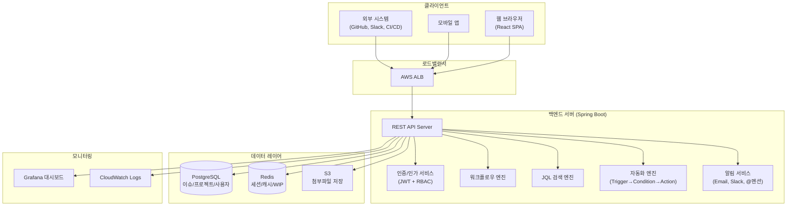

# Jira 프로젝트 관리 시스템 아키텍처 정의서

## 1. 시스템 개요

Jira 프로젝트 관리 시스템의 전체 시스템 아키텍처를 정의한다. 이슈 트래킹, 워크플로우 엔진, 스프린트 관리, 대시보드, REST API를 포함하는 통합 협업 플랫폼이다.

## 2. 시스템 아키텍처



## 3. 기술 스택 상세

### 3.1 Frontend

| 항목 | 기술 | 선정 사유 |
|------|------|-----------|
| Framework | React 18 | 컴포넌트 기반 UI, 대규모 SPA 적합 |
| 상태 관리 | Zustand | 경량, 보드/이슈 상태 관리에 적합 |
| 스타일링 | Tailwind CSS | 유틸리티 기반 빠른 UI 개발 |
| 빌드 도구 | Vite | 빠른 HMR, 빌드 성능 |
| 차트 | Recharts | 번다운/속도 차트, 대시보드 가젯 |

### 3.2 Backend

| 항목 | 기술 | 선정 사유 |
|------|------|-----------|
| Framework | Spring Boot 3.x | 엔터프라이즈 안정성, 풍부한 생태계 |
| ORM | JPA/Hibernate | 객체-관계 매핑, 쿼리 최적화 |
| 인증 | JWT + Spring Security | 토큰 기반 인증, RBAC 5단계 역할 지원 |
| 검색 | JQL Parser (Custom) | Jira Query Language 지원 |
| 메시징 | Spring Events | 워크플로우 전환 이벤트, 자동화 트리거 |

### 3.3 Infrastructure

| 항목 | 기술 | 선정 사유 |
|------|------|-----------|
| 클라우드 | AWS (ECS, RDS, ElastiCache) | 관리형 서비스, 확장성 |
| 컨테이너 | Docker + ECS Fargate | 서버리스 컨테이너, 운영 부담 감소 |
| CI/CD | GitHub Actions | 코드와 파이프라인 통합 관리 |
| 모니터링 | Grafana + CloudWatch | 대시보드 가시성, 로그 통합 |

## 4. 디렉토리 구조

```
project-root/
├── frontend/
│   └── src/
│       ├── components/     # 공통 컴포넌트 (Board, IssueCard 등)
│       ├── pages/          # 페이지 (Dashboard, Backlog, Board 등)
│       ├── stores/         # 상태 관리 (Zustand)
│       └── api/            # API 클라이언트
├── backend/
│   └── src/main/java/
│       ├── controller/     # REST API 컨트롤러
│       ├── service/        # 비즈니스 로직 (워크플로우, JQL 등)
│       ├── repository/     # JPA 리포지토리
│       ├── domain/         # 엔티티 (Issue, Sprint, Project 등)
│       └── config/         # 설정 (Security, Redis 등)
├── docs/                   # 프로젝트 문서
├── infra/                  # IaC (Terraform/CDK)
└── scripts/                # 유틸리티 스크립트
```

## 5. 보안 아키텍처

| 항목 | 방법 | 비고 |
|------|------|------|
| 인증 | JWT (Bearer Token) | Access Token + Refresh Token |
| 인가 | RBAC (5단계) | Admin/Developer/QA/Reporter/Viewer |
| 이슈 보안 | Security Level | Public/Internal/Confidential |
| 암호화 | bcrypt | 비밀번호 해싱 |
| 통신 | HTTPS (TLS 1.3) | 필수 |
| Audit | Audit Log | 모든 필드 변경, 상태 전환, 권한 변경 추적 |

## 6. 성능 목표

| 지표 | 목표치 | 측정 방법 |
|------|--------|-----------|
| API 응답 시간 (P95) | < 200ms | APM (Grafana) |
| JQL 검색 응답 | < 500ms | 쿼리 로그 |
| 동시 접속자 | 500명 | 부하 테스트 (k6) |
| 가용성 | 99.9% | CloudWatch |
| 보드 렌더링 | < 1초 | Lighthouse |

## 변경 이력

| 버전 | 날짜 | 작성자 | 변경 내용 |
|------|------|--------|-----------|
| v1.0 | 2026-03-21 | 팀 | 최초 작성 |
