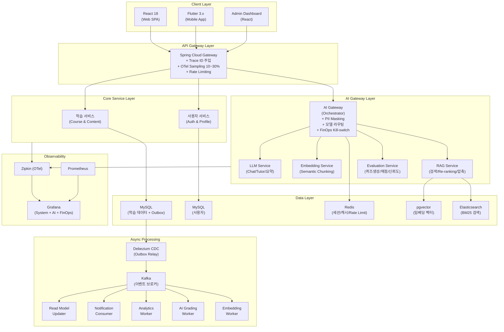
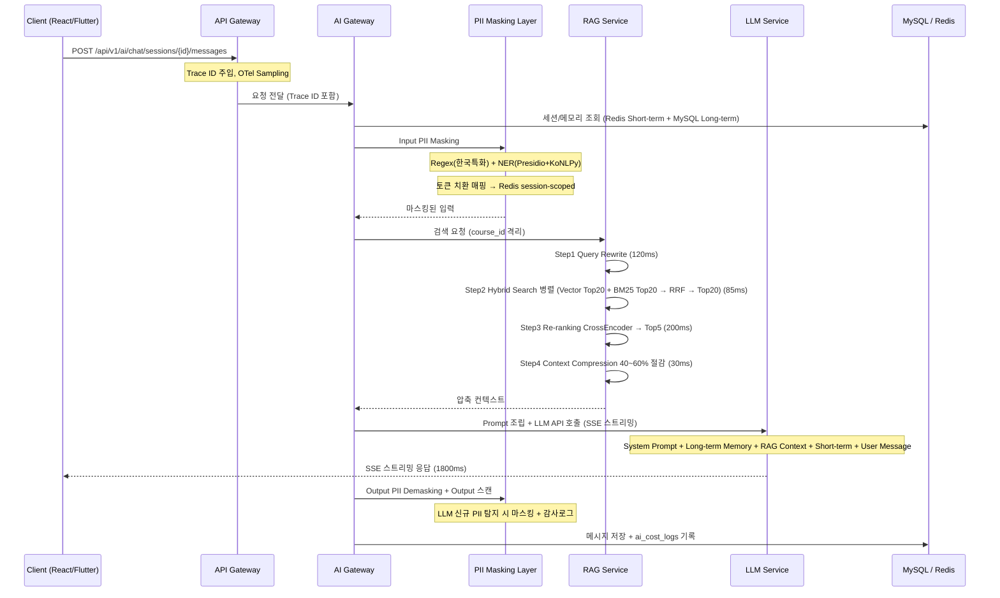
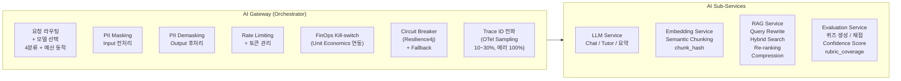
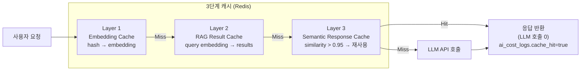
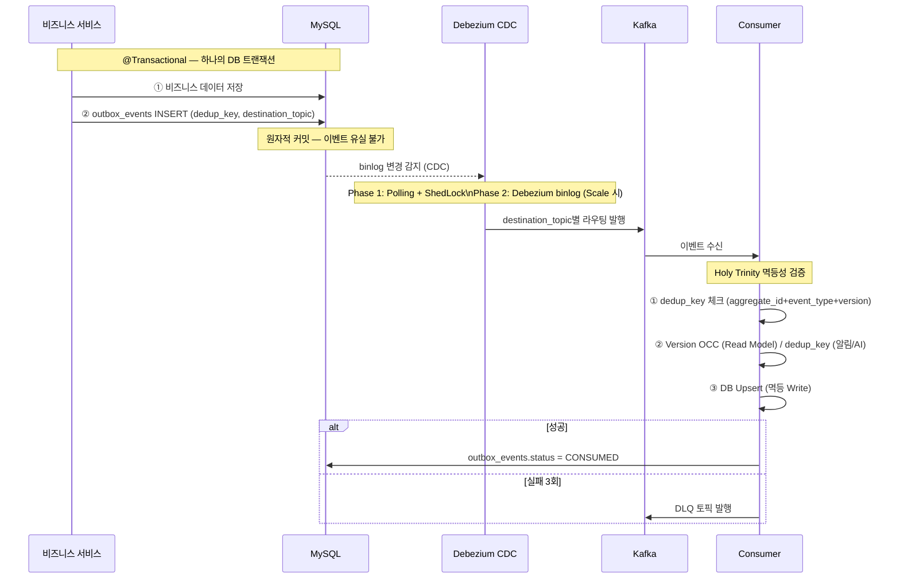
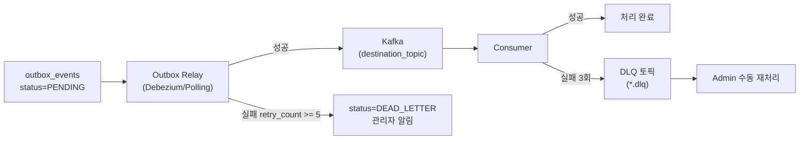
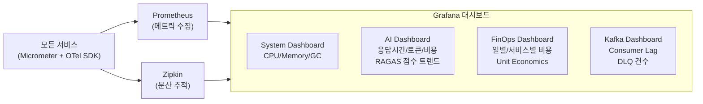
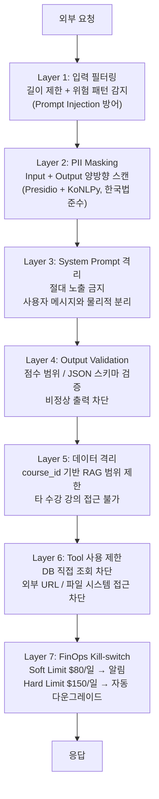
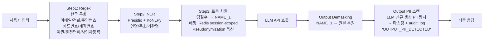

# LearnFlow AI — 시스템 아키텍처 정의서 v5.0

## 변경 이력

| 버전 | 날짜 | 변경 내용 | 작성자 |
|------|------|-----------|--------|
| v1.0 | 2025-09-01 | 초기 아키텍처 (단일 AI 서비스) | Architecture Team |
| v2.0 | 2025-11-01 | AI Gateway + 4 서브서비스 분리, RAG 고도화 | Architecture Team |
| v3.0 | 2026-01-15 | Transactional Outbox, Zipkin 분산 추적, RAGAS | Architecture Team |
| v4.0 | 2026-03-01 | OTel Sampling, destination_topic, dedup_key, Consumer Holy Trinity, DLQ | Architecture Team |
| v5.0 | 2026-04-02 | Mermaid 다이어그램 전면 재작성, 보안 7 Layer 정형화, Docker Compose 구성 보완 | Architecture Team |

---

## 1. 아키텍처 개요

LearnFlow AI는 **Spring Boot 4 + React 18 + Flutter 3.x + LLM API** 기반의 AI 적응형 학습 관리 시스템이다.
주요 아키텍처 원칙:

- **이벤트 기반 비동기**: Transactional Outbox + Kafka (데이터 일관성 보장)
- **AI 서비스 분리**: AI Gateway Orchestrator + 4 전문 서브서비스
- **분산 추적**: OpenTelemetry Sampling (dev 100% / prod 10~30%, 에러 100%)
- **컴플라이언스**: PII 양방향 마스킹 (Input + Output), 감사 로그
- **FinOps**: Unit Economics 기반 동적 라우팅, Kill-switch

---

## 2. 전체 시스템 아키텍처

### 2.1 전체 구성도



### 2.2 요청 흐름 (AI 튜터 채팅 예시)



---

## 3. AI 서비스 분리 아키텍처

### 3.1 AI Gateway Orchestrator



### 3.2 LLM 라우팅 — 4분류 + 예산 동적

| Tier | 모델 | 대상 요청 유형 | 예상 비용 |
|------|------|--------------|-----------|
| Tier 1 | Claude Haiku | 짧은 Q&A, OX, 용어 정의 | ~$0.001/요청 |
| Tier 2 | Claude Sonnet | 코드 설명, 디버깅, 리팩토링 | ~$0.005/요청 |
| Tier 3 | Claude Sonnet | 개념 설명, 비교 분석, 원리 | ~$0.010/요청 |
| Tier 4 | Claude Opus | 복잡한 설계, 아키텍처 질문 | ~$0.050/요청 |

**예산 기반 동적 라우팅 (v4.0)**:

```
잔여 > 70% : 정상 (4분류)
50~70%      : Tier 4 (Opus) 비활성
30~50%      : Haiku 우선
< 30%       : Haiku 전용 + 배치 중단
```

### 3.3 3단계 캐싱 전략



**효과**: Semantic Cache 히트 시 LLM API 호출 0 → 비용 40~60% 절감

---

## 4. Transactional Outbox Pattern

### 4.1 Outbox 흐름



### 4.2 이벤트 목록 (8개)

| 이벤트 | Producer | destination_topic | Consumer | 처리 내용 |
|--------|----------|-------------------|----------|-----------|
| `ContentCreated` | 학습 서비스 (Outbox) | `content.created` | Embedding Worker | 청킹 + 임베딩 생성 |
| `ContentUpdated` | 학습 서비스 (Outbox) | `content.updated` | Embedding Worker | chunk_hash 비교 → 변경분만 재임베딩 |
| `ContentDeleted` | 학습 서비스 (Outbox) | `content.deleted` | Embedding Worker | 해당 청크 INACTIVE 처리 (Soft Delete) |
| `QuizSubmitted` | 퀴즈 서비스 (Outbox) | `quiz.submitted` | AI Grading Worker | 자동 채점 + Confidence Score |
| `AssignmentSubmitted` | 과제 서비스 (Outbox) | `assignment.submitted` | AI Grading Worker | 과제 AI 채점 + rubric_coverage |
| `GradingAppeal` | 퀴즈/과제 서비스 | `grading.appeal` | Notification Consumer | 강사 Manual Review Queue 알림 |
| `LessonCompleted` | 학습 서비스 (Outbox) | `lesson.completed` | Analytics Worker | 진도/취약점/mastery 갱신 |
| `CostThresholdReached` | FinOps Monitor | `finops.threshold` | Admin Notification | 비용 경고 + Kill-switch 트리거 |

### 4.3 DLQ 처리 흐름



---

## 5. Distributed Tracing (OpenTelemetry)

### 5.1 Sampling 전략

| 환경 | 기본 Sampling | 예외 조건 |
|------|-------------|-----------|
| dev | 100% | - |
| staging | 50% | - |
| prod | 10~30% | 5xx 에러 → 100%, AI API 호출 → 100% |

### 5.2 Span Attributes (Business Context)

```yaml
# 표준 Span Attributes
user.id: "{userId}"
course.id: "{courseId}"
ai.model: "claude-3-5-sonnet"
ai.tokens.input: 1250
ai.tokens.output: 340
ai.cost_usd: 0.00620
rag.chunks_retrieved: 20
rag.rerank_score: 0.87
cache.hit: false
```

### 5.3 AI 튜터 요청 Trace 예시

```mermaid
gantt
    title AI 튜터 응답 Trace (~2265ms)
    dateFormat X
    axisFormat %Lms

    section API Gateway
    Trace ID 주입         : 0, 2

    section AI Gateway
    PII Masking Input     : 2, 7

    section RAG Service
    Query Rewrite         : 7, 127
    Hybrid Search         : 127, 212
    Re-ranking            : 212, 412
    Context Compression   : 412, 442

    section LLM Service
    Prompt 조립           : 442, 457
    LLM API 호출 (SSE)    : 457, 2257

    section PII
    Output Demasking      : 2257, 2260
    Output PII 스캔       : 2260, 2265
```



### 5.4 모니터링 구성



---

## 6. 보안 설계 (7 Layer)



### 6.1 PII Masking Pipeline 상세



### 6.2 인증/인가 체계

| 계층 | 기술 | 상세 |
|------|------|------|
| 인증 | Spring Security + JWT | Access Token (15분) + Refresh Token (7일) |
| 인가 | Role-based (RBAC) | LEARNER / INSTRUCTOR / ADMIN |
| API Gateway | Rate Limiting | Redis 기반 Sliding Window |
| AI | 토큰 쿼터 | Free 5K/일 / Basic 50K/일 / Premium 200K/일 |

---

## 7. Docker Compose 구성

```yaml
# docker-compose.yml (개발 환경)
services:

  # ─── Core Services ───
  api-gateway:
    image: learnflow/api-gateway:latest
    ports: ["8080:8080"]
    depends_on: [user-service, course-service, ai-gateway]

  user-service:
    image: learnflow/user-service:latest
    ports: ["8081:8081"]
    depends_on: [mysql-user, redis]

  course-service:
    image: learnflow/course-service:latest
    ports: ["8082:8082"]
    depends_on: [mysql-course, redis, kafka]

  # ─── AI Services ───
  ai-gateway:
    image: learnflow/ai-gateway:latest
    ports: ["8090:8090"]
    environment:
      - ANTHROPIC_API_KEY=${ANTHROPIC_API_KEY}
      - OPENAI_API_KEY=${OPENAI_API_KEY}
    depends_on: [llm-service, embedding-service, rag-service, evaluation-service]

  llm-service:
    image: learnflow/llm-service:latest
    ports: ["8091:8091"]

  embedding-service:
    image: learnflow/embedding-service:latest
    ports: ["8092:8092"]
    depends_on: [pgvector]

  rag-service:
    image: learnflow/rag-service:latest
    ports: ["8093:8093"]
    depends_on: [pgvector, elasticsearch]

  evaluation-service:
    image: learnflow/evaluation-service:latest
    ports: ["8094:8094"]

  # ─── Data Stores ───
  mysql-user:
    image: mysql:8
    environment:
      MYSQL_DATABASE: learnflow_user
    volumes: [mysql-user-data:/var/lib/mysql]

  mysql-course:
    image: mysql:8
    environment:
      MYSQL_DATABASE: learnflow_course
    volumes: [mysql-course-data:/var/lib/mysql]

  redis:
    image: redis:7-alpine
    ports: ["6379:6379"]

  pgvector:
    image: pgvector/pgvector:pg16
    ports: ["5432:5432"]
    environment:
      POSTGRES_DB: learnflow_vectors

  elasticsearch:
    image: elasticsearch:8.12.0
    ports: ["9200:9200"]
    environment:
      - discovery.type=single-node
      - xpack.security.enabled=false

  # ─── Messaging ───
  zookeeper:
    image: confluentinc/cp-zookeeper:7.5.0

  kafka:
    image: confluentinc/cp-kafka:7.5.0
    ports: ["9092:9092"]
    depends_on: [zookeeper]

  debezium:
    image: debezium/connect:2.4
    ports: ["8083:8083"]
    depends_on: [kafka, mysql-course]

  # ─── Observability ───
  zipkin:
    image: openzipkin/zipkin:latest
    ports: ["9411:9411"]

  prometheus:
    image: prom/prometheus:latest
    ports: ["9090:9090"]
    volumes: [./prometheus.yml:/etc/prometheus/prometheus.yml]

  grafana:
    image: grafana/grafana:latest
    ports: ["3000:3000"]
    depends_on: [prometheus, zipkin]

volumes:
  mysql-user-data:
  mysql-course-data:
```

---

## 8. 기술 스택 요약

### 8.1 Backend

| 영역 | 기술 | 버전 |
|------|------|------|
| Framework | Spring Boot | 4.x |
| Language | Java | 21+ (Virtual Threads) |
| ORM | Spring Data JPA + QueryDSL | 5.x |
| Security | Spring Security | 7.x |
| Resilience | Resilience4j | 최신 |
| Tracing | Micrometer + OTel | 최신 |
| PII | Presidio + KoNLPy | 최신 |
| DB Migration | Flyway | 최신 |

### 8.2 AI / LLM

| 영역 | 기술 |
|------|------|
| LLM (메인) | Claude API (Anthropic) |
| LLM (Fallback) | OpenAI GPT API |
| Embedding | text-embedding-3-small (1536dim) |
| Vector DB | pgvector (Phase 1) → Qdrant (Phase 2) |
| Re-ranking | CrossEncoder (ms-marco) |
| RAG 평가 | RAGAS + DeepEval |

### 8.3 Frontend

| 영역 | 기술 |
|------|------|
| Web | React 18 + TypeScript |
| 상태 관리 | Zustand + TanStack Query |
| UI | shadcn/ui + Tailwind CSS |
| Mobile | Flutter 3.x + Riverpod |

---

## 9. 비기능 요구사항 (NFR)

| 항목 | 목표 | 측정 방법 |
|------|------|-----------|
| AI 응답 지연 | P95 < 3초 (일반), P95 < 5초 (복잡) | Zipkin Trace |
| 시스템 가용성 | 99.5% (월) | Prometheus Uptime |
| 이벤트 처리 지연 | Kafka Consumer Lag < 1000 | Grafana Kafka Dashboard |
| Outbox 릴레이 | 최대 5회 재시도, DLQ 알림 | 관리자 모니터링 |
| PII 탐지율 | > 99% (한국 법령 데이터 기준) | 정기 감사 |
| Vector 검색 | P99 < 100ms (ACTIVE 청크) | Prometheus |
| Semantic Cache 히트율 | > 40% (목표) | FinOps Dashboard |
