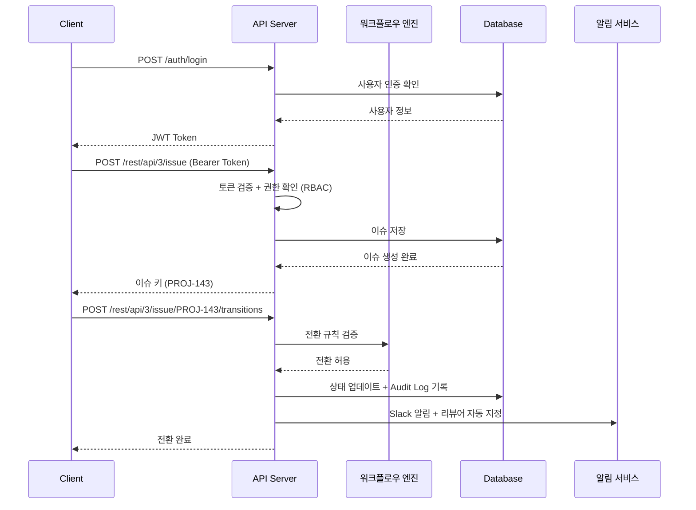

# Jira 프로젝트 관리 시스템 API 정의서

## 1. API 개요

| 항목 | 내용 |
|------|------|
| Base URL | `https://api.jira-pm.example.com/rest/api/3` |
| Agile URL | `https://api.jira-pm.example.com/rest/agile/1.0` |
| 인증 방식 | Bearer Token (JWT) |
| Content-Type | application/json |
| 문자 인코딩 | UTF-8 |

## 2. 공통 사항

### 2.1 공통 응답 포맷

**성공 응답**:
```json
{
  "success": true,
  "data": { },
  "message": "요청이 성공적으로 처리되었습니다."
}
```

**에러 응답**:
```json
{
  "success": false,
  "error": {
    "code": "ERROR_CODE",
    "message": "에러 메시지"
  }
}
```

### 2.2 공통 에러 코드

| 코드 | HTTP Status | 설명 |
|------|-------------|------|
| UNAUTHORIZED | 401 | 인증 실패 (토큰 만료/미제공) |
| FORBIDDEN | 403 | 권한 없음 (역할 기반 접근 제어) |
| NOT_FOUND | 404 | 리소스 없음 |
| VALIDATION_ERROR | 422 | 입력값 검증 실패 |
| INTERNAL_ERROR | 500 | 서버 내부 오류 |

### 2.3 페이지네이션

```json
{
  "data": [],
  "pagination": {
    "page": 1,
    "size": 20,
    "totalElements": 100,
    "totalPages": 5
  }
}
```

## 3. API 엔드포인트

### 3.1 인증 (Auth)

#### POST /auth/login - 로그인

| 항목 | 내용 |
|------|------|
| Method | POST |
| URL | /auth/login |
| 인증 | 불필요 |

**Request Body**:
| 필드 | 타입 | 필수 | 설명 |
|------|------|------|------|
| email | string | Y | 이메일 |
| password | string | Y | 비밀번호 |

**Response (200)**:
| 필드 | 타입 | 설명 |
|------|------|------|
| accessToken | string | 액세스 토큰 (JWT) |
| refreshToken | string | 리프레시 토큰 |
| expiresIn | number | 만료 시간 (초) |

---

### 3.2 이슈 (Issue)

#### POST /rest/api/3/issue - 이슈 생성

| 항목 | 내용 |
|------|------|
| Method | POST |
| URL | /rest/api/3/issue |
| 인증 | 필요 (DEVELOPER 이상) |

**Request Body**:
| 필드 | 타입 | 필수 | 설명 |
|------|------|------|------|
| project.key | string | Y | 프로젝트 키 |
| summary | string | Y | 이슈 제목 ([모듈] 기능 요약 형식) |
| issuetype.name | string | Y | 이슈 타입 (Epic/Story/Task/Bug/Sub-task) |
| assignee.accountId | string | N | 담당자 ID |
| priority.name | string | N | 우선순위 (Highest/High/Medium/Low/Lowest) |
| story_points | number | N | 스토리 포인트 (피보나치: 1,2,3,5,8,13) |
| fixVersions[].name | string | N | 릴리즈 버전 |
| parent.key | string | N | 상위 이슈 키 (Sub-task의 경우) |

#### GET /rest/api/3/issue/{issueKey} - 이슈 단건 조회

| 항목 | 내용 |
|------|------|
| Method | GET |
| URL | /rest/api/3/issue/{issueKey} |
| 인증 | 필요 (보안 레벨에 따라 역할 제한) |

#### PUT /rest/api/3/issue/{issueKey} - 이슈 수정

| 항목 | 내용 |
|------|------|
| Method | PUT |
| URL | /rest/api/3/issue/{issueKey} |
| 인증 | 필요 (DEVELOPER 이상, Reporter는 본인만) |

#### DELETE /rest/api/3/issue/{issueKey} - 이슈 삭제

| 항목 | 내용 |
|------|------|
| Method | DELETE |
| URL | /rest/api/3/issue/{issueKey} |
| 인증 | 필요 (ADMIN, DEVELOPER만) |

---

### 3.3 검색 (Search)

#### POST /rest/api/3/search - JQL 기반 이슈 검색

| 항목 | 내용 |
|------|------|
| Method | POST |
| URL | /rest/api/3/search |
| 인증 | 필요 |

**Request Body**:
| 필드 | 타입 | 필수 | 설명 |
|------|------|------|------|
| jql | string | Y | JQL 쿼리문 |
| maxResults | number | N | 최대 결과 수 (기본 50) |
| fields | string[] | N | 반환 필드 목록 |

**JQL 예시**:
```sql
project = "PROJ" AND status = "In Progress" AND assignee = currentUser() ORDER BY priority DESC
```

---

### 3.4 상태 전환 (Transition)

#### POST /rest/api/3/issue/{issueKey}/transitions - 상태 전환

| 항목 | 내용 |
|------|------|
| Method | POST |
| URL | /rest/api/3/issue/{issueKey}/transitions |
| 인증 | 필요 (DEVELOPER 이상) |

**Request Body**:
| 필드 | 타입 | 필수 | 설명 |
|------|------|------|------|
| transition.id | string | Y | 전환 ID |

**전환 규칙**:
| 전환 경로 | 조건 |
|-----------|------|
| In Progress → Code Review | PR 생성 완료 |
| Code Review → In Progress | 리뷰어 변경 요청 |
| Code Review → QA | 리뷰어 승인 완료 |
| QA → In Progress | 테스트 실패 |
| QA → Done | DoD 체크리스트 전체 충족 |

---

### 3.5 스프린트 (Sprint)

#### POST /rest/agile/1.0/sprint - 스프린트 생성

| 항목 | 내용 |
|------|------|
| Method | POST |
| URL | /rest/agile/1.0/sprint |
| 인증 | 필요 (ADMIN, DEVELOPER) |

---

### 3.6 버전/릴리즈 (Version)

#### POST /rest/api/3/version - 릴리즈 버전 생성

| 항목 | 내용 |
|------|------|
| Method | POST |
| URL | /rest/api/3/version |
| 인증 | 필요 (ADMIN) |

---

### 3.7 사용자 (User)

#### GET /rest/api/3/user - 사용자 정보 조회

| 항목 | 내용 |
|------|------|
| Method | GET |
| URL | /rest/api/3/user |
| 인증 | 필요 |

## 4. API 흐름도



## 변경 이력

| 버전 | 날짜 | 작성자 | 변경 내용 |
|------|------|--------|-----------|
| v1.0 | 2026-03-21 | 팀 | 최초 작성 |
