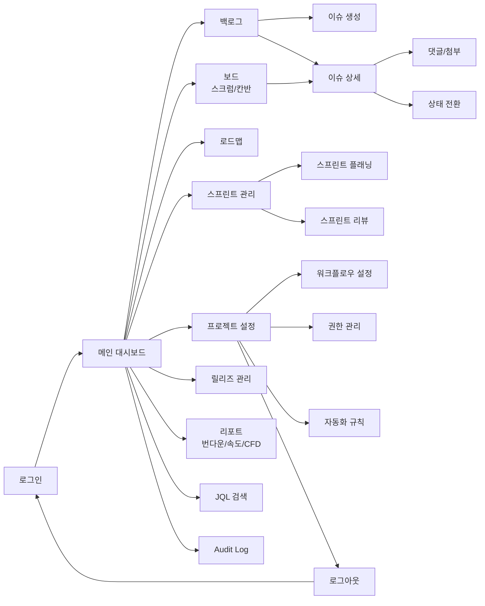
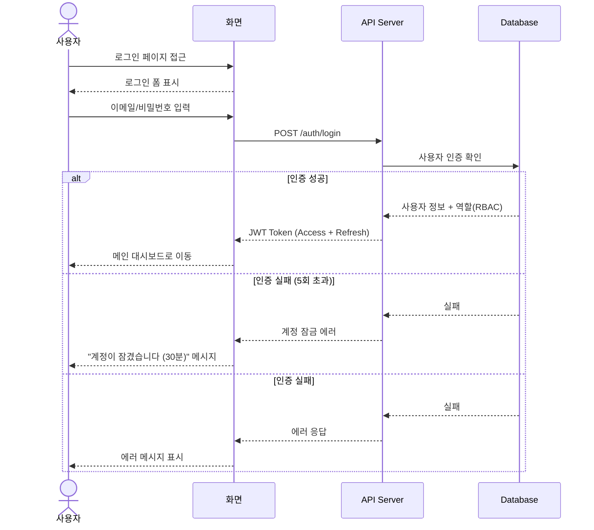
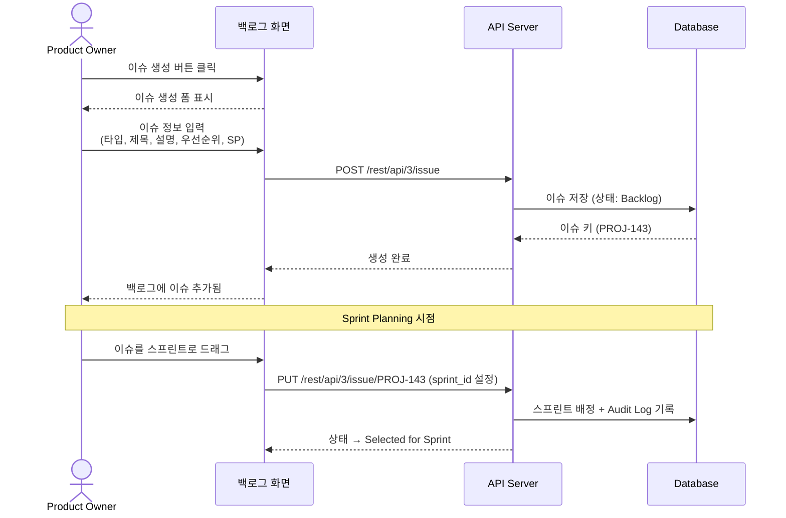
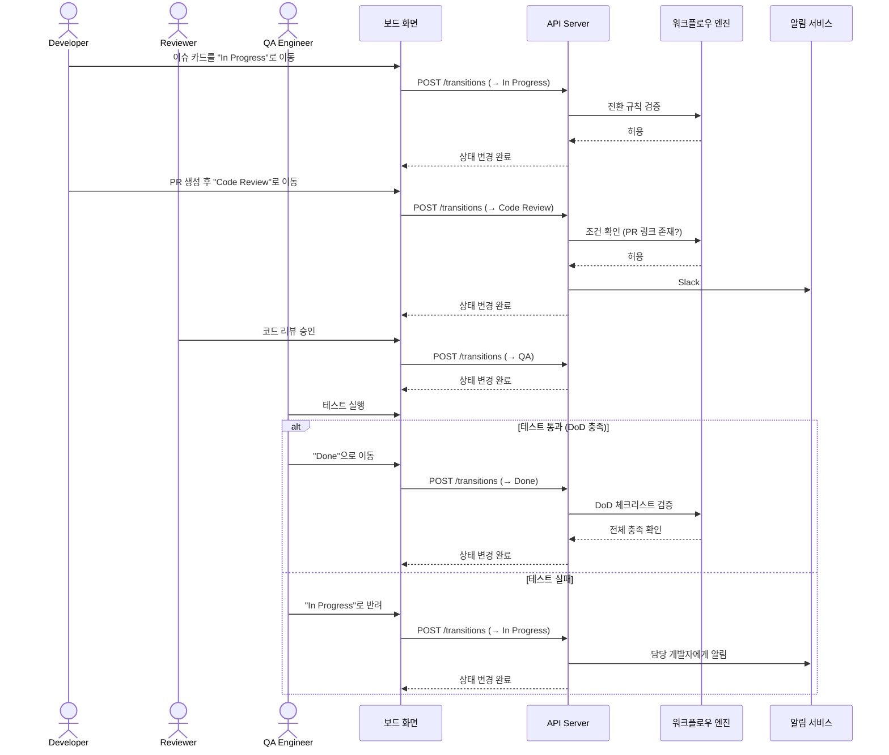
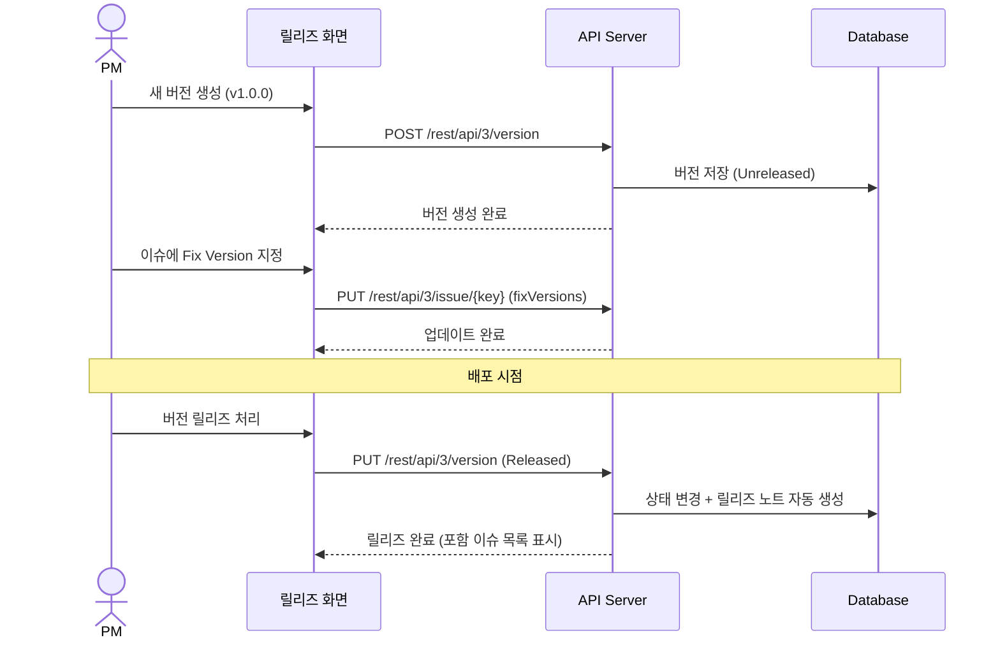

# Jira 프로젝트 관리 시스템 화면 흐름 시퀀스 다이어그램

## 1. 전체 화면 흐름도

## 2. 주요 시퀀스 다이어그램

### 2.1 로그인 흐름

### 2.2 이슈 생성 및 스프린트 배정 흐름

### 2.3 워크플로우 전환 흐름 (개발 → 코드리뷰 → QA → Done)

### 2.4 릴리즈 관리 흐름

## 3. 화면 전환 매트릭스

| From \ To | 로그인 | 대시보드 | 백로그 | 보드 | 이슈상세 | 로드맵 | 리포트 | 릴리즈 | 설정 | 검색 |
|-----------|--------|---------|--------|------|---------|--------|--------|--------|------|------|
| 로그인 | - | O | - | - | - | - | - | - | - | - |
| 대시보드 | - | - | O | O | O | O | O | O | O | O |
| 백로그 | - | O | - | O | O | - | - | - | - | O |
| 보드 | - | O | O | - | O | - | - | - | - | O |
| 이슈상세 | - | O | O | O | - | - | - | - | - | - |
| 로드맵 | - | O | - | - | O | - | - | O | - | - |
| 리포트 | - | O | - | - | - | - | - | - | - | - |
| 릴리즈 | - | O | - | - | O | - | - | - | - | - |
| 설정 | O | O | - | - | - | - | - | - | - | - |

## 변경 이력

| 버전 | 날짜 | 작성자 | 변경 내용 |
|------|------|--------|-----------|
| v1.0 | 2026-03-21 | 팀 | 최초 작성 |
