# LearnFlow AI 화면 흐름 시퀀스 다이어그램 v4.0

---

## 변경 이력

| 버전 | 변경일 | 변경자 | 변경 내용 |
|------|--------|--------|-----------|
| v1.0 | 2026-01-10 | Team 3 | 초기 화면 흐름 정의 |
| v2.0 | 2026-02-05 | Team 3 | AI 튜터 SSE 흐름, RAG 파이프라인 추가 |
| v3.0 | 2026-03-22 | Team 3 | HITL, 온보딩 진단, RAGAS, PII 흐름 추가 |
| v4.0 | 2026-04-02 | Team 3 | Semantic Chunking, FinOps 동적 라우팅, 3층 평가, Flutter 모바일 흐름, SCR-ID 전면 정비 |

---

## 1. 화면 ID 코드 체계

| 접두사 | 대상 | 예시 |
|--------|------|------|
| SCR-0xx | 공통/인증 | SCR-001 로그인 |
| SCR-1xx | 학습자 화면 | SCR-101 강의 목록 |
| SCR-2xx | 강사 화면 | SCR-201 강의 관리 |
| SCR-3xx | 관리자 화면 | SCR-301 사용자 관리 |

### 전체 화면 목록

| 화면 ID | 화면명 | 역할 |
|---------|--------|------|
| SCR-001 | 회원가입 | ALL |
| SCR-002 | 로그인 | ALL |
| SCR-003 | 온보딩 — 진단 테스트 | LEARNER |
| SCR-004 | 온보딩 — 자가 진단 | LEARNER |
| SCR-101 | 학습자 대시보드 | LEARNER |
| SCR-102 | 강의 목록 | LEARNER |
| SCR-103 | 강의 상세 | LEARNER |
| SCR-104 | 강의 수강 (영상 + AI 튜터) | LEARNER |
| SCR-105 | AI 튜터 채팅 (풀스크린) | LEARNER |
| SCR-106 | 퀴즈 풀기 | LEARNER |
| SCR-107 | 퀴즈 결과 | LEARNER |
| SCR-108 | 과제 제출 | LEARNER |
| SCR-109 | 과제 결과 / 채점 이의 제기 | LEARNER |
| SCR-110 | 학습 분석 대시보드 | LEARNER |
| SCR-201 | 강사 대시보드 | INSTRUCTOR |
| SCR-202 | 강의 관리 | INSTRUCTOR |
| SCR-203 | 강의 생성/수정 에디터 | INSTRUCTOR |
| SCR-204 | 과제 출제 | INSTRUCTOR |
| SCR-205 | 수강생 분석 | INSTRUCTOR |
| SCR-206 | Manual Review Queue | INSTRUCTOR |
| SCR-301 | 관리자 대시보드 | ADMIN |
| SCR-302 | 사용자 관리 | ADMIN |
| SCR-303 | AI 운영 대시보드 (FinOps + 품질 + Observability) | ADMIN |
| SCR-304 | AI 품질 상세 | ADMIN |
| SCR-305 | FinOps 상세 | ADMIN |
| SCR-306 | Observability / 분산 추적 | ADMIN |
| SCR-307 | 감사 로그 | ADMIN |

---

## 2. 전체 화면 흐름도

### 2.1 최상위 흐름 (전체 사용자)

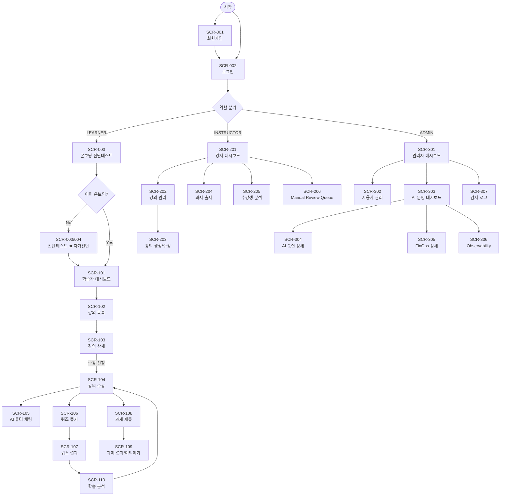

---

### 2.2 학습자 핵심 흐름 (수강 → AI 튜터 → 퀴즈 → 분석)

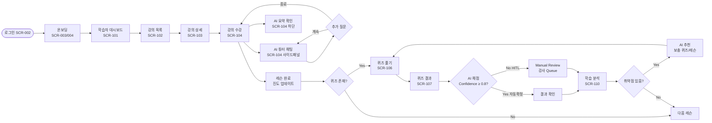

---

### 2.3 강사 화면 흐름

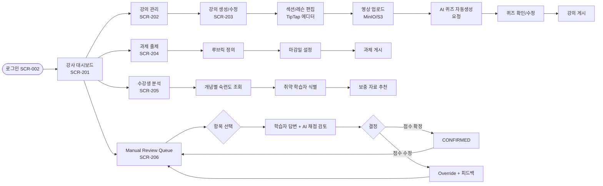

---

### 2.4 관리자 화면 흐름

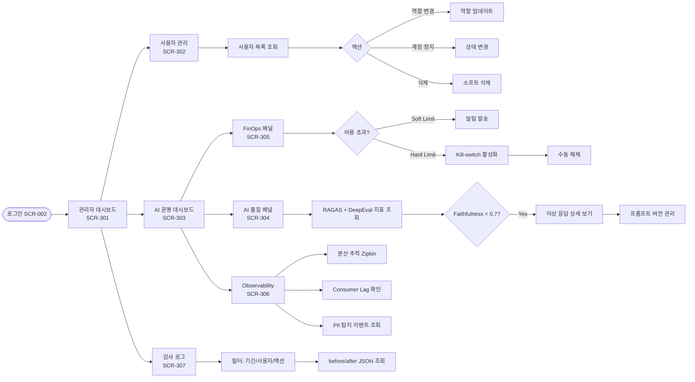

---

## 3. 시퀀스 다이어그램

### 3.1 회원가입 → 로그인 → 온보딩

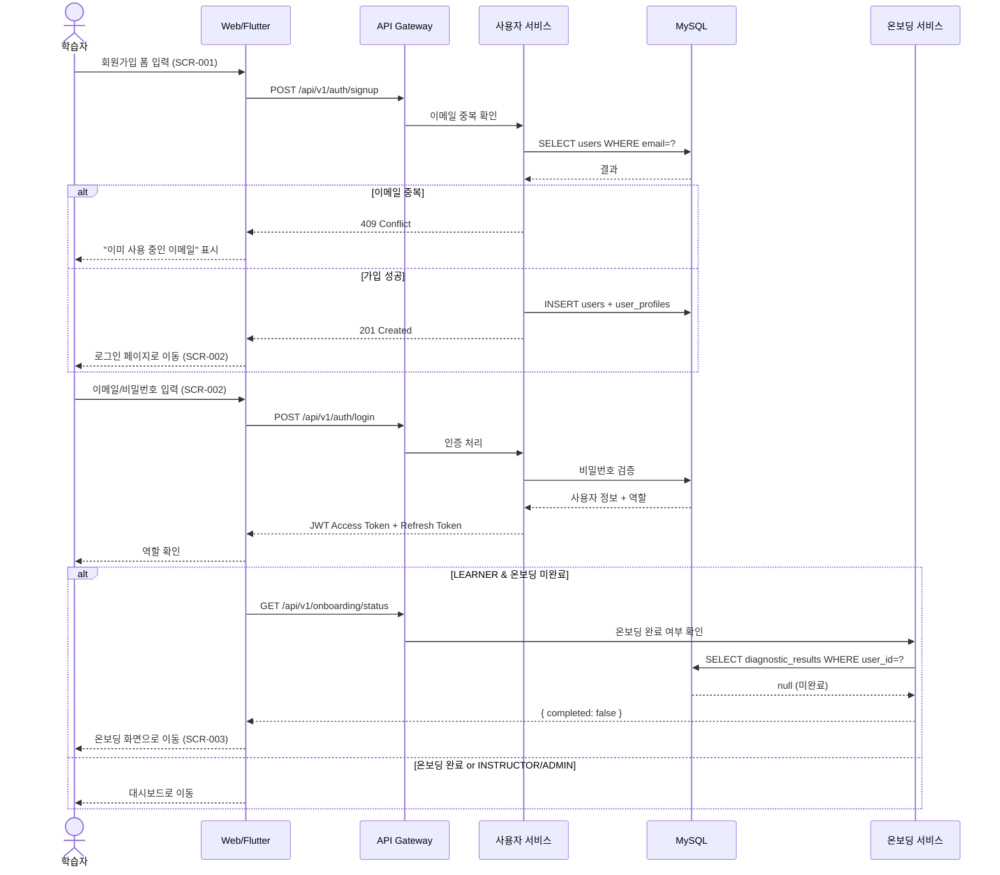

---

### 3.2 온보딩 — 진단 테스트 흐름

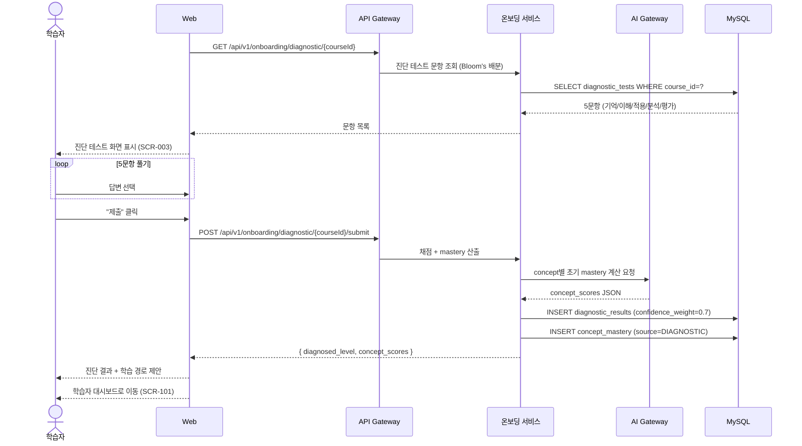

---

### 3.3 AI 튜터 채팅 — SSE 스트리밍

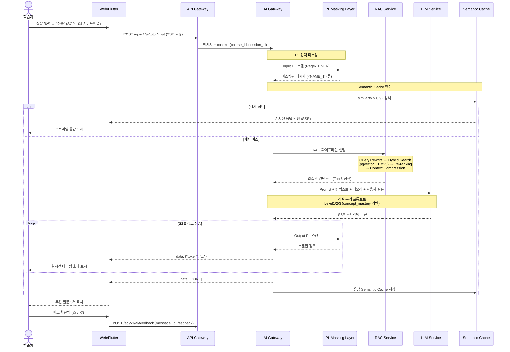

---

### 3.4 RAG 파이프라인 상세

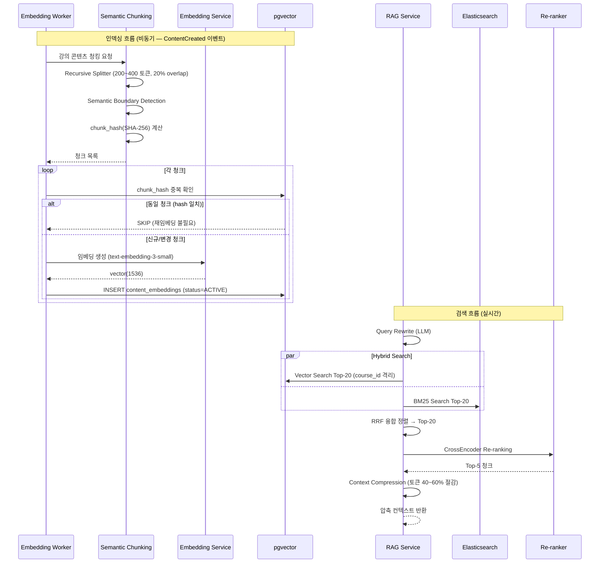

---

### 3.5 퀴즈 제출 → AI 채점 → Confidence → HITL

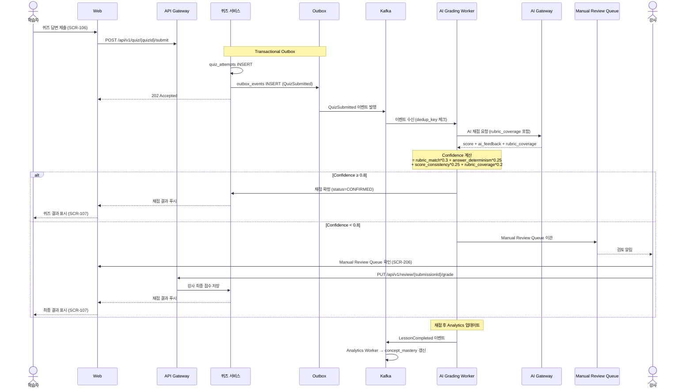

---

### 3.6 채점 이의 제기 흐름

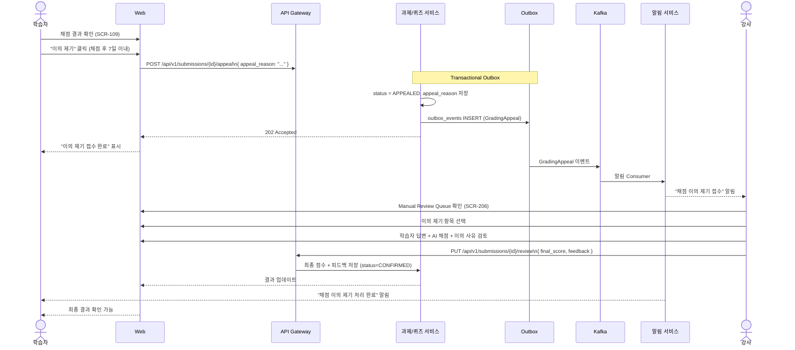

---

### 3.7 학습 분석 대시보드 — 데이터 흐름

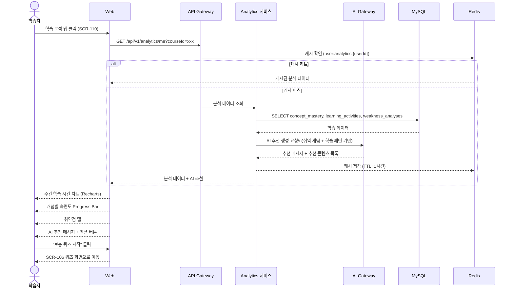

---

### 3.8 관리자 FinOps — Kill-switch 흐름

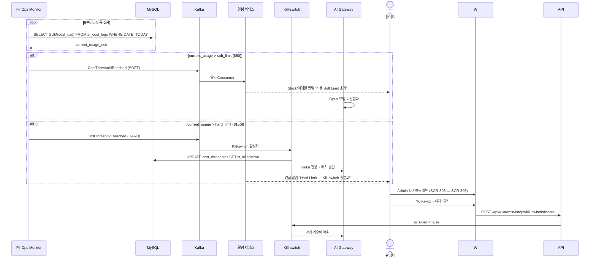

---

## 4. 역할별 화면 흐름 요약

### 4.1 학습자 전체 흐름

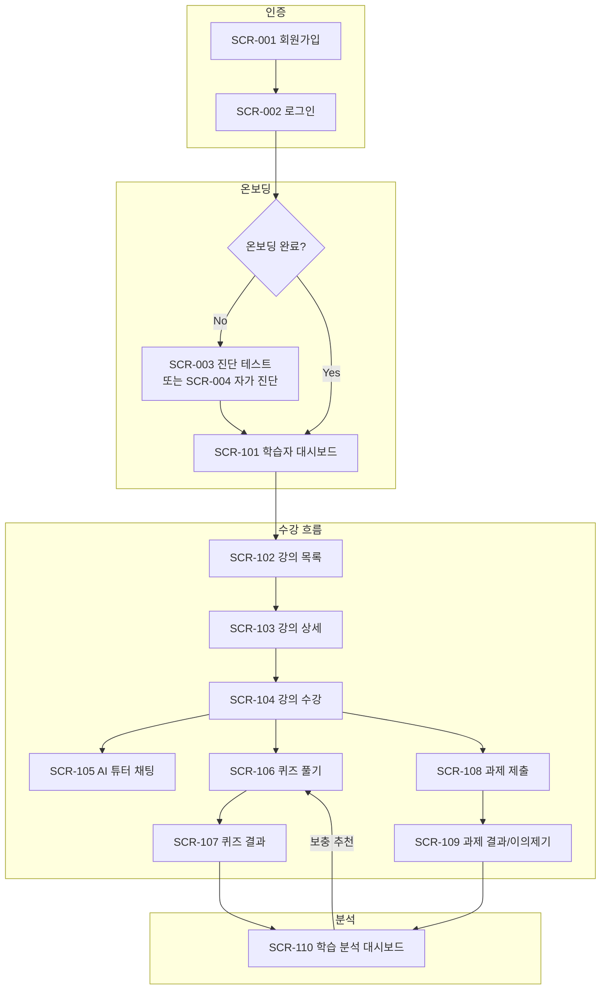

---

### 4.2 강사 전체 흐름

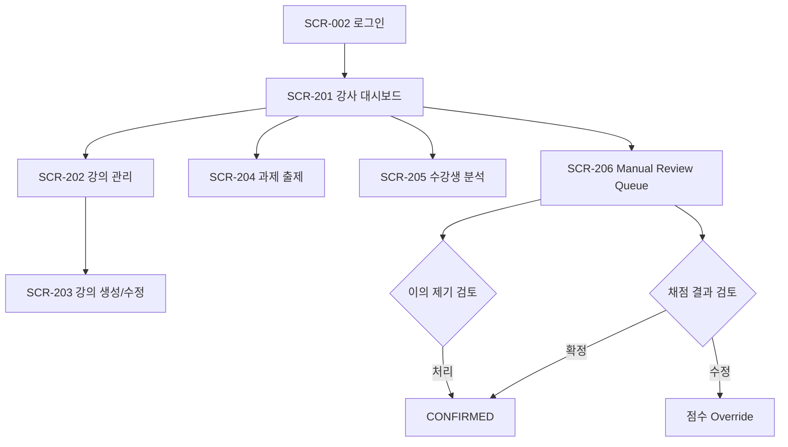

---

### 4.3 관리자 전체 흐름

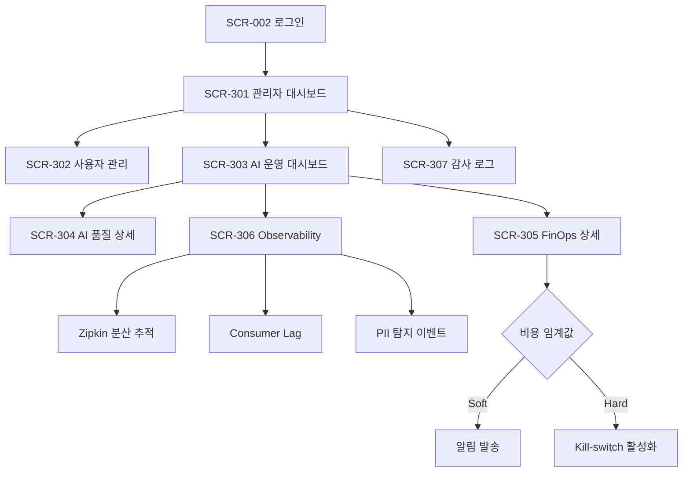

---

## 5. 모바일 (Flutter) 화면 흐름

Flutter 3.x + Riverpod 기반 모바일 앱은 Web과 동일한 API를 사용하며, 핵심 학습자 화면을 지원한다.

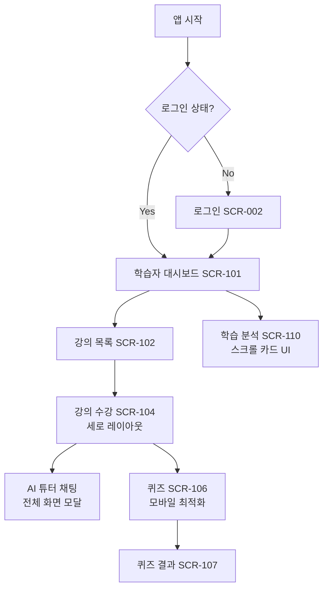

| 화면 | 모바일 특이사항 |
|------|----------------|
| SCR-104 강의 수강 | 가로 모드: 영상 전체화면, AI 튜터 하단 Sheet |
| SCR-105 AI 튜터 | 전체 화면 모달, SSE 스트리밍 유지 |
| SCR-106 퀴즈 | 단일 문항씩 표시, 스와이프 탐색 |
| SCR-110 학습 분석 | 카드 스크롤, 차트 터치 인터랙션 |

---
