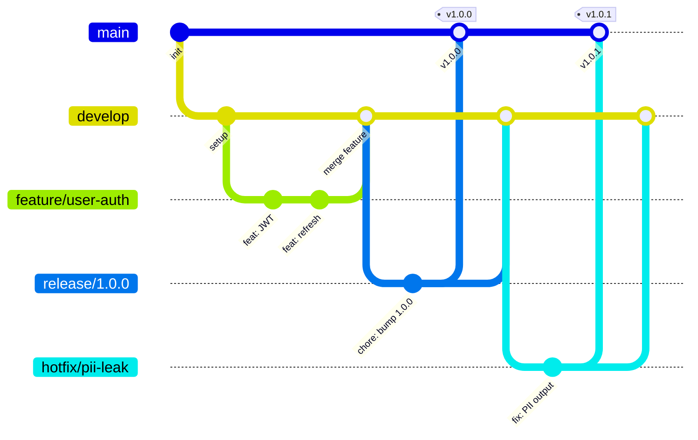
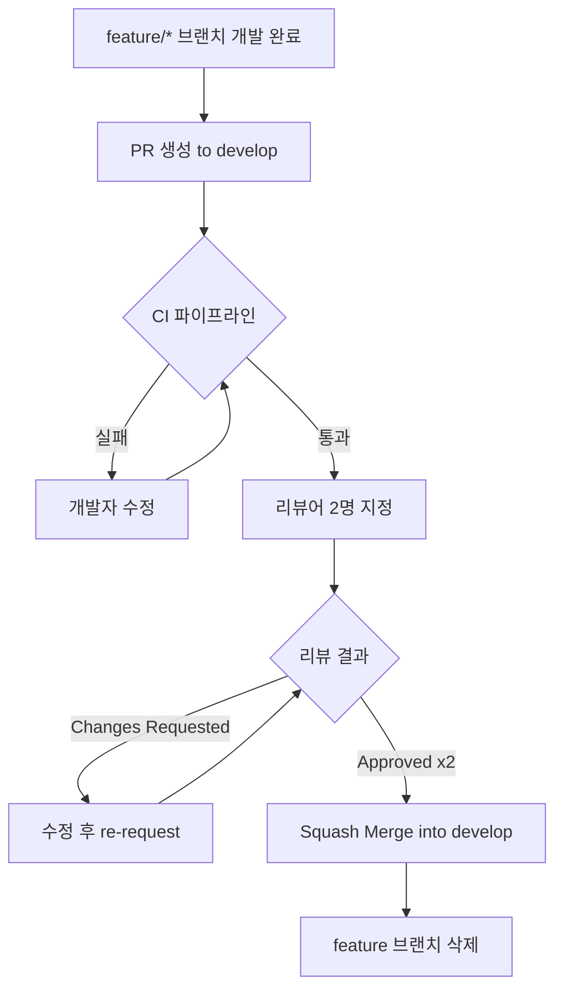
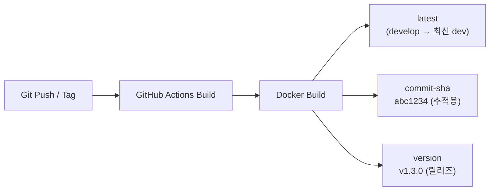

# LearnFlow AI Git 규칙 정의서

## 목차

1. [브랜치 전략](#1-브랜치-전략)
2. [커밋 컨벤션](#2-커밋-컨벤션)
3. [PR 규칙](#3-pr-규칙)
4. [태그 전략](#4-태그-전략)
5. [Docker 이미지 태그](#5-docker-이미지-태그)
6. [Hotfix Bypass 정책](#6-hotfix-bypass-정책)
7. [브랜치 보호 규칙](#7-브랜치-보호-규칙)
8. [Git Hooks](#8-git-hooks)

---

## 1. 브랜치 전략

LearnFlow AI 프로젝트는 **Git Flow** 기반의 브랜치 전략을 따른다.

### 1.1 브랜치 구조 다이어그램



### 1.2 브랜치 종류 및 역할

| 브랜치 | 역할 | 수명 | 병합 대상 | 직접 푸시 |
|--------|------|------|-----------|----------|
| `main` | 프로덕션 릴리즈 소스. 항상 배포 가능 상태 유지 | 영구 | `release/*`, `hotfix/*` | 금지 |
| `develop` | 다음 릴리즈를 위한 통합 브랜치 | 영구 | `feature/*`, `release/*`, `hotfix/*` | 금지 |
| `feature/*` | 신규 기능 개발 | 단기 | `develop` | 허용 |
| `release/*` | 릴리즈 준비 (버전 번호 지정, QA) | 중기 | `main` + `develop` | 제한 |
| `hotfix/*` | 프로덕션 긴급 버그 수정 | 단기 | `main` + `develop` | 허용 |

### 1.3 브랜치 네이밍 규칙

```
feature/{scope}-{짧은설명}
release/{Major}.{Minor}.{Patch}
hotfix/{이슈번호}-{짧은설명}
```

**예시**

```
feature/user-jwt-refresh
feature/rag-semantic-chunking
feature/finops-kill-switch
feature/ai-tutor-leveling
release/1.2.0
hotfix/LF-204-pii-output-leak
hotfix/LF-315-kafka-consumer-deadlock
```

### 1.4 스코프(Scope) 목록

LearnFlow AI 도메인 기반 스코프를 사용한다.

| 스코프 | 대상 모듈/기능 |
|--------|--------------|
| `user` | 사용자 인증, 프로필, 권한 |
| `course` | 강의, 섹션, 레슨, 수강 신청 |
| `quiz` | 퀴즈, 과제, 채점, 이의 제기 |
| `ai-tutor` | AI 튜터 채팅, 레벨링, 메모리 |
| `rag` | RAG 파이프라인, 청킹, 임베딩, 검색 |
| `evaluation` | AI 채점, Confidence, HITL, Appeal |
| `finops` | FinOps, Kill-switch, Unit Economics |
| `pii` | PII 마스킹/복원, Output 스캔 |
| `onboarding` | 진단 테스트, 자가 진단, 온보딩 |
| `analytics` | 학습 분석, 개념 숙련도, 취약점 |
| `quality` | RAGAS, DeepEval, A/B 테스트, 프롬프트 |
| `outbox` | Transactional Outbox, Debezium, DLQ |
| `tracing` | OTel, Zipkin, Distributed Tracing |
| `infra` | Docker, CI/CD, GitHub Actions |
| `global` | 공통 설정, 예외 처리, 보안 |
| `mobile` | Flutter 모바일 앱 |

---

## 2. 커밋 컨벤션

[Conventional Commits](https://www.conventionalcommits.org/) 명세를 따른다.

### 2.1 커밋 메시지 포맷

```
<type>(<scope>): <subject>

[optional body]

[optional footer(s)]
```

### 2.2 타입(Type) 정의

| 타입 | 설명 | 예시 |
|------|------|------|
| `feat` | 새로운 기능 추가 | `feat(rag): Semantic Chunking 하이브리드 전략 구현` |
| `fix` | 버그 수정 | `fix(pii): Output PII 스캔 누락 패턴 추가` |
| `docs` | 문서 수정만 | `docs(api): AI 튜터 SSE 엔드포인트 설명 보완` |
| `refactor` | 기능 변경 없는 코드 리팩토링 | `refactor(finops): UnitEconomics 서비스 분리` |
| `test` | 테스트 코드 추가/수정 | `test(rag): RAGAS 평가 통합 테스트 추가` |
| `chore` | 빌드, 설정, 의존성 등 | `chore(infra): Gradle Kotlin DSL 마이그레이션` |
| `style` | 코드 포맷, 세미콜론 등 (로직 변경 없음) | `style(global): checkstyle 경고 제거` |
| `perf` | 성능 개선 | `perf(rag): chunk_hash 중복 스킵으로 재임베딩 40% 감소` |
| `ci` | CI/CD 파이프라인 변경 | `ci(infra): GitHub Actions matrix 전략 적용` |
| `revert` | 이전 커밋 되돌리기 | `revert: feat(rag): Semantic Chunking` |

### 2.3 커밋 메시지 규칙

- **subject**: 영문 소문자 시작, 50자 이내, 마침표 없음
- **body**: 무엇을, 왜 변경했는지 설명. 72자 줄바꿈
- **footer**: `Closes #이슈번호`, `BREAKING CHANGE: 설명`, `Co-authored-by:`
- **언어**: 한국어 또는 영어 일관성 있게 사용

### 2.4 커밋 메시지 예시

**일반 기능 커밋**
```
feat(rag): Semantic Chunking 하이브리드 전략 구현

Recursive Splitter(200~400토큰) + Semantic Boundary Detection을
결합하여 의미 경계를 보존하는 청킹 전략을 구현한다.
chunk_hash(SHA-256)로 동일 내용 재임베딩을 건너뜀으로써
임베딩 비용을 약 40% 절감한다.

Closes #183
```

**브레이킹 체인지**
```
feat(pii)!: Output PII 스캔 레이어 추가 (v4.0)

LLM이 새로 생성한 PII를 후처리 단계에서 탐지·마스킹한다.
기존 PiiMaskingService 인터페이스에 scanOutput() 메서드가 추가된다.

BREAKING CHANGE: PiiMaskingService 구현체는 scanOutput()을 반드시 구현해야 한다.
Closes #201
```

**핫픽스 커밋**
```
fix(finops): Kill-switch 해제 시 Haiku 전용 모드 잔류 버그 수정

is_killed=false 처리 후 model_router가 캐시된 Haiku 전용 정책을
초기화하지 않아 정상 라우팅이 복구되지 않는 문제를 수정한다.

Closes #315
```

---

## 3. PR 규칙

### 3.1 PR 생성 원칙



### 3.2 PR 작성 규칙

| 항목 | 규칙 |
|------|------|
| 제목 | `[타입][스코프] 변경 내용 한 줄 요약` (예: `[feat][rag] Semantic Chunking 구현`) |
| 리뷰어 | 최소 2명 지정 필수 (Hotfix는 1명 허용) |
| CI 통과 | 모든 CI 체크 통과 필수 (lint, test, build) |
| 머지 방식 | Squash Merge 사용 (커밋 히스토리 정리) |
| 브랜치 삭제 | 머지 후 소스 브랜치 자동 삭제 |
| PR 크기 | 변경 파일 20개 이하, 변경 라인 500줄 이하 권장 |
| 셀프 리뷰 | PR 생성 전 본인 코드 먼저 확인 |

### 3.3 PR 템플릿

```markdown
## 변경 사항 요약
<!-- 이 PR이 무엇을 변경하는지 간략하게 설명 -->

## 변경 유형
- [ ] feat (새로운 기능)
- [ ] fix (버그 수정)
- [ ] refactor (리팩토링)
- [ ] docs (문서)
- [ ] test (테스트)
- [ ] chore (설정/빌드)

## 스코프
<!-- user / course / rag / ai-tutor / pii / finops / 등 -->

## 관련 이슈
Closes #

## 테스트 방법
<!-- 이 변경사항을 어떻게 테스트했는지 설명 -->

## AI 특화 체크리스트
- [ ] Prompt 변경 시 A/B 테스트 계획 첨부
- [ ] PII 처리 코드 변경 시 Output 스캔 확인
- [ ] FinOps 영향 분석 (비용 증감 추정)
- [ ] RAG 변경 시 RAGAS 점수 첨부 (해당 시)
- [ ] LLM 응답 검증 로직 포함 여부

## 스크린샷 / 로그
<!-- 필요 시 첨부 -->
```

### 3.4 PR 리뷰 응답 시간 기준

| 우선순위 | 응답 시간 | 해당 케이스 |
|---------|----------|------------|
| P1 (긴급) | 1시간 이내 | Hotfix, 장애 관련 |
| P2 (일반) | 1 영업일 이내 | 일반 feature, fix |
| P3 (낮음) | 2 영업일 이내 | docs, chore, style |

---

## 4. 태그 전략

### 4.1 시맨틱 버저닝

```
v{Major}.{Minor}.{Patch}[-{pre-release}]
```

| 구분 | 증가 조건 | 예시 |
|------|----------|------|
| **Major** | 하위 호환 불가 변경 (BREAKING CHANGE) | `v2.0.0` |
| **Minor** | 하위 호환 신규 기능 추가 | `v1.3.0` |
| **Patch** | 하위 호환 버그 수정 | `v1.3.1` |
| **Pre-release** | 릴리즈 후보 | `v2.0.0-rc.1`, `v2.0.0-beta.1` |

### 4.2 태그 생성 절차

```bash
# 1. release 브랜치에서 버전 확인
git checkout release/1.3.0

# 2. main으로 머지 후 태그 생성
git checkout main
git merge --no-ff release/1.3.0
git tag -a v1.3.0 -m "release: v1.3.0 - RAG Semantic Chunking + FinOps v4.0"
git push origin main --tags

# 3. develop에도 머지
git checkout develop
git merge --no-ff release/1.3.0
git push origin develop

# 4. release 브랜치 삭제
git branch -d release/1.3.0
git push origin --delete release/1.3.0
```

### 4.3 태그 네이밍 예시

```
v1.0.0  - MVP 기반 (회원, 강의 CRUD, 수강)
v1.1.0  - 퀴즈, 과제, 온보딩
v1.2.0  - Outbox, AI Gateway, PII, OTel, FinOps
v1.3.0  - RAG v4.0, AI 튜터, AI 채점+HITL
v1.4.0  - 3층 평가, DeepEval, A/B 테스트
v2.0.0  - 모바일, Chaos Test, 전체 배포
```

---

## 5. Docker 이미지 태그

### 5.1 3단계 이미지 태그 전략



| 태그 | 사용 시점 | 예시 | 불변성 |
|------|----------|------|--------|
| `latest` | `develop` 브랜치 머지 시 | `learnflow-api:latest` | 가변 (매번 덮어씀) |
| `commit-sha` | 모든 CI 빌드 시 | `learnflow-api:abc1234f` | 불변 |
| `version` | 릴리즈 태그 생성 시 | `learnflow-api:v1.3.0` | 불변 |

### 5.2 이미지 태그 규칙

```bash
# 서비스별 이미지 네이밍
ghcr.io/learnflow/{service}:{tag}

# 예시
ghcr.io/learnflow/api:v1.3.0
ghcr.io/learnflow/api:abc1234f
ghcr.io/learnflow/api:latest
ghcr.io/learnflow/web:v1.3.0
```

### 5.3 GitHub Actions 이미지 빌드 예시

```yaml
- name: Build and push Docker image
  uses: docker/build-push-action@v5
  with:
    push: true
    tags: |
      ghcr.io/learnflow/api:latest
      ghcr.io/learnflow/api:${{ github.sha }}
      ghcr.io/learnflow/api:${{ steps.version.outputs.tag }}
```

---

## 6. Hotfix Bypass 정책

### 6.1 Hotfix 적용 조건

P1 장애 기준: 아래 중 하나 이상 해당 시

| 조건 | 예시 |
|------|------|
| 서비스 전체 또는 핵심 기능 불가 | AI 튜터 응답 불가, 로그인 불가 |
| PII 유출 발생 또는 위험 | Output PII 스캔 미동작 |
| FinOps Hard Limit 미동작 | Kill-switch 해제 불가 |
| 보안 취약점 즉시 패치 필요 | Prompt Injection 방어 우회 |
| 데이터 정합성 손상 진행 중 | Outbox 이벤트 중복 발행 |

### 6.2 Hotfix 절차

```mermaid
flowchart TD
    A[P1 장애 감지] --> B[온콜 엔지니어 확인]
    B --> C[main에서 hotfix/LF-{번호}-{설명} 브랜치 생성]
    C --> D[수정 커밋]
    D --> E{리뷰어 1명 승인\n응답 1시간 이내}
    E -->|승인| F[main 직접 머지 허용]
    F --> G[즉시 배포]
    G --> H[develop에도 체리픽 또는 머지]
    H --> I[Hotfix 태그 생성\nv1.3.1]
    I --> J[장애 보고서 작성\nRCA 24시간 이내]
```

### 6.3 Hotfix 브랜치 네이밍

```
hotfix/{이슈번호}-{짧은설명}

예시:
hotfix/LF-204-pii-output-scan-missing
hotfix/LF-315-kill-switch-not-reset
hotfix/LF-401-kafka-dlq-blocked
```

### 6.4 Hotfix 커밋 규칙

```
fix({scope}): {문제 요약}

P1 장애 수정. {영향 범위} 및 {재현 경로} 설명.
{수정 방법} 기술.

Fixes #이슈번호
```

---

## 7. 브랜치 보호 규칙

### 7.1 main 브랜치

| 규칙 | 설정 |
|------|------|
| 직접 푸시 | 금지 |
| PR 필수 | 활성화 |
| 리뷰어 수 | 최소 2명 (Hotfix: 1명) |
| CI 통과 필수 | lint, test, build 모두 통과 |
| 머지 방식 | Squash Merge 또는 Merge Commit |
| 브랜치 삭제 후 복구 | 허용 |
| 서명된 커밋 | 권장 |

### 7.2 develop 브랜치

| 규칙 | 설정 |
|------|------|
| 직접 푸시 | 금지 |
| PR 필수 | 활성화 |
| 리뷰어 수 | 최소 1명 |
| CI 통과 필수 | lint, test 통과 |
| 머지 방식 | Squash Merge |

---

## 8. Git Hooks

### 8.1 pre-commit (로컬)

```bash
#!/bin/sh
# .git/hooks/pre-commit
# Gradle checkstyle + spotless 실행
./gradlew checkstyleMain spotlessCheck --quiet
if [ $? -ne 0 ]; then
  echo "[ERROR] checkstyle/spotless 실패. 커밋 중단."
  exit 1
fi
```

### 8.2 commit-msg (로컬)

```bash
#!/bin/sh
# .git/hooks/commit-msg
# Conventional Commits 형식 검증
COMMIT_MSG=$(cat "$1")
PATTERN="^(feat|fix|docs|refactor|test|chore|style|perf|ci|revert)(\(.+\))?(!)?: .{1,72}"
if ! echo "$COMMIT_MSG" | grep -qE "$PATTERN"; then
  echo "[ERROR] 커밋 메시지 형식 오류. Conventional Commits를 따르세요."
  echo "  예시: feat(rag): Semantic Chunking 구현"
  exit 1
fi
```

### 8.3 CI 커밋 린트 (GitHub Actions)

```yaml
- name: Lint commit messages
  uses: wagoid/commitlint-github-action@v5
  with:
    configFile: .commitlintrc.json
```

---

## 변경 이력

| 버전 | 날짜 | 작성자 | 변경 내용 |
|------|------|--------|-----------|
| v4.0 | 2026-04-02 | DevOps팀 | v4.0 통합 완결본 기준 전면 개정. 스코프 목록 확장(pii, finops, quality, onboarding 등), Docker 3단계 이미지 태그, Hotfix bypass P1 기준 명확화, Git Hooks 추가 |
| v3.0 | 2026-01-15 | DevOps팀 | Hotfix bypass 정책 추가, PR 템플릿 AI 특화 체크리스트 추가 |
| v2.0 | 2025-10-01 | DevOps팀 | Conventional Commits 도입, 스코프 정의 |
| v1.0 | 2025-07-01 | DevOps팀 | 최초 작성 |
