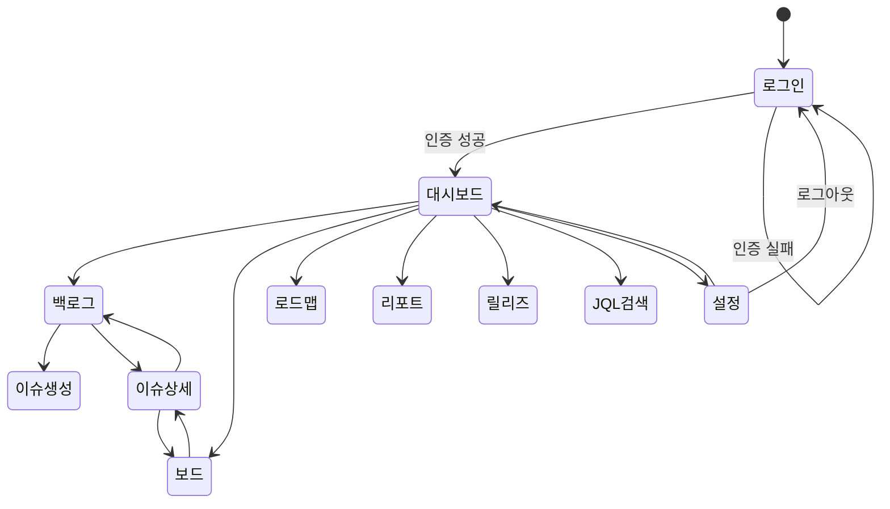

# Jira 프로젝트 관리 시스템 스토리보드

## 1. 사용자 시나리오 개요

| 시나리오 ID | 시나리오명 | 대상 사용자 | 주요 화면 |
|------------|-----------|------------|-----------|
| US-001 | 로그인 및 대시보드 확인 | 전체 사용자 | 로그인, 대시보드 |
| US-002 | 이슈 생성 및 백로그 관리 | Product Owner | 백로그, 이슈 생성 |
| US-003 | 스프린트 플래닝 | Scrum Master, PO | 백로그, 스프린트 관리 |
| US-004 | 개발 워크플로우 (보드 활용) | Developer | 보드, 이슈 상세 |
| US-005 | 코드 리뷰 및 QA | Reviewer, QA | 보드, 이슈 상세 |
| US-006 | 릴리즈 관리 | PM | 릴리즈, 대시보드 |

## 2. 스토리보드 상세

### US-001: 로그인 및 대시보드 확인

#### Step 1: 로그인 페이지

```
+-------------------------------------------+
|          Jira 프로젝트 관리 시스템           |
|                                           |
|  이메일                                    |
|  +-------------------------------------+  |
|  | user@company.com                     |  |
|  +-------------------------------------+  |
|  비밀번호                                  |
|  +-------------------------------------+  |
|  | ********                             |  |
|  +-------------------------------------+  |
|                                           |
|  +-------------------------------------+  |
|  |            로그인                     |  |
|  +-------------------------------------+  |
|                                           |
+-------------------------------------------+
```

**동작**:
- 이메일/비밀번호 입력 후 "로그인" 클릭 → 대시보드 이동
- 인증 실패 → 에러 메시지 표시
- 5회 연속 실패 → "계정이 잠겼습니다 (30분)" 표시

#### Step 2: 메인 대시보드 (Developer 역할)

```
+-------------------------------------------+
|  Jira PM  | 프로젝트: PROJ    | 사용자 ▼  |
+-------------------------------------------+
| +-------------------+ +------------------+ |
| | 내 담당 이슈       | | Sprint Burndown  | |
| | PROJ-142 [진행중]  | |  \               | |
| | PROJ-143 [리뷰중]  | |   \  ___         | |
| | PROJ-145 [대기]    | |    \/   \___     | |
| +-------------------+ +------------------+ |
| +-------------------+ +------------------+ |
| | Velocity Chart    | | 이슈 타입별 분포  | |
| | ■■■ 21            | |  Story  45%      | |
| | ■■■■ 28           | |  Task   25%      | |
| | ■■■ 24            | |  Bug    20%      | |
| +-------------------+ +------------------+ |
| +------------------------------------------+|
| | Cumulative Flow Diagram                   ||
| | ======================================== ||
| +------------------------------------------+|
+-------------------------------------------+
```

**동작**:
- 역할에 따라 가젯 자동 구성
- 이슈 클릭 → 이슈 상세 화면 이동

---

### US-004: 개발 워크플로우 (보드 활용)

#### Step 1: 스크럼 보드

```
+-------------------------------------------------------------------+
| Sprint 5 보드                                    필터 ▼  검색 🔍   |
+-------------------------------------------------------------------+
| Backlog    | Selected  | In Progress | Code Review | QA   | Done  |
|            |           | (WIP: 3)   |             |      |       |
+----------++-----------+-------------+-------------+------+-------+
| PROJ-150 | PROJ-148  | PROJ-142    | PROJ-139    |PROJ- | PROJ- |
| [Story]  | [Story]   | [Story]     | [Bug]       | 137  | 135   |
| SP:5     | SP:3      | SP:3        | SP:2        |[Task]| [Story|
|          |           | @김개발     | @이리뷰     |SP:1  | SP:5  |
+----------+-----------+-------------+-------------+------+-------+
| PROJ-151 | PROJ-149  | PROJ-143    |             |      | PROJ- |
| [Task]   | [Task]    | [Task]      |             |      | 136   |
| SP:2     | SP:2      | SP:2        |             |      | [Bug] |
|          |           | @박개발     |             |      | SP:1  |
+----------+-----------+-------------+-------------+------+-------+
```

**동작**:
- 카드 드래그 앤 드롭 → 상태 전환 (워크플로우 규칙 적용)
- In Progress 컬럼 WIP=3 초과 시 → 빨간색 경고 표시
- 카드 클릭 → 이슈 상세 모달

#### Step 2: 이슈 상세 (인라인 편집)

```
+-------------------------------------------+
| ← 보드   PROJ-142                         |
+-------------------------------------------+
| [Story] 로그인 실패 메시지 개선              |
|                                           |
| 상태: [In Progress ▼]  우선순위: [High ▼]  |
| 담당자: @김개발         SP: 3              |
| 스프린트: Sprint 5     버전: v1.0.0        |
+-------------------------------------------+
| 설명:                                     |
| [회원] 로그인 실패 시 사용자 친화적 에러     |
| 메시지를 제공하도록 개선                     |
+-------------------------------------------+
| 링크: Blocks PROJ-145                     |
+-------------------------------------------+
| 댓글                                      |
| @이리뷰: PR #42 생성했습니다. 리뷰 부탁.   |
| @김개발: 수정 완료, 재리뷰 요청드립니다.    |
+-------------------------------------------+
| 변경 이력                                  |
| 03/20 14:32 상태: In Progress→Code Review |
| 03/19 10:15 담당자: 미지정 → 김개발        |
+-------------------------------------------+
```

**동작**:
- 필드 클릭 → 인라인 편집
- 상태 드롭다운 → 워크플로우 전환 규칙 적용
- @멘션 댓글 → 해당 사용자에게 알림 발송

## 3. 화면 전환 흐름



## 변경 이력

| 버전 | 날짜 | 작성자 | 변경 내용 |
|------|------|--------|-----------|
| v1.0 | 2026-03-21 | 팀 | 최초 작성 |
