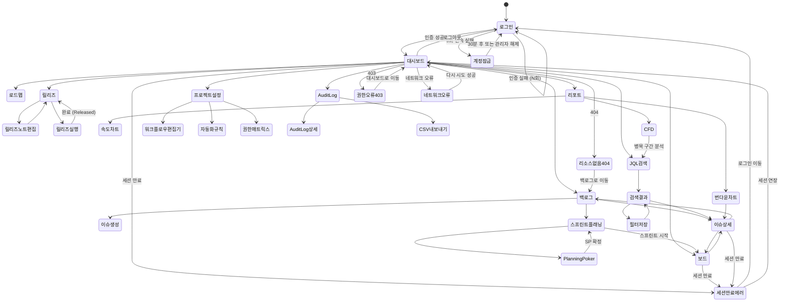

# Jira 프로젝트 관리 시스템 스토리보드

## 1. 사용자 시나리오 개요

| 시나리오 ID | 시나리오명 | 대상 사용자 | 주요 화면 |
|------------|-----------|------------|-----------|
| US-001 | 로그인 및 대시보드 확인 | 전체 사용자 | 로그인, 대시보드 |
| US-002 | 이슈 생성 및 백로그 관리 | Product Owner | 백로그, 이슈 생성 |
| US-003 | 스프린트 플래닝 | Scrum Master, PO | 백로그, 스프린트 관리 |
| US-004 | 개발 워크플로우 (보드 활용) | Developer | 보드, 이슈 상세 |
| US-005 | 코드 리뷰 및 QA | Reviewer, QA | 보드, 이슈 상세 |
| US-006 | 릴리즈 관리 | PM | 릴리즈, 대시보드 |
| US-007 | JQL 검색 활용 | 전체 사용자 | 검색, 필터 |
| US-008 | 프로젝트 설정 | Admin | 설정, 워크플로우 편집기 |
| US-009 | Audit Log 조회 | Admin, 컴플라이언스 | Audit Log |
| US-010 | 리포트 확인 | PM, 팀 리더 | 번다운, 속도, CFD |

---

## 2. 스토리보드 상세

---

### US-001: 로그인 및 대시보드 확인

#### Step 1: 로그인 페이지 (정상)

```
+-------------------------------------------+
|          Jira 프로젝트 관리 시스템           |
|                                           |
|  이메일                                    |
|  +-------------------------------------+  |
|  | user@company.com                    |  |
|  +-------------------------------------+  |
|  비밀번호                                  |
|  +-------------------------------------+  |
|  | ********                            |  |
|  +-------------------------------------+  |
|                                           |
|  [ ] 로그인 상태 유지                       |
|                                           |
|  +-------------------------------------+  |
|  |            로그인                   |  |
|  +-------------------------------------+  |
|                                           |
|  비밀번호를 잊으셨나요? [재설정]             |
+-------------------------------------------+
```

**동작**:
- 이메일/비밀번호 입력 후 "로그인" 클릭 → 역할별 대시보드로 이동
- 인증 실패 → Step 1-A 로그인 실패 에러 화면 표시
- 5회 연속 실패 → Step 1-B 계정 잠금 화면 표시

---

#### Step 1-A: 로그인 실패 와이어프레임

```
+-------------------------------------------+
|          Jira 프로젝트 관리 시스템           |
|                                           |
|  +-------------------------------------+  |
|  | ! 이메일 또는 비밀번호가 올바르지      |  |
|  |   않습니다. (3/5회 시도)             |  |
|  +-------------------------------------+  |
|                                           |
|  이메일                                    |
|  +-------------------------------------+  |
|  | user@company.com                    |  |  <- 빨간 테두리
|  +-------------------------------------+  |
|  비밀번호                                  |
|  +-------------------------------------+  |
|  | ********                            |  |  <- 빨간 테두리
|  +-------------------------------------+  |
|                                           |
|  +-------------------------------------+  |
|  |            로그인                   |  |
|  +-------------------------------------+  |
+-------------------------------------------+
```

**동작**:
- 실패 횟수(N/5)를 에러 메시지에 함께 표시
- 입력 필드 테두리를 빨간색으로 강조
- 2회 이상 실패 시 "비밀번호 재설정" 링크 강조 표시

---

#### Step 1-B: 계정 잠금 와이어프레임

```
+-------------------------------------------+
|          Jira 프로젝트 관리 시스템           |
|                                           |
|  +-------------------------------------+  |
|  |  계정이 잠겼습니다                   |  |
|  |                                     |  |
|  |  5회 연속 로그인 실패로 계정이        |  |
|  |  일시적으로 잠겼습니다.              |  |
|  |                                     |  |
|  |  잠금 해제까지 남은 시간: 28:43      |  |  <- 카운트다운
|  |                                     |  |
|  |  관리자에게 즉시 해제 요청하려면:    |  |
|  |  [관리자에게 문의]                   |  |
|  +-------------------------------------+  |
|                                           |
|  [비밀번호 재설정 이메일 발송]              |
+-------------------------------------------+
```

**동작**:
- 30분 카운트다운 타이머 실시간 표시
- "관리자에게 문의" 클릭 → 관리자 이메일 알림 발송
- "비밀번호 재설정 이메일 발송" 클릭 → 등록 이메일로 재설정 링크 전송

---

#### Step 2: 메인 대시보드 - Developer 역할

```
+-------------------------------------------+
|  Jira PM  | 프로젝트: PROJ    | 사용자 ▼  |
+-------------------------------------------+
| +-------------------+ +------------------+ |
| | 내 담당 이슈       | | Sprint Burndown  | |
| | PROJ-142 [진행중]  | |  \               | |
| | PROJ-143 [리뷰중]  | |   \  ___         | |
| | PROJ-145 [대기]    | |    \/   \___     | |
| +-------------------+ +------------------+ |
| +-------------------+ +------------------+ |
| | Velocity Chart    | | 이슈 타입별 분포  | |
| | ■■■ 21            | |  Story  45%      | |
| | ■■■■ 28           | |  Task   25%      | |
| | ■■■ 24            | |  Bug    20%      | |
| +-------------------+ +------------------+ |
| +------------------------------------------+|
| | Cumulative Flow Diagram                  ||
| | ========================================||
| +------------------------------------------+|
+-------------------------------------------+
```

**동작**:
- 역할에 따라 가젯 자동 구성 (아래 역할별 대시보드 참조)
- 이슈 클릭 → 이슈 상세 화면 이동

---

#### Step 2-A: PM 역할 대시보드 와이어프레임

```
+-------------------------------------------+
|  Jira PM  | 프로젝트: PROJ    | PM ▼      |
+-------------------------------------------+
| +-------------------+ +------------------+ |
| | Roadmap (Epic)    | | 릴리즈 진행률    | |
| | v1.0 [=======  ]  | | v1.0.0  [==== ] | |
| | v1.1 [====    ]   | |  78% (14/18)    | |
| | v2.0 [=       ]   | | v1.1.0  [=    ] | |
| +-------------------+ +------------------+ |
| +-------------------+ +------------------+ |
| | Pie Chart         | | Sprint Review    | |
| | Story  40%        | | 완료:  12 이슈   | |
| | Task   30%        | | 미완료: 3 이슈   | |
| | Bug    20%        | | 이월:   2 이슈   | |
| | Epic   10%        | |                  | |
| +-------------------+ +------------------+ |
| +------------------------------------------+|
| | 프로젝트 전체 번다운 (Epic 기준)          ||
| +------------------------------------------+|
+-------------------------------------------+
```

**동작**:
- Roadmap 클릭 → 로드맵 상세 화면 이동
- 릴리즈 진행률 클릭 → Release Hub 이동
- Sprint Review 미완료 이슈 클릭 → 백로그 이동

---

#### Step 2-B: QA 역할 대시보드 와이어프레임

```
+-------------------------------------------+
|  Jira PM  | 프로젝트: PROJ    | QA ▼      |
+-------------------------------------------+
| +-------------------+ +------------------+ |
| | QA 대기 이슈       | | Bug 현황         | |
| | PROJ-139 [QA]     | | Open    8        | |
| | PROJ-141 [QA]     | | In QA   3        | |
| | PROJ-144 [QA]     | | Fixed   12       | |
| +-------------------+ +------------------+ |
| +-------------------+ +------------------+ |
| | Created vs        | | 테스트 통과율     | |
| | Resolved          | | 이번 스프린트     | |
| | 생성: ▲ 5         | | Pass  15  (75%)  | |
| | 해결: ▼ 8         | | Fail   3  (15%)  | |
| |        순감소      | | Skip   2  (10%)  | |
| +-------------------+ +------------------+ |
+-------------------------------------------+
```

**동작**:
- QA 대기 이슈 클릭 → 이슈 상세 화면 이동
- Bug 현황 숫자 클릭 → 해당 상태 필터 적용된 이슈 목록 표시

---

### US-002: 이슈 생성 및 백로그 관리 (PO)

#### Step 1: 백로그 화면 와이어프레임

```
+------------------------------------------------------------------+
|  PROJ 백로그                          [+ 이슈 생성]  [스프린트 ▼] |
+------------------------------------------------------------------+
| 에픽 필터: [전체 ▼]  담당자: [전체 ▼]  타입: [전체 ▼]  [검색 🔍]   |
+------------------------------------------------------------------+
| Sprint 5  (2026-03-21 ~ 04-03)  [스프린트 완료]  총 SP: 28       |
|  = PROJ-148  [Story] 결제 플로우 개선           SP:5  @김개발    |
|  = PROJ-149  [Task]  DB 인덱스 최적화           SP:2  @박개발    |
|  = PROJ-150  [Bug]   모바일 레이아웃 깨짐        SP:3  @이개발   |
+------------------------------------------------------------------+
| 백로그  (이슈 47개)                              총 SP: 183       |
|                                                                  |
|  ≡ PROJ-151  [Story] 알림 센터 구현             SP:8  미배정     |  <- 드래그 핸들
|  ≡ PROJ-152  [Story] 다국어 지원 (i18n)         SP:5  미배정     |
|  ≡ PROJ-153  [Bug]   IE11 호환성 오류           SP:2  미배정     |
|  ≡ PROJ-154  [Epic]  보안 강화 패키지           SP:-  미배정     |
|  ≡ PROJ-155  [Task]  CI/CD 파이프라인 개선       SP:3  미배정     |
|  ...                                                             |
|  [+ 이슈 생성]                                                   |
+------------------------------------------------------------------+
```

**동작**:
- 에픽 필터 드롭다운 → 선택한 에픽에 속한 이슈만 표시
- 이슈 좌측 "≡" 핸들 드래그 → 백로그 내 우선순위 순서 재정렬
- 백로그 이슈를 스프린트 영역으로 드래그 → 스프린트 배정
- "스프린트 완료" 클릭 → 미완료 이슈 이월 확인 다이얼로그 표시

---

#### Step 2: 이슈 생성 폼 - 타입 선택 및 동적 필드

```
+-------------------------------------------+
|  이슈 생성                              [X] |
+-------------------------------------------+
|  프로젝트  [PROJ - 프로젝트명       ▼]      |
|  이슈 타입 [Story                   ▼]      |
|            +---------------------------+    |
|            | Epic                      |    |
|            | Story           (선택됨) |    |
|            | Task                      |    |
|            | Bug                       |    |
|            | Sub-task                  |    |
|            +---------------------------+    |
|                                           |
|  제목 *                                   |
|  +-------------------------------------+  |
|  | [모듈] 기능 요약                     |  |
|  +-------------------------------------+  |
|                                           |
|  설명  (As a / I want / So that)          |
|  +-------------------------------------+  |
|  |                                     |  |
|  +-------------------------------------+  |
|                                           |
|  에픽 링크   [선택 ▼]                      |
|  우선순위    [Medium ▼]                    |
|  담당자      [미배정 ▼]                    |
|  스토리 포인트 [  ]                        |
|  레이블      [+ 추가]                      |
|  컴포넌트    [+ 추가]                      |
|                                           |
|          [취소]  [생성]                    |
+-------------------------------------------+
```

**동작**:
- 이슈 타입 "Bug" 선택 시 → 하단에 Bug 전용 필드 동적 추가 (Step 2-A 참조)
- "생성" 클릭 → 이슈 생성 후 생성된 이슈 상세 화면으로 이동
- 제목 필드에 "[모듈] " 접두어 패턴 미준수 시 → 황색 경고 표시

---

#### Step 2-A: Bug 타입 선택 시 동적 필드 추가

```
+-------------------------------------------+
|  이슈 생성  (Bug)                       [X] |
+-------------------------------------------+
|  프로젝트  [PROJ             ▼]            |
|  이슈 타입 [Bug              ▼]            |
|                                           |
|  제목 *                                   |
|  +-------------------------------------+  |
|  | [모듈] 증상 한 줄 요약               |  |
|  +-------------------------------------+  |
|                                           |
|  재현 절차 *                              |
|  +-------------------------------------+  |
|  | 1.                                  |  |
|  | 2.                                  |  |
|  | 3.                                  |  |
|  +-------------------------------------+  |
|                                           |
|  기대 결과 *                              |
|  +-------------------------------------+  |
|  | 정상적으로 ...해야 함                |  |
|  +-------------------------------------+  |
|                                           |
|  실제 결과 *                              |
|  +-------------------------------------+  |
|  | ...오류 발생                         |  |
|  +-------------------------------------+  |
|                                           |
|  환경 정보                                |
|  OS: [       ]  브라우저: [       ]        |
|  재현율: [ 항상 ▼]                         |
|                                           |
|  우선순위 [High ▼]  심각도 [Critical ▼]    |
|          [취소]  [생성]                    |
+-------------------------------------------+
```

**동작**:
- 재현 절차, 기대 결과, 실제 결과는 Bug 타입에서만 표시되는 필수 필드
- 필수 필드 미입력 시 "생성" 버튼 비활성화
- 심각도(Severity): Critical / Major / Minor / Trivial 선택

---

#### Step 3: 이슈 상세 편집

```
+-------------------------------------------+
|  <- 백로그   PROJ-151                      |
+-------------------------------------------+
|  [Story] 알림 센터 구현                    |
|                                           |
|  상태: [Backlog ▼]        우선순위: [High ▼] |
|  담당자: [미배정 ▼]        SP: [8    ]      |  <- 인라인 편집
|  에픽: [알림 시스템 ▼]     버전: [v1.1.0 ▼] |
|                                           |
+-------------------------------------------+
|  레이블                                   |
|  [frontend] [notification] [+ 추가]       |
|                                           |
|  컴포넌트                                  |
|  [UI] [API] [+ 추가]                      |
+-------------------------------------------+
|  완료 조건 (Acceptance Criteria)           |
|  [ ] 실시간 알림 푸시 수신                  |
|  [ ] 알림 목록 읽음/안읽음 처리             |
|  [ ] 알림 전체 삭제 기능                    |
+-------------------------------------------+
|  댓글                                     |
|  [댓글 입력...                         ]   |
+-------------------------------------------+
```

**동작**:
- 각 필드 클릭 → 인라인 편집 모드 활성화
- SP 입력 후 Enter → 저장 + Velocity 통계 즉시 반영
- 레이블/컴포넌트 "+ 추가" 클릭 → 자동완성 드롭다운 표시

---

#### Step 4: 스프린트 배정 (드래그)

```
+------------------------------------------------------------------+
|  백로그                                                           |
+------------------------------------------------------------------+
| Sprint 5  (진행 중)                           총 SP: 28          |
|  = PROJ-148  [Story] 결제 플로우 개선                              |
|  = PROJ-149  [Task]  DB 인덱스 최적화                              |
|  +------------------------------------------------------------+  |
|  |  >>> PROJ-151 드래그 중  <<<   [Story] 알림 센터 구현  SP:8 |  |  <- 드래그 중
|  +------------------------------------------------------------+  |
+------------------------------------------------------------------+
| Sprint 6  (예정)            [스프린트 시작]     총 SP: 13          |
|  = PROJ-152  [Story] 다국어 지원               SP:5               |
|  = PROJ-153  [Bug]   IE11 호환성 오류          SP:2               |
|  +---------------------------------------------------+           |
|  |  PROJ-151 이 여기에 추가됩니다.  SP 합계: 21/40  |           |  <- 드롭 가이드
|  +---------------------------------------------------+           |
+------------------------------------------------------------------+
| 백로그  (이슈 46개)                                                |
|  ≡ PROJ-154  [Epic]  보안 강화 패키지                              |
|  ≡ PROJ-155  [Task]  CI/CD 파이프라인 개선                         |
+------------------------------------------------------------------+
```

**동작**:
- 이슈 카드 드래그 → 스프린트 영역 드롭 시 배정 완료
- 스프린트 용량(SP 합계) 초과 시 → 황색 경고 배지 표시
- 우클릭 컨텍스트 메뉴 → "스프린트에 추가" 선택으로도 배정 가능

---

### US-003: 스프린트 플래닝 (Scrum Master, PO)

#### Step 1: 스프린트 생성 다이얼로그

```
+-------------------------------------------+
|  새 스프린트 생성                        [X] |
+-------------------------------------------+
|  스프린트 이름 *                           |
|  +-------------------------------------+  |
|  | Sprint 6                            |  |
|  +-------------------------------------+  |
|                                           |
|  시작일 *           종료일 *               |
|  +---------------+  +---------------+    |
|  | 2026-04-04    |  | 2026-04-17    |    |
|  +---------------+  +---------------+    |
|  기간: 2주 (자동 계산)                     |
|                                           |
|  스프린트 목표                             |
|  +-------------------------------------+  |
|  | 알림 센터 및 다국어 지원 구현 완료      |  |
|  +-------------------------------------+  |
|                                           |
|  팀 용량 (Story Points)                   |
|  +-------------------------------------+  |
|  | 40                                  |  |  <- 권장 기준
|  +-------------------------------------+  |
|                                           |
|          [취소]  [생성]                    |
+-------------------------------------------+
```

**동작**:
- 시작일 선택 시 종료일 자동 계산 (기본 2주)
- "생성" 클릭 → 백로그 화면에 새 스프린트 섹션 추가
- 스프린트 목표는 스프린트 보드 헤더에 표시

---

#### Step 2: 백로그에서 이슈 선택 (DoR 체크 + 용량 확인)

```
+------------------------------------------------------------------+
| Sprint 6 플래닝                          팀 용량: 40 SP          |
+------------------------------------------------------------------+
| 선택됨: 13 SP  [===========                        ] 32.5%       |
|                                                                  |
| 이슈 선택                         DoR    SP   담당자             |
| [v] PROJ-151  알림 센터 구현       [DoR]  8    미배정            |
| [v] PROJ-152  다국어 지원 (i18n)   [DoR]  5    미배정            |
| [ ] PROJ-154  보안 강화 패키지     [!DoR] -    미배정            |  <- DoR 미충족
| [ ] PROJ-155  CI/CD 파이프라인     [DoR]  3    미배정            |
| [ ] PROJ-156  대시보드 커스텀      [DoR]  5    미배정            |
+------------------------------------------------------------------+
| DoR 체크리스트 (PROJ-154)          [닫기]                         |
| +--------------------------------------------------------------+ |
| | [ ] 요구사항 명확 - Acceptance Criteria 미작성                | |
| | [v] UI/UX 산출물 - 와이어프레임 완료                          | |
| | [ ] API 스펙 정의 - 미확정                                    | |
| | [v] Story Point 산정 완료                                    | |
| | [ ] 의존성 파악 - PROJ-148 완료 필요                          | |
| +--------------------------------------------------------------+ |
+------------------------------------------------------------------+
```

**동작**:
- 체크박스 선택 → 상단 용량 바 실시간 업데이트
- "[!DoR]" 배지 클릭 → DoR 체크리스트 패널 펼치기
- 용량 100% 초과 시 → 바 색상 빨간색 전환 + 경고 메시지

---

#### Step 3: Planning Poker

```
+------------------------------------------------------------------+
| Planning Poker  -  PROJ-151: 알림 센터 구현      참가자: 6명      |
+------------------------------------------------------------------+
| 이슈 설명                                                         |
| "사용자가 실시간으로 알림을 받고 읽음 처리할 수 있는 알림 센터 구현" |
| [이슈 상세 보기 ↗]                                               |
+------------------------------------------------------------------+
| 카드 선택:                                                        |
|                                                                  |
|  +--+  +--+  +--+  +--+  +--+  +--+  +--+  +--+               |
|  | 1|  | 2|  | 3|  | 5|  | 8|  |13|  | ?|  |☕|               |
|  +--+  +--+  +--+  +--+  +--+  +--+  +--+  +--+               |
|               선택됨 ->  [8]                                    |
|                                                                  |
+------------------------------------------------------------------+
| 현재 상태: 투표 중  (4/6명 선택 완료)                              |
|                                                                  |
| 김개발  [선택됨]   박개발  [선택됨]   이개발  [대기중...]          |
| 최개발  [선택됨]   정QA    [선택됨]   한PO    [대기중...]          |
|                                                                  |
|  [전체 공개]  <- 모두 선택 완료 시 활성화                          |
+------------------------------------------------------------------+
```

**Step 3-A: 카드 동시 공개 후**

```
+------------------------------------------------------------------+
| Planning Poker  -  PROJ-151: 알림 센터 구현  [공개 완료]           |
+------------------------------------------------------------------+
| 결과:                                                             |
|  김개발   [5]   박개발   [8]   이개발   [8]                       |
|  최개발   [13]  정QA     [8]   한PO     [5]                       |
|                                                                  |
|  최저: 5  (김개발, 한PO)                                          |
|  최고: 13 (최개발)                                                |
|  평균: 7.8                                                        |
|                                                                  |
| 토론 (최저/최고 의견 청취)                                         |
| 최개발: "외부 푸시 연동 포함하면 13이 적절합니다."                  |
| 김개발: "푸시는 별도 이슈로 분리하면 5면 충분해요."                 |
|                                                                  |
|  [재투표]   [SP 확정: 8]                                          |
+------------------------------------------------------------------+
```

**동작**:
- 모든 참가자가 카드 선택 전까지 "전체 공개" 버튼 비활성화
- 공개 후 최저/최고 값 선택자가 자동으로 토론 진행자로 표시
- "SP 확정" 클릭 → 이슈에 SP 값 자동 저장

---

#### Step 4: 스프린트 시작

```
+-------------------------------------------+
|  Sprint 6 시작                          [X] |
+-------------------------------------------+
|  스프린트 이름: Sprint 6                   |
|  기간: 2026-04-04 ~ 2026-04-17 (2주)       |
|  스프린트 목표: 알림 센터 및 다국어 지원     |
|               구현 완료                    |
|                                           |
|  포함 이슈: 8개  (총 38 SP)                |
|                                           |
|  +-------------------------------------+  |
|  | [v] 모든 이슈에 담당자가 지정됨        |  |
|  | [v] SP가 산정된 이슈: 8/8            |  |
|  | [!] DoR 미충족 이슈: 0개             |  |
|  +-------------------------------------+  |
|                                           |
|  현재 진행 중인 스프린트: Sprint 5          |
|  (Sprint 5가 완료되지 않았습니다)           |
|                                           |
|          [취소]  [스프린트 시작]            |
+-------------------------------------------+
```

**동작**:
- "스프린트 시작" 클릭 → 보드에 스프린트 활성화 + 번다운 차트 생성 시작
- 담당자 미지정 이슈 존재 시 → 경고 배지 표시 (시작은 가능)
- 동시에 2개 스프린트 진행 가능 (경고 표시 후 진행)

---

### US-004: 개발 워크플로우 (보드 활용)

#### Step 1: 스크럼 보드

```
+-------------------------------------------------------------------+
| Sprint 5 보드                                    필터 ▼  검색 🔍   |
| 목표: "결제 플로우 개선 및 DB 최적화 완료"                           |
+-------------------------------------------------------------------+
| Backlog    | Selected  | In Progress | Code Review | QA   | Done  |
|            |           | (WIP: 3/3) |             |      |       |
+----------++-----------+-------------+-------------+------+-------+
| PROJ-150 | PROJ-148  | PROJ-142    | PROJ-139    |PROJ- | PROJ- |
| [Story]  | [Story]   | [Story]     | [Bug]       | 137  | 135   |
| SP:5     | SP:3      | SP:3        | SP:2        |[Task]| [Story|
|          |           | @김개발     | @이리뷰     |SP:1  | SP:5  |
+----------+-----------+-------------+-------------+------+-------+
| PROJ-151 | PROJ-149  | PROJ-143    |             |      | PROJ- |
| [Task]   | [Task]    | [Task]      |             |      | 136   |
| SP:2     | SP:2      | SP:2        |             |      | [Bug] |
|          |           | @박개발     |             |      | SP:1  |
+----------+-----------+-------------+-------------+------+-------+
```

**동작**:
- 카드 드래그 앤 드롭 → 상태 전환 (워크플로우 규칙 적용)
- In Progress 컬럼 WIP=3/3 도달 시 → Step 1-A WIP 초과 경고 표시
- 카드 클릭 → 이슈 상세 모달 (Step 2 참조)

---

#### Step 1-A: WIP 초과 경고 보드

```
+-------------------------------------------------------------------+
| Sprint 5 보드                                    필터 ▼  검색 🔍   |
+-------------------------------------------------------------------+
| Backlog    | Selected  | In Progress          | Code Review | ... |
|            |           | (WIP: 4/3) [!!!]     |             |     |
+----------++-----------+----------------------+-------------+-----+
|          |           | PROJ-142  PROJ-143    | PROJ-139    |     |
|          |           | PROJ-144  PROJ-146    |             |     |  <- 4개 (초과)
|          |           | (컬럼 헤더 빨간색)    |             |     |
+----------+-----------+----------------------+-------------+-----+
|                                                                   |
|  +-------------------------------------------------------+        |
|  | WIP 한계 초과 경고                               [X]   |        |
|  |                                                       |        |
|  | In Progress 컬럼이 WIP 한계(3)를 초과했습니다.         |        |
|  |                                                       |        |
|  | 기존 작업을 먼저 완료하여 흐름을 유지해 주세요.          |        |
|  |                                                       |        |
|  | 현재 진행 중: 4개  /  WIP 한계: 3                      |        |
|  |                [확인]  [WIP 설정 변경]                 |        |
|  +-------------------------------------------------------+        |
+-------------------------------------------------------------------+
```

**동작**:
- WIP 초과 상태에서 카드를 드래그 드롭 시 즉시 경고 다이얼로그 표시
- 컬럼 헤더 배경색이 노란색 → 빨간색으로 전환
- "WIP 설정 변경" 클릭 → 프로젝트 보드 설정 화면으로 이동 (Admin 권한 필요)

---

#### Step 1-B: 전환 규칙 위반 에러 다이얼로그

```
+-------------------------------------------+
|  상태 전환 불가                          [X] |
+-------------------------------------------+
|                                           |
|  PROJ-142를 다음 상태로 전환할 수 없습니다: |
|                                           |
|  In Progress  →  QA                       |
|                                           |
|  이유: 이 전환은 허용되지 않습니다.         |
|  허용된 전환 경로:                          |
|                                           |
|  In Progress → Code Review                |
|  In Progress → Backlog (후퇴)             |
|                                           |
|  PR 생성 후 "Code Review"로 전환하거나,    |
|  작업을 중단하려면 "Backlog"으로 이동하세요. |
|                                           |
|              [확인]                        |
+-------------------------------------------+
```

**동작**:
- 비허용 전환 경로로 드래그 드롭 시 카드가 원위치로 복귀하며 에러 다이얼로그 표시
- 허용된 전환 경로 목록 제공으로 사용자 안내
- "확인" 클릭 → 다이얼로그 닫기, 카드 원래 컬럼 유지

---

#### Step 2: 이슈 상세 (인라인 편집)

```
+-------------------------------------------+
| <- 보드   PROJ-142                         |
+-------------------------------------------+
| [Story] 로그인 실패 메시지 개선              |
|                                           |
| 상태: [In Progress ▼]  우선순위: [High ▼]  |
| 담당자: @김개발         SP: 3              |
| 스프린트: Sprint 5     버전: v1.0.0        |
+-------------------------------------------+
| 설명:                                     |
| [회원] 로그인 실패 시 사용자 친화적 에러     |
| 메시지를 제공하도록 개선                     |
+-------------------------------------------+
| 링크: Blocks PROJ-145                     |
+-------------------------------------------+
| 댓글                                      |
| @이리뷰: PR #42 생성했습니다. 리뷰 부탁.   |
| @김개발: 수정 완료, 재리뷰 요청드립니다.    |
+-------------------------------------------+
| 변경 이력                                  |
| 03/20 14:32 상태: In Progress→Code Review |
| 03/19 10:15 담당자: 미지정 → 김개발        |
+-------------------------------------------+
```

**동작**:
- 필드 클릭 → 인라인 편집
- 상태 드롭다운 → 워크플로우 전환 규칙 적용 (위반 시 Step 1-B 다이얼로그)
- @멘션 댓글 → 해당 사용자에게 알림 발송

---

### US-005: 코드 리뷰 및 QA (Reviewer, QA)

#### Step 1: Reviewer - Code Review 컬럼 이슈 확인

```
+-------------------------------------------------------------------+
| Sprint 5 보드                                    필터 ▼  검색 🔍   |
+-------------------------------------------------------------------+
| ...  | In Progress | Code Review          | QA   | Done          |
|      |             | (WIP: 2)             |      |               |
+------+-------------+----------------------+------+---------------+
|      |             | PROJ-139  [Bug]      |      |               |
|      |             | SP:2  @이리뷰        |      |               |
|      |             | [PR #38 연결됨]      |      |               |  <- GitHub 연동
|      |             +--------------------+ |      |               |
|      |             | PROJ-144  [Story]  | |      |               |
|      |             | SP:5  @이리뷰      | |      |               |
|      |             | [PR #41 연결됨]    | |      |               |
+------+-------------+----------------------+------+---------------+
```

**동작**:
- Code Review 컬럼에서 본인(@이리뷰) 담당 이슈 확인
- 이슈 카드의 "PR #38" 링크 클릭 → GitHub PR 페이지로 이동
- 이슈 카드 클릭 → 이슈 상세에서 PR 리뷰 패널 확인

---

#### Step 2: PR 리뷰 화면 (GitHub 연동)

```
+-------------------------------------------+
| <- 보드   PROJ-139                         |
+-------------------------------------------+
| [Bug] 로그인 500 에러 수정                  |
| 상태: [Code Review]  담당자: @이리뷰        |
+-------------------------------------------+
| GitHub PR 연동                             |
| +-------------------------------------+  |
| | PR #38: fix: handle login 500 error |  |
| | 브랜치: feature/PROJ-139-login-fix  |  |
| | 작성자: @김개발  |  변경: +45 / -12  |  |
| |                                     |  |
| | [GitHub에서 전체 코드 보기 ↗]        |  |
| |                                     |  |
| | 변경 파일 (3개)                      |  |
| | src/auth/login.service.ts    +32    |  |
| | src/auth/login.controller.ts +8     |  |
| | test/auth/login.spec.ts      +5     |  |
| |                                     |  |
| | 리뷰 코멘트 (2개)                   |  |
| | @이리뷰: L42 - 에러 코드 상수화 권장 |  |
| | @김개발: 반영했습니다. 확인 부탁드려요|  |
| +-------------------------------------+  |
|                                           |
|  [변경 요청 (Request Changes)]  [승인 (Approve)] |
+-------------------------------------------+
```

**동작**:
- "GitHub에서 전체 코드 보기" → 새 탭으로 GitHub PR 페이지 오픈
- "변경 요청" 클릭 → Step 3-A 처리
- "승인" 클릭 → Step 3-B 처리

---

#### Step 3-A: 변경 요청 → In Progress 복귀

```
+-------------------------------------------+
|  리뷰 결과: 변경 요청                    [X] |
+-------------------------------------------+
|  PROJ-139 상태를 변경합니다:               |
|  Code Review → In Progress               |
|                                           |
|  변경 요청 사유 (담당자에게 전달됩니다):     |
|  +-------------------------------------+  |
|  | 에러 코드 상수화 후 재제출 바랍니다.  |  |
|  | src/auth/login.service.ts L42 참고  |  |
|  +-------------------------------------+  |
|                                           |
|  [ ] @김개발 에게 알림 발송               |
|  [ ] Slack #dev 채널에 알림 발송          |
|                                           |
|          [취소]  [변경 요청 제출]          |
+-------------------------------------------+
```

**동작**:
- "변경 요청 제출" 클릭 → 이슈 상태가 Code Review → In Progress로 전환
- 담당자(@김개발)에게 알림 자동 발송
- 이슈 변경 이력에 리뷰 코멘트 기록

---

#### Step 3-B: 승인 → QA 상태 전환

```
+-------------------------------------------+
|  리뷰 승인                              [X] |
+-------------------------------------------+
|  PROJ-139 상태를 변경합니다:               |
|  Code Review → QA                         |
|                                           |
|  승인 코멘트 (선택):                       |
|  +-------------------------------------+  |
|  | LGTM! 깔끔하게 수정됐습니다.          |  |
|  +-------------------------------------+  |
|                                           |
|  QA 담당자 지정:                           |
|  [정QA ▼]                                 |
|                                           |
|          [취소]  [승인 완료]               |
+-------------------------------------------+
```

**동작**:
- "승인 완료" 클릭 → 이슈 상태가 Code Review → QA로 전환
- 지정된 QA 담당자에게 알림 발송
- PR이 GitHub에서 자동으로 Approve 처리 (GitHub Actions 연동 시)

---

#### Step 4: QA 테스트 실행

```
+-------------------------------------------+
| <- 보드   PROJ-139                         |
+-------------------------------------------+
| [Bug] 로그인 500 에러 수정                  |
| 상태: [QA]  담당자: @정QA                   |
+-------------------------------------------+
| QA 테스트 체크리스트                        |
| +-------------------------------------+  |
| | [v] 로그인 성공 케이스               |  |
| | [v] 잘못된 비밀번호 입력 케이스       |  |
| | [v] 존재하지 않는 계정 케이스        |  |
| | [ ] 5회 실패 후 잠금 케이스           |  |
| | [ ] 토큰 만료 후 재로그인 케이스      |  |
| +-------------------------------------+  |
|  3/5 완료                                 |
|                                           |
| DoD 체크리스트                             |
| +-------------------------------------+  |
| | [v] Acceptance Criteria 충족         |  |
| | [v] 코드 리뷰 완료 (승인 1인 이상)   |  |
| | [v] 단위 테스트 커버리지 82%         |  |
| | [ ] QA 시나리오 전체 Pass            |  |
| | [ ] 문서 업데이트 확인               |  |
| +-------------------------------------+  |
|                                           |
|  [테스트 실패 → Bug 등록]  [Pass → Done]   |
+-------------------------------------------+
```

**Step 4-A: QA Pass → Done 전환**

```
+-------------------------------------------+
|  QA 통과 - Done 전환                    [X] |
+-------------------------------------------+
|  DoD 체크리스트 최종 확인                   |
|                                           |
|  [v] Acceptance Criteria 전체 충족         |
|  [v] 코드 리뷰 완료                        |
|  [v] 단위 테스트 커버리지 82% (기준 80%)    |
|  [v] QA 시나리오 전체 Pass (5/5)           |
|  [v] 문서 업데이트 완료                    |
|  [v] 회귀 테스트 이상 없음                  |
|                                           |
|  PROJ-139 상태: QA → Done                 |
|                                           |
|          [취소]  [Done으로 전환]           |
+-------------------------------------------+
```

**Step 4-B: QA Fail → Bug 등록**

```
+-------------------------------------------+
|  테스트 실패 - Bug 등록                  [X] |
+-------------------------------------------+
|  연관 이슈: PROJ-139                       |
|                                           |
|  버그 제목 *                               |
|  +-------------------------------------+  |
|  | [회원] 5회 실패 후 잠금 미동작 (PROJ-139)|  |
|  +-------------------------------------+  |
|                                           |
|  재현 절차 *                              |
|  +-------------------------------------+  |
|  | 1. 로그인 5회 연속 실패               |  |
|  | 2. 6번째 시도 시 잠금 없이 로그인 가능 |  |
|  +-------------------------------------+  |
|                                           |
|  심각도: [Critical ▼]  우선순위: [High ▼]  |
|  담당자: [@김개발 ▼]                       |
|  PROJ-139와 연결: [Blocks ▼]              |
|                                           |
|          [취소]  [Bug 등록]               |
+-------------------------------------------+
```

**동작**:
- "Bug 등록" 클릭 → 새 Bug 이슈 생성 + PROJ-139와 Blocks 관계 연결
- Bug 이슈는 자동으로 현재 스프린트 백로그에 추가
- PROJ-139는 QA 상태 유지 (Bug 해결 후 재테스트)

---

### US-006: 릴리즈 관리 (PM)

#### Step 1: Release Hub (버전별 진행률)

```
+------------------------------------------------------------------+
|  릴리즈 관리                                    [+ 버전 생성]      |
+------------------------------------------------------------------+
|  프로젝트: PROJ                                                   |
+------------------------------------------------------------------+
| Unreleased                                                        |
|                                                                   |
| v1.1.0  (예정: 2026-05-01)                                        |
|  진행률: [==================          ] 60%  (12/20 이슈 완료)    |
|  [Story: 8] [Task: 3] [Bug: 9]                                   |
|  [릴리즈 노트 편집]  [릴리즈 실행]                                 |
|                                                                   |
| v1.0.1  (예정: 2026-04-10)                                        |
|  진행률: [===========================  ] 90%  (9/10 이슈 완료)    |
|  [Story: 2] [Task: 1] [Bug: 7]                                   |
|  [릴리즈 노트 편집]  [릴리즈 실행]                                 |
+------------------------------------------------------------------+
| Released                                                          |
|                                                                   |
| v1.0.0  (릴리즈: 2026-04-01)                                      |
|  진행률: [==============================] 100%  (18/18 이슈 완료) |
|  [릴리즈 노트 보기]                                               |
+------------------------------------------------------------------+
```

**동작**:
- 진행률 바 클릭 → 해당 버전 이슈 목록 필터 표시
- "릴리즈 노트 편집" 클릭 → Step 2 릴리즈 노트 편집 화면
- "릴리즈 실행" 클릭 → Step 3 릴리즈 실행 다이얼로그

---

#### Step 2: 릴리즈 노트 자동 생성/편집

```
+------------------------------------------------------------------+
|  릴리즈 노트 - v1.0.1               [자동 생성]  [미리보기]  [저장] |
+------------------------------------------------------------------+
|  제목: Jira PM v1.0.1 릴리즈 노트                                 |
|  릴리즈 일: 2026-04-10                                            |
+------------------------------------------------------------------+
| ## 새 기능 (New Features)                                         |
| - [PROJ-23] 알림 설정 개인화 옵션 추가                             |
| - [PROJ-25] 대시보드 가젯 순서 변경 기능                           |
|                                                                   |
| ## 버그 수정 (Bug Fixes)                                          |
| - [PROJ-31] 모바일 환경 로그인 500 에러 수정                       |
| - [PROJ-33] IE11 날짜 선택기 오류 수정                             |
| - [PROJ-35] 스프린트 완료 후 번다운 차트 미갱신 수정               |
|                                                                   |
| ## 개선 사항 (Improvements)                                       |
| - [PROJ-40] 검색 응답 속도 40% 개선                               |
| - [PROJ-41] 페이지 로딩 스켈레톤 UI 적용                          |
|                                                                   |
| [이슈 추가]  [이슈 제거]  [섹션 추가]                              |
+------------------------------------------------------------------+
```

**동작**:
- "자동 생성" 클릭 → Fix Version=v1.0.1인 Done 상태 이슈를 이슈 타입별로 자동 분류 삽입
- 각 이슈 항목 클릭 → 해당 이슈 상세 화면으로 이동
- "미리보기" 클릭 → Confluence 문서 형식으로 렌더링된 미리보기 표시
- "저장" 클릭 → 릴리즈 노트 저장 + Confluence에 자동 게시 (연동 시)

---

#### Step 3: 릴리즈 실행 (Unreleased → Released)

```
+-------------------------------------------+
|  릴리즈 실행 - v1.0.1                   [X] |
+-------------------------------------------+
|  릴리즈 요약                               |
|  버전: v1.0.1                             |
|  포함 이슈: 10개 (완료: 9, 미완료: 1)       |
|                                           |
|  +-------------------------------------+  |
|  | ! 미완료 이슈가 1개 있습니다:         |  |
|  | PROJ-45 - 레거시 API 제거            |  |
|  |                                     |  |
|  | 처리 방법:                           |  |
|  | (o) 다음 버전(v1.1.0)으로 이동        |  |
|  | ( ) 이번 릴리즈에서 제외 (백로그 이동)|  |
|  | ( ) 릴리즈 취소                      |  |
|  +-------------------------------------+  |
|                                           |
|  릴리즈 일시: [2026-04-10 09:00 ▼]        |
|                                           |
|  [취소]  [릴리즈 실행]                     |
+-------------------------------------------+
```

**동작**:
- "릴리즈 실행" 클릭 → v1.0.1 상태가 Unreleased → Released로 변경
- 미완료 이슈는 선택한 방법에 따라 처리
- Slack 알림 채널에 릴리즈 공지 자동 발송 (연동 시)

---

#### Step 4: 배포 후 확인

```
+------------------------------------------------------------------+
|  릴리즈 완료 - v1.0.1                               2026-04-10   |
+------------------------------------------------------------------+
|  상태: Released                                                   |
|                                                                   |
|  릴리즈 요약                                                       |
|  +------------------------+  +------------------------------+     |
|  | 포함 이슈: 9개          |  | 다음 버전으로 이동: 1개        |     |
|  | Story: 2  Task: 1      |  | v1.1.0에 PROJ-45 추가됨      |     |
|  | Bug: 6                 |  |                              |     |
|  +------------------------+  +------------------------------+     |
|                                                                   |
|  배포 관련                                                         |
|  [GitHub Release 보기 ↗]   [Confluence 릴리즈 노트 ↗]           |
|  [CI/CD 배포 로그 ↗]                                              |
|                                                                   |
|  [다음 버전 (v1.1.0) 관리]                                         |
+------------------------------------------------------------------+
```

**동작**:
- Released 상태 버전은 수정 불가 (읽기 전용)
- "GitHub Release 보기" → GitHub Releases 페이지로 이동
- "다음 버전 관리" → Release Hub에서 v1.1.0 포커스

---

### US-007: JQL 검색 활용 (전체 사용자)

#### Step 1: 검색 화면 (JQL 입력 + 자동완성)

```
+------------------------------------------------------------------+
|  이슈 검색                                                         |
+------------------------------------------------------------------+
|  JQL 입력                                    [기본 모드로 전환]    |
|  +------------------------------------------------------------+   |
|  | project = PROJ AND status = "In Progress" AND assignee = c|   |
|  |                                                 ^자동완성  |   |
|  +------------------------------------------------------------+   |
|  자동완성 제안:                                                    |
|  +------------------------------------------------------------+   |
|  | currentUser()        <- 현재 로그인 사용자                  |   |
|  | "kim.developer"                                             |   |
|  | "lee.reviewer"                                              |   |
|  | "park.developer"                                            |   |
|  +------------------------------------------------------------+   |
|                                                                   |
|  최근 검색                           저장된 필터                   |
|  - status = "In Progress"           - 내 담당 진행중 이슈          |
|  - project = PROJ AND priority ...  - 이번 스프린트 버그            |
|  - assignee = currentUser()         - QA 대기 이슈                |
|                                                                   |
|  JQL 도움말:  [필드 목록]  [연산자]  [함수]                        |
+------------------------------------------------------------------+
```

**동작**:
- JQL 입력 중 스페이스 입력 → 다음 가능한 키워드 자동완성 표시
- 함수명(currentUser 등) 입력 시 → 함수 설명 툴팁 표시
- Enter 또는 "검색" 클릭 → Step 2 검색 결과 표시

---

#### Step 2: 검색 결과 테이블

```
+------------------------------------------------------------------+
|  검색 결과 (23개)                          [필터 저장]  [내보내기]  |
|  JQL: project = PROJ AND status = "In Progress" AND assignee = currentUser() |
+------------------------------------------------------------------+
|  열 설정: [이슈키 ▼] [요약 ▼] [상태 ▼] [담당자 ▼] [우선순위 ▼] [SP ▼] |
+------------------------------------------------------------------+
| 이슈키    | 요약                        | 상태        | 담당자  | P  | SP |
|-----------|-----------------------------+-------------+---------+----+-----|
| PROJ-142  | 로그인 실패 메시지 개선       | In Progress | @김개발 | H  | 3  |
| PROJ-143  | 토큰 갱신 로직 구현           | In Progress | @김개발 | M  | 2  |
| PROJ-146  | 대시보드 로딩 최적화          | In Progress | @김개발 | H  | 5  |
| ...       |                             |             |         |    |    |
+------------------------------------------------------------------+
|  [< 이전]  1 / 3  [다음 >]                     페이지당: [10 ▼]   |
+------------------------------------------------------------------+
```

**동작**:
- 열 헤더 클릭 → 해당 열 기준 정렬 (오름차순/내림차순 토글)
- 이슈키 클릭 → 이슈 상세 화면으로 이동
- "내보내기" 클릭 → CSV / Excel / JSON 형식 선택 다운로드
- "열 설정" 클릭 → 표시할 열 추가/제거 커스터마이징

---

#### Step 3: 필터 저장 및 공유

```
+-------------------------------------------+
|  필터 저장                              [X] |
+-------------------------------------------+
|  필터 이름 *                               |
|  +-------------------------------------+  |
|  | 내 담당 진행중 이슈                  |  |
|  +-------------------------------------+  |
|                                           |
|  설명                                     |
|  +-------------------------------------+  |
|  | 내가 담당한 In Progress 상태의 이슈  |  |
|  +-------------------------------------+  |
|                                           |
|  공유 설정                                |
|  (o) 비공개 (나만 사용)                    |
|  ( ) 팀 공유 (프로젝트 멤버 전체)          |
|  ( ) 공개 (전체 사용자)                    |
|                                           |
|  대시보드 가젯 추가:                       |
|  [ ] 대시보드에 Filter Result 가젯 추가    |
|                                           |
|          [취소]  [저장]                    |
+-------------------------------------------+
```

**동작**:
- "저장" 클릭 → 필터 목록에 추가 + 사이드바 즐겨찾기 반영
- 팀 공유 필터는 다른 팀원의 검색 화면 "공유된 필터" 섹션에 표시
- "대시보드에 가젯 추가" 체크 시 → 대시보드에 Filter Result 가젯 자동 추가

---

### US-008: 프로젝트 설정 (Admin)

#### Step 1: 워크플로우 편집기 (시각적 편집)

```
+------------------------------------------------------------------+
|  워크플로우 편집기: 표준 개발 워크플로우      [게시]  [취소]  [되돌리기] |
+------------------------------------------------------------------+
|  상태 추가 [+]   전환 추가 [→]                                     |
+------------------------------------------------------------------+
|                                                                   |
|   [Backlog]  ──────►  [Selected]  ──────►  [In Progress]         |
|       ▲                                    │        ▲            |
|       │                                    │        │            |
|       │                              [Code Review]  │            |
|       │                                    │        │            |
|       │                                    ▼        │            |
|       └──────────────────────────────── [QA] ───────┘            |
|                                            │                     |
|                                            ▼                     |
|                                         [Done]                   |
|                                                                   |
|  선택된 전환: In Progress → Code Review                            |
|  +------------------------------------------------------------+   |
|  | 전환 이름: To Code Review                                   |   |
|  | 조건: PR 링크 필드가 비어있지 않음                           |   |
|  | 화면: 전환 시 코멘트 입력 화면 표시                          |   |
|  | [조건 편집]  [화면 편집]  [삭제]                             |   |
|  +------------------------------------------------------------+   |
+------------------------------------------------------------------+
```

**동작**:
- 상태 박스 드래그 → 워크플로우 다이어그램 내 위치 재배치
- 상태 박스 클릭 → 상태 속성 편집 (이름, 카테고리)
- 전환 화살표 클릭 → 전환 조건/화면/속성 편집 패널 표시
- "게시" 클릭 → 변경된 워크플로우를 프로젝트에 즉시 적용

---

#### Step 2: 자동화 규칙 생성 (Trigger/Condition/Action)

```
+------------------------------------------------------------------+
|  자동화 규칙 생성                           [저장]  [취소]  [테스트] |
+------------------------------------------------------------------+
|  규칙 이름: PR 승인 시 QA 자동 전환                                 |
+------------------------------------------------------------------+
|                                                                   |
|  1. TRIGGER (트리거)                    [변경]                    |
|  +------------------------------------------------------------+   |
|  | 이벤트: GitHub PR이 Approve됨                               |   |
|  | 연동: GitHub (PROJ 저장소)                                  |   |
|  +------------------------------------------------------------+   |
|                                                                   |
|  2. CONDITION (조건)                    [+ 조건 추가]             |
|  +------------------------------------------------------------+   |
|  | 이슈 상태 = "Code Review"                                   |   |
|  +------------------------------------------------------------+   |
|                                                                   |
|  3. ACTION (액션)                       [+ 액션 추가]             |
|  +------------------------------------------------------------+   |
|  | 이슈 상태 전환: Code Review → QA                            |   |
|  +------------------------------------------------------------+   |
|  +------------------------------------------------------------+   |
|  | 댓글 추가: "PR이 승인되어 QA 단계로 이동합니다. @{{QA담당자}}"|   |
|  +------------------------------------------------------------+   |
|                                                                   |
|  실행 범위: 이 프로젝트 (PROJ)                                     |
|  활성화: [ON]                                                      |
+------------------------------------------------------------------+
```

**동작**:
- TRIGGER 섹션 "변경" 클릭 → 트리거 유형 선택 다이얼로그 (이슈 생성/상태 변경/시간 기반 등)
- "테스트" 클릭 → 실제 이슈를 선택하여 규칙 실행 시뮬레이션
- "저장" 클릭 → 규칙 즉시 활성화

---

#### Step 3: 권한 매트릭스 편집

```
+------------------------------------------------------------------+
|  권한 설정 - PROJ                              [저장]  [초기화]   |
+------------------------------------------------------------------+
|  역할 관리: [+ 역할 추가]                                          |
+------------------------------------------------------------------+
|  권한 항목         | Admin | Developer | QA  | Reporter | Viewer |
|--------------------|:-----:|:---------:|:---:|:--------:|:------:|
|  이슈 생성          |  [v]  |    [v]    | [v] |   [v]    |  [ ]   |
|  이슈 수정          |  [v]  |    [v]    | [v] |  [본인]  |  [ ]   |
|  이슈 삭제          |  [v]  |    [v]    | [ ] |   [ ]    |  [ ]   |
|  상태 전환          |  [v]  |    [v]    | [v] |   [ ]    |  [ ]   |
|  Sprint 관리        |  [v]  |    [v]    | [ ] |   [ ]    |  [ ]   |
|  프로젝트 설정      |  [v]  |    [ ]    | [ ] |   [ ]    |  [ ]   |
|  Audit Log 조회     |  [v]  |    [ ]    | [ ] |   [ ]    |  [ ]   |
+------------------------------------------------------------------+
|  변경 사항 미리보기                                                |
|  Developer 역할 - 이슈 삭제 권한 제거                              |
|  [저장]                                                           |
+------------------------------------------------------------------+
```

**동작**:
- 체크박스 클릭 → 해당 역할의 권한 즉시 토글
- "저장" 클릭 전 하단 변경 사항 미리보기에서 변경 내용 확인
- "초기화" 클릭 → 기본 권한 설정으로 복원 (확인 다이얼로그 표시)

---

### US-009: Audit Log 조회 (Admin/컴플라이언스)

#### Step 1: Audit Log 화면 (필터: 기간/사용자/이슈)

```
+------------------------------------------------------------------+
|  Audit Log                                       [내보내기 ▼]     |
+------------------------------------------------------------------+
|  필터                                                              |
|  기간:  [2026-03-01 ▼] ~ [2026-03-21 ▼]                         |
|  사용자: [전체 ▼]                                                  |
|  이슈:   [PROJ-     ]  (이슈키 직접 입력)                          |
|  이벤트: [전체 ▼]   (이슈 변경 / 권한 변경 / 로그인 / 설정 변경)   |
|  프로젝트: [PROJ ▼]                                               |
|                                          [검색]  [초기화]          |
+------------------------------------------------------------------+
|  총 1,247건  (필터 적용 후: 83건)                                   |
+------------------------------------------------------------------+
| 시각                | 사용자              | 이슈      | 변경 내용  |
|---------------------|---------------------|-----------|-----------|
| 03/21 09:15:32      | kim.dev@company.com | PROJ-142  | 상태 변경  |
| 03/21 09:02:11      | lee.rev@company.com | PROJ-139  | 코멘트 추가|
| 03/20 17:45:03      | admin@company.com   | -         | 권한 변경  |
| 03/20 16:30:22      | park.dev@company.com| PROJ-143  | 필드 수정  |
+------------------------------------------------------------------+
```

**동작**:
- "검색" 클릭 → 필터 조건에 맞는 로그 항목 표시
- 각 행 클릭 → Step 2 변경 이력 상세 펼치기
- "내보내기" 클릭 → Step 3 내보내기 옵션 표시

---

#### Step 2: 변경 이력 상세 테이블

```
+------------------------------------------------------------------+
|  Audit Log 상세 - PROJ-142                      [닫기]            |
+------------------------------------------------------------------+
|  이슈: PROJ-142 - 로그인 실패 메시지 개선                          |
|  변경자: kim.developer@company.com                                |
|  시각: 2026-03-21 09:15:32 (KST)                                  |
|  IP: 192.168.1.42                                                 |
+------------------------------------------------------------------+
|  변경 항목     | 이전 값           | 이후 값                       |
|----------------|-------------------|-------------------------------|
|  상태           | In Progress       | Code Review                   |
|  담당자         | 김개발             | 이리뷰                         |
|  우선순위       | Medium            | High                          |
+------------------------------------------------------------------+
|  전체 변경 이력 (PROJ-142)                                         |
|                                                                   |
|  03/21 09:15  상태: In Progress → Code Review     (kim.dev)       |
|  03/20 14:32  담당자: 미지정 → 김개발              (admin)         |
|  03/19 10:15  우선순위: Low → Medium              (park.dev)      |
|  03/18 11:00  이슈 생성                           (kim.dev)       |
+------------------------------------------------------------------+
```

**동작**:
- 각 변경 이력 행 클릭 → 해당 시점의 전체 이슈 스냅샷 표시
- "이슈 보기" 클릭 → PROJ-142 이슈 상세 화면으로 이동

---

#### Step 3: CSV/JSON 내보내기

```
+-------------------------------------------+
|  Audit Log 내보내기                     [X] |
+-------------------------------------------+
|  내보내기 범위                             |
|  (o) 현재 필터 결과 (83건)                 |
|  ( ) 전체 Audit Log (1,247건)              |
|                                           |
|  형식                                     |
|  (o) CSV  (Excel에서 열기 가능)            |
|  ( ) JSON (API/시스템 연동용)              |
|                                           |
|  포함 항목                                 |
|  [v] 시각 (KST)                           |
|  [v] 사용자 이메일                         |
|  [v] 이슈키                               |
|  [v] 변경 항목 / 이전값 / 이후값           |
|  [ ] IP 주소 (개인정보 포함)               |
|                                           |
|  파일명: audit_log_20260321.csv           |
|                                           |
|          [취소]  [다운로드]                |
+-------------------------------------------+
```

**동작**:
- "다운로드" 클릭 → 선택한 형식으로 파일 즉시 다운로드
- IP 주소 포함 시 → 개인정보 처리 동의 확인 체크 필요
- 10,000건 초과 시 → 이메일로 발송 옵션 제공

---

### US-010: 리포트 확인 (PM/팀 리더)

#### Step 1: 번다운 차트 (스프린트 선택)

```
+------------------------------------------------------------------+
|  번다운 차트                                                       |
|  스프린트: [Sprint 5 ▼]   기준: [Story Points ▼]                  |
+------------------------------------------------------------------+
|                                                                   |
| SP  40 |*                                                         |
|     36 |  *                                                       |
|     32 |    *-- - - - - - - - - - - - (이상적 번다운선)           |
|     28 |        *                                                 |
|     24 |          *  *                                            |
|     20 |              *                                           |
|     16 |                  *   *                                   |
|     12 |                        *                                 |
|      8 |                          *  *                            |
|      4 |                                *                         |
|      0 +------------------------------------------------          |
|         D1  D2  D3  D4  D5  D6  D7  D8  D9  D10                  |
|         Mar21            Mar28             Apr03                   |
|                                                                   |
|   --- 이상적 번다운    * 실제 번다운    ■ 스코프 변경              |
|                                                                   |
|  스프린트 요약                                                     |
|  시작 SP: 40  |  완료 SP: 36  |  잔여: 4  |  완료율: 90%          |
+------------------------------------------------------------------+
```

**동작**:
- 스프린트 드롭다운 → 과거 스프린트 번다운도 조회 가능
- 차트 특정 날짜 호버 → 해당 날짜 완료/잔여 이슈 목록 툴팁 표시
- 실제 번다운이 이상적 선 위에 있으면 → 빨간색 표시 (지연 경고)

---

#### Step 2: 속도 차트 (최근 N 스프린트)

```
+------------------------------------------------------------------+
|  속도 차트 (Velocity Chart)                                        |
|  기준: [Story Points ▼]   표시: [최근 6 스프린트 ▼]               |
+------------------------------------------------------------------+
|                                                                   |
| SP                                                                |
| 50 |                                                              |
| 45 |              [■■■■■]                                        |
| 40 |  [■■■■]      [     ]  [■■■■■]  [■■■■■]  [■■■■■]            |
| 35 |  [    ]      [     ]  [     ]  [     ]  [     ]  [■■■]      |
| 30 |  [    ]      [     ]  [     ]  [     ]  [     ]  [   ]      |
|    |                                                              |
|    +------------------------------------------------------        |
|       Sp.1    Sp.2    Sp.3    Sp.4    Sp.5    Sp.6              |
|                                                                   |
|    [■] 완료  [□] 미완료                                           |
|                                                                   |
|  통계                                                             |
|  평균 속도: 34 SP/Sprint   |  최근 3회 평균: 38 SP/Sprint         |
|  다음 스프린트 권장 용량: 36 ~ 40 SP                              |
+------------------------------------------------------------------+
```

**동작**:
- 각 스프린트 바 클릭 → 해당 스프린트 번다운 차트로 이동
- "최근 N 스프린트" 드롭다운 → 3 / 6 / 12 / 전체 선택
- "다음 스프린트 권장 용량" → 스프린트 플래닝 화면에서 기본값으로 사용

---

#### Step 3: 누적 흐름 다이어그램 (CFD)

```
+------------------------------------------------------------------+
|  누적 흐름 다이어그램 (Cumulative Flow Diagram)                     |
|  기간: [2026-03-01 ▼] ~ [2026-03-21 ▼]   [갱신]                  |
+------------------------------------------------------------------+
|                                                                   |
| 이슈수                                                             |
|  50 |████████████████████████████████ Done                        |
|  45 |█████████████████████████████                                |
|  40 |████████████████████████    QA                               |
|  35 |█████████████████████                                        |
|  30 |████████████████   Code Review                               |
|  25 |████████████                                                 |
|  20 |████████  In Progress                                        |
|  15 |█████                                                        |
|  10 |███  Selected                                                |
|   5 |█  Backlog                                                   |
|   0 +--------------------------------------------------           |
|      3/1  3/5  3/10  3/15  3/21                                   |
|                                                                   |
|  분석                                                             |
|  병목 구간: Code Review  (3/10~3/15 폭 급증 → 리뷰어 부족 의심)    |
|  평균 리드 타임: 4.2일   |   평균 사이클 타임: 2.8일               |
+------------------------------------------------------------------+
```

**동작**:
- 특정 날짜 영역 클릭 → 해당 날짜의 상태별 이슈 목록 표시
- 특정 상태 범례 클릭 → 해당 상태 레이어만 강조 표시
- "병목 구간" 링크 클릭 → 해당 기간 Code Review 이슈 필터 검색 결과로 이동

---

## 3. 에러 및 예외 화면

### E-001: 네트워크 오류 화면

```
+-------------------------------------------+
|  Jira PM  | 프로젝트: PROJ    | 사용자 ▼  |
+-------------------------------------------+
|                                           |
|                                           |
|  +-------------------------------------+  |
|  |                                     |  |
|  |        네트워크 연결 오류            |  |
|  |                                     |  |
|  |  서버에 연결할 수 없습니다.          |  |
|  |  인터넷 연결 상태를 확인하거나        |  |
|  |  잠시 후 다시 시도해 주세요.         |  |
|  |                                     |  |
|  |  오류 코드: NETWORK_TIMEOUT         |  |
|  |  발생 시각: 09:32:15               |  |
|  |                                     |  |
|  |  [다시 시도]   [이전 페이지로]       |  |
|  |                                     |  |
|  +-------------------------------------+  |
|                                           |
+-------------------------------------------+
```

**동작**:
- "다시 시도" 클릭 → 동일 API 요청 재시도 (최대 3회 자동 재시도 후 노출)
- "이전 페이지로" 클릭 → 브라우저 히스토리 Back
- 오프라인 감지 시 → 상단 배너로 "연결이 끊겼습니다" 표시

---

### E-002: 권한 부족 (403) 화면

```
+-------------------------------------------+
|  Jira PM  | 프로젝트: PROJ    | 사용자 ▼  |
+-------------------------------------------+
|                                           |
|                                           |
|  +-------------------------------------+  |
|  |                                     |  |
|  |        접근 권한이 없습니다 (403)    |  |
|  |                                     |  |
|  |  이 페이지에 접근할 권한이 없습니다.  |  |
|  |                                     |  |
|  |  필요한 역할: Project Admin          |  |
|  |  현재 역할: Developer               |  |
|  |                                     |  |
|  |  접근이 필요하다면 관리자에게         |  |
|  |  권한 부여를 요청하세요.             |  |
|  |                                     |  |
|  |  [대시보드로 이동]  [관리자에게 요청] |  |
|  |                                     |  |
|  +-------------------------------------+  |
|                                           |
+-------------------------------------------+
```

**동작**:
- "대시보드로 이동" 클릭 → 사용자 대시보드로 리다이렉트
- "관리자에게 요청" 클릭 → 권한 요청 이메일 폼 표시 (수신자: Project Admin)
- 403 발생 시 접근 시도 URL과 사용자 정보를 Audit Log에 기록

---

### E-003: 리소스 미존재 (404) 화면

```
+-------------------------------------------+
|  Jira PM  | 프로젝트: PROJ    | 사용자 ▼  |
+-------------------------------------------+
|                                           |
|                                           |
|  +-------------------------------------+  |
|  |                                     |  |
|  |     이슈를 찾을 수 없습니다 (404)    |  |
|  |                                     |  |
|  |  요청하신 이슈 (PROJ-9999)가         |  |
|  |  존재하지 않거나 삭제되었습니다.      |  |
|  |                                     |  |
|  |  이슈가 아카이브되었을 수 있습니다.   |  |
|  |  [아카이브 이슈에서 검색]             |  |
|  |                                     |  |
|  |  [백로그로 이동]  [검색으로 이동]    |  |
|  |                                     |  |
|  +-------------------------------------+  |
|                                           |
+-------------------------------------------+
```

**동작**:
- "아카이브 이슈에서 검색" 클릭 → JQL `archived = true AND issueKey = PROJ-9999` 검색 실행
- "백로그로 이동" 클릭 → 백로그 화면으로 이동
- 삭제된 이슈는 Admin만 Audit Log에서 삭제 이력 확인 가능

---

### E-004: 세션 만료 다이얼로그

```
+-------------------------------------------+
|                                           |
|  +-------------------------------------+  |
|  |  세션이 만료되었습니다             [X]|  |
|  |                                     |  |
|  |  보안을 위해 30분 동안 활동이 없어   |  |
|  |  자동으로 로그아웃되었습니다.        |  |
|  |                                     |  |
|  |  현재 작업 중인 내용이 있다면        |  |
|  |  로그인 후 계속할 수 있습니다.       |  |
|  |                                     |  |
|  |  자동 로그아웃까지: 0:45            |  |  <- 카운트다운
|  |                                     |  |
|  |  [로그인 페이지로 이동]             |  |
|  |  [세션 연장 (현재 페이지 유지)]      |  |
|  |                                     |  |
|  +-------------------------------------+  |
|                                           |
+-------------------------------------------+
```

**동작**:
- 세션 만료 5분 전 → 화면 우측 하단 토스트 알림 "세션이 곧 만료됩니다"
- "세션 연장" 클릭 → 세션 갱신 API 호출 후 다이얼로그 닫기
- "로그인 페이지로 이동" 클릭 또는 카운트다운 0 도달 → 로그인 페이지로 리다이렉트
- 미저장 내용은 브라우저 로컬스토리지에 임시 보관 후 재로그인 시 복원 안내

---

## 4. 화면 전환 흐름



---

## 5. 변경 이력

| 버전 | 날짜 | 작성자 | 변경 내용 |
|------|------|--------|-----------|
| v1.0 | 2026-03-21 | 팀 | 최초 작성 (US-001, US-004 기본 구조) |
| v2.0 | 2026-03-21 | 팀 | US-002~006 상세화, US-007~010 신규 추가, 에러/예외 와이어프레임 추가 (E-001~E-004), 화면 전환 흐름 완성 (Audit Log, 스프린트 관리, 릴리즈, JQL 검색, 리포트, 프로젝트 설정, 에러 전환 포함) |
