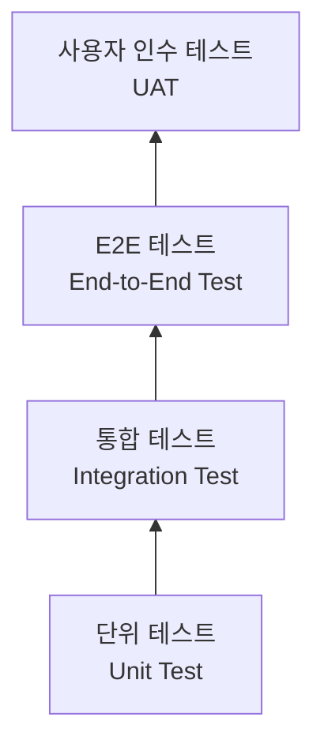

# Jira 프로젝트 관리 시스템 테스트 전략서

## 1. 테스트 개요

| 항목 | 내용 |
|------|------|
| 프로젝트명 | Jira 프로젝트 관리 시스템 |
| 테스트 기간 | 2026-07-01 ~ 2026-07-21 |
| 테스트 환경 | AWS ECS (Staging) |
| 테스트 도구 | JUnit 5, Jest, Playwright, k6 |

## 2. 테스트 범위

### 2.1 테스트 대상

| 구분 | 대상 | 우선순위 |
|------|------|----------|
| 포함 | 이슈 CRUD, 워크플로우 전환, 스프린트 관리, JQL 검색, 보드 UI, 권한(RBAC), REST API, Audit Log | 필수 |
| 포함 | 대시보드, 릴리즈 관리, WIP 제한, 알림 | 선택 |
| 제외 | 외부 연동 (GitHub, Slack), 모바일 앱 | - |

### 2.2 테스트 유형

| 유형 | 범위 | 도구 | 커버리지 목표 |
|------|------|------|--------------|
| 단위 테스트 | 서비스 로직, JQL 파서, 워크플로우 엔진 | JUnit 5 (BE), Jest (FE) | 80% 이상 |
| 통합 테스트 | REST API 엔드포인트, DB 연동 | Spring Boot Test, Supertest | 주요 API 100% |
| E2E 테스트 | 이슈 생성→워크플로우→Done 시나리오 | Playwright | 핵심 시나리오 100% |
| 성능 테스트 | API 응답 시간, JQL 검색 성능, 동시 접속 | k6 | SLA 충족 |

## 3. 테스트 케이스

### 3.1 테스트 케이스 목록

| TC ID | 기능 | 테스트 시나리오 | 사전 조건 | 기대 결과 | 우선순위 |
|-------|------|----------------|-----------|-----------|----------|
| TC-001 | 로그인 | 정상 로그인 | 등록된 계정 | JWT 토큰 발급, 대시보드 이동 | 높음 |
| TC-002 | 로그인 | 잘못된 비밀번호 | 등록된 계정 | 에러 메시지 표시 | 높음 |
| TC-003 | 로그인 | 5회 실패 후 잠금 | 등록된 계정 | 30분 잠금, 잠금 메시지 표시 | 높음 |
| TC-010 | 이슈 생성 | Story 생성 | 로그인 + DEVELOPER 역할 | 이슈 키 발급, Backlog에 표시 | 높음 |
| TC-011 | 이슈 생성 | Bug 등록 (필수 양식) | 로그인 | 재현절차/기대/실제 결과 포함 | 높음 |
| TC-020 | 워크플로우 | In Progress → Code Review | PR 생성 완료 | 상태 변경, Slack 알림 발송 | 높음 |
| TC-021 | 워크플로우 | Code Review → QA | 리뷰어 승인 | 상태 변경 | 높음 |
| TC-022 | 워크플로우 | QA → Done (DoD 충족) | 모든 DoD 항목 완료 | 상태 변경 완료 | 높음 |
| TC-023 | 워크플로우 | QA → Done (DoD 미충족) | DoD 일부 미완료 | 전환 거부 | 높음 |
| TC-030 | JQL | 기본 검색 | 이슈 존재 | 올바른 결과 반환 | 높음 |
| TC-031 | JQL | 복합 조건 검색 | 다양한 이슈 | 조건에 맞는 이슈만 반환 | 중간 |
| TC-040 | 권한 | Viewer 이슈 수정 시도 | Viewer 로그인 | 403 Forbidden | 높음 |
| TC-041 | 권한 | Reporter 타인 이슈 수정 | Reporter 로그인 | 403 Forbidden | 높음 |
| TC-042 | 권한 | Confidential 이슈 접근 | Developer 로그인 | 404 Not Found | 중간 |
| TC-050 | WIP 제한 | WIP 초과 이슈 이동 | WIP=3, 3개 이슈 존재 | 경고 표시 | 중간 |
| TC-060 | 보드 | 드래그 앤 드롭 | 보드 화면 진입 | 상태 전환 + Audit Log 기록 | 높음 |
| TC-070 | Audit Log | 필드 변경 추적 | 이슈 존재 | 변경 필드, 이전값, 새값 기록 | 높음 |

## 4. 테스트 환경

| 환경 | 용도 | URL | DB |
|------|------|-----|-----|
| Local | 개발자 테스트 | localhost:3000 | 로컬 PostgreSQL |
| Dev | 통합 테스트 | dev.jira-pm.example.com | RDS (dev) |
| Staging | QA/UAT | staging.jira-pm.example.com | RDS (staging) |
| Production | 운영 | jira-pm.example.com | RDS (prod) |

## 5. 결함 관리

### 5.1 결함 심각도

| 등급 | 설명 | 대응 시간 |
|------|------|-----------|
| Critical | 워크플로우 전환 불가, 데이터 손실, 인증 우회 | 즉시 |
| Major | 보드 렌더링 오류, JQL 검색 실패, 권한 체크 오류 | 24시간 내 |
| Minor | UI 깨짐, 알림 미발송, Audit Log 누락 | 다음 스프린트 |
| Trivial | 오타, 색상 미세 차이, 가젯 정렬 | 백로그 |

## 6. 자동화 전략

- [ ] CI 파이프라인에 JUnit/Jest 단위 테스트 통합
- [ ] PR 머지 전 통합 테스트 자동 실행
- [ ] 야간 Playwright E2E 테스트 자동 실행
- [ ] 주간 k6 성능 테스트 자동 실행
- [ ] 테스트 커버리지 리포트 자동 생성 (80% 미만 시 빌드 실패)

## 변경 이력

| 버전 | 날짜 | 작성자 | 변경 내용 |
|------|------|--------|-----------|
| v1.0 | 2026-03-21 | 팀 | 최초 작성 |
