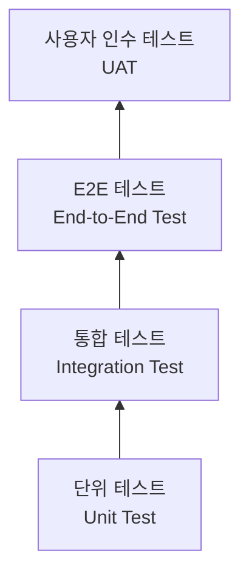
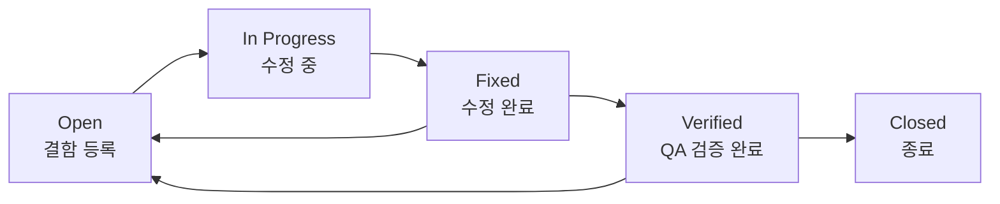
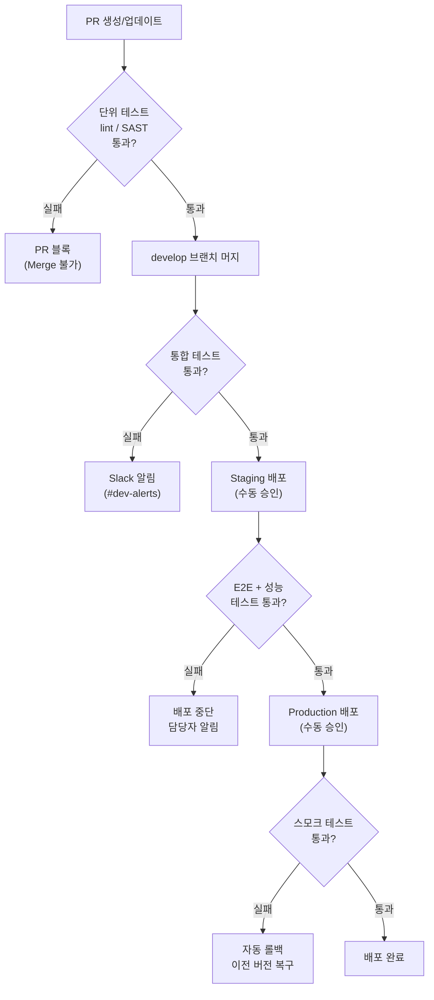

# Jira 프로젝트 관리 시스템 테스트 전략서

## 목차

1. [테스트 개요](#1-테스트-개요)
2. [테스트 범위](#2-테스트-범위)
3. [테스트 케이스](#3-테스트-케이스)
4. [테스트 환경](#4-테스트-환경)
5. [결함 관리](#5-결함-관리)
6. [자동화 전략](#6-자동화-전략)
7. [테스트 피라미드](#7-테스트-피라미드)
8. [DoD 항목별 검증 방법](#8-dod-항목별-검증-방법)
9. [부하 테스트 상세](#9-부하-테스트-상세)
10. [보안 테스트](#10-보안-테스트)
11. [테스트 데이터 관리](#11-테스트-데이터-관리)
12. [CI/CD 테스트 게이트](#12-cicd-테스트-게이트)
13. [접근성 테스트](#13-접근성-테스트)
14. [Chaos Engineering (카오스 엔지니어링)](#14-chaos-engineering-카오스-엔지니어링)
15. [시각적 회귀 테스트 (Visual Regression Testing)](#15-시각적-회귀-테스트-visual-regression-testing)
16. [API 계약 테스트](#16-api-계약-테스트)

---

## 1. 테스트 개요

| 항목 | 내용 |
|------|------|
| 프로젝트명 | Jira 프로젝트 관리 시스템 |
| 테스트 기간 | 2026-07-01 ~ 2026-07-21 |
| 테스트 환경 | AWS ECS (Staging) |
| 테스트 도구 | JUnit 5, Jest, Playwright, k6, SonarQube, OWASP ZAP |

---

## 2. 테스트 범위

### 2.1 테스트 대상

| 구분 | 대상 | 우선순위 |
|------|------|----------|
| 포함 | 이슈 CRUD, 워크플로우 전환, 스프린트 관리, JQL 검색, 보드 UI, 권한(RBAC), REST API, Audit Log | 필수 |
| 포함 | 대시보드, 릴리즈 관리, WIP 제한, 알림, 댓글/첨부파일, 이슈 링크, 백로그, 아카이브 | 선택 |
| 포함 | 외부 연동 (GitHub PR 연결, Smart Commit), 자동화 규칙 | 확장 |
| 제외 | 모바일 앱, Confluence 연동, 서드파티 플러그인 | - |

### 2.2 테스트 유형



| 유형 | 범위 | 도구 | 커버리지 목표 | 실행 빈도 | 시간 예산 | 환경 | 실패 시 |
|------|------|------|--------------|-----------|-----------|------|---------|
| 단위 테스트 | 서비스 로직, JQL 파서, 워크플로우 엔진 | JUnit 5 (BE), Jest (FE) | 80% 이상 | PR마다 | 5분 이내 | Local / CI | PR 블록 |
| 통합 테스트 | REST API 엔드포인트, DB 연동 | Spring Boot Test, Supertest | 주요 API 100% | develop 머지마다 | 15분 이내 | Dev / CI | Slack 알림 |
| E2E 테스트 | 이슈 생성→워크플로우→Done 시나리오 | Playwright | 핵심 시나리오 100% | 야간 / Staging 배포 시 | 45분 이내 | Staging | 배포 중단 |
| 성능 테스트 | API 응답 시간, JQL 검색 성능, 동시 접속 | k6 | SLA 충족 | 주간 / 릴리즈 전 | 30분 이내 | Staging | 배포 중단 |
| 보안 테스트 | RBAC, JWT, OWASP Top 10 | SonarQube, OWASP ZAP | - | PR마다 (SAST), 주간 (DAST) | 10분(SAST) / 60분(DAST) | CI / Staging | PR 블록 / 알림 |
| 접근성 테스트 | WCAG 2.1 AA | axe-core, 수동 검사 | - | 스프린트마다 | 수동 | Staging | 다음 스프린트 수정 |

---

## 3. 테스트 케이스

### 3.1 테스트 케이스 목록

#### 인증 (TC-001 ~ TC-003)

| TC ID | 기능 | 테스트 시나리오 | 사전 조건 | 기대 결과 | 우선순위 |
|-------|------|----------------|-----------|-----------|----------|
| TC-001 | 로그인 | 정상 로그인 | 등록된 계정 | JWT 토큰 발급, 대시보드 이동 | 높음 |
| TC-002 | 로그인 | 잘못된 비밀번호 | 등록된 계정 | 에러 메시지 표시 | 높음 |
| TC-003 | 로그인 | 5회 실패 후 잠금 | 등록된 계정 | 30분 잠금, 잠금 메시지 표시 | 높음 |

#### 이슈 생성 (TC-010 ~ TC-011)

| TC ID | 기능 | 테스트 시나리오 | 사전 조건 | 기대 결과 | 우선순위 |
|-------|------|----------------|-----------|-----------|----------|
| TC-010 | 이슈 생성 | Story 생성 | 로그인 + DEVELOPER 역할 | 이슈 키 발급, Backlog에 표시 | 높음 |
| TC-011 | 이슈 생성 | Bug 등록 (필수 양식) | 로그인 | 재현절차/기대/실제 결과 포함 | 높음 |

#### 워크플로우 (TC-020 ~ TC-023)

| TC ID | 기능 | 테스트 시나리오 | 사전 조건 | 기대 결과 | 우선순위 |
|-------|------|----------------|-----------|-----------|----------|
| TC-020 | 워크플로우 | In Progress → Code Review | PR 생성 완료 | 상태 변경, Slack 알림 발송 | 높음 |
| TC-021 | 워크플로우 | Code Review → QA | 리뷰어 승인 | 상태 변경 | 높음 |
| TC-022 | 워크플로우 | QA → Done (DoD 충족) | 모든 DoD 항목 완료 | 상태 변경 완료 | 높음 |
| TC-023 | 워크플로우 | QA → Done (DoD 미충족) | DoD 일부 미완료 | 전환 거부 | 높음 |

#### JQL 검색 (TC-030 ~ TC-031)

| TC ID | 기능 | 테스트 시나리오 | 사전 조건 | 기대 결과 | 우선순위 |
|-------|------|----------------|-----------|-----------|----------|
| TC-030 | JQL | 기본 검색 | 이슈 존재 | 올바른 결과 반환 | 높음 |
| TC-031 | JQL | 복합 조건 검색 | 다양한 이슈 | 조건에 맞는 이슈만 반환 | 중간 |

#### 권한 (TC-040 ~ TC-042)

| TC ID | 기능 | 테스트 시나리오 | 사전 조건 | 기대 결과 | 우선순위 |
|-------|------|----------------|-----------|-----------|----------|
| TC-040 | 권한 | Viewer 이슈 수정 시도 | Viewer 로그인 | 403 Forbidden | 높음 |
| TC-041 | 권한 | Reporter 타인 이슈 수정 | Reporter 로그인 | 403 Forbidden | 높음 |
| TC-042 | 권한 | Confidential 이슈 접근 | Developer 로그인 | 404 Not Found | 중간 |

#### WIP 제한 (TC-050)

| TC ID | 기능 | 테스트 시나리오 | 사전 조건 | 기대 결과 | 우선순위 |
|-------|------|----------------|-----------|-----------|----------|
| TC-050 | WIP 제한 | WIP 초과 이슈 이동 | WIP=3, 3개 이슈 존재 | 경고 표시 | 중간 |

#### 보드 (TC-060)

| TC ID | 기능 | 테스트 시나리오 | 사전 조건 | 기대 결과 | 우선순위 |
|-------|------|----------------|-----------|-----------|----------|
| TC-060 | 보드 | 드래그 앤 드롭 | 보드 화면 진입 | 상태 전환 + Audit Log 기록 | 높음 |

#### Audit Log (TC-070)

| TC ID | 기능 | 테스트 시나리오 | 사전 조건 | 기대 결과 | 우선순위 |
|-------|------|----------------|-----------|-----------|----------|
| TC-070 | Audit Log | 필드 변경 추적 | 이슈 존재 | 변경 필드, 이전값, 새값 기록 | 높음 |

#### Sprint 관리 (TC-080 ~ TC-085)

| TC ID | 기능 | 테스트 시나리오 | 사전 조건 | 기대 결과 | 우선순위 |
|-------|------|----------------|-----------|-----------|----------|
| TC-080 | Sprint 관리 | Sprint 생성 | Project Admin 또는 Developer 로그인 | Sprint가 백로그 화면에 표시, 상태 = 준비중 | 높음 |
| TC-081 | Sprint 관리 | Sprint 시작 | Sprint에 이슈 1개 이상 배정 | Sprint 상태 = Active, 보드에 이슈 표시 | 높음 |
| TC-082 | Sprint 관리 | Sprint 정상 완료 (모든 이슈 Done) | Sprint 내 전체 이슈 Done 상태 | Sprint 완료, 번다운 차트 100% 달성 표시 | 높음 |
| TC-083 | Sprint 관리 | Sprint 완료 시 미완료 이슈 존재 | Sprint 내 Done 아닌 이슈 존재 | 미완료 이슈를 다음 Sprint 또는 백로그로 이동 선택 다이얼로그 표시 | 높음 |
| TC-084 | Sprint 관리 | 미완료 이슈 다음 Sprint 이동 | TC-083 이후 다음 Sprint 선택 | 이슈가 다음 Sprint로 이동, 히스토리 기록 | 중간 |
| TC-085 | Sprint 관리 | Viewer 역할 Sprint 관리 시도 | Viewer 로그인 | 403 Forbidden, Sprint 생성/시작 버튼 비활성화 | 높음 |

#### 대시보드 가젯 (TC-090 ~ TC-093)

| TC ID | 기능 | 테스트 시나리오 | 사전 조건 | 기대 결과 | 우선순위 |
|-------|------|----------------|-----------|-----------|----------|
| TC-090 | 대시보드 | 개발자 역할 기본 대시보드 가젯 구성 | Developer 로그인 | Filter Result(내 담당 이슈), Sprint Burndown 가젯 표시 | 중간 |
| TC-091 | 대시보드 | PM 역할 대시보드 가젯 구성 | PM 로그인 | Roadmap(Epic 진행률), Pie Chart(이슈 타입별) 가젯 표시 | 중간 |
| TC-092 | 대시보드 | 가젯 데이터 로딩 정상 | 이슈 10건 이상 존재 | 각 가젯 2초 이내 데이터 로딩 완료 | 중간 |
| TC-093 | 대시보드 | QA 역할 대시보드 가젯 구성 | QA Engineer 로그인 | Filter Result(QA 상태 이슈), Created vs Resolved 가젯 표시 | 중간 |

#### 릴리즈 관리 (TC-100 ~ TC-105)

| TC ID | 기능 | 테스트 시나리오 | 사전 조건 | 기대 결과 | 우선순위 |
|-------|------|----------------|-----------|-----------|----------|
| TC-100 | 릴리즈 관리 | 버전 생성 | Project Admin 로그인 | 버전 v1.0.0 생성, Release Hub에 표시 | 높음 |
| TC-101 | 릴리즈 관리 | 이슈에 Fix Version 지정 | 이슈 존재, 버전 생성 완료 | 이슈에 Fix Version 태그, 릴리즈 진행률 자동 업데이트 | 높음 |
| TC-102 | 릴리즈 관리 | 릴리즈 노트 자동 생성 | Fix Version에 이슈 3건 이상 연결 | Fix Version 포함 이슈 목록 추출, 릴리즈 노트 생성 | 중간 |
| TC-103 | 릴리즈 관리 | 버전 상태 Unreleased → Released 전환 | 버전 내 이슈 전체 Done | 버전 상태 Released, 전환 날짜 기록 | 높음 |
| TC-104 | 릴리즈 관리 | 미완료 이슈 포함 버전 릴리즈 시도 | 버전 내 Done 아닌 이슈 존재 | 경고 메시지 표시, 강제 릴리즈 확인 다이얼로그 | 중간 |
| TC-105 | 릴리즈 관리 | 버전 삭제 | Project Admin 로그인, 버전 존재 | 버전 삭제, 연결 이슈의 Fix Version 비워짐 | 중간 |

#### 알림/구독 (TC-110 ~ TC-115)

| TC ID | 기능 | 테스트 시나리오 | 사전 조건 | 기대 결과 | 우선순위 |
|-------|------|----------------|-----------|-----------|----------|
| TC-110 | 알림 | 이슈 변경 이메일 알림 수신 | 이슈 구독(Watch) 설정, 이슈 변경 | 구독자 이메일로 알림 발송, 변경 내용 포함 | 중간 |
| TC-111 | 알림 | Slack 채널 이슈 상태 변경 알림 | Slack 연동 설정, 이슈 상태 변경 | 지정 Slack 채널에 상태 변경 메시지 전송 | 중간 |
| TC-112 | 알림 | 댓글 @멘션 알림 | 댓글에 @사용자 태그 | 태그된 사용자에게 알림(이메일 + 인앱) | 높음 |
| TC-113 | 알림 | 이슈 Watch 등록 | 로그인 상태 | Watch 등록 완료, 이후 변경 시 알림 수신 | 중간 |
| TC-114 | 알림 | 이슈 Watch 해제 | Watch 등록 상태 | Watch 해제, 이후 변경 알림 미수신 | 중간 |
| TC-115 | 알림 | 알림 설정 OFF 시 알림 미발송 | 이메일 알림 설정 비활성화 | 이슈 변경 시 알림 미발송 확인 | 낮음 |

#### 아카이브 (TC-120 ~ TC-124)

| TC ID | 기능 | 테스트 시나리오 | 사전 조건 | 기대 결과 | 우선순위 |
|-------|------|----------------|-----------|-----------|----------|
| TC-120 | 아카이브 | 이슈 수동 아카이브 | Project Admin 로그인, 이슈 Done 상태 | 이슈 아카이브 처리, 기본 검색 결과에서 제외 | 중간 |
| TC-121 | 아카이브 | 아카이브 이슈 JQL 검색 | 아카이브 이슈 존재 | `archived = true` JQL로 아카이브 이슈 검색 가능 | 중간 |
| TC-122 | 아카이브 | 프로젝트 아카이브 | Project Admin 로그인 | 프로젝트 읽기 전용 전환, 이슈 수정 불가 | 중간 |
| TC-123 | 아카이브 | 자동 아카이브 규칙 적용 | 6개월 이상 미수정 이슈 존재 | 조건 충족 이슈 자동 아카이브, 알림 발송 | 낮음 |
| TC-124 | 아카이브 | 아카이브 이슈 복원 | 아카이브 이슈 존재 | 복원 후 활성 이슈로 전환, 검색 결과에 표시 | 중간 |

#### 자동화 (TC-130 ~ TC-135)

| TC ID | 기능 | 테스트 시나리오 | 사전 조건 | 기대 결과 | 우선순위 |
|-------|------|----------------|-----------|-----------|----------|
| TC-130 | 자동화 | 자동화 규칙 생성 | Project Admin 로그인 | 트리거/조건/액션 설정 완료, 규칙 활성화 | 높음 |
| TC-131 | 자동화 | 트리거 - 상태 전환 시 Slack 알림 | 자동화 규칙 활성, 이슈 상태 변경 | 지정 Slack 채널에 자동 메시지 전송 | 높음 |
| TC-132 | 자동화 | 조건 - 이슈 타입 필터 | 자동화 규칙 활성 (조건: Story 또는 Bug만) | Task 이슈 상태 변경 시 자동화 미실행 | 중간 |
| TC-133 | 자동화 | 액션 - PR 링크 댓글 자동 추가 | Code Review 전환 트리거, 자동화 규칙 활성 | Code Review 전환 시 PR 링크 댓글 자동 생성 | 중간 |
| TC-134 | 자동화 | 자동화 규칙 비활성화 | 자동화 규칙 활성 상태 | 비활성화 후 트리거 이벤트 발생해도 액션 미실행 | 중간 |
| TC-135 | 자동화 | 자동화 실행 이력 조회 | 자동화 규칙 실행 후 | 실행 시각, 성공/실패 상태, 처리 이슈 목록 표시 | 낮음 |

#### 외부 연동 (TC-140 ~ TC-143)

| TC ID | 기능 | 테스트 시나리오 | 사전 조건 | 기대 결과 | 우선순위 |
|-------|------|----------------|-----------|-----------|----------|
| TC-140 | GitHub 연동 | GitHub PR 생성 시 이슈 자동 연결 | GitHub 연동 설정, PR 제목에 이슈 키 포함 | 이슈에 PR 링크 자동 연결, Development 패널에 표시 | 높음 |
| TC-141 | GitHub 연동 | PR Merge 시 이슈 상태 자동 전환 | GitHub 연동 + 자동화 규칙 설정 | PR 머지 시 이슈 상태 Code Review → QA 자동 전환 | 높음 |
| TC-142 | Smart Commit | 커밋 메시지로 이슈 상태 전환 | Smart Commit 활성, 커밋 메시지에 `PROJ-123 #in-progress` 포함 | 이슈 상태 자동 변경, Audit Log 기록 | 중간 |
| TC-143 | Smart Commit | 커밋 메시지로 작업 시간 기록 | Smart Commit 활성, 커밋 메시지에 `#time 2h` 포함 | 이슈 작업 시간 자동 기록 | 낮음 |

#### 댓글/첨부파일 (TC-150 ~ TC-155)

| TC ID | 기능 | 테스트 시나리오 | 사전 조건 | 기대 결과 | 우선순위 |
|-------|------|----------------|-----------|-----------|----------|
| TC-150 | 댓글 | 댓글 작성 | 로그인, 이슈 조회 가능 | 댓글 저장, 이슈 상세에 표시, 작성자/시각 기록 | 높음 |
| TC-151 | 댓글 | 댓글 수정 | 본인 댓글 존재 | 수정 완료, (수정됨) 표시, 원본 내용 Audit Log 보존 | 중간 |
| TC-152 | 댓글 | 댓글 삭제 | 본인 댓글 또는 Admin | 댓글 삭제, Audit Log에 삭제 이력 기록 | 중간 |
| TC-153 | 댓글 | @멘션 알림 | 댓글에 @사용자 태그 | 태그된 사용자에게 즉시 알림 발송 | 높음 |
| TC-154 | 첨부파일 | 파일 업로드 | 로그인, 이슈 수정 권한 | 파일 업로드 성공, 이슈 첨부파일 목록에 표시 | 중간 |
| TC-155 | 첨부파일 | 허용 용량 초과 업로드 | 10MB 초과 파일 준비 | 에러 메시지 표시, 업로드 거부 | 중간 |

#### 이슈 링크 (TC-160 ~ TC-162)

| TC ID | 기능 | 테스트 시나리오 | 사전 조건 | 기대 결과 | 우선순위 |
|-------|------|----------------|-----------|-----------|----------|
| TC-160 | 이슈 링크 | Blocks 관계 설정 | 이슈 2개 이상 존재 | A Blocks B 관계 설정, B 이슈에 "Blocked by A" 역관계 자동 생성 | 중간 |
| TC-161 | 이슈 링크 | Duplicates 관계 설정 | 이슈 2개 이상 존재 | A Duplicates B 관계 설정, 양쪽 이슈에 링크 표시 | 중간 |
| TC-162 | 이슈 링크 | Relates to 관계 설정 | 이슈 2개 이상 존재 | A Relates to B 관계 설정, 양쪽 이슈에 링크 표시 | 낮음 |

#### 백로그 (TC-170 ~ TC-173)

| TC ID | 기능 | 테스트 시나리오 | 사전 조건 | 기대 결과 | 우선순위 |
|-------|------|----------------|-----------|-----------|----------|
| TC-170 | 백로그 | 우선순위 기준 정렬 | 이슈 5건 이상 존재, 우선순위 상이 | 우선순위 Highest → Lowest 순으로 정렬 | 중간 |
| TC-171 | 백로그 | 이슈 타입 필터 | 이슈 복수 타입 존재 | 선택 타입(Story/Bug 등)만 백로그에 표시 | 중간 |
| TC-172 | 백로그 | Sprint 배정 | 백로그 이슈 존재, 활성 Sprint 존재 | 이슈를 Sprint로 드래그 또는 컨텍스트 메뉴로 배정, Sprint 이슈 목록에 표시 | 높음 |
| TC-173 | 백로그 | 대량 이슈(1,000건) 백로그 로딩 | 이슈 1,000건 시딩 완료 | 2초 이내 로딩 완료, 페이지네이션 정상 동작 | 높음 |

---

## 4. 테스트 환경

| 환경 | 용도 | URL | DB |
|------|------|-----|-----|
| Local | 개발자 테스트 | localhost:3000 | 로컬 PostgreSQL |
| Dev | 통합 테스트 | dev.jira-pm.example.com | RDS (dev) |
| Staging | QA/UAT, E2E, 성능, 보안 | staging.jira-pm.example.com | RDS (staging) |
| Production | 운영, 스모크 테스트 | jira-pm.example.com | RDS (prod) |

---

## 5. 결함 관리

### 5.1 결함 심각도

| 등급 | 설명 | 대응 시간 |
|------|------|-----------|
| Critical | 워크플로우 전환 불가, 데이터 손실, 인증 우회 | 즉시 |
| Major | 보드 렌더링 오류, JQL 검색 실패, 권한 체크 오류 | 24시간 내 |
| Minor | UI 깨짐, 알림 미발송, Audit Log 누락 | 다음 스프린트 |
| Trivial | 오타, 색상 미세 차이, 가젯 정렬 | 백로그 |

### 5.2 결함 라이프사이클



| 상태 | 설명 | 담당자 |
|------|------|--------|
| Open | 결함 최초 등록 | QA / 누구나 |
| In Progress | 개발자 수정 진행 중 | Developer |
| Fixed | 수정 완료, QA 검증 요청 | Developer |
| Verified | QA 검증 통과, 재현 불가 확인 | QA Engineer |
| Closed | 최종 종료 | QA Engineer / PM |

### 5.3 결함 메트릭

| 메트릭 | 산식 | 목표치 |
|--------|------|--------|
| 결함 밀도 (Defect Density) | 발견 결함 수 / 기능 포인트(또는 TC 수) | 스프린트당 0.5 이하 |
| 탈출 결함율 (Escaped Defect Rate) | Production 발견 결함 / 전체 발견 결함 × 100 | 5% 이하 |
| 평균 해결 시간 (MTTR) | 결함 Open~Closed 총 시간 / 결함 수 | Critical 4h 이내, Major 48h 이내 |

---

## 6. 자동화 전략

- [ ] CI 파이프라인에 JUnit/Jest 단위 테스트 통합
- [ ] PR 머지 전 통합 테스트 자동 실행
- [ ] 야간 Playwright E2E 테스트 자동 실행
- [ ] 주간 k6 성능 테스트 자동 실행
- [ ] 테스트 커버리지 리포트 자동 생성 (80% 미만 시 빌드 실패)
- [ ] SonarQube SAST 분석 PR 코멘트 자동 게시
- [ ] OWASP ZAP DAST 주간 스캔 자동화
- [ ] 결함 메트릭 주간 자동 집계 및 Slack 리포트

---

## 7. 테스트 피라미드

```
          /\
         /  \
        / E2E \       10% (약 50개 TC)
       /--------\
      / 통합 테스트 \   20% (약 100개 TC)
     /-------------\
    /  단위 테스트   \   70% (약 350개 TC)
   /-----------------\
```

| 계층 | 비율 목표 | TC 수 목표 | 실행 속도 | 유지보수 비용 |
|------|-----------|------------|-----------|---------------|
| 단위 테스트 | 70% | 350개 이상 | 빠름 (ms 단위) | 낮음 |
| 통합 테스트 | 20% | 100개 이상 | 중간 (초 단위) | 중간 |
| E2E 테스트 | 10% | 50개 이상 | 느림 (분 단위) | 높음 |

**운영 원칙**

- 비즈니스 로직은 단위 테스트로 우선 검증, E2E에 의존하지 않는다.
- 통합 테스트는 API 계약 및 DB 연동 검증에 집중한다.
- E2E 테스트는 핵심 사용자 시나리오(이슈 생성→워크플로우→Done 등)에만 작성한다.
- 테스트 피라미드 역전(E2E 과다) 발생 시 단위/통합 테스트로 분해한다.

---

## 8. DoD 항목별 검증 방법

기능정의서 섹션 10.2 Definition of Done 7개 항목 각각의 검증 방법입니다.

| DoD 항목 | 검증 방법 | 자동화 여부 | 도구 | 실패 조치 |
|----------|-----------|------------|------|-----------|
| 코드 구현 완료 (Acceptance Criteria 전체 충족) | QA Engineer가 TC 시나리오 전체 실행, Pass 확인 | 부분 자동화 (E2E) | Playwright | PR 블록, 개발자에게 반환 |
| 코드 리뷰 완료 (최소 1인 승인) | GitHub Pull Request Required Review 설정, Approve 상태 확인 | 자동 | GitHub Branch Protection | Approve 없으면 Merge 불가 |
| 단위 테스트 통과 (커버리지 80% 이상) | JaCoCo (BE) / Istanbul (FE) 리포트 자동 생성, PR 코멘트 게시 | 자동 | JaCoCo, Istanbul, GitHub Actions | 80% 미만 시 CI 빌드 실패, PR 블록 |
| QA 테스트 통과 (기능 테스트 시나리오 전체 Pass) | Playwright E2E 스위트 실행 결과 확인 | 자동 (야간/Staging 배포 시) | Playwright, CI/CD 파이프라인 | 실패 시 배포 중단, QA 알림 |
| 문서 업데이트 (API 명세서, README 등) | PR 체크리스트 수동 확인, 작성자 체크 후 리뷰어 승인 | 수동 | GitHub PR 체크리스트 | 체크 미완료 시 PR 병합 보류 |
| 배포 가능 상태 (main/develop 머지, 빌드 성공) | CI 파이프라인 빌드 상태 확인, Green 여부 자동 판별 | 자동 | GitHub Actions, AWS CodePipeline | 빌드 실패 시 머지 블록 |
| 회귀 테스트 확인 (기존 기능 영향 없음) | 기존 Playwright E2E 스위트 전체 실행, 기존 단위/통합 테스트 전체 실행 | 자동 | Playwright, JUnit 5, Jest | 실패 TC 발생 시 배포 중단, 담당자 알림 |

---

## 9. 부하 테스트 상세

### 9.1 SLA 기준

| 지표 | SLA 기준 |
|------|---------|
| P95 응답 시간 (이슈 조회) | 200ms 이하 |
| P95 응답 시간 (JQL 검색) | 500ms 이하 |
| P95 응답 시간 (보드 드래그앤드롭) | 300ms 이하 |
| 대량 백로그 로딩 (10,000건) | 2초 이하 |
| 대시보드 가젯 동시 로딩 | 1초 이하 |
| 에러율 | 1% 이하 |

### 9.2 k6 시나리오별 상세

| 시나리오 | VUs | Duration | Ramp-up | SLA | 측정 지표 | 실패 기준 |
|---------|-----|----------|---------|-----|-----------|----------|
| 동시 500명 이슈 조회 | 500 | 5분 | 1분 | P95 < 200ms | http_req_duration, http_req_failed | P95 초과 또는 에러율 1% 초과 |
| JQL 복합 검색 100명 동시 | 100 | 3분 | 30초 | P95 < 500ms | http_req_duration, iterations | P95 초과 |
| 보드 드래그앤드롭 50명 동시 | 50 | 3분 | 30초 | P95 < 300ms | http_req_duration, http_req_failed | P95 초과 또는 에러율 1% 초과 |
| 대량 이슈(10,000건) 백로그 로딩 | 10 | 2분 | 10초 | P95 < 2000ms | http_req_duration | P95 초과 |
| 대시보드 가젯 동시 로딩 | 100 | 3분 | 30초 | P95 < 1000ms | http_req_duration, 가젯별 응답 시간 | P95 초과 |

### 9.3 k6 스크립트 구조 예시

```javascript
import http from 'k6/http';
import { check, sleep } from 'k6';

export const options = {
  stages: [
    { duration: '1m', target: 500 },  // Ramp-up
    { duration: '5m', target: 500 },  // Sustained load
    { duration: '1m', target: 0 },    // Ramp-down
  ],
  thresholds: {
    http_req_duration: ['p(95)<200'],
    http_req_failed: ['rate<0.01'],
  },
};

export default function () {
  const res = http.get('https://staging.jira-pm.example.com/rest/api/3/issue/PROJ-1', {
    headers: { Authorization: `Bearer ${__ENV.API_TOKEN}` },
  });
  check(res, { 'status 200': (r) => r.status === 200 });
  sleep(1);
}
```

---

## 10. 보안 테스트

### 10.1 RBAC 전체 매트릭스 (7권한 x 5역할 = 35조합)

기능정의서 섹션 14.2 권한 매트릭스 기반 전체 검증 계획입니다.

| 권한 항목 | Project Admin | Developer | QA Engineer | Reporter | Viewer | 검증 방법 |
|-----------|:------------:|:---------:|:-----------:|:--------:|:------:|-----------|
| 이슈 생성 | 허용 | 허용 | 허용 | 허용 | 거부(403) | 자동화 (Playwright + API) |
| 이슈 수정 (본인) | 허용 | 허용 | 허용 | 허용 | 거부(403) | 자동화 |
| 이슈 수정 (타인) | 허용 | 허용 | 허용 | 거부(403) | 거부(403) | 자동화 |
| 이슈 삭제 | 허용 | 허용 | 거부(403) | 거부(403) | 거부(403) | 자동화 |
| 상태 전환 | 허용 | 허용 | 허용 | 거부(403) | 거부(403) | 자동화 |
| Sprint 관리 | 허용 | 허용 | 거부(403) | 거부(403) | 거부(403) | 자동화 |
| 프로젝트 설정 | 허용 | 거부(403) | 거부(403) | 거부(403) | 거부(403) | 자동화 |
| Audit Log 조회 | 허용 | 거부(403) | 거부(403) | 거부(403) | 거부(403) | 자동화 |

### 10.2 JWT 토큰 보안 테스트

| 테스트 항목 | 시나리오 | 기대 결과 |
|-------------|---------|-----------|
| 토큰 만료 | 만료된 JWT로 API 요청 | 401 Unauthorized, 재로그인 요구 |
| 토큰 변조 | Payload 변조 후 API 요청 | 401 Unauthorized, 변조 감지 |
| 토큰 없음 | Authorization 헤더 없이 API 요청 | 401 Unauthorized |
| 타 사용자 토큰 재사용 | 다른 사용자 토큰으로 본인 리소스 외 접근 | 403 Forbidden |
| 토큰 갱신 | Refresh Token으로 Access Token 재발급 | 새 Access Token 발급, 기존 토큰 무효화 |

### 10.3 이슈 보안 레벨 교차 접근 테스트

기능정의서 섹션 14.3 이슈 보안 레벨 기반 검증입니다.

| 보안 레벨 | 접근 역할 | 기대 결과 |
|-----------|---------|-----------|
| Confidential | Developer | 404 Not Found (존재 자체 노출 방지) |
| Confidential | QA Engineer | 404 Not Found |
| Confidential | Reporter | 404 Not Found |
| Confidential | Viewer | 404 Not Found |
| Confidential | Project Admin | 200 OK, 정상 조회 |
| Internal | Viewer | 404 Not Found |
| Internal | Reporter | 404 Not Found |
| Internal | Developer | 200 OK, 정상 조회 |
| Public | Viewer | 200 OK, 정상 조회 |

### 10.4 OWASP Top 10 테스트

| 취약점 | 테스트 방법 | 도구 | 기대 결과 |
|--------|------------|------|-----------|
| SQL Injection | JQL 파라미터에 SQL 페이로드 삽입 (`' OR '1'='1`) | OWASP ZAP, 수동 | 쿼리 실행 안 됨, 에러 메시지 노출 없음 |
| XSS (Stored) | 이슈 제목/댓글에 `<script>alert(1)</script>` 입력 | OWASP ZAP | 스크립트 실행 안 됨, 이스케이프 처리 확인 |
| XSS (Reflected) | URL 파라미터에 XSS 페이로드 삽입 | OWASP ZAP | 스크립트 실행 안 됨 |
| CSRF | 외부 도메인에서 인증된 API 요청 위조 | 수동 / ZAP | CSRF 토큰 검증 실패, 요청 거부 |
| Broken Access Control | 권한 없는 리소스 직접 URL 접근 | 수동 / Playwright | 403 또는 404 반환 |
| Security Misconfiguration | HTTP 헤더 보안 설정 확인 | OWASP ZAP | X-Frame-Options, CSP, HSTS 헤더 존재 |
| Sensitive Data Exposure | API 응답에 패스워드/토큰 노출 여부 | OWASP ZAP, 수동 | 민감 정보 응답 미포함 |

### 10.5 정적/동적 분석

| 분류 | 도구 | 실행 시점 | 분석 대상 | 실패 기준 |
|------|------|-----------|-----------|-----------|
| SAST (정적 분석) | SonarQube | PR 생성 시 자동 실행 | BE (Java), FE (TypeScript) | Critical/Blocker 이슈 1개 이상 발견 시 PR 블록 |
| DAST (동적 분석) | OWASP ZAP | 주간 자동 스캔 (Staging) | 전체 API 엔드포인트 | High 이상 취약점 발견 시 보안팀 즉시 알림 |
| 의존성 취약점 | OWASP Dependency-Check | PR 생성 시 | npm, Maven 의존성 | Critical CVE 발견 시 PR 블록 |

---

## 11. 테스트 데이터 관리

### 11.1 테스트 데이터 시딩

| 데이터 종류 | 수량 | 생성 방법 | 도구 |
|-------------|------|-----------|------|
| 사용자 계정 (역할별) | 50명 (역할별 10명씩) | Faker 기반 스크립트 자동 생성 | Faker.js (FE), JavaFaker (BE) |
| 이슈 (타입/상태 다양) | 1,000건 | 무작위 타입·상태·우선순위 조합 생성 | Faker + REST API Bulk Create |
| 프로젝트 | 5개 | 수동 생성 + 스크립트 설정 | 시딩 스크립트 |
| Sprint | 프로젝트당 3개 | 스크립트 자동 생성 | 시딩 스크립트 |
| 댓글 | 이슈당 평균 3건 | Faker 기반 자동 생성 | Faker |
| 첨부파일 | 이슈당 평균 1건 | 더미 파일 업로드 스크립트 | 시딩 스크립트 |

```bash
# 테스트 데이터 시딩 실행 예시
npm run seed:test-data -- --users 50 --issues 1000 --projects 5

# 특정 시나리오용 데이터 시딩
npm run seed:sprint-scenario -- --sprint-count 3 --incomplete-issues 5
```

### 11.2 테스트 격리

| 격리 전략 | 적용 계층 | 방법 |
|-----------|---------|------|
| 트랜잭션 롤백 | 단위 테스트, 통합 테스트 | `@Transactional` + `@Rollback` 어노테이션, 각 TC 후 DB 원상복구 |
| 독립 DB 스키마 | 통합 테스트 | 테스트 전용 스키마 분리, Testcontainers 활용 |
| 테스트 전용 계정 | E2E 테스트 | 테스트 전용 사용자 계정 사용, 운영 계정 사용 금지 |
| 환경 분리 | 전체 | Staging 환경을 운영과 완전 분리 |

### 11.3 테스트 데이터 정리 (Teardown)

```bash
# E2E 테스트 후 데이터 정리
npm run teardown:e2e-data -- --project TEST_PROJECT

# 전체 Staging 데이터 초기화 (주 1회)
npm run reset:staging-data
```

| 정리 시점 | 대상 | 방법 |
|-----------|------|------|
| 각 TC 완료 후 | 단위/통합 테스트 생성 데이터 | `@Transactional` 롤백 자동 처리 |
| E2E 테스트 스위트 완료 후 | Playwright 생성 이슈/댓글/첨부파일 | teardown 훅에서 REST API DELETE 호출 |
| 주 1회 | Staging 전체 데이터 | reset 스크립트 실행 후 기본 시딩 재수행 |

### 11.4 민감 데이터 마스킹

| 항목 | 마스킹 방법 | 적용 환경 |
|------|-----------|-----------|
| 사용자 이메일 | `test+{uuid}@example.com` 형식으로 대체 | Dev, Staging |
| 사용자 이름 | Faker 생성 가상 이름 사용 | Dev, Staging |
| API 토큰 | 환경 변수로 관리, 코드/로그에 미노출 | 전체 |
| 첨부파일 내용 | 더미 파일 사용, 실제 파일 미사용 | Dev, Staging |

---

## 12. CI/CD 테스트 게이트

### 12.1 파이프라인 단계별 테스트 매핑

| 단계 | 트리거 | 실행 테스트 | 소요 시간 | 실패 시 조치 |
|------|--------|------------|-----------|-------------|
| PR 생성/업데이트 | GitHub PR event | 단위 테스트 + lint + SAST (SonarQube) + 의존성 취약점 검사 | 10분 이내 | PR 블록 (Merge 불가) |
| develop 브랜치 머지 | merge event | 통합 테스트 + 단위 테스트 전체 | 20분 이내 | Slack #dev-alerts 알림 발송 |
| Staging 배포 | 수동 승인 (팀장) | E2E 테스트 (Playwright) + 성능 테스트 (k6) | 90분 이내 | 배포 파이프라인 중단, 담당자 알림 |
| Production 배포 | 수동 승인 (PM + 팀장) | 스모크 테스트 (핵심 API 상태 확인) | 5분 이내 | 자동 롤백 (이전 버전으로 복구) |

### 12.2 파이프라인 흐름도



### 12.3 GitHub Actions 워크플로우 구조 (PR 게이트 예시)

```yaml
name: PR Quality Gate

on:
  pull_request:
    branches: [develop, main]

jobs:
  unit-test:
    runs-on: ubuntu-latest
    steps:
      - uses: actions/checkout@v4
      - name: Run unit tests (BE)
        run: ./gradlew test jacocoTestReport
      - name: Coverage gate (80%)
        run: ./gradlew jacocoTestCoverageVerification
      - name: Run unit tests (FE)
        run: npm run test:coverage -- --coverageThreshold='{"global":{"lines":80}}'

  lint:
    runs-on: ubuntu-latest
    steps:
      - uses: actions/checkout@v4
      - name: Lint
        run: npm run lint && ./gradlew checkstyleMain

  sast:
    runs-on: ubuntu-latest
    steps:
      - uses: actions/checkout@v4
      - name: SonarQube Scan
        uses: SonarSource/sonarcloud-github-action@master
        env:
          SONAR_TOKEN: ${{ secrets.SONAR_TOKEN }}
```

---

## 13. 접근성 테스트

### 13.1 기준

| 기준 | 레벨 | 설명 |
|------|------|------|
| WCAG 2.1 | AA | 웹 콘텐츠 접근성 지침 2.1 AA 수준 준수 |

### 13.2 테스트 항목

| 항목 | 검증 방법 | 도구 | 기준 |
|------|---------|------|------|
| 키보드 네비게이션 | Tab/Shift+Tab으로 전체 UI 요소 이동 가능 여부 수동 확인 | 수동 테스트 | 마우스 없이 모든 기능 접근 가능 |
| 포커스 표시 | 키보드 포커스 시각적 표시 여부 | 수동 테스트 | 포커스 링 명확히 표시 |
| 스크린 리더 | 주요 화면에서 스크린 리더로 내용 인식 가능 여부 | NVDA (Windows), VoiceOver (macOS) | 이슈 목록, 보드, 폼 요소 정상 읽힘 |
| ARIA 레이블 | 버튼, 아이콘, 폼 요소 ARIA 속성 유무 | axe-core 자동화 | aria-label / aria-describedby 누락 없음 |
| 색상 대비 | 텍스트와 배경색 대비율 | axe-core, Colour Contrast Analyser | 일반 텍스트 4.5:1 이상, 큰 텍스트 3:1 이상 |
| 이미지 대체 텍스트 | 의미 있는 이미지에 alt 속성 유무 | axe-core 자동화 | 모든 기능적 이미지에 alt 속성 존재 |
| 폼 레이블 | 입력 필드에 레이블 연결 여부 | axe-core 자동화 | 모든 input에 label 또는 aria-label 연결 |
| 오류 메시지 접근성 | 오류 발생 시 스크린 리더에 오류 내용 전달 여부 | 수동 테스트 | role="alert" 또는 aria-live 적용 확인 |

### 13.3 axe-core Playwright 통합 예시

```typescript
import { test, expect } from '@playwright/test';
import AxeBuilder from '@axe-core/playwright';

test('이슈 목록 페이지 접근성', async ({ page }) => {
  await page.goto('/projects/PROJ/board');
  const results = await new AxeBuilder({ page })
    .withTags(['wcag2a', 'wcag2aa'])
    .analyze();
  expect(results.violations).toHaveLength(0);
});
```

### 13.4 접근성 테스트 대상 화면

| 화면 | 우선순위 |
|------|---------|
| 로그인 페이지 | 높음 |
| 이슈 목록 (백로그) | 높음 |
| 스크럼 보드 | 높음 |
| 이슈 상세/수정 폼 | 높음 |
| 대시보드 | 중간 |
| 릴리즈 관리 | 중간 |
| 관리자 설정 | 낮음 |

---

## 14. Chaos Engineering (카오스 엔지니어링)

### 14.1 목적
시스템의 복원력(Resilience)을 사전 검증하여 프로덕션 장애 대응 능력 확보

### 14.2 장애 주입 시나리오

| 시나리오 | 대상 | 주입 방법 | 기대 동작 | 실행 환경 |
|---------|------|----------|----------|----------|
| DB 연결 실패 | RDS Primary | Security Group 차단 | Multi-AZ Failover, 30초 내 복구 | Staging |
| Redis 타임아웃 | ElastiCache | tc netem delay 추가 | 캐시 미스 → DB 직접 조회 Fallback | Staging |
| 외부 API 장애 | GitHub/Slack Webhook | Mock 서버 500 응답 | Circuit Breaker Open, 자동화 재시도 큐 | Staging |
| ECS 태스크 종료 | API Server | aws ecs stop-task | Auto Scaling 신규 태스크 기동, ALB 헬스체크 | Staging |
| SQS 메시지 지연 | 알림/자동화 큐 | SQS DelaySeconds 설정 | 메시지 지연 처리, 사용자 알림 무중단 | Staging |
| 디스크 풀 | ECS 컨테이너 | dd if=/dev/zero | 로그 로테이션, 알림 발생 | Dev |
| DNS 장애 | 전체 | Route53 헬스체크 비활성화 | Failover DNS 전환 | Staging (분기 1회) |

### 14.3 실행 계획
| 주기 | 범위 | 참여자 |
|------|------|--------|
| 월 1회 | 단일 컴포넌트 장애 (DB, Redis, 단일 태스크) | 개발팀 |
| 분기 1회 | 복합 장애 (다중 컴포넌트, DNS) | 개발팀 + SRE |
| 연 1회 | DR 전체 훈련 (리전 장애 시뮬레이션) | 전체 |

### 14.4 게임데이 (GameDay) 절차
1. 가설 수립: "Redis 장애 시 보드 로딩 시간이 3초 이내로 유지된다"
2. 안전 장치 확인: 롤백 절차, 모니터링 대시보드 준비
3. 장애 주입: Staging 환경에서 실행
4. 관찰: Grafana 대시보드, CloudWatch 로그 모니터링
5. 분석: 가설 검증/반증, 취약점 식별
6. 개선: 발견된 취약점에 대한 개선 이슈 등록 (Jira Bug)

---

## 15. 시각적 회귀 테스트 (Visual Regression Testing)

### 15.1 도구
| 도구 | 용도 | 통합 |
|------|------|------|
| Playwright + pixelmatch | 스크린샷 비교 | CI 파이프라인 |
| Chromatic (Storybook) | 컴포넌트 단위 | PR 체크 |

### 15.2 대상 화면
| 화면 | 뷰포트 | 상태 | 우선순위 |
|------|--------|------|----------|
| SCR-004 스크럼 보드 | 1440px, 768px | 이슈 5+개, WIP 경고 | 높음 |
| SCR-005 칸반 보드 | 1440px, 768px | WIP 초과 상태 | 높음 |
| SCR-002 대시보드 | 1440px | Developer 역할, PM 역할 | 높음 |
| SCR-006 이슈 상세 | 1440px, 768px | 댓글 3+개, 첨부파일 | 중간 |
| SCR-008 JQL 검색 | 1440px | 검색 결과 20건 | 중간 |
| SCR-012 리포트 | 1440px | 번다운/속도/CFD 차트 | 중간 |

### 15.3 실행 정책
- PR 생성 시: 변경된 컴포넌트 관련 스크린샷 자동 비교
- 야간: 전체 화면 스크린샷 갱신 (베이스라인 업데이트)
- 차이 임계치: 0.1% 이상 변경 시 PR에 경고 코멘트
- 승인: 의도적 변경은 리뷰어가 "Update baseline" 승인

---

## 16. API 계약 테스트

### 16.1 도구
- Pact (Consumer-Driven Contract Testing)
- OpenAPI Spec 자동 검증 (openapi-diff)

### 16.2 전략
| 계약 유형 | 검증 내용 | 실행 시점 |
|----------|----------|----------|
| Consumer-Driven | FE가 기대하는 API 응답 구조 | PR 생성 시 |
| Provider Verification | BE API가 계약을 준수하는지 | BE PR 생성 시 |
| OpenAPI Diff | API 스펙 변경 감지 (Breaking Change) | PR 생성 시 |

### 16.3 Breaking Change 정책
- Response 필드 제거: MAJOR 버전 업 필수
- Request 필수 필드 추가: MAJOR 버전 업 필수
- 선택 필드 추가: 허용 (MINOR)
- Deprecation: 최소 6개월 유지 후 제거

---

## 변경 이력

| 버전 | 날짜 | 작성자 | 변경 내용 |
|------|------|--------|-----------|
| v1.0 | 2026-03-21 | 팀 | 최초 작성 |
| v2.0 | 2026-03-21 | 팀 | TC 50개+ 확장 (Sprint/대시보드/릴리즈/알림/아카이브/자동화/외부연동/댓글/이슈링크/백로그), DoD 항목별 검증 방법 추가, 부하 테스트 상세(k6) 추가, 보안 테스트(RBAC 35조합/JWT/OWASP Top 10/SAST/DAST) 추가, 테스트 데이터 관리 추가, CI/CD 테스트 게이트 추가, 테스트 피라미드 추가, 접근성 테스트(WCAG 2.1 AA) 추가, 결함 라이프사이클 및 메트릭 보강, 테스트 유형별 실행 빈도/시간 예산/환경 보강 |
| v3.0 | 2026-03-21 | 팀 | Chaos Engineering, 시각적 회귀 테스트, API 계약 테스트 추가 |
