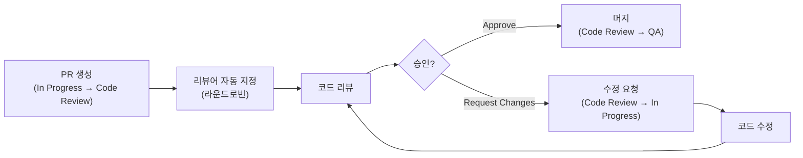

# Jira 프로젝트 관리 시스템 코드 리뷰 규칙

## 1. 코드 리뷰 목적

- 코드 품질 향상 및 버그 사전 방지
- 지식 공유 및 팀 역량 강화
- 코딩 표준 준수 확인
- 워크플로우 연동: Code Review 상태에서 리뷰어 승인 시 QA로 전환

## 2. 리뷰 프로세스

### 2.1 프로세스 규칙

| 항목 | 규칙 |
|------|------|
| 리뷰어 수 | 최소 1명 (핵심 변경은 2명) |
| 리뷰 응답 시간 | PR 생성 후 24시간 이내 |
| PR 크기 | 400줄 이하 권장 (초과 시 분할) |
| 셀프 리뷰 | PR 생성 전 필수 |
| 알림 | Slack #code-review 채널 자동 알림 |

## 3. 리뷰 체크리스트

### 3.1 기능

- [ ] 요구사항(Acceptance Criteria)을 올바르게 구현했는가?
- [ ] 엣지 케이스를 처리했는가?
- [ ] 에러 핸들링이 적절한가?
- [ ] 워크플로우 전환 규칙을 준수하는가?

### 3.2 코드 품질

- [ ] 네이밍이 명확하고 일관적인가?
- [ ] 불필요한 복잡도가 없는가?
- [ ] 중복 코드가 없는가?
- [ ] 단일 책임 원칙을 따르는가?

### 3.3 보안

- [ ] SQL Injection 취약점이 없는가?
- [ ] XSS 취약점이 없는가?
- [ ] 민감 정보가 하드코딩되지 않았는가?
- [ ] RBAC 권한 체크가 올바른가? (5단계 역할)
- [ ] 이슈 보안 레벨(Public/Internal/Confidential) 접근 제어가 적절한가?

### 3.4 성능

- [ ] N+1 쿼리 문제가 없는가?
- [ ] JQL 검색 쿼리가 최적화되었는가?
- [ ] 불필요한 API 호출이 없는가?
- [ ] 적절한 인덱싱이 되어 있는가?

### 3.5 테스트

- [ ] 새로운 기능에 대한 테스트가 있는가?
- [ ] 커버리지 80% 이상을 유지하는가? (DoD 조건)
- [ ] 테스트가 의미 있는 케이스를 검증하는가?
- [ ] 기존 테스트가 깨지지 않았는가?

## 4. 리뷰 코멘트 가이드

| 접두사 | 의미 | 예시 |
|--------|------|------|
| [MUST] | 반드시 수정 필요 | [MUST] RBAC 권한 체크가 누락되었습니다 |
| [SHOULD] | 강력 권장 | [SHOULD] JQL 쿼리에 인덱스를 활용하면 좋겠습니다 |
| [NICE] | 개선 제안 | [NICE] 변수명을 좀 더 명확하게 바꾸면 좋겠습니다 |
| [Q] | 질문 | [Q] 이 워크플로우 전환 조건의 의도가 궁금합니다 |

## 5. 코딩 표준

| 항목 | 규칙 |
|------|------|
| 들여쓰기 | 스페이스 2칸 (FE), 4칸 (BE/Java) |
| 줄 길이 | 최대 120자 |
| 파일 길이 | 최대 300줄 권장 |
| 함수 길이 | 최대 30줄 권장 |
| 이슈 제목 형식 | `[모듈] 기능 요약` (동사+목적어) |

## 변경 이력

| 버전 | 날짜 | 작성자 | 변경 내용 |
|------|------|--------|-----------|
| v1.0 | 2026-03-21 | 팀 | 최초 작성 |
