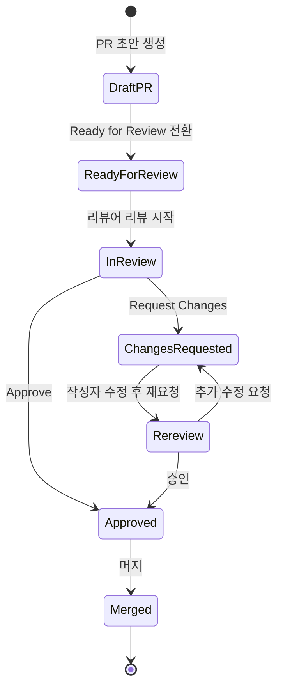
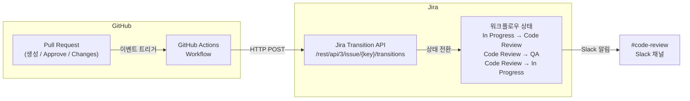

# Jira 프로젝트 관리 시스템 코드 리뷰 규칙

## 목차

1. [코드 리뷰 목적](#1-코드-리뷰-목적)
2. [리뷰 프로세스](#2-리뷰-프로세스)
3. [리뷰 체크리스트](#3-리뷰-체크리스트)
4. [리뷰 코멘트 가이드](#4-리뷰-코멘트-가이드)
5. [코딩 표준](#5-코딩-표준)
6. [Jira 워크플로우 자동 연동](#6-jira-워크플로우-자동-연동)
7. [리뷰어 선정 기준](#7-리뷰어-선정-기준)
8. [긴급 리뷰 프로세스](#8-긴급-리뷰-프로세스)
9. [아키텍처 리뷰 vs 코드 리뷰](#9-아키텍처-리뷰-vs-코드-리뷰)
10. [리뷰 메트릭](#10-리뷰-메트릭)
11. [PR 자동 분석 봇](#11-pr-자동-분석-봇)
12. [리뷰 에스컬레이션](#12-리뷰-에스컬레이션)
13. [리뷰 문화 가이드](#13-리뷰-문화-가이드)
14. [변경 이력](#14-변경-이력)

---

## 1. 코드 리뷰 목적

- 코드 품질 향상 및 버그 사전 방지
- 지식 공유 및 팀 역량 강화
- 코딩 표준 준수 확인
- 워크플로우 연동: Code Review 상태에서 리뷰어 승인 시 QA로 전환
- 보안 취약점(SQL Injection, XSS, RBAC 누락) 조기 발견
- 이슈 타입별(Story / Bug / Task) 완료 기준 검증

---

## 2. 리뷰 프로세스

### 2.1 PR 상태 머신



### 2.2 각 단계별 행동 규칙

| 단계 | 행동 주체 | 행동 규칙 |
|------|-----------|-----------|
| Draft PR | 작성자 | 셀프 리뷰 완료 후 Ready for Review로 전환. WIP 코드는 Draft 유지 |
| Ready for Review | 작성자 | PR 설명, 관련 Jira 이슈 번호, 스크린샷(UI 변경 시) 첨부 |
| In Review | 리뷰어 | 24시간 이내 첫 코멘트 또는 Approve. 범위 외 지적은 [NICE]로 분류 |
| Changes Requested | 작성자 | 모든 [MUST] 코멘트 해결 후 Re-request review. 반박 시 코멘트로 사유 명시 |
| Re-review | 리뷰어 | 이전 코멘트 해결 여부 중심으로 재검토. 신규 이슈 발견 시 별도 코멘트 |
| Approved | 작성자 | 최소 승인 수 충족 확인 후 Squash Merge 또는 Merge |
| Merged | 작성자 | 관련 Jira 이슈 상태 전환 확인(자동 연동 미작동 시 수동 전환) |

### 2.3 프로세스 규칙

| 항목 | 규칙 |
|------|------|
| 리뷰어 수 | 최소 1명 (핵심 변경은 2명) |
| 리뷰 응답 시간 | PR 생성 후 24시간 이내 |
| PR 크기 | 400줄 이하 권장 (초과 시 분할) |
| 셀프 리뷰 | PR 생성 전 필수 |
| 알림 | Slack #code-review 채널 자동 알림 |
| 브랜치 전략 | feature/* → develop → main (GitFlow 기준) |

---

## 3. 리뷰 체크리스트

> [자동] = CI/봇이 자동 검증 가능 항목 / [수동] = 리뷰어가 직접 확인해야 하는 항목

### 3.1 기능

- [ ] [수동] 요구사항(Acceptance Criteria)을 올바르게 구현했는가?
- [ ] [수동] 엣지 케이스를 처리했는가?
- [ ] [수동] 에러 핸들링이 적절한가?
- [ ] [수동] 워크플로우 전환 규칙을 준수하는가?

### 3.2 코드 품질

- [ ] [수동] 네이밍이 명확하고 일관적인가?
- [ ] [수동] 불필요한 복잡도가 없는가?
- [ ] [자동] 중복 코드가 없는가? (SonarQube Duplication 체크)
- [ ] [수동] 단일 책임 원칙을 따르는가?

### 3.3 보안

- [ ] [자동] SQL Injection 취약점이 없는가? (Snyk / SonarQube)
- [ ] [자동] XSS 취약점이 없는가? (Snyk)
- [ ] [자동] 민감 정보가 하드코딩되지 않았는가? (Gitleaks / SonarQube)
- [ ] [수동] RBAC 권한 체크가 올바른가? (5단계 역할: Admin / Developer / QA / Reporter / Viewer)
- [ ] [수동] 이슈 보안 레벨(Public / Internal / Confidential) 접근 제어가 적절한가?

### 3.4 성능

- [ ] [수동] N+1 쿼리 문제가 없는가?
- [ ] [수동] JQL 검색 쿼리가 최적화되었는가?
- [ ] [수동] 불필요한 API 호출이 없는가?
- [ ] [수동] 적절한 인덱싱이 되어 있는가?

### 3.5 테스트

- [ ] [자동] 새로운 기능에 대한 테스트가 있는가?
- [ ] [자동] 커버리지 80% 이상을 유지하는가? (DoD 조건 — JaCoCo/Istanbul)
- [ ] [수동] 테스트가 의미 있는 케이스를 검증하는가?
- [ ] [자동] 기존 테스트가 깨지지 않았는가? (CI 파이프라인)

### 3.6 이슈 타입별 리뷰 중점

| 이슈 타입 | 리뷰 중점 항목 |
|-----------|----------------|
| **Story** (기능) | Acceptance Criteria 완전 충족 여부, 사용자 시나리오 정상 동작, UI/UX 사양 일치 |
| **Bug** (결함) | 재현 절차대로 버그 재현 확인, 수정 후 동일 경로 재현 불가 확인, 회귀 케이스 추가 여부 |
| **Task** (기술) | 완료 기준(DoD) 항목 체크, 성능/인프라 영향 범위, 문서 업데이트 반영 여부 |

---

## 4. 리뷰 코멘트 가이드

| 접두사 | 의미 | 예시 |
|--------|------|------|
| [MUST] | 반드시 수정 필요 (머지 블로킹) | [MUST] RBAC 권한 체크가 누락되었습니다 |
| [SHOULD] | 강력 권장 (미수정 시 사유 명시) | [SHOULD] JQL 쿼리에 인덱스를 활용하면 좋겠습니다 |
| [NICE] | 개선 제안 (선택 사항) | [NICE] 변수명을 좀 더 명확하게 바꾸면 좋겠습니다 |
| [Q] | 질문 (코드 이해 목적) | [Q] 이 워크플로우 전환 조건의 의도가 궁금합니다 |

> [MUST] 코멘트가 하나라도 남아 있으면 머지 불가. [SHOULD] / [NICE] 는 작성자 판단으로 처리 가능하나 처리 결과를 코멘트로 남긴다.

---

## 5. 코딩 표준

### 5.1 기본 규칙

| 항목 | 규칙 |
|------|------|
| 들여쓰기 | 스페이스 2칸 (FE), 4칸 (BE/Java) |
| 줄 길이 | 최대 120자 |
| 파일 길이 | 최대 300줄 권장 |
| 함수 길이 | 최대 30줄 권장 |
| 이슈 제목 형식 | `[모듈] 기능 요약` (동사+목적어) |

### 5.2 FE (Frontend) 도구 설정

```jsonc
// .eslintrc.json (예시)
{
  "extends": ["eslint:recommended", "plugin:@typescript-eslint/recommended", "prettier"],
  "rules": {
    "max-lines": ["warn", 300],
    "max-lines-per-function": ["warn", 30],
    "no-console": "error"
  }
}
```

```jsonc
// .prettierrc (예시)
{
  "printWidth": 120,
  "tabWidth": 2,
  "semi": true,
  "singleQuote": true,
  "trailingComma": "es5"
}
```

### 5.3 BE (Backend/Java) 도구 설정

```xml
<!-- checkstyle.xml 핵심 규칙 (예시) -->
<module name="LineLength">
  <property name="max" value="120"/>
</module>
<module name="MethodLength">
  <property name="max" value="30"/>
</module>
<module name="FileLength">
  <property name="max" value="300"/>
</module>
```

SpotBugs는 `pom.xml` 또는 `build.gradle`에 플러그인 추가 후 CI 빌드 단계에서 실행한다.

```xml
<!-- Maven SpotBugs 플러그인 예시 -->
<plugin>
  <groupId>com.github.spotbugs</groupId>
  <artifactId>spotbugs-maven-plugin</artifactId>
  <version>4.8.3.1</version>
  <executions>
    <execution>
      <goals><goal>check</goal></goals>
    </execution>
  </executions>
</plugin>
```

### 5.4 .editorconfig 공유

```ini
# .editorconfig — 저장소 루트에 위치
root = true

[*]
charset = utf-8
end_of_line = lf
insert_final_newline = true
trim_trailing_whitespace = true

[*.{js,ts,tsx,jsx,json,yaml,yml,md}]
indent_style = space
indent_size = 2

[*.{java,xml,gradle}]
indent_style = space
indent_size = 4
```

### 5.5 CI 자동 검증

```yaml
# .github/workflows/lint.yml
name: Lint & Format Check

on: [pull_request]

jobs:
  frontend-lint:
    runs-on: ubuntu-latest
    steps:
      - uses: actions/checkout@v4
      - uses: actions/setup-node@v4
        with:
          node-version: '20'
      - run: npm ci
      - run: npm run lint
      - run: npm run format:check

  backend-lint:
    runs-on: ubuntu-latest
    steps:
      - uses: actions/checkout@v4
      - uses: actions/setup-java@v4
        with:
          java-version: '21'
      - run: ./mvnw checkstyle:check spotbugs:check
```

---

## 6. Jira 워크플로우 자동 연동

### 6.1 연동 아키텍처



### 6.2 전환 규칙

| GitHub 이벤트 | Jira 상태 전환 | 조건 |
|---------------|----------------|------|
| PR 생성 (opened) | In Progress → Code Review | PR 제목 또는 브랜치명에 Jira 이슈 키 포함 |
| PR Approve | Code Review → QA | 설정된 최소 Approve 수 충족 |
| PR Request Changes | Code Review → In Progress | 리뷰어가 변경 요청 제출 |
| PR Closed (without merge) | Code Review → In Progress | PR 닫힘(미머지) |
| PR Merged | QA 전환은 별도 처리 | QA 자동화 파이프라인과 연계 |

### 6.3 GitHub Actions YAML 예시

```yaml
# .github/workflows/jira-sync.yml
name: Jira Workflow Sync

on:
  pull_request:
    types: [opened, reopened, closed]
  pull_request_review:
    types: [submitted]

env:
  JIRA_BASE_URL: ${{ secrets.JIRA_BASE_URL }}
  JIRA_USER_EMAIL: ${{ secrets.JIRA_USER_EMAIL }}
  JIRA_API_TOKEN: ${{ secrets.JIRA_API_TOKEN }}

jobs:
  sync-jira:
    runs-on: ubuntu-latest
    steps:
      - name: Extract Jira Issue Key
        id: extract
        run: |
          # PR 제목 또는 브랜치명에서 이슈 키 추출 (예: PROJ-123)
          ISSUE_KEY=$(echo "${{ github.head_ref }}" | grep -oE '[A-Z]+-[0-9]+' | head -1)
          if [ -z "$ISSUE_KEY" ]; then
            ISSUE_KEY=$(echo "${{ github.event.pull_request.title }}" | grep -oE '[A-Z]+-[0-9]+' | head -1)
          fi
          echo "issue_key=$ISSUE_KEY" >> $GITHUB_OUTPUT

      - name: Get Transition ID
        id: transition
        run: |
          EVENT="${{ github.event_name }}"
          ACTION="${{ github.event.action }}"
          REVIEW_STATE="${{ github.event.review.state }}"

          if [ "$EVENT" = "pull_request" ] && [ "$ACTION" = "opened" ]; then
            # In Progress → Code Review (transition ID는 프로젝트별 상이)
            echo "transition_id=21" >> $GITHUB_OUTPUT
          elif [ "$EVENT" = "pull_request_review" ] && [ "$REVIEW_STATE" = "approved" ]; then
            # Code Review → QA
            echo "transition_id=31" >> $GITHUB_OUTPUT
          elif [ "$EVENT" = "pull_request_review" ] && [ "$REVIEW_STATE" = "changes_requested" ]; then
            # Code Review → In Progress
            echo "transition_id=11" >> $GITHUB_OUTPUT
          fi

      - name: Transition Jira Issue
        if: steps.extract.outputs.issue_key != '' && steps.transition.outputs.transition_id != ''
        run: |
          curl -s -X POST \
            "$JIRA_BASE_URL/rest/api/3/issue/${{ steps.extract.outputs.issue_key }}/transitions" \
            -u "$JIRA_USER_EMAIL:$JIRA_API_TOKEN" \
            -H "Content-Type: application/json" \
            -d "{\"transition\": {\"id\": \"${{ steps.transition.outputs.transition_id }}\"}}"
```

> Transition ID는 Jira 프로젝트마다 다르다. `GET /rest/api/3/issue/{issueKey}/transitions` 로 현재 프로젝트의 ID를 확인한 후 위 값을 교체한다.

---

## 7. 리뷰어 선정 기준

### 7.1 CODEOWNERS 파일 구조

저장소 루트 또는 `.github/CODEOWNERS`에 도메인별 코드 소유자를 명시한다. GitHub는 PR 생성 시 변경 파일 경로와 매칭하여 자동으로 리뷰어를 요청한다.

```
# .github/CODEOWNERS

# 도메인별 코드 소유자
/backend/src/*/issue/       @issue-team
/backend/src/*/workflow/    @workflow-team
/backend/src/*/sprint/      @sprint-team
/backend/src/*/release/     @release-team
/frontend/src/board/        @frontend-team
/frontend/src/issue/        @frontend-team @issue-team
/frontend/src/dashboard/    @frontend-team

# 공통 설정 파일 — TL 필수 리뷰
/.github/                   @team-leads
/infrastructure/            @devops-team @team-leads
*.sql                       @dba-team @team-leads

# 전체 코드 — TL이 최소 1명 포함되도록 보장
*                           @team-leads
```

### 7.2 자동 리뷰어 지정 원칙

| 원칙 | 설명 |
|------|------|
| CODEOWNERS 우선 | 변경 파일 경로에 매칭되는 소유자가 1순위 자동 지정 |
| 최근 변경 이력 기반 | `git log --follow` 기준 최근 3개월 내 해당 파일 수정자 추천 |
| 도메인 전문가 포함 | 변경 범위가 2개 이상 도메인에 걸칠 경우 각 도메인 소유자 포함 |
| 라운드로빈 | 동일 팀 내 리뷰 부하 분산 — 직전 리뷰어 제외하고 순환 지정 |

### 7.3 라운드로빈 알고리즘

```
팀원 목록: [A, B, C, D]
마지막 배정 리뷰어: C

다음 리뷰어 선택 순서:
1. D (C 다음)
2. A (순환)
3. B
4. C (한 바퀴 완료 후 재배정)

예외 처리:
- 본인 PR → 배정 제외
- 휴가/부재 상태 → 건너뜀 (GitHub 상태 또는 Slack 상태 확인)
- 이미 해당 스프린트 리뷰 3회 초과 → 낮은 우선순위로 이동
```

### 7.4 셀프 승인 금지

- 본인이 생성한 PR은 본인이 Approve 불가 (GitHub Branch Protection Rules에서 `Require a pull request before merging` + `Dismiss stale pull request approvals` 설정)
- 팀 리더도 본인 PR은 다른 리뷰어의 승인 필요
- 긴급 상황(Hotfix)에서도 최소 1명의 타인 승인 필수

---

## 8. 긴급 리뷰 프로세스

### 8.1 일반 리뷰 vs 긴급 리뷰 비교

| 항목 | 일반 리뷰 | 긴급 리뷰 (Hotfix) |
|------|-----------|-------------------|
| 리뷰어 수 | 1~2명 | 1명 |
| 응답 SLA | 24시간 | 2시간 |
| PR 크기 제한 | 400줄 이하 | 가능한 최소화 (권장 100줄 이하) |
| 테스트 범위 | 전체 테스트 스위트 | 영향 범위 테스트만 |
| 브랜치 | feature/* → develop | hotfix/* → main + develop |
| Jira 이슈 타입 | Story / Task / Bug | Bug (Priority: Highest) |
| 사후 조치 | 없음 | 정식 리뷰 수행 (72시간 이내) |
| Slack 알림 채널 | #code-review | #code-review-urgent |

### 8.2 긴급 리뷰 발동 기준

- 운영 서비스 장애 발생 (5xx 에러율 급증, 서비스 다운)
- 보안 취약점 즉시 패치 필요
- 데이터 유실 위험이 있는 결함
- 주요 비즈니스 기능(결제, 인증 등) 전면 불가

### 8.3 긴급 리뷰 절차

```
1. 작성자: Jira Bug 이슈 생성 (Priority: Highest, Label: hotfix)
2. 작성자: hotfix/PROJ-XXX 브랜치 생성 → 수정 → PR 생성
3. 작성자: PR 제목에 [HOTFIX] 접두사 추가
4. 작성자: Slack #code-review-urgent 에 @on-call 멘션으로 즉시 알림
5. 리뷰어: 2시간 이내 리뷰 완료 → Approve
6. 작성자: main 브랜치 머지 → 즉시 배포
7. 작성자: develop 브랜치에도 cherry-pick 또는 merge
8. 사후: 72시간 이내 정식 리뷰 수행 (기술 부채 방지)
```

---

## 9. 아키텍처 리뷰 vs 코드 리뷰

### 9.1 구분 기준

| 기준 | 코드 리뷰 | 아키텍처 리뷰 |
|------|-----------|---------------|
| 범위 | 단일 PR / 단일 기능 구현 | 시스템 설계, 모듈 간 관계 |
| 검토자 | 동료 개발자 1~2명 | TL + 관련 도메인 개발자 전원 |
| 소요 시간 | 1~2시간 이내 | 반나절~1일 (회의 포함) |
| 산출물 | PR 코멘트, Approve | ADR(Architecture Decision Record) 문서 |
| 빈도 | 모든 PR | 아키텍처 리뷰 트리거 해당 시만 |
| Jira 연동 | Code Review 상태 | Story/Task + Sub-task(아키텍처 리뷰) 별도 등록 |

### 9.2 아키텍처 리뷰 트리거

아래 조건 중 하나 이상 해당 시 코드 리뷰 전에 아키텍처 리뷰를 먼저 수행한다.

- 새 모듈(패키지/서비스) 추가
- DB 스키마 변경 (테이블 추가/삭제/컬럼 변경)
- API Breaking Change (기존 엔드포인트 제거 또는 요청/응답 스펙 변경)
- 3개 이상의 기존 모듈에 동시 영향
- 외부 시스템 신규 연동 (Jira API, Slack, CI/CD 등)
- 인프라 변경 (클라우드 리소스, 네트워크 구성)

### 9.3 ADR(Architecture Decision Record) 작성 기준

```markdown
# ADR-{번호}: {결정 제목}

## 상태
Proposed | Accepted | Deprecated | Superseded

## 배경
이 결정이 필요하게 된 맥락과 문제를 기술한다.

## 결정
선택한 방향과 그 이유를 기술한다.

## 고려한 대안
검토했으나 채택하지 않은 방안과 그 이유를 기술한다.

## 결과
이 결정으로 인한 영향(긍정적/부정적)을 기술한다.

## 관련 이슈
- Jira: PROJ-XXX
- PR: #XXX
```

ADR 파일은 저장소 내 `/docs/adr/` 디렉토리에 `ADR-001-{slug}.md` 형식으로 관리한다.

### 9.4 아키텍처 리뷰 회의

- **참석자**: TL(필수) + 변경 영향을 받는 도메인 개발자 전원
- **준비물**: 변경 대상 다이어그램, 영향 범위 분석 문서, 대안 검토 결과
- **결과물**: ADR 문서 작성 + Jira 이슈에 첨부 + 팀 위키(Confluence) 공유

---

## 10. 리뷰 메트릭

### 10.1 핵심 메트릭 및 목표치

| 메트릭 | 설명 | 측정 방법 | 목표치 |
|--------|------|-----------|--------|
| 첫 리뷰 응답 시간 | PR 생성 시각 ~ 첫 리뷰 코멘트/Approve 시각 | GitHub Insights / LinearB | < 4시간 |
| PR 사이클 타임 | PR 생성 시각 ~ 머지 시각 | LinearB PR Cycle Time | < 24시간 |
| 반려율 | Request Changes 발생 비율 / 전체 PR | GitHub API 집계 | < 20% |
| 리뷰 당 코멘트 수 | PR 1건당 평균 리뷰 코멘트 수 | GitHub Insights | 평균 3~5개 |
| [MUST] 코멘트 비율 | 전체 코멘트 중 [MUST] 비율 | 코멘트 텍스트 파싱 | < 10% |
| PR 크기 | 변경 줄 수 (추가 + 삭제) | GitHub PR Size 라벨 | 400줄 이하 80% 이상 |
| 커버리지 유지율 | 머지 후 테스트 커버리지 감소 없음 | JaCoCo / Istanbul CI 리포트 | 80% 이상 유지 |

### 10.2 측정 도구

| 도구 | 측정 대상 | 활용 방법 |
|------|-----------|-----------|
| **GitHub Insights** | PR 수, 머지 시간, 기여자별 통계 | 저장소 Insights 탭 주간 확인 |
| **LinearB** | PR 사이클 타임, 첫 리뷰 시간, 배포 빈도 | 팀 대시보드 연동, 스프린트 레트로 시 공유 |
| **SonarQube** | 코드 품질 지표, 기술 부채, 커버리지 | PR Decoration으로 PR마다 자동 리포트 |
| **GitHub Actions 로그** | 빌드/테스트 통과율 | 주간 Summary 리포트 자동 생성 |

### 10.3 메트릭 리뷰 주기

- **매 스프린트 레트로스펙티브**: 위 메트릭 수치 공유 → 목표치 미달 항목 개선 논의
- **분기별**: 목표치 재설정 (팀 성숙도 반영)

---

## 11. PR 자동 분석 봇

### 11.1 도구별 역할

| 도구 | 역할 | PR에서의 동작 |
|------|------|---------------|
| **SonarQube PR Decoration** | 정적 분석 (코드 품질, 복잡도, 중복) | PR에 품질 게이트 결과 자동 코멘트. Quality Gate 실패 시 머지 블로킹 |
| **JaCoCo (BE)** | Java 테스트 커버리지 측정 | PR 커버리지 변동 리포트. 80% 미만 시 경고 코멘트 |
| **Istanbul/nyc (FE)** | JavaScript/TypeScript 커버리지 측정 | PR 커버리지 변동 리포트. 80% 미만 시 경고 코멘트 |
| **Snyk** | 보안 취약점 스캔 (의존성 + 코드) | Critical/High 취약점 발견 시 PR 자동 코멘트 + 머지 블로킹 |
| **PR Size Labeler** | PR 크기 자동 라벨링 | 변경 줄 수 기준 XS/S/M/L/XL 라벨 부착 |

### 11.2 PR 크기 자동 라벨링

```yaml
# .github/workflows/pr-labeler.yml
name: PR Size Labeler

on:
  pull_request:
    types: [opened, synchronize]

jobs:
  label:
    runs-on: ubuntu-latest
    steps:
      - uses: codelytv/pr-size-labeler@v1
        with:
          GITHUB_TOKEN: ${{ secrets.GITHUB_TOKEN }}
          xs_max_size: 10
          s_max_size: 100
          m_max_size: 400
          l_max_size: 800
          fail_if_xl: false
          message_if_xl: |
            이 PR은 800줄을 초과합니다. 가능하면 더 작은 단위로 분할해 주세요.
            리뷰어의 집중도와 리뷰 품질이 저하될 수 있습니다.
```

### 11.3 SonarQube Quality Gate 기준

| 지표 | 기준 |
|------|------|
| 신규 코드 커버리지 | 80% 이상 |
| 신규 코드 중복 | 3% 이하 |
| 신규 Blocker 이슈 | 0개 |
| 신규 Critical 이슈 | 0개 |
| 유지보수성 등급 | A |

---

## 12. 리뷰 에스컬레이션

### 12.1 에스컬레이션 단계

| 경과 시간 | 대상 상황 | 자동화 조치 | 수동 조치 |
|-----------|-----------|-------------|-----------|
| 4시간 경과 | 첫 리뷰 없음 | — | 작성자가 Slack에서 리뷰어 직접 멘션 |
| 24시간 경과 | 리뷰 미응답 | Slack Bot 자동 리마인더 → 리뷰어 DM | 작성자가 TL에게 보고 |
| 48시간 경과 | 여전히 미응답 | Slack Bot → #code-review 채널에 TL 태그 에스컬레이션 알림 | TL이 리뷰어 교체 또는 직접 리뷰 |
| 48시간 이상 | 리뷰어 간 의견 충돌 | — | TL 또는 아키텍트가 중재 회의 소집 |

### 12.2 자동 리마인더 Slack Bot 설정

```yaml
# .github/workflows/review-reminder.yml
name: Review Reminder

on:
  schedule:
    # 평일 오전 10시, 오후 4시 (KST = UTC+9)
    - cron: '0 1,7 * * 1-5'

jobs:
  remind:
    runs-on: ubuntu-latest
    steps:
      - name: Check stale PRs and notify
        uses: actions/github-script@v7
        with:
          script: |
            const now = new Date();
            const prs = await github.rest.pulls.list({
              owner: context.repo.owner,
              repo: context.repo.repo,
              state: 'open'
            });

            for (const pr of prs.data) {
              const createdAt = new Date(pr.created_at);
              const hoursElapsed = (now - createdAt) / (1000 * 60 * 60);

              if (hoursElapsed >= 24 && pr.requested_reviewers.length > 0) {
                // Slack Webhook으로 리마인더 전송
                const reviewers = pr.requested_reviewers.map(r => r.login).join(', ');
                await fetch(process.env.SLACK_WEBHOOK_URL, {
                  method: 'POST',
                  headers: { 'Content-Type': 'application/json' },
                  body: JSON.stringify({
                    text: `[리뷰 리마인더] PR #${pr.number} "${pr.title}" 이 24시간 이상 리뷰 대기 중입니다. 리뷰어: ${reviewers}`
                  })
                });
              }
            }
        env:
          SLACK_WEBHOOK_URL: ${{ secrets.SLACK_WEBHOOK_URL }}
```

### 12.3 의견 충돌 중재 절차

```
1. 리뷰어 A와 리뷰어 B의 의견이 상충할 경우
   → 작성자가 각 의견의 근거를 PR 코멘트에 정리

2. 24시간 내 합의 불가 시
   → 작성자가 TL에게 중재 요청 (PR 링크 + 요약 전달)

3. TL 중재
   → TL이 PR 코멘트에 결정 사항과 근거 명시
   → 필요 시 아키텍트 참여

4. 결정 후
   → 반복 충돌 패턴은 팀 코딩 컨벤션 문서에 명문화
```

---

## 13. 리뷰 문화 가이드

### 13.1 코드 vs 사람 분리 원칙

- 코멘트의 주어는 항상 코드(또는 구현)이지 사람이 아니다.
- 올바른 예: "이 함수는 단일 책임 원칙을 벗어난 것 같습니다."
- 잘못된 예: "당신은 왜 이렇게 구현했나요?"
- 코드 작성자의 능력이 아니라 코드 자체의 개선 가능성을 논한다.

### 13.2 비동기 리뷰 에티켓

| 규칙 | 설명 |
|------|------|
| 명확한 의도 전달 | 코멘트는 맥락과 이유를 포함한다. "수정 필요" 단독 사용 금지 |
| 즉각 응답 강요 금지 | 리뷰 코멘트에 대한 즉각 답변을 강요하지 않는다 (SLA 내 응답이면 충분) |
| Resolve 전 확인 | 작성자가 코멘트를 Resolve하기 전에 리뷰어 의견이 반영되었는지 확인 |
| 컨텍스트 제공 | 리뷰어는 왜 이 코멘트를 남기는지 배경(보안, 성능, 유지보수)을 함께 설명 |
| 불필요한 핑퐁 방지 | [NICE] 수준 코멘트는 작성자 판단을 존중하고 승인을 블로킹하지 않는다 |

### 13.3 긍정적 피드백도 남기기

- 좋은 구현, 깔끔한 코드, 영리한 해결책을 발견하면 명시적으로 칭찬한다.
- 예: "이 방식으로 N+1 문제를 해결한 것이 인상적입니다."
- 긍정적 피드백은 팀 신뢰 형성과 리뷰 참여 의욕 향상에 직결된다.
- 스프린트 레트로스펙티브에서 좋은 리뷰 사례를 공유하는 문화를 만든다.

### 13.4 질문형 코멘트 권장

- 지적보다 질문으로 시작하면 방어적 반응을 줄일 수 있다.
- 권장 표현:
  - "~하면 어떨까요?"
  - "혹시 ~를 고려해 보셨나요?"
  - "~한 이유가 있을까요? 제가 놓친 맥락이 있을 수 있어서요."
- 질문 후 작성자의 의도가 타당하다면 코멘트를 철회하거나 [NICE]로 낮춘다.

### 13.5 리뷰어의 학습 자세

- 모든 것을 알 수 없다. 모르는 부분은 [Q]로 질문한다.
- 리뷰는 리뷰어도 배우는 과정이다.
- 도메인 지식이 부족한 영역은 해당 도메인 전문가에게 의견을 구한다.

---

## 14. 변경 이력

| 버전 | 날짜 | 작성자 | 변경 내용 |
|------|------|--------|-----------|
| v1.0 | 2026-03-21 | 팀 | 최초 작성 |
| v2.0 | 2026-03-21 | 팀 | Jira 자동 연동, CODEOWNERS, 긴급 리뷰, 아키텍처 리뷰, 메트릭, PR 봇, 에스컬레이션, 문화 가이드 추가 |
