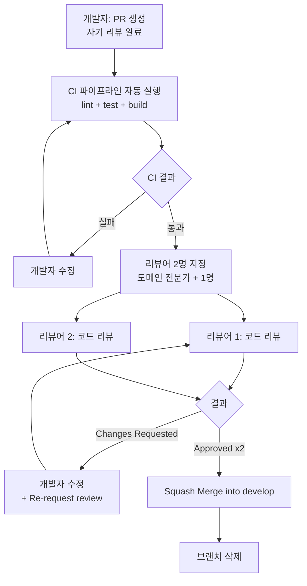
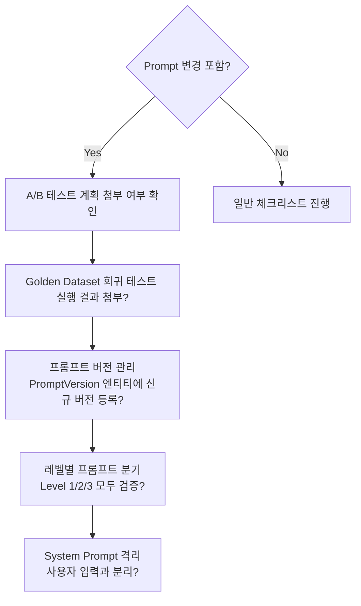

# LearnFlow AI 코드 리뷰 규칙

## 목차

1. [리뷰 원칙](#1-리뷰-원칙)
2. [리뷰 프로세스](#2-리뷰-프로세스)
3. [공통 체크리스트](#3-공통-체크리스트)
4. [AI 특화 리뷰](#4-ai-특화-리뷰)
5. [Java/Spring 코딩 표준](#5-javaspring-코딩-표준)
6. [React/TypeScript 표준](#6-reacttypescript-표준)
7. [Dart/Flutter 표준](#7-dartflutter-표준)
8. [Hotfix 리뷰 특례](#8-hotfix-리뷰-특례)

---

## 1. 리뷰 원칙

### 1.1 기본 원칙

LearnFlow AI 코드 리뷰는 코드 품질 향상과 지식 공유를 목적으로 하며, 다음 원칙을 따른다.

| 원칙 | 설명 |
|------|------|
| **존중과 건설성** | 코드를 비판하되 작성자를 비판하지 않는다. "이 코드는..."으로 시작, "당신은..."으로 시작하지 않는다. |
| **명확한 의도 전달** | 제안인지 필수 수정인지 명시한다 (`[nit]`, `[must]`, `[question]`, `[suggestion]`) |
| **근거 제시** | 변경 요청 시 이유와 대안을 함께 제시한다. |
| **학습 기회** | 더 나은 방법을 알고 있다면 공유한다. 리뷰어도 배울 수 있다. |
| **타임박스** | P2 이상 리뷰는 1 영업일 이내 응답. 지연 시 PR 작성자가 리마인드. |
| **자기 리뷰 선행** | PR 생성 전 본인이 먼저 diff를 전체 검토한다. |

### 1.2 리뷰 코멘트 레이블

| 레이블 | 의미 | 블로킹 여부 |
|--------|------|------------|
| `[must]` | 반드시 수정 필요. 버그, 보안, 성능 문제 | 예 |
| `[should]` | 강력히 권장. 코드 품질, 가독성 | 예 (원칙적으로) |
| `[nit]` | 사소한 스타일, 네이밍 개선 | 아니오 |
| `[question]` | 이해를 위한 질문. 수정 불필요 | 아니오 |
| `[suggestion]` | 더 나은 접근법 제안. 선택 사항 | 아니오 |
| `[praise]` | 좋은 코드에 대한 칭찬 | 아니오 |

---

## 2. 리뷰 프로세스

### 2.1 전체 흐름



### 2.2 리뷰어 배정 기준

| 스코프 | 1차 리뷰어 | 2차 리뷰어 |
|--------|----------|----------|
| `rag`, `ai-tutor`, `quality` | AI 파트 담당자 | 아키텍트 또는 시니어 |
| `pii`, `finops` | 보안/FinOps 담당자 | 시니어 개발자 |
| `user`, `course`, `quiz` | 도메인 담당자 | 팀 내 1명 |
| `outbox`, `tracing`, `infra` | DevOps 담당자 | 시니어 백엔드 |
| `mobile` | Flutter 담당자 | 프론트엔드 리드 |

### 2.3 리뷰 응답 시간 기준

| 우선순위 | PR 크기 | 응답 기준 |
|---------|---------|----------|
| P1 (Hotfix) | 모든 크기 | 1시간 이내 |
| P2 (일반) | ~200줄 | 1 영업일 이내 |
| P2 (일반) | 200~500줄 | 2 영업일 이내 |
| P3 (docs/chore) | 모든 크기 | 2 영업일 이내 |

---

## 3. 공통 체크리스트

### 3.1 기능 정확성

- [ ] 요구사항(이슈/티켓)을 완전히 충족하는가?
- [ ] 엣지 케이스(null, 빈 컬렉션, 경계값)를 처리하는가?
- [ ] 비즈니스 로직이 명세와 일치하는가?
- [ ] 이전 기능에 대한 회귀 테스트가 있는가?

### 3.2 코드 품질

- [ ] 메서드/클래스가 단일 책임 원칙(SRP)을 따르는가?
- [ ] 중복 코드(DRY)가 없는가?
- [ ] 변수명/메서드명이 의도를 명확히 전달하는가?
- [ ] 매직 넘버/문자열이 상수로 추출되었는가?
- [ ] 불필요한 주석이나 TODO가 없는가?
- [ ] 복잡한 로직에 Javadoc/주석이 있는가?

### 3.3 보안

- [ ] SQL 인젝션 방지 (PreparedStatement / JPA 사용)?
- [ ] 사용자 입력 검증 (`@Valid`, `@Validated`) 적용?
- [ ] 민감 정보(비밀번호, API 키)가 로그에 출력되지 않는가?
- [ ] 권한 체크(`@PreAuthorize`, `@Secured`) 누락 없는가?
- [ ] CORS 설정이 과도하게 허용적이지 않은가?
- [ ] PII가 포함된 데이터를 불필요하게 저장/로깅하지 않는가?

### 3.4 성능

- [ ] N+1 쿼리 문제가 없는가? (`@EntityGraph`, `Fetch Join` 확인)
- [ ] 불필요한 DB 조회나 외부 API 호출이 없는가?
- [ ] 대용량 데이터를 한번에 로드하지 않는가? (페이지네이션, Cursor)
- [ ] 적절한 인덱스를 사용하는가?
- [ ] 캐싱이 적용되어야 할 곳에 적용되었는가?
- [ ] 비동기 처리가 필요한 곳에 적용되었는가?

### 3.5 테스트

- [ ] 신규 코드에 단위 테스트가 있는가?
- [ ] 주요 비즈니스 로직 분기에 테스트 케이스가 있는가?
- [ ] 테스트가 실제 동작을 검증하는가? (의미 없는 mock 남용 없음)
- [ ] 커버리지 목표(domain 80%, ai 70%)를 충족하는가?

---

## 4. AI 특화 리뷰

LearnFlow AI의 핵심 차별점인 AI 기능에 대해서는 별도 체크리스트를 적용한다.

### 4.1 Prompt 변경 리뷰



**Prompt 변경 시 필수 확인 항목**

- [ ] `prompts/` 디렉토리의 프롬프트 파일 변경 시 A/B 테스트 계획 PR에 첨부
- [ ] RAGAS 회귀 테스트 결과 첨부 (Faithfulness, Precision, Recall, Relevancy)
- [ ] `PromptVersion` 엔티티에 신규 버전 등록 (is_active=false로 시작)
- [ ] Level 1(초보), Level 2(중급), Level 3(고급) 레벨별 프롬프트 모두 갱신/검증
- [ ] System Prompt가 사용자 입력과 완전히 분리되어 있는가?
- [ ] Prompt Injection 시도에 대한 방어 로직 포함 여부

### 4.2 PII 처리 리뷰

- [ ] LLM API 호출 전 반드시 `PiiMaskingService.mask()` 경유하는가?
- [ ] LLM 응답 반환 전 `PiiDemaskingService.demask()` + `PiiOutputScanner.scan()` 경유?
- [ ] PII 토큰 매핑(`<NAME_1>` 등)이 Redis session-scoped로 관리되는가?
- [ ] `audit_logs`에 PII 관련 이벤트(`PII_INPUT_DETECTED`, `OUTPUT_PII_DETECTED`)가 기록되는가?
- [ ] PII 데이터를 DB에 평문 저장하지 않는가?
- [ ] 테스트 코드에 실제 PII(이름, 전화번호, 이메일)가 포함되지 않는가?

**잘못된 패턴 예시**

```java
// [must] PiiMaskingService 미사용 — LLM에 PII 직접 전달
String response = llmClient.complete(userMessage); // 위험!

// [must] 올바른 패턴
String maskedInput = piiMaskingService.mask(userMessage);
String rawResponse = llmClient.complete(maskedInput);
String piiScanned = piiOutputScanner.scan(rawResponse);
String finalResponse = piiDemaskingService.demask(piiScanned);
```

### 4.3 FinOps 영향 리뷰

- [ ] 새로운 LLM API 호출 추가 시 예상 비용 증감 추정치 PR에 명시
- [ ] LLM 호출 전 `FinOpsGuard.check()` 또는 Kill-switch 상태 확인 로직 포함?
- [ ] Semantic Cache 적용 가능한 호출인가? (`SemanticResponseCache` 활용 검토)
- [ ] 모델 라우팅 티어가 요청 유형에 적합한가? (단순 Q&A에 Opus 사용 금지)
- [ ] `AiCostLog` 기록이 누락되지 않았는가?
- [ ] 배치 작업의 경우 예산 잔여율 체크 후 실행하는가?

**비용 추정 예시 (PR 설명에 포함)**

```
## FinOps 영향 분석
- 변경: AI 퀴즈 생성 시 Re-ranking 단계 추가
- 추가 토큰: 입력 ~200토큰/요청 (CrossEncoder 쿼리)
- 예상 비용 증가: +$0.002/퀴즈 생성 요청
- 월간 예상 증가: 퀴즈 생성 10,000회/월 기준 +$20/월
- 완화 방안: Re-ranking 결과 캐싱 (TTL 1시간)
```

### 4.4 RAG 파이프라인 변경 리뷰

- [ ] 청킹 전략 변경 시 RAGAS 점수 비교 (변경 전/후) 첨부
- [ ] `chunk_hash` 로직 변경 시 기존 임베딩 재처리 계획 포함?
- [ ] Hybrid Search (pgvector + Elasticsearch) 양쪽 모두 영향 분석
- [ ] Re-ranking CrossEncoder 모델 변경 시 벤치마크 결과 첨부
- [ ] `course_id` 기반 격리 로직이 유지되는가? (다른 강의 컨텍스트 혼입 금지)
- [ ] Context Compression 후 토큰 절감율 측정값 첨부

### 4.5 Outbox/Kafka 이벤트 리뷰

- [ ] 비즈니스 데이터 저장과 `outbox_events` INSERT가 동일 `@Transactional` 내에 있는가?
- [ ] `dedup_key` 생성 로직이 `aggregate_id + event_type + version` 형식인가?
- [ ] `destination_topic`이 이벤트 유형에 맞게 올바르게 설정되었는가?
- [ ] Consumer 멱등성 처리 (dedup_key 체크 또는 Version OCC) 구현?
- [ ] DLQ 처리 로직 (3회 실패 → DLQ 토픽 전송) 포함?

### 4.6 Distributed Tracing 리뷰

- [ ] AI 관련 Span에 Business Context Attribute가 추가되었는가?
  - `user.id`, `course.id`, `ai.model`, `ai.tokens.input`, `ai.tokens.output`
  - `ai.cost_usd`, `rag.chunks_retrieved`, `rag.rerank_score`, `cache.hit`
- [ ] Trace ID가 하위 서비스(LLM Service, RAG Service 등)로 전파되는가?
- [ ] 에러 발생 시 Span에 exception 정보가 기록되는가?

---

## 5. Java/Spring 코딩 표준

### 5.1 일반 Java 규칙

```java
// [must] 불변 객체 선호
public final class ChunkResult {
    private final String chunkId;
    private final String text;
    private final double[] embedding;

    // 생성자 또는 @Value + @Builder
}

// [must] Optional 올바른 사용
// 잘못된 예
Optional<User> user = userRepository.findById(id);
if (user.isPresent()) { // 안티패턴
    return user.get();
}

// 올바른 예
return userRepository.findById(id)
    .orElseThrow(() -> new BusinessException(ErrorCode.USER_NOT_FOUND));

// [should] 스트림 사용으로 가독성 향상
List<String> activeChunks = embeddings.stream()
    .filter(e -> e.getStatus() == EmbeddingStatus.ACTIVE)
    .map(ContentEmbedding::getChunkText)
    .collect(Collectors.toList());
```

### 5.2 Spring Boot 규칙

```java
// [must] @Transactional 올바른 사용
// Service 계층에만 적용, Controller에 적용 금지
@Service
@Transactional(readOnly = true) // 기본은 readOnly
public class CourseService {

    @Transactional // 쓰기 작업만 별도 지정
    public Course createCourse(CreateCourseRequest request) { ... }
}

// [must] 예외 처리 — BusinessException 사용
throw new BusinessException(ErrorCode.COURSE_NOT_FOUND);
// GlobalExceptionHandler에서 통일 처리

// [should] DTO 분리 — Entity 직접 반환 금지
// 잘못된 예
public User getUser(Long id) {
    return userRepository.findById(id).orElseThrow(...); // Entity 노출!
}

// 올바른 예
public UserResponse getUser(Long id) {
    User user = userRepository.findById(id).orElseThrow(...);
    return UserResponse.from(user);
}
```

### 5.3 QueryDSL 규칙

```java
// [should] 복잡한 동적 쿼리는 QueryDSL 사용
public List<Course> findCoursesByFilter(CourseFilter filter) {
    return queryFactory
        .selectFrom(course)
        .where(
            categoryEq(filter.getCategory()),
            levelEq(filter.getLevel()),
            course.status.eq(CourseStatus.PUBLISHED)
        )
        .orderBy(course.avgRating.desc())
        .fetch();
}

// [nit] N+1 방지 — @EntityGraph 또는 Fetch Join
@Query("SELECT c FROM Course c JOIN FETCH c.sections WHERE c.id = :id")
Optional<Course> findByIdWithSections(@Param("id") Long id);
```

### 5.4 테스트 코드 규칙

```java
// [must] 테스트 독립성 — @Transactional 또는 @AfterEach cleanup
// [must] 실제 DB 사용 통합 테스트는 @SpringBootTest + Testcontainers
// [should] 단위 테스트는 @ExtendWith(MockitoExtension.class)

@ExtendWith(MockitoExtension.class)
class AiGradingServiceTest {

    @Mock
    private LlmClient llmClient;

    @InjectMocks
    private AiGradingService aiGradingService;

    @Test
    @DisplayName("신뢰도 0.8 이상 시 자동 확정")
    void grade_whenConfidenceHigh_shouldAutoConfirm() {
        // given
        when(llmClient.complete(any())).thenReturn(mockGradingResponse(0.9));

        // when
        GradingResult result = aiGradingService.grade(submission);

        // then
        assertThat(result.getStatus()).isEqualTo(GradingStatus.CONFIRMED);
    }
}
```

### 5.5 금지 패턴

```java
// [must] System.out.println 사용 금지 (log.info/debug 사용)
System.out.println("DEBUG: " + data); // 금지

// [must] e.printStackTrace() 금지
} catch (Exception e) {
    e.printStackTrace(); // 금지
    log.error("처리 실패", e); // 올바른 예
}

// [must] catch Exception 남발 금지 — 구체적인 예외 타입 사용
} catch (Exception e) { ... } // 피할 것
} catch (LlmApiException | RateLimitException e) { ... } // 권장

// [must] @SuppressWarnings("unchecked") 남용 금지
```

---

## 6. React/TypeScript 표준

### 6.1 컴포넌트 규칙

```typescript
// [must] 함수형 컴포넌트만 사용 (클래스 컴포넌트 금지)
// [must] Props 타입 명시적 정의
interface AiTutorChatProps {
  sessionId: string;
  courseId: number;
  onClose: () => void;
}

// [should] React.FC 대신 직접 함수 선언
export function AiTutorChat({ sessionId, courseId, onClose }: AiTutorChatProps) {
  // ...
}

// [must] any 타입 사용 금지
const data: any = response; // 금지
const data: ChatResponse = response; // 올바른 예
```

### 6.2 상태 관리 (Zustand + TanStack Query)

```typescript
// [should] 서버 상태는 TanStack Query로 관리
const { data: course, isLoading } = useQuery({
  queryKey: ['course', courseId],
  queryFn: () => courseApi.getCourse(courseId),
});

// [should] 클라이언트 상태는 Zustand로 관리
const useChatStore = create<ChatState>((set) => ({
  messages: [],
  isStreaming: false,
  addMessage: (message) => set((state) => ({
    messages: [...state.messages, message],
  })),
}));

// [must] useEffect 의존성 배열 완전히 명시
useEffect(() => {
  loadDashboard(userId);
}, [userId]); // userId 누락 금지
```

### 6.3 SSE 스트리밍 처리

```typescript
// [must] SSE 연결 정리(cleanup) 필수
useEffect(() => {
  const eventSource = new EventSource(`/api/v1/ai/chat/sessions/${sessionId}/stream`);

  eventSource.onmessage = (event) => {
    const chunk = JSON.parse(event.data);
    appendStreamChunk(chunk.content);
  };

  eventSource.onerror = () => {
    eventSource.close();
    setError('스트리밍 연결 오류');
  };

  return () => eventSource.close(); // [must] cleanup
}, [sessionId]);
```

### 6.4 에러 처리

```typescript
// [must] API 에러 처리 일관성
const { mutate: submitQuiz } = useMutation({
  mutationFn: quizApi.submit,
  onSuccess: (result) => { ... },
  onError: (error: ApiError) => {
    toast.error(error.message ?? '퀴즈 제출에 실패했습니다.');
  },
});

// [should] ErrorBoundary로 컴포넌트 에러 격리
<ErrorBoundary fallback={<ErrorScreen />}>
  <AiTutorChat />
</ErrorBoundary>
```

---

## 7. Dart/Flutter 표준

### 7.1 상태 관리 (Riverpod)

```dart
// [must] StateNotifier 또는 AsyncNotifier 사용
@riverpod
class AiTutorNotifier extends _$AiTutorNotifier {
  @override
  FutureOr<List<ChatMessage>> build(String sessionId) async {
    return ref.watch(chatRepositoryProvider).getMessages(sessionId);
  }

  Future<void> sendMessage(String content) async {
    state = const AsyncValue.loading();
    // ...
  }
}

// [must] ConsumerWidget 사용 (StatefulWidget 직접 상태 관리 지양)
class AiTutorScreen extends ConsumerWidget {
  @override
  Widget build(BuildContext context, WidgetRef ref) {
    final messages = ref.watch(aiTutorNotifierProvider(sessionId));
    // ...
  }
}
```

### 7.2 비동기 처리

```dart
// [must] FutureBuilder/StreamBuilder 보다 Riverpod AsyncValue 우선
final messagesAsync = ref.watch(aiTutorNotifierProvider(sessionId));

return messagesAsync.when(
  data: (messages) => MessageList(messages: messages),
  loading: () => const LoadingIndicator(),
  error: (e, st) => ErrorView(message: e.toString()),
);

// [must] async/await 사용 시 예외 처리
try {
  final result = await aiTutorRepository.sendMessage(sessionId, content);
} on DioException catch (e) {
  // HTTP 에러 처리
} catch (e) {
  // 기타 에러
}
```

### 7.3 위젯 규칙

```dart
// [should] const 생성자 적극 활용 (성능 최적화)
const Text('AI 튜터', style: TextStyle(fontSize: 18));

// [should] 깊은 중첩 위젯 분리 (3단계 이상 중첩 시 별도 위젯 추출)
// 잘못된 예: Column > Row > Container > ... > Text (과도한 중첩)

// [must] BuildContext를 async 간극에서 사용 금지
// 잘못된 예
await someAsyncOperation();
Navigator.of(context).push(...); // context 유효성 미보장

// 올바른 예
if (!mounted) return;
Navigator.of(context).push(...);
```

### 7.4 테스트 (Flutter)

```dart
// [should] Widget 테스트에서 실제 Provider 대신 Mock 사용
testWidgets('채팅 메시지 표시 테스트', (tester) async {
  await tester.pumpWidget(
    ProviderScope(
      overrides: [
        aiTutorNotifierProvider.overrideWith(
          (ref, sessionId) => FakeAiTutorNotifier(mockMessages),
        ),
      ],
      child: const MaterialApp(home: AiTutorScreen(sessionId: 'test-1')),
    ),
  );

  await tester.pumpAndSettle();
  expect(find.byType(MessageBubble), findsNWidgets(mockMessages.length));
});
```

---

## 8. Hotfix 리뷰 특례

### 8.1 Hotfix 리뷰 원칙

P1 장애 대응 시 신속성이 최우선이며, 다음 특례를 적용한다.

| 항목 | 일반 PR | Hotfix PR |
|------|---------|----------|
| 리뷰어 수 | 2명 | 1명 (시니어 또는 온콜 담당자) |
| 응답 시간 | 1 영업일 | 1시간 이내 |
| CI 통과 | 필수 | 필수 (단, 통합 테스트 생략 가능) |
| 리뷰 깊이 | 전체 체크리스트 | 핵심 항목만 (보안, 정확성) |
| 사후 조치 | 없음 | 장애 보고서 + RCA 24시간 이내 작성 |

### 8.2 Hotfix 리뷰 체크리스트 (단축)

- [ ] 변경 범위가 최소한인가? (해당 버그만 수정, 추가 개선 금지)
- [ ] 수정이 올바른가? (버그 재현 후 수정 효과 확인)
- [ ] 보안 문제를 유발하지 않는가?
- [ ] 테스트 케이스(최소 1개)가 있는가?
- [ ] develop 브랜치에도 동일 수정이 반영되었는가?

### 8.3 Hotfix 이후 Follow-up

Hotfix 머지 후 반드시 다음을 수행한다:

1. **장애 보고서 작성** (24시간 이내): 원인, 영향 범위, 해결 방법, 재발 방지
2. **기술 부채 티켓 생성**: 신속 처리로 인한 코드 품질 이슈 추후 보완
3. **회고 미팅**: 주간 스프린트 회고 시 사례 공유 및 프로세스 개선

---

## 변경 이력

| 버전 | 날짜 | 작성자 | 변경 내용 |
|------|------|--------|-----------|
| v4.0 | 2026-04-02 | DevOps팀/아키텍처팀 | v4.0 기준 전면 개정. AI 특화 리뷰 섹션 강화(Prompt A/B, PII Output, FinOps 비용 추정, Outbox 멱등성, OTel Span), Flutter/Dart 표준 추가, Hotfix bypass 반영 |
| v3.0 | 2026-01-15 | 아키텍처팀 | PII 리뷰 체크리스트 추가, FinOps 영향 리뷰 추가 |
| v2.0 | 2025-10-01 | 아키텍처팀 | AI 특화 리뷰 섹션 추가, React/TypeScript 표준 보완 |
| v1.0 | 2025-07-01 | 아키텍처팀 | 최초 작성 |
