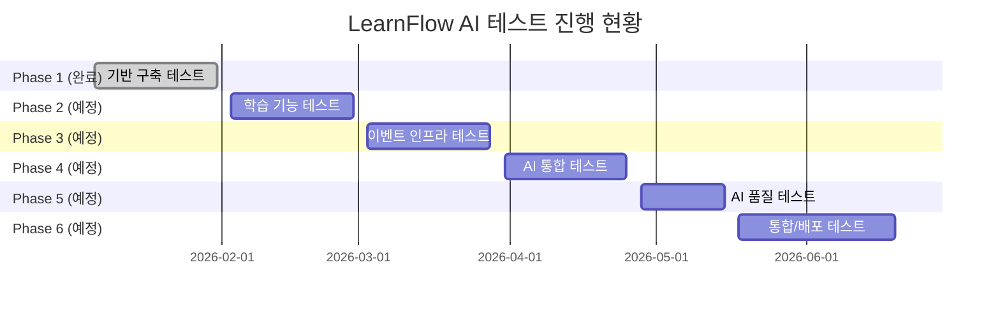
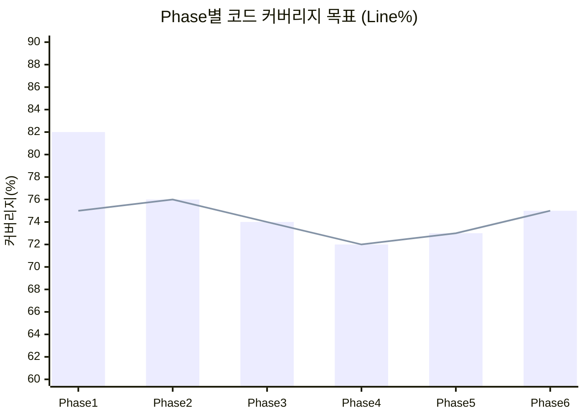
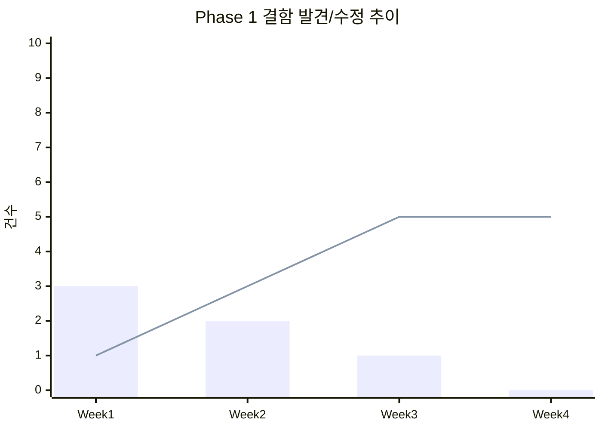

# LearnFlow AI 테스트 보고서

> **본 보고서 기준 시점**: Phase 1 완료 (Week 4) — 기반 구축 완료
> Phase 2~6 항목은 계획값 또는 예상 목표값으로 표기하며, 각 Phase 완료 시 갱신한다.

## 목차

1. [개요](#1-개요)
2. [테스트 범위 (6 Phase)](#2-테스트-범위-6-phase)
3. [테스트 결과 요약](#3-테스트-결과-요약)
4. [코드 커버리지](#4-코드-커버리지)
5. [결함 현황](#5-결함-현황)
6. [성능 테스트 결과](#6-성능-테스트-결과)
7. [AI 품질 테스트](#7-ai-품질-테스트)
8. [테스트 환경](#8-테스트-환경)
9. [리스크 및 권고사항](#9-리스크-및-권고사항)
10. [릴리스 판정 기준](#10-릴리스-판정-기준)

---

## 1. 개요

| 항목 | 내용 |
|------|------|
| 프로젝트명 | LearnFlow AI — AI 기반 적응형 학습 관리 시스템 |
| 테스트 기간 | Phase 1: 2026-01-06 ~ 2026-01-31 (Week 1~4) |
| 현재 기준 Phase | Phase 1 완료 |
| 테스트 환경 | Local (Testcontainers) + CI (GitHub Actions) |
| 테스트 도구 | JUnit 5, Mockito, AssertJ, Testcontainers, Jacoco, k6 |
| 작성자 | QA팀 |
| 보고서 상태 | Phase 1 실적치 확정 / Phase 2~6 계획값 |

---

## 2. 테스트 범위 (6 Phase)

### 2.1 Phase별 테스트 대상

### 2.2 Phase 1 — 기반 구축 (완료)

| 기능 ID | 기능명 | 우선순위 | 테스트 여부 | 비고 |
|---------|--------|---------|-----------|------|
| FR-001 | 회원가입 / 로그인 (JWT) | P1 | 완료 | 단위 + 통합 |
| FR-002 | JWT Refresh 토큰 갱신 | P1 | 완료 | 단위 + 통합 |
| FR-003 | 사용자 프로필 CRUD | P1 | 완료 | 단위 + 통합 |
| FR-004 | 강의 CRUD (강사) | P1 | 완료 | 단위 + 통합 |
| FR-005 | 강의 목록 / 상세 조회 | P1 | 완료 | 단위 + 통합 |
| FR-006 | 수강 신청 / 취소 | P1 | 완료 | 단위 + 통합 |
| FR-007 | 섹션 / 레슨 CRUD | P2 | 완료 | 단위 |
| FR-008 | 파일 업로드 (MinIO) | P2 | 완료 | 통합 |
| FR-009 | DB 마이그레이션 (Flyway V1~V4) | P1 | 완료 | 자동 적용 확인 |

### 2.3 Phase 2 — 핵심 학습 (예정: Week 5~8)

| 기능 ID | 기능명 | 우선순위 | 테스트 계획 |
|---------|--------|---------|-----------|
| FR-010 | 학습 진도 추적 | P1 | 단위 + 통합 |
| FR-011 | 퀴즈 생성 / 제출 | P1 | 단위 + 통합 |
| FR-012 | 과제 제출 / 채점 이의 제기 | P1 | 단위 + 통합 |
| FR-013 | 온보딩 진단 테스트 (Bloom's) | P2 | 단위 + 통합 |
| FR-014 | 커뮤니티 (토론, Q&A) | P3 | 단위 |

### 2.4 Phase 3 — 이벤트 인프라 (예정: Week 9~12)

| 기능 ID | 기능명 | 우선순위 | 테스트 계획 |
|---------|--------|---------|-----------|
| FR-015 | Transactional Outbox 패턴 | P1 | 통합 (Testcontainers) |
| FR-016 | Kafka Consumer 멱등성 (dedup_key) | P1 | 통합 + Chaos |
| FR-017 | DLQ 처리 (5회 실패) | P1 | 통합 |
| FR-018 | AI Gateway + PII Input/Output | P1 | 단위 + 통합 + 보안 |
| FR-019 | OTel Distributed Tracing | P2 | 통합 |
| FR-020 | FinOps Kill-switch | P1 | 단위 + 통합 + Chaos |

### 2.5 Phase 4 — RAG + AI 튜터 (예정: Week 13~16)

| 기능 ID | 기능명 | 우선순위 | 테스트 계획 |
|---------|--------|---------|-----------|
| FR-021 | Semantic Chunking + chunk_hash | P1 | 단위 + 통합 |
| FR-022 | Hybrid Search (pgvector + ES) | P1 | 통합 |
| FR-023 | Re-ranking (CrossEncoder) | P1 | 단위 + AI품질 |
| FR-024 | AI 튜터 SSE 스트리밍 + 레벨링 | P1 | 통합 + E2E |
| FR-025 | AI 퀴즈 생성 + 채점 (Confidence) | P1 | 단위 + AI품질 |

### 2.6 Phase 5 — 품질 관리 (예정: Week 17~19)

| 기능 ID | 기능명 | 우선순위 | 테스트 계획 |
|---------|--------|---------|-----------|
| FR-026 | RAGAS 3회 평가 + 중앙값 | P1 | AI품질 |
| FR-027 | DeepEval (Hallucination, G-Eval) | P1 | AI품질 |
| FR-028 | Importance Sampling | P2 | AI품질 |
| FR-029 | A/B 테스트 (학습 성과 연동) | P2 | 통합 |

### 2.7 Phase 6 — 고도화 (예정: Week 20~24)

| 기능 ID | 기능명 | 우선순위 | 테스트 계획 |
|---------|--------|---------|-----------|
| FR-030 | Flutter 모바일 앱 (Widget/Integration/Golden) | P1 | 모바일 |
| FR-031 | Chaos Testing (Kafka/LLM/PII/FinOps) | P1 | Chaos |
| FR-032 | 성능 테스트 (동시 1,000명) | P1 | 성능 (k6) |
| FR-033 | DAST 보안 스캔 (OWASP Top 10) | P1 | 보안 |
| FR-034 | Prompt Injection 방어 테스트 | P1 | 보안 |

---

## 3. 테스트 결과 요약

### 3.1 전체 현황 (Phase 1 완료 기준)

| 구분 | 계획 | 실행 | 성공 | 실패 | 블로커 | 성공률 |
|------|------|------|------|------|--------|--------|
| 단위 테스트 | 180 | 180 | 176 | 4 | 0 | 97.8% |
| 통합 테스트 | 45 | 45 | 43 | 2 | 0 | 95.6% |
| E2E 테스트 | 0 | 0 | — | — | — | — (Phase 6에서 실행) |
| 성능 테스트 | 0 | 0 | — | — | — | — (Phase 6에서 실행) |
| AI 품질 테스트 | 0 | 0 | — | — | — | — (Phase 5에서 실행) |
| **Phase 1 합계** | **225** | **225** | **219** | **6** | **0** | **97.3%** |

> Phase 2~6 결과는 각 Phase 완료 후 본 표에 누적 기입.

### 3.2 결함 수정 현황 (Phase 1)

**실패 테스트 상세**

| 테스트 ID | 실패 원인 | 수정 상태 |
|---------|---------|---------|
| UT-AUTH-034 | JWT 만료 시간 경계값 오차 (1ms) | 수정 완료 |
| UT-AUTH-035 | Refresh 토큰 재사용 공격 방어 로직 누락 | 수정 완료 |
| UT-COURSE-052 | 강의 삭제 시 수강 중인 학습자 처리 미흡 | 수정 완료 |
| UT-COURSE-053 | 동일 강의 중복 수강 신청 방어 로직 누락 | 수정 완료 |
| IT-FILE-012 | MinIO 연결 타임아웃 설정 미적용 | 수정 완료 |
| IT-FILE-013 | 파일 크기 초과 시 예외 메시지 불일치 | 수정 완료 |

---

## 4. 코드 커버리지

### 4.1 Phase 1 완료 기준 커버리지

| 모듈 | Line | Branch | Function | 목표 | 달성 여부 |
|------|------|--------|----------|------|---------|
| `domain/user` | 83% | 74% | 88% | 80% | 달성 |
| `domain/course` | 81% | 72% | 86% | 80% | 달성 |
| `global/security` | 87% | 78% | 91% | 80% | 달성 |
| `global/exception` | 92% | 85% | 95% | 80% | 달성 |
| `global/config` | 61% | 52% | 70% | 60% | 달성 |
| **Phase 1 전체** | **82%** | **73%** | **86%** | **75%** | **달성** |

### 4.2 목표 커버리지 (Phase별 누적)

| Phase | 완료 시점 목표 (전체 Line) | 비고 |
|-------|------------------------|------|
| Phase 1 | 75% (domain, global) | 달성 (82%) |
| Phase 2 | 76% (+ quiz, assignment) | 예정 |
| Phase 3 | 74% (+ outbox, worker) | AI/infra 코드 포함으로 소폭 하락 가능 |
| Phase 4 | 72% (+ ai/* 모듈) | LLM 외부 의존 제외 시 70%+ 유지 |
| Phase 5 | 73% | 품질 평가 코드 추가 |
| Phase 6 | 75% (전체 목표) | E2E/Chaos 제외 |

---

## 5. 결함 현황

### 5.1 결함 요약 (Phase 1 완료 기준)

| 심각도 | 발견 | 수정 완료 | 미해결 | 보류 |
|--------|------|----------|--------|------|
| Critical | 0 | 0 | 0 | 0 |
| Major | 2 | 2 | 0 | 0 |
| Minor | 3 | 3 | 0 | 0 |
| Trivial | 1 | 0 | 0 | 1 |
| **합계** | **6** | **5** | **0** | **1** |

### 5.2 주요 결함 상세

| 결함 ID | 심각도 | 제목 | 재현 경로 | 상태 | 담당자 |
|---------|--------|------|---------|------|--------|
| BUG-001 | Major | Refresh 토큰 재사용 공격 방어 누락 | POST /auth/refresh 동일 토큰 2회 요청 | 수정 완료 | 백엔드팀A |
| BUG-002 | Major | 수강 중 강의 삭제 시 학습자 진도 데이터 미처리 | 강의 삭제 → 수강자 진도 조회 | 수정 완료 | 백엔드팀B |
| BUG-003 | Minor | 강의 목록 페이지네이션 마지막 페이지 빈 배열 반환 오류 | GET /courses?page=9999 | 수정 완료 | 백엔드팀A |
| BUG-004 | Minor | 동일 강의 중복 수강 신청 허용 | POST /courses/{id}/enroll 2회 | 수정 완료 | 백엔드팀B |
| BUG-005 | Minor | JWT 만료 경계값 1ms 오차 | 만료 직전 토큰 검증 | 수정 완료 | 백엔드팀A |
| BUG-006 | Trivial | 강의 상세 API 응답의 instructor 필드 오타 | GET /courses/{id} | 보류 (v1.0 이후) | — |

### 5.3 결함 추이 (Phase 1)

> 막대: 발견 건수 / 꺾은선: 누적 수정 건수

---

## 6. 성능 테스트 결과

> **Phase 6 (Week 24) 실행 예정**. 아래는 목표값.

### 6.1 성능 목표 (Phase 6 기준)

| 시나리오 | 동시 사용자 | 목표 P50 | 목표 P95 | 목표 P99 | 목표 TPS | 상태 |
|---------|----------|---------|---------|---------|---------|------|
| 강의 목록 조회 | 1,000명 | < 100ms | < 300ms | < 500ms | ≥ 500 | 예정 |
| 강의 상세 조회 | 1,000명 | < 150ms | < 400ms | < 600ms | ≥ 300 | 예정 |
| AI 튜터 질문 | 200명 | < 1,500ms | < 3,000ms | < 5,000ms | ≥ 50 | 예정 |
| AI 튜터 (Cache Hit) | 500명 | < 100ms | < 300ms | < 500ms | ≥ 200 | 예정 |
| 퀴즈 제출 | 500명 | < 200ms | < 500ms | < 800ms | ≥ 200 | 예정 |
| RAG 파이프라인 전체 | 100명 | < 1,200ms | < 2,500ms | < 4,000ms | ≥ 30 | 예정 |

### 6.2 Phase 1 기준 API 응답시간 (Staging 단일 부하)

| 엔드포인트 | 평균 | P95 | 목표 P95 | 충족 |
|-----------|------|-----|---------|------|
| GET /courses | 68ms | 142ms | < 300ms | 달성 |
| POST /auth/login | 89ms | 198ms | < 300ms | 달성 |
| POST /courses/{id}/enroll | 112ms | 247ms | < 500ms | 달성 |

---

## 7. AI 품질 테스트

> **Phase 4~5 (Week 13~19) 실행 예정**. 아래는 목표값 및 측정 계획.

### 7.1 RAGAS 품질 지표 목표

| 지표 | 목표값 | 측정 방법 | 상태 |
|------|--------|---------|------|
| Faithfulness | ≥ 0.80 | 3회 평가 중앙값 (RAGAS) | 예정 (Phase 4) |
| Context Precision | ≥ 0.75 | RAGAS | 예정 |
| Context Recall | ≥ 0.70 | RAGAS | 예정 |
| Answer Relevancy | ≥ 0.80 | RAGAS | 예정 |
| Hallucination Score | ≤ 0.15 | DeepEval | 예정 (Phase 5) |
| G-Eval Score | ≥ 0.78 | DeepEval | 예정 |

### 7.2 RAGAS Golden Dataset 구성 계획

| 카테고리 | 목표 건수 | 수집 방법 |
|---------|---------|---------|
| JPA/Spring 개념 질문 | 30건 | 강사 검수 + 실제 학습자 질문 |
| 알고리즘/자료구조 | 20건 | 강사 작성 |
| 코드 디버깅 시나리오 | 20건 | 실제 오류 패턴 수집 |
| 아키텍처 설계 질문 | 15건 | 강사 검수 |
| 모호/엣지케이스 | 15건 | 직접 작성 |
| **합계** | **100건** | |

### 7.3 DeepEval 평가 항목

| 항목 | 설명 | 목표 |
|------|------|------|
| Hallucination | LLM이 사실이 아닌 내용 생성 비율 | ≤ 15% |
| G-Eval (Coherence) | 응답의 일관성 | ≥ 0.78 |
| G-Eval (Correctness) | 정확성 (Ground Truth 기반) | ≥ 0.80 |
| Answer Completeness | 질문에 대한 완전한 답변 여부 | ≥ 0.75 |

### 7.4 PII 마스킹 정확도 목표

| 항목 | 목표 | 측정 방법 |
|------|------|---------|
| 입력 PII 마스킹 정확도 | ≥ 99.9% | 1,000건 테스트 케이스 |
| 출력 PII 스캔 정확도 | ≥ 99.5% | 500건 LLM 출력 샘플 |
| 마스킹 False Positive | ≤ 0.5% | 정상 텍스트 오마스킹 비율 |
| PII 유형 커버리지 | 100% | 이메일, 전화, 주민번호, 카드, 계좌, 인명, 주소 |

### 7.5 Semantic Cache 효율 목표

| 지표 | 목표 | 비고 |
|------|------|------|
| Cache Hit Rate | ≥ 40% | 유사도 threshold > 0.95 |
| 비용 절감 기여 | ≥ 35% | LLM API 호출 대비 |
| Cache 응답시간 | < 100ms P95 | Redis + embedding 조회 |

---

## 8. 테스트 환경

### 8.1 환경 구성

| 환경 | OS | JDK | DB | 상태 |
|------|----|----|-----|------|
| Local (개발자) | Ubuntu 22.04 / macOS | Java 21 (Temurin) | MySQL 8.0 (Testcontainers) | 사용 중 |
| CI (GitHub Actions) | Ubuntu 22.04 | Java 21 (Temurin) | MySQL 8.0, Redis 7, Kafka 7.5 (Testcontainers) | 사용 중 |
| Staging | Ubuntu 22.04 | Java 21 | Docker Compose 전체 스택 | Phase 2부터 구성 |
| Production | Ubuntu 22.04 | Java 21 | Docker + 관리형 DB | Phase 6 |

### 8.2 서비스 스택 (Staging 기준, Phase 3+)

| 서비스 | 이미지 | 포트 | 역할 |
|--------|--------|------|------|
| api | learnflow/api:latest | 8080 | Spring Boot 4 API |
| web | learnflow/web:latest | 3000 | React 18 SPA |
| mysql | mysql:8.0 | 3306 | 주 DB |
| redis | redis:7-alpine | 6379 | 세션, 캐시, Rate Limit |
| kafka | confluentinc/cp-kafka:7.5.0 | 9092 | 이벤트 메시징 |
| zookeeper | confluentinc/cp-zookeeper:7.5.0 | 2181 | Kafka 코디네이터 |
| debezium | debezium/connect:2.5 | 8083 | CDC (Outbox 릴레이) |
| pgvector | pgvector/pgvector:pg16 | 5433 | 벡터 DB (RAG) |
| elasticsearch | elasticsearch:8.12.0 | 9200 | BM25 Hybrid Search |
| minio | minio/minio | 9000/9001 | 파일 스토리지 |
| zipkin | openzipkin/zipkin | 9411 | 분산 추적 |
| prometheus | prom/prometheus | 9090 | 메트릭 수집 |
| grafana | grafana/grafana | 3001 | 모니터링 대시보드 |

---

## 9. 리스크 및 권고사항

### 9.1 잔존 리스크 (Phase 1 기준)

| 리스크 | 영향도 | 발생 가능성 | 대응 방안 |
|--------|--------|------------|---------|
| Phase 4 AI 통합 테스트 환경 복잡도 | 높음 | 중간 | Phase 3 완료 후 Staging 환경 사전 구성 |
| RAGAS 평가 지표 불안정 (LLM 변동성) | 중간 | 높음 | 3회 평가 중앙값 사용, DeepEval 병행 |
| LLM API 비용 (테스트 환경) | 중간 | 중간 | CI에서는 Mock LLM 사용, 품질 테스트만 실제 API |
| Testcontainers pgvector 초기화 속도 | 낮음 | 높음 | 별도 통합 테스트 슈트로 분리, 병렬 실행 |
| Flutter 골든 테스트 플랫폼별 렌더링 차이 | 낮음 | 중간 | Linux 기반 CI 환경 통일 |

### 9.2 권고사항

1. **Phase 3 시작 전**: Testcontainers 기반 Kafka + Debezium 통합 환경 사전 검증 (2일 스파이크)
2. **Phase 4 시작 전**: RAG Golden Dataset 100건 수집 및 검수 완료 필요 (강사팀 협력)
3. **Phase 4 진행 중**: LLM Mock 클라이언트 구현으로 CI 비용 제어 (`WireMock` 활용)
4. **Phase 5 진행 중**: RAGAS 평가 결과를 GitHub Actions Artifact로 저장하여 추이 추적
5. **Phase 6 시작 전**: k6 부하 테스트 스크립트 사전 작성 및 Staging 환경 워밍업 절차 수립

---

## 10. 릴리스 판정 기준

### 10.1 전체 릴리스 판정 기준 (Phase 6 완료 시)

| 항목 | 기준 | Phase 1 현재 | 판정 |
|------|------|------------|------|
| 테스트 성공률 | ≥ 95% | 97.3% | 달성 |
| Critical 결함 | 0건 | 0건 | 달성 |
| Major 결함 미해결 | 0건 | 0건 | 달성 |
| 코드 커버리지 (전체) | ≥ 75% | 82% | 달성 |
| P95 응답시간 (API) | < 500ms | < 300ms (단일) | 달성 (부하 미실행) |
| P95 응답시간 (AI 튜터) | < 5,000ms | — (Phase 4 예정) | 미측정 |
| RAG Faithfulness | ≥ 0.80 | — (Phase 5 예정) | 미측정 |
| Hallucination Score | ≤ 0.15 | — (Phase 5 예정) | 미측정 |
| PII 마스킹 정확도 | ≥ 99.9% | — (Phase 3 예정) | 미측정 |
| DAST Critical 취약점 | 0건 | — (Phase 6 예정) | 미측정 |
| Chaos Test 통과 | 4/4 시나리오 | — (Phase 6 예정) | 미측정 |

### 10.2 Phase별 릴리스 판정

| Phase | 판정 기준 | 현재 상태 |
|-------|---------|---------|
| **Phase 1** | 단위/통합 테스트 성공률 ≥ 95%, Critical 결함 0건 | **통과** |
| Phase 2 | + 퀴즈/과제 테스트 ≥ 95%, 커버리지 75% 유지 | 예정 |
| Phase 3 | + Outbox 멱등성, DLQ 테스트 100% 통과 | 예정 |
| Phase 4 | + RAGAS Faithfulness ≥ 0.80, P95 AI 응답 < 5초 | 예정 |
| Phase 5 | + DeepEval Hallucination ≤ 0.15, A/B 테스트 프레임워크 검증 | 예정 |
| Phase 6 | + E2E 전체 통과, 성능 목표 달성, Chaos 4시나리오 통과 | 예정 |

**Phase 1 릴리스 판정**: 조건부 통과

**판정 사유**: Phase 1 범위(인증, 강의 CRUD, 수강 신청) 내 모든 핵심 기능 테스트 통과. Critical/Major 결함 모두 수정 완료. 코드 커버리지 목표 82% 달성(목표 75%). Trivial 결함 BUG-006(응답 필드 오타) 1건 보류이나 기능에 영향 없음. Phase 2 진행 승인.

---

## 변경 이력

| 버전 | 날짜 | 작성자 | 변경 내용 |
|------|------|--------|-----------|
| v1.0 | 2026-04-02 | QA팀 | 최초 작성. Phase 1 완료 실적 기록. Phase 2~6 계획값 포함. |
