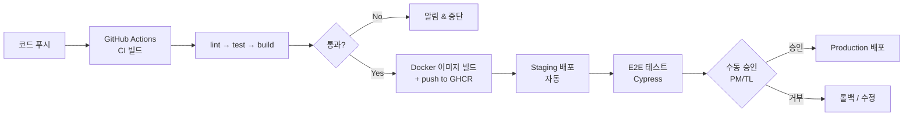
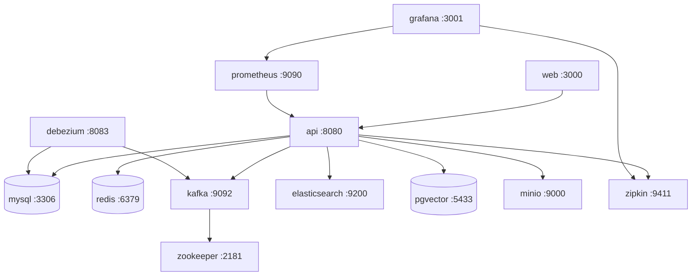
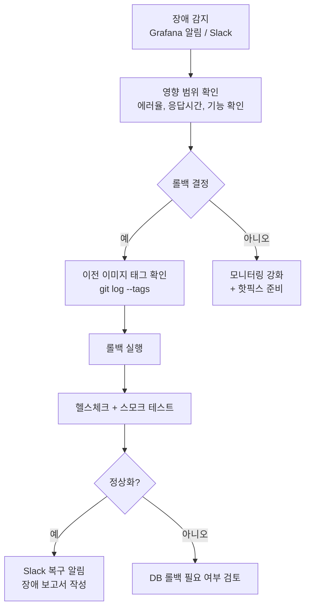
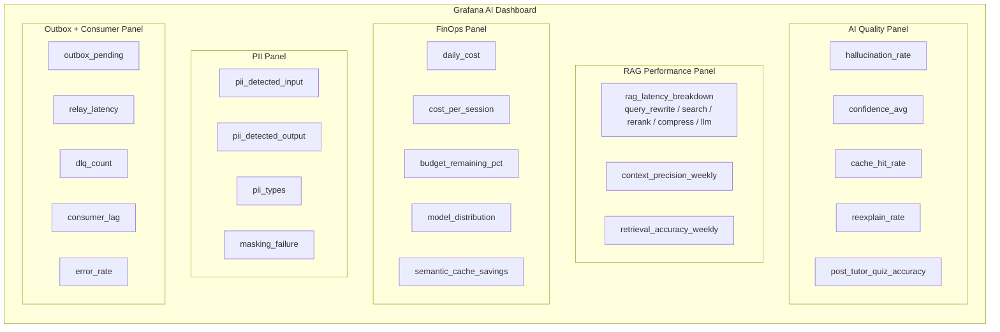

# LearnFlow AI 배포 가이드

## 목차

1. [배포 환경 정보](#1-배포-환경-정보)
2. [서비스 목록 (13개)](#2-서비스-목록-13개)
3. [사전 준비사항](#3-사전-준비사항)
4. [환경별 설정](#4-환경별-설정)
5. [배포 절차](#5-배포-절차)
6. [CI/CD 파이프라인](#6-cicd-파이프라인)
7. [롤백 전략](#7-롤백-전략)
8. [배포 체크리스트](#8-배포-체크리스트)
9. [모니터링](#9-모니터링)
10. [장애 대응](#10-장애-대응)

---

## 1. 배포 환경 정보

| 환경 | 배포 방식 | URL | 배포 트리거 | 승인 |
|------|---------|-----|-----------|------|
| **Development** | Docker Compose (로컬) | http://localhost:8080 | 수동 | 불필요 |
| **Staging** | Docker + GitHub Actions | https://staging.learnflow.ai | `develop` 브랜치 머지 | 자동 |
| **Production** | Docker + GitHub Actions | https://api.learnflow.ai | `main` 브랜치 태그 (`v*.*.*`) | 수동 승인 필수 |

### 1.1 배포 파이프라인 개요



---

## 2. 서비스 목록 (13개)

LearnFlow AI는 총 13개 컨테이너 서비스로 구성된다.

| # | 서비스명 | 이미지 | 포트 | 역할 | 의존성 |
|---|---------|--------|------|------|--------|
| 1 | `api` | `ghcr.io/learnflow/api:{tag}` | 8080 | Spring Boot 4 백엔드 API | mysql, redis, kafka, elasticsearch |
| 2 | `web` | `ghcr.io/learnflow/web:{tag}` | 3000 | React 18 SPA 프론트엔드 | api |
| 3 | `mysql` | `mysql:8.0` | 3306 | 주 관계형 DB (Source of Truth) | — |
| 4 | `redis` | `redis:7-alpine` | 6379 | 세션, 캐시, Rate Limiting, PII 토큰 매핑 | — |
| 5 | `kafka` | `confluentinc/cp-kafka:7.5.0` | 9092 | 이벤트 메시징 (Outbox 릴레이) | zookeeper |
| 6 | `zookeeper` | `confluentinc/cp-zookeeper:7.5.0` | 2181 | Kafka 코디네이터 | — |
| 7 | `debezium` | `debezium/connect:2.5` | 8083 | CDC (MySQL binlog → Kafka 릴레이) | mysql, kafka |
| 8 | `pgvector` | `pgvector/pgvector:pg16` | 5433 | 벡터 DB (RAG 임베딩 저장) | — |
| 9 | `elasticsearch` | `elasticsearch:8.12.0` | 9200 | BM25 Hybrid Search | — |
| 10 | `minio` | `minio/minio` | 9000/9001 | 파일 스토리지 (강의 영상, 이미지) | — |
| 11 | `zipkin` | `openzipkin/zipkin` | 9411 | 분산 추적 (OTel) | — |
| 12 | `prometheus` | `prom/prometheus` | 9090 | 메트릭 수집 | api |
| 13 | `grafana` | `grafana/grafana` | 3001 | 모니터링 대시보드 (AI 전용 포함) | prometheus |

### 2.1 서비스 의존성 다이어그램



---

## 3. 사전 준비사항

### 3.1 필수 도구

| 도구 | 버전 | 용도 | 설치 확인 |
|------|------|------|---------|
| Docker | 25.x 이상 | 컨테이너 빌드/실행 | `docker --version` |
| Docker Compose | 2.x 이상 | 멀티 컨테이너 관리 | `docker compose version` |
| Java (JDK) | 21 (Temurin) | Gradle 빌드 | `java -version` |
| Gradle | 8.x (래퍼 사용) | 백엔드 빌드 | `./gradlew --version` |
| Node.js | 20.x LTS | 프론트엔드 빌드 | `node --version` |
| Git | 2.x 이상 | 소스 관리 | `git --version` |

### 3.2 GitHub Container Registry 인증

```bash
# GHCR 로그인 (CI에서는 GITHUB_TOKEN 자동 사용)
echo $GITHUB_TOKEN | docker login ghcr.io -u $GITHUB_USERNAME --password-stdin
```

### 3.3 필수 환경 변수 목록

| 변수명 | 설명 | 환경 | 필수 |
|--------|------|------|------|
| `SPRING_PROFILES_ACTIVE` | Spring 프로파일 (dev/staging/prod) | 전체 | Y |
| `DB_ROOT_PASSWORD` | MySQL root 비밀번호 | 전체 | Y |
| `DB_PASSWORD` | MySQL learnflow 사용자 비밀번호 | 전체 | Y |
| `JWT_SECRET` | JWT 서명 비밀키 (256bit 이상) | 전체 | Y |
| `JWT_EXPIRATION_MS` | Access Token 만료시간 (ms) | 전체 | Y |
| `CLAUDE_API_KEY` | Anthropic Claude API 키 | 전체 | Y |
| `OPENAI_API_KEY` | OpenAI GPT API 키 (Fallback) | 전체 | Y |
| `REDIS_PASSWORD` | Redis 비밀번호 | staging/prod | Y |
| `MINIO_ROOT_USER` | MinIO 관리자 계정 | 전체 | Y |
| `MINIO_ROOT_PASSWORD` | MinIO 관리자 비밀번호 | 전체 | Y |
| `GRAFANA_ADMIN_PASSWORD` | Grafana 관리자 비밀번호 | 전체 | Y |
| `FINOPS_SOFT_LIMIT_USD` | FinOps Soft Limit (일별, USD) | 전체 | Y |
| `FINOPS_HARD_LIMIT_USD` | FinOps Hard Limit (일별, USD) | 전체 | Y |
| `SLACK_WEBHOOK_URL` | FinOps/장애 알림 Slack Webhook | staging/prod | Y |
| `ELASTICSEARCH_PASSWORD` | ES 비밀번호 | staging/prod | N |

### 3.4 `.env` 파일 설정 (로컬 개발)

```bash
# .env (git 추적 제외 — .gitignore에 포함)
SPRING_PROFILES_ACTIVE=dev
DB_ROOT_PASSWORD=localroot1234
DB_PASSWORD=localpass1234
JWT_SECRET=localdevsecret_must_be_256bit_minimum_length
JWT_EXPIRATION_MS=86400000
CLAUDE_API_KEY=sk-ant-api03-...
OPENAI_API_KEY=sk-...
MINIO_ROOT_USER=minioadmin
MINIO_ROOT_PASSWORD=minioadmin123
GRAFANA_ADMIN_PASSWORD=grafanaadmin123
FINOPS_SOFT_LIMIT_USD=10
FINOPS_HARD_LIMIT_USD=20
```

> **보안 주의**: `.env` 파일은 절대 Git에 커밋하지 않는다. GitHub Secrets를 통해 CI/CD에 주입한다.

---

## 4. 환경별 설정

### 4.1 개발 환경 (dev)

`application-dev.yml` 주요 설정:

```yaml
# src/main/resources/application-dev.yml
spring:
  datasource:
    url: jdbc:mysql://localhost:3306/learnflow?useSSL=false
  jpa:
    show-sql: true
    hibernate:
      ddl-auto: validate  # Flyway가 마이그레이션 관리
  kafka:
    bootstrap-servers: localhost:9092

ai:
  tracing:
    sampling-rate: 1.0  # dev: 100% 샘플링
  finops:
    soft-limit-usd: ${FINOPS_SOFT_LIMIT_USD:10}
    hard-limit-usd: ${FINOPS_HARD_LIMIT_USD:20}

logging:
  level:
    com.learnflow: DEBUG
    org.springframework.security: DEBUG
```

### 4.2 스테이징 환경 (staging)

`application-staging.yml` 주요 설정:

```yaml
# src/main/resources/application-staging.yml
spring:
  datasource:
    url: jdbc:mysql://mysql:3306/learnflow
  jpa:
    show-sql: false
  kafka:
    bootstrap-servers: kafka:9092

ai:
  tracing:
    sampling-rate: 0.5  # staging: 50% 샘플링
  finops:
    soft-limit-usd: ${FINOPS_SOFT_LIMIT_USD:80}
    hard-limit-usd: ${FINOPS_HARD_LIMIT_USD:150}

logging:
  level:
    com.learnflow: INFO
```

### 4.3 프로덕션 환경 (prod)

`application-prod.yml` 주요 설정:

```yaml
# src/main/resources/application-prod.yml
spring:
  datasource:
    url: jdbc:mysql://mysql:3306/learnflow
    hikari:
      maximum-pool-size: 20
      minimum-idle: 5
  jpa:
    show-sql: false
  kafka:
    bootstrap-servers: kafka:9092

ai:
  tracing:
    sampling-rate: 0.1   # prod: 10% 샘플링 (에러 100%)
    error-sampling-rate: 1.0
  finops:
    soft-limit-usd: ${FINOPS_SOFT_LIMIT_USD:80}
    hard-limit-usd: ${FINOPS_HARD_LIMIT_USD:150}

logging:
  level:
    com.learnflow: WARN
    com.learnflow.ai: INFO  # AI 관련은 INFO 유지
```

### 4.4 환경별 Docker Compose 파일

| 파일명 | 용도 |
|--------|------|
| `docker-compose.yml` | 개발 환경 (전체 스택) |
| `docker-compose.staging.yml` | 스테이징 환경 오버라이드 |
| `docker-compose.prod.yml` | 프로덕션 환경 오버라이드 |

---

## 5. 배포 절차

### 5.1 개발 환경 배포 (Docker Compose)

```bash
# 1. 소스 클론
git clone https://github.com/learnflow-ai/learnflow.git
cd learnflow

# 2. 환경 변수 파일 생성
cp .env.example .env
# .env 파일 편집 (필수 값 입력)

# 3. 백엔드 빌드
./gradlew bootJar

# 4. 프론트엔드 빌드
cd learnflow-web && npm install && npm run build && cd ..

# 5. 전체 서비스 시작
docker compose up -d

# 6. 서비스 상태 확인
docker compose ps

# 7. API 헬스체크
curl http://localhost:8080/actuator/health
```

### 5.2 개발 환경 — 서비스별 재빌드

```bash
# API 서버만 재빌드 및 재시작
./gradlew bootJar
docker compose up -d --build api

# 웹만 재빌드
cd learnflow-web && npm run build && cd ..
docker compose up -d --build web

# 전체 재시작 (데이터 유지)
docker compose restart

# 전체 재시작 (데이터 초기화 포함)
docker compose down -v
docker compose up -d
```

### 5.3 Debezium 커넥터 등록 (최초 1회)

```bash
# Debezium MySQL Connector 등록
curl -X POST http://localhost:8083/connectors \
  -H "Content-Type: application/json" \
  -d @infra/debezium/mysql-connector.json

# 커넥터 상태 확인
curl http://localhost:8083/connectors/learnflow-mysql-connector/status
```

### 5.4 스테이징 배포 (GitHub Actions 자동)

`develop` 브랜치에 머지되면 자동 실행:

1. CI 파이프라인 실행 (lint → test → build)
2. Docker 이미지 빌드 및 GHCR 푸시 (`latest` + `commit-sha`)
3. Staging 서버에 `docker compose pull && docker compose up -d`
4. E2E 테스트 자동 실행 (Cypress)
5. Slack 배포 완료 알림

### 5.5 프로덕션 배포 (수동 승인)

```mermaid
flowchart TD
    A[release/* 브랜치 생성\ngit checkout -b release/1.3.0] --> B[버전 번호 업데이트\nbuild.gradle.kts version = "1.3.0"]
    B --> C[CHANGELOG.md 업데이트]
    C --> D[PR 생성\nrelease/1.3.0 → main]
    D --> E[CI 자동 실행\n+ 리뷰어 2명 승인]
    E --> F[main 머지]
    F --> G[태그 생성\ngit tag -a v1.3.0]
    G --> H[GitHub Actions\nProduction 배포 트리거]
    H --> I[PM/TL 수동 승인\nGitHub Environments]
    I --> J[Docker 이미지 빌드\nversion 태그]
    J --> K[Production 배포\ndocker compose up -d]
    K --> L[헬스체크 + 스모크 테스트]
    L --> M[Slack 배포 완료 알림]
```

**프로덕션 배포 명령 (수동 실행 시)**

```bash
# 이미지 태그 지정 배포
export API_TAG=v1.3.0
export WEB_TAG=v1.3.0

docker compose -f docker-compose.yml -f docker-compose.prod.yml pull
docker compose -f docker-compose.yml -f docker-compose.prod.yml up -d \
  --no-deps api web

# Flyway 마이그레이션 자동 실행 (앱 시작 시)
# 확인: docker compose logs api | grep -i flyway
```

---

## 6. CI/CD 파이프라인

### 6.1 GitHub Actions 워크플로우

```yaml
# .github/workflows/deploy.yml
name: Deploy

on:
  push:
    branches: [develop]      # Staging 자동 배포
    tags: ['v*.*.*']         # Production 배포 트리거

jobs:
  build-and-push:
    runs-on: ubuntu-latest
    steps:
      - uses: actions/checkout@v4

      - name: Set up JDK 21
        uses: actions/setup-java@v4
        with:
          java-version: '21'
          distribution: 'temurin'

      - name: Build with Gradle
        run: ./gradlew bootJar

      - name: Set image tag
        id: tag
        run: |
          if [[ $GITHUB_REF == refs/tags/* ]]; then
            echo "tag=${GITHUB_REF#refs/tags/}" >> $GITHUB_OUTPUT
          else
            echo "tag=${GITHUB_SHA::8}" >> $GITHUB_OUTPUT
          fi

      - name: Login to GHCR
        uses: docker/login-action@v3
        with:
          registry: ghcr.io
          username: ${{ github.actor }}
          password: ${{ secrets.GITHUB_TOKEN }}

      - name: Build and push API image
        uses: docker/build-push-action@v5
        with:
          context: ./learnflow-api
          push: true
          tags: |
            ghcr.io/learnflow/api:latest
            ghcr.io/learnflow/api:${{ steps.tag.outputs.tag }}

  deploy-staging:
    needs: build-and-push
    if: github.ref == 'refs/heads/develop'
    runs-on: ubuntu-latest
    environment: staging
    steps:
      - name: Deploy to Staging
        env:
          API_TAG: ${{ needs.build-and-push.outputs.tag }}
        run: |
          ssh ${{ secrets.STAGING_HOST }} "
            cd /opt/learnflow &&
            export API_TAG=$API_TAG &&
            docker compose -f docker-compose.yml -f docker-compose.staging.yml pull api web &&
            docker compose -f docker-compose.yml -f docker-compose.staging.yml up -d api web
          "

  e2e-staging:
    needs: deploy-staging
    runs-on: ubuntu-latest
    steps:
      - uses: actions/checkout@v4
      - name: Run E2E Tests
        run: npx cypress run --config baseUrl=https://staging.learnflow.ai

  deploy-production:
    needs: [build-and-push, e2e-staging]
    if: startsWith(github.ref, 'refs/tags/v')
    runs-on: ubuntu-latest
    environment:
      name: production
      url: https://api.learnflow.ai
    steps:
      - name: Deploy to Production
        env:
          API_TAG: ${{ github.ref_name }}
        run: |
          ssh ${{ secrets.PROD_HOST }} "
            cd /opt/learnflow &&
            export API_TAG=$API_TAG &&
            docker compose -f docker-compose.yml -f docker-compose.prod.yml pull api web &&
            docker compose -f docker-compose.yml -f docker-compose.prod.yml up -d api web
          "
```

### 6.2 Docker Compose 전체 설정 (개발)

```yaml
# docker-compose.yml
version: '3.8'

services:
  api:
    build:
      context: ./learnflow-api
      dockerfile: Dockerfile
    image: ghcr.io/learnflow/api:${API_TAG:-latest}
    ports:
      - "8080:8080"
    depends_on:
      mysql:
        condition: service_healthy
      redis:
        condition: service_healthy
      kafka:
        condition: service_started
      elasticsearch:
        condition: service_healthy
    environment:
      SPRING_PROFILES_ACTIVE: ${SPRING_PROFILES_ACTIVE:-dev}
      CLAUDE_API_KEY: ${CLAUDE_API_KEY}
      OPENAI_API_KEY: ${OPENAI_API_KEY}
      JWT_SECRET: ${JWT_SECRET}
      DB_PASSWORD: ${DB_PASSWORD}
      FINOPS_SOFT_LIMIT_USD: ${FINOPS_SOFT_LIMIT_USD:-80}
      FINOPS_HARD_LIMIT_USD: ${FINOPS_HARD_LIMIT_USD:-150}
    healthcheck:
      test: ["CMD", "curl", "-f", "http://localhost:8080/actuator/health"]
      interval: 30s
      timeout: 10s
      retries: 5

  web:
    build: ./learnflow-web
    image: ghcr.io/learnflow/web:${WEB_TAG:-latest}
    ports:
      - "3000:3000"
    environment:
      VITE_API_URL: http://localhost:8080

  mysql:
    image: mysql:8.0
    ports:
      - "3306:3306"
    volumes:
      - mysql-data:/var/lib/mysql
    environment:
      MYSQL_ROOT_PASSWORD: ${DB_ROOT_PASSWORD}
      MYSQL_DATABASE: learnflow
      MYSQL_USER: learnflow
      MYSQL_PASSWORD: ${DB_PASSWORD}
    healthcheck:
      test: ["CMD", "mysqladmin", "ping", "-h", "localhost"]
      interval: 10s
      timeout: 5s
      retries: 10

  redis:
    image: redis:7-alpine
    ports:
      - "6379:6379"
    volumes:
      - redis-data:/data
    command: redis-server --appendonly yes
    healthcheck:
      test: ["CMD", "redis-cli", "ping"]
      interval: 10s
      timeout: 5s
      retries: 5

  zookeeper:
    image: confluentinc/cp-zookeeper:7.5.0
    ports:
      - "2181:2181"
    environment:
      ZOOKEEPER_CLIENT_PORT: 2181
      ZOOKEEPER_TICK_TIME: 2000

  kafka:
    image: confluentinc/cp-kafka:7.5.0
    ports:
      - "9092:9092"
    depends_on:
      - zookeeper
    environment:
      KAFKA_BROKER_ID: 1
      KAFKA_ZOOKEEPER_CONNECT: zookeeper:2181
      KAFKA_ADVERTISED_LISTENERS: PLAINTEXT://localhost:9092,PLAINTEXT_INTERNAL://kafka:29092
      KAFKA_LISTENER_SECURITY_PROTOCOL_MAP: PLAINTEXT:PLAINTEXT,PLAINTEXT_INTERNAL:PLAINTEXT
      KAFKA_INTER_BROKER_LISTENER_NAME: PLAINTEXT_INTERNAL
      KAFKA_OFFSETS_TOPIC_REPLICATION_FACTOR: 1
      KAFKA_AUTO_CREATE_TOPICS_ENABLE: "true"

  debezium:
    image: debezium/connect:2.5
    ports:
      - "8083:8083"
    depends_on:
      - mysql
      - kafka
    environment:
      BOOTSTRAP_SERVERS: kafka:29092
      GROUP_ID: learnflow-debezium
      CONFIG_STORAGE_TOPIC: debezium.config
      OFFSET_STORAGE_TOPIC: debezium.offset
      STATUS_STORAGE_TOPIC: debezium.status

  pgvector:
    image: pgvector/pgvector:pg16
    ports:
      - "5433:5432"
    volumes:
      - pgvector-data:/var/lib/postgresql/data
    environment:
      POSTGRES_DB: learnflow_vector
      POSTGRES_USER: learnflow
      POSTGRES_PASSWORD: ${DB_PASSWORD}

  elasticsearch:
    image: elasticsearch:8.12.0
    ports:
      - "9200:9200"
    environment:
      discovery.type: single-node
      xpack.security.enabled: "false"
      ES_JAVA_OPTS: "-Xms512m -Xmx512m"
    volumes:
      - es-data:/usr/share/elasticsearch/data
    healthcheck:
      test: ["CMD-SHELL", "curl -f http://localhost:9200/_cluster/health || exit 1"]
      interval: 30s
      timeout: 10s
      retries: 10

  minio:
    image: minio/minio
    ports:
      - "9000:9000"
      - "9001:9001"
    command: server /data --console-address ":9001"
    volumes:
      - minio-data:/data
    environment:
      MINIO_ROOT_USER: ${MINIO_ROOT_USER}
      MINIO_ROOT_PASSWORD: ${MINIO_ROOT_PASSWORD}

  zipkin:
    image: openzipkin/zipkin
    ports:
      - "9411:9411"

  prometheus:
    image: prom/prometheus
    ports:
      - "9090:9090"
    volumes:
      - ./infra/prometheus/prometheus.yml:/etc/prometheus/prometheus.yml

  grafana:
    image: grafana/grafana
    ports:
      - "3001:3000"
    environment:
      GF_SECURITY_ADMIN_PASSWORD: ${GRAFANA_ADMIN_PASSWORD}
    volumes:
      - grafana-data:/var/lib/grafana
      - ./infra/grafana/dashboards:/etc/grafana/provisioning/dashboards
      - ./infra/grafana/datasources:/etc/grafana/provisioning/datasources

volumes:
  mysql-data:
  redis-data:
  pgvector-data:
  es-data:
  minio-data:
  grafana-data:
```

---

## 7. 롤백 전략

### 7.1 롤백 결정 기준

| 상황 | 롤백 결정자 | 롤백 시점 |
|------|----------|---------|
| 에러율 > 5% (5분 이상) | 온콜 엔지니어 자율 판단 | 즉시 |
| P95 응답시간 > 3x 기준치 | 온콜 엔지니어 자율 판단 | 즉시 |
| Critical 기능 불가 | PM/TL 승인 후 | 10분 이내 |
| 데이터 정합성 손상 | CTO/TL 승인 후 | 즉시 |

### 7.2 롤백 절차



### 7.3 애플리케이션 롤백 명령

```bash
# 1. 이전 배포 태그 확인
git tag --sort=-version:refname | head -5
# v1.3.0
# v1.2.1
# v1.2.0

# 2. API 서버 롤백 (이전 버전 이미지 지정)
export API_TAG=v1.2.1
docker compose -f docker-compose.yml -f docker-compose.prod.yml \
  pull api && \
  docker compose -f docker-compose.yml -f docker-compose.prod.yml \
  up -d --no-deps api

# 3. 헬스체크 확인
curl https://api.learnflow.ai/actuator/health

# 4. 로그 확인
docker compose logs api --tail=100 -f
```

### 7.4 DB 마이그레이션 롤백

Flyway는 기본적으로 undo 마이그레이션을 지원하지 않는다. 아래 절차를 따른다:

```bash
# 1. Flyway 마이그레이션 이력 확인
docker compose exec api ./gradlew flywayInfo

# 2. 수동 롤백 스크립트 실행 (사전 준비된 undo 스크립트)
# db/migration/undo/U{버전}__{설명}.sql
docker compose exec mysql mysql -u learnflow -p learnflow < db/undo/U1.3.0__rollback.sql

# 3. 이전 앱 버전 배포
export API_TAG=v1.2.1
docker compose up -d --no-deps api
```

> **원칙**: DB 스키마 변경은 항상 하위 호환성을 유지한다. 컬럼 삭제 대신 `deprecated` 표시 후 다음 버전에서 제거.

---

## 8. 배포 체크리스트

### 8.1 배포 전 체크리스트

**공통**
- [ ] 모든 CI 테스트 통과 확인 (lint, unit, integration)
- [ ] CHANGELOG.md 업데이트 완료
- [ ] 환경 변수 설정 확인 (신규 변수 누락 없음)
- [ ] DB 마이그레이션 스크립트 검토 (V{n}__{설명}.sql 순서 확인)
- [ ] Flyway 마이그레이션 하위 호환성 확인
- [ ] 배포 일정 팀 공유 (Slack #배포 채널)

**Staging 배포 전 추가**
- [ ] Staging 환경 Docker Compose 헬스체크 통과
- [ ] E2E 테스트 시나리오 실행 계획 확인

**Production 배포 전 추가**
- [ ] Staging 환경에서 최소 24시간 검증 완료
- [ ] PM/TL 배포 승인 획득
- [ ] 배포 시간: 피크 시간대 회피 (오전 2~6시 권장)
- [ ] 온콜 담당자 대기 확인
- [ ] 이전 버전 이미지 태그 메모 (롤백 준비)
- [ ] Grafana 알림 임계값 일시 조정 (배포 중 false positive 방지)

### 8.2 배포 후 체크리스트

**즉시 (5분 이내)**
- [ ] API 헬스체크 통과: `GET /actuator/health` → `{"status":"UP"}`
- [ ] Flyway 마이그레이션 성공 로그 확인
- [ ] Kafka Consumer Group 재연결 확인
- [ ] Debezium 커넥터 상태 확인: `GET /connectors/{name}/status`

**단기 (15분 이내)**
- [ ] 핵심 기능 스모크 테스트
  - [ ] 로그인 / JWT 발급
  - [ ] 강의 목록 조회
  - [ ] AI 튜터 응답 (샘플 질문 1건)
  - [ ] 퀴즈 제출 (샘플)
- [ ] Grafana 에러율 정상 범위 확인 (< 1%)
- [ ] P95 응답시간 정상 범위 확인 (< 500ms)

**중기 (1시간 이내)**
- [ ] Outbox 이벤트 적체 없음 확인 (Grafana outbox_pending ≈ 0)
- [ ] Kafka Consumer Lag 정상 확인 (< 100)
- [ ] FinOps 비용 모니터링 정상
- [ ] PII 마스킹 에러 없음 확인
- [ ] Slack 배포 완료 공지

---

## 9. 모니터링

### 9.1 Grafana AI 전용 대시보드

Grafana (`http://grafana:3001`) 에 AI 전용 대시보드를 운영한다.



### 9.2 알림 임계값

| 패널 | 메트릭 | 경고 임계값 | 심각 임계값 | 알림 채널 |
|------|--------|-----------|-----------|---------|
| AI Quality | `hallucination_rate` | > 10% | > 20% | #ai-quality |
| AI Quality | `cache_hit_rate` | < 30% | < 20% | #ai-quality |
| RAG Performance | `rag_p95_latency` | > 3,000ms | > 5,000ms | #backend |
| FinOps | `daily_cost_usd` | > $80 (Soft) | > $150 (Hard) | #finops + Slack |
| PII | `pii_detected_output` | > 0건 | — | #security (즉시) |
| PII | `masking_failure` | > 0건 | > 5건 | #security |
| Outbox | `outbox_pending` | > 1,000건 | > 5,000건 | #backend |
| Outbox | `dlq_count` | > 0건 | > 10건 | #backend |
| Consumer | `consumer_lag` | > 500 | > 2,000 | #backend |
| System | `api_error_rate` | > 1% | > 5% | #backend |
| System | `p95_response_time` | > 500ms | > 1,000ms | #backend |

### 9.3 Prometheus 메트릭 설정

```yaml
# infra/prometheus/prometheus.yml
global:
  scrape_interval: 15s
  evaluation_interval: 15s

scrape_configs:
  - job_name: 'learnflow-api'
    metrics_path: '/actuator/prometheus'
    static_configs:
      - targets: ['api:8080']

  - job_name: 'kafka'
    static_configs:
      - targets: ['kafka:9092']

  - job_name: 'zipkin'
    static_configs:
      - targets: ['zipkin:9411']
```

### 9.4 Zipkin 분산 추적 확인

```bash
# Zipkin UI: http://zipkin:9411

# AI 튜터 응답 전체 Trace 조회 (최근 1시간)
curl "http://zipkin:9411/api/v2/traces?serviceName=learnflow-api&spanName=ai-tutor-chat&limit=20"

# 특정 TraceID의 전체 스팬 조회
curl "http://zipkin:9411/api/v2/trace/{traceId}"
```

---

## 10. 장애 대응

### 10.1 서비스별 장애 대응

**API 서버 장애**
```bash
# 1. 로그 확인
docker compose logs api --tail=200 -f

# 2. 메모리/CPU 확인
docker stats api

# 3. 재시작 (일시적 장애)
docker compose restart api

# 4. 복구 안될 경우 이전 버전 롤백 (7.3절 참조)
```

**Kafka 장애**
```bash
# 1. Kafka 상태 확인
docker compose exec kafka kafka-topics.sh --bootstrap-server localhost:9092 --list

# 2. Kafka 재시작 (Outbox 이벤트는 DB에 보존됨)
docker compose restart kafka

# 3. Consumer Group 리밸런싱 확인
docker compose exec kafka kafka-consumer-groups.sh \
  --bootstrap-server localhost:9092 --describe --all-groups
```

**LLM API 장애**
```bash
# Circuit Breaker 상태 확인 (Resilience4j)
curl http://localhost:8080/actuator/circuitbreakers

# Fallback (OpenAI GPT)으로 자동 전환 — 로그 확인
docker compose logs api | grep -i "fallback\|circuit"

# 수동 Fallback 강제 (환경 변수)
docker compose exec api env LLM_PRIMARY_DISABLED=true ...
```

**FinOps Kill-switch 활성화 시**
```bash
# Kill-switch 상태 확인
curl http://localhost:8080/api/v1/admin/finops/dashboard \
  -H "Authorization: Bearer $ADMIN_TOKEN"

# 수동 해제 (Admin API)
curl -X PUT http://localhost:8080/api/v1/admin/finops/kill-switch \
  -H "Authorization: Bearer $ADMIN_TOKEN" \
  -d '{"killed": false}'
```

### 10.2 장애 등급별 대응 SLA

| 등급 | 기준 | 탐지 방법 | 최초 대응 | 복구 목표 |
|------|------|---------|---------|---------|
| P1 (긴급) | 핵심 기능 불가, PII 유출, 보안 사고 | Grafana 알림, 사용자 신고 | 15분 이내 | 2시간 이내 |
| P2 (높음) | 에러율 > 5%, AI 응답 불가 | Grafana 알림 | 30분 이내 | 4시간 이내 |
| P3 (중간) | 일부 기능 저하, 성능 저하 | Grafana 경고 | 2시간 이내 | 다음 영업일 |
| P4 (낮음) | 사소한 버그, UI 오류 | 사용자 신고 | 다음 영업일 | 다음 Sprint |

---

## 변경 이력

| 버전 | 날짜 | 작성자 | 변경 내용 |
|------|------|--------|-----------|
| v5.0 | 2026-04-02 | DevOps팀 | v4.0 기준 전면 개정. 13개 서비스 목록 확정, Docker Compose 전체 설정 포함, 환경별(dev/staging/prod) application-{env}.yml 상세화, Grafana AI 전용 대시보드(5개 패널) 명세, 롤백 절차 상세화, 장애 대응 SLA 추가 |
| v4.0 | 2026-01-15 | DevOps팀 | Debezium CDC 설정 추가, Grafana AI 대시보드 초안 |
| v3.0 | 2025-10-01 | DevOps팀 | Kafka, pgvector, Elasticsearch 서비스 추가 |
| v2.0 | 2025-08-01 | DevOps팀 | GitHub Actions CI/CD 도입 |
| v1.0 | 2025-07-01 | DevOps팀 | 최초 작성 |
