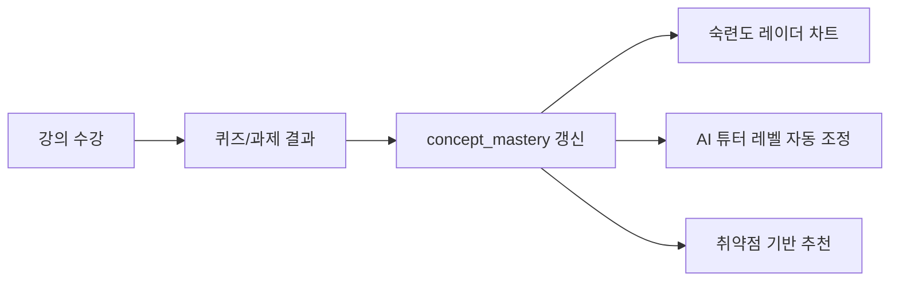
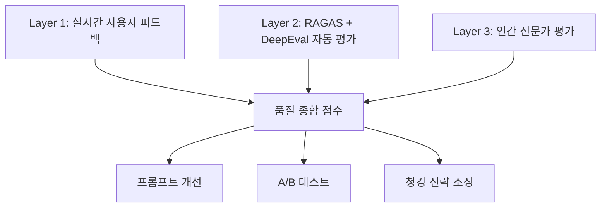

# LearnFlow AI 사용자 매뉴얼

## 목차

1. [소개](#1-소개)
2. [시스템 요구사항](#2-시스템-요구사항)
3. [시작하기](#3-시작하기)
4. [학습자 기능 가이드](#4-학습자-기능-가이드)
5. [강사 기능 가이드](#5-강사-기능-가이드)
6. [관리자 기능 가이드](#6-관리자-기능-가이드)
7. [모바일 앱 가이드](#7-모바일-앱-가이드)
8. [자주 묻는 질문 (FAQ)](#8-자주-묻는-질문-faq)
9. [문제 해결](#9-문제-해결)
10. [단축키 및 편의 기능](#10-단축키-및-편의-기능)
11. [용어 사전](#11-용어-사전)
12. [지원 및 문의](#12-지원-및-문의)
13. [변경 이력](#13-변경-이력)

---

## 1. 소개

### 1.1 문서 목적

이 매뉴얼은 LearnFlow AI — AI 기반 적응형 학습 관리 시스템의 최종 사용자를 위한 기능 사용 가이드이다. 학습자, 강사, 관리자 각 역할에 맞는 기능 사용 절차와 주의사항을 상세히 안내한다.

### 1.2 LearnFlow AI 소개

LearnFlow AI는 LLM(대형 언어 모델) 기반 AI 튜터, 적응형 학습 경로, 자동 퀴즈 생성·채점, 학습 분석 대시보드를 통해 개인화된 학습 경험을 제공하는 플랫폼이다. 학습자의 숙련도(concept_mastery)와 취약점을 실시간으로 분석하여 맞춤형 콘텐츠와 피드백을 제공한다.

### 1.3 대상 독자

| 역할 | 설명 | 참조 섹션 |
|------|------|-----------|
| **학습자 (Learner)** | 강의를 수강하고 AI 튜터·퀴즈·과제를 활용하는 사용자 | 섹션 3, 4, 7 |
| **강사 (Instructor)** | 강의를 생성·관리하고 수강생 학습 현황을 분석하는 사용자 | 섹션 3, 5, 7 |
| **관리자 (Admin)** | 시스템 전반을 운영하고 AI 품질·비용을 관리하는 운영자 | 섹션 3, 6 |

---

## 2. 시스템 요구사항

### 2.1 웹 브라우저

| 항목 | 최소 사양 | 권장 사양 |
|------|----------|----------|
| Chrome | 90 이상 | 최신 버전 |
| Firefox | 88 이상 | 최신 버전 |
| Safari | 14 이상 | 최신 버전 |
| Edge | 90 이상 | 최신 버전 |
| 해상도 | 1280 × 720 | 1920 × 1080 |
| 네트워크 | 5 Mbps | 20 Mbps 이상 |

> **주의**: Internet Explorer는 지원하지 않는다.

### 2.2 모바일 앱

| 항목 | 최소 사양 | 권장 사양 |
|------|----------|----------|
| iOS | 15.0 이상 | 최신 버전 |
| Android | 12 이상 | 최신 버전 |
| 저장 공간 | 500 MB 여유 | 2 GB 이상 |
| 네트워크 | LTE / Wi-Fi | Wi-Fi 권장 (영상 수강 시) |

### 2.3 지원 기능 비교

| 기능 | 웹 (PC) | 모바일 앱 |
|------|---------|---------|
| 강의 수강 (영상) | ✓ | ✓ |
| AI 튜터 채팅 | ✓ | ✓ |
| 퀴즈 풀기 | ✓ | ✓ |
| 과제 제출 | ✓ | ✓ (텍스트 한정) |
| 학습 분석 대시보드 | ✓ | ✓ (요약) |
| 강의 생성 (강사) | ✓ | 제한적 |
| AI 품질 대시보드 (관리자) | ✓ | ✗ |

---

## 3. 시작하기

### 3.1 회원가입

1. 웹 브라우저에서 `https://learnflow.ai`에 접속한다.
2. 우측 상단 **[회원가입]** 버튼을 클릭한다.
3. 역할을 선택한다: **학습자** / **강사** (관리자는 별도 초대).
4. 이메일, 비밀번호(8자 이상, 영문+숫자+특수문자), 이름을 입력한다.
5. **[회원가입 완료]** 클릭 후, 등록된 이메일로 발송된 인증 메일의 링크를 클릭하여 이메일 인증을 완료한다.
6. 인증 완료 후 자동으로 로그인 페이지로 이동한다.

> **팁**: 기업/기관 소속인 경우 SSO 로그인을 이용하면 별도 가입 없이 접속할 수 있다. 관리자에게 SSO 설정 여부를 문의한다.

### 3.2 로그인

#### 3.2.1 이메일/비밀번호 로그인

1. 로그인 페이지에서 이메일과 비밀번호를 입력한다.
2. **[로그인]** 버튼을 클릭한다.
3. JWT 토큰이 발급되며 대시보드로 이동한다. 토큰 유효 시간은 24시간이며, 자동 갱신(Refresh Token)이 적용된다.

#### 3.2.2 SSO 로그인 (기업/기관)

1. 로그인 페이지에서 **[조직 계정으로 로그인]**을 클릭한다.
2. 소속 기관의 IdP(Identity Provider) 화면으로 리다이렉트된다.
3. 기관 계정 자격증명을 입력하면 LearnFlow AI로 자동 복귀하여 로그인이 완료된다.

#### 3.2.3 2단계 인증 (2FA) 설정 및 사용

2FA를 활성화하면 로그인 시 추가 인증 코드를 요구한다.

**설정 방법:**
1. 우측 상단 프로필 아이콘 → **[계정 설정]** → **[보안]** 탭으로 이동한다.
2. **[2단계 인증 활성화]** 를 클릭하고 인증 앱(Google Authenticator, Authy 등)으로 QR 코드를 스캔한다.
3. 인증 앱에 표시된 6자리 코드를 입력하여 설정을 완료한다.

**로그인 시 사용:**
- 이메일/비밀번호 입력 후 인증 앱의 6자리 OTP 코드를 입력한다.
- OTP 코드는 30초마다 갱신된다.

### 3.3 초기 설정 (학습자 전용)

첫 로그인 시 온보딩 마법사가 자동으로 실행된다.

#### 3.3.1 학습 선호도 설정

| 항목 | 선택지 | 설명 |
|------|--------|------|
| 학습 속도 | 느리게 / 보통 / 빠르게 | 콘텐츠 추천 밀도 조정 |
| 일일 학습 목표 | 15 / 30 / 60 / 90분 | 학습 리마인더 기준 |
| 관심 분야 | 프로그래밍, 데이터, 디자인 외 다수 | AI 강의 추천 기반 |
| 학습 난이도 선호 | 입문 / 초급 / 중급 / 고급 | 초기 콘텐츠 필터 |

#### 3.3.2 온보딩 — 수준 진단

설정 완료 후 수강 신청한 강의에 대해 수준 진단이 제공된다.

**옵션 A: 진단 테스트 (권장, 3~5분)**
- 5문항(Bloom's Taxonomy 배분: 기억·이해·적용·분석·평가)을 풀면 개념별 초기 숙련도(mastery)가 산출된다.
- 결과 신뢰도(confidence = 0.7)가 높아 AI 튜터 레벨이 빠르게 최적화된다.

**옵션 B: 자가 진단 (30초)**
- 입문 / 초급 / 중급 / 고급 중 자신의 수준을 직접 선택한다.
- 신뢰도(confidence = 0.3)가 낮으므로 초기 퀴즈를 통해 빠르게 보정이 이루어진다.

> **팁**: 진단 테스트를 완료하면 AI 튜터가 처음부터 적절한 수준으로 응답하여 학습 효율이 높아진다.

---

## 4. 학습자 기능 가이드

### 4.1 학습자 대시보드

로그인 후 표시되는 메인 화면이다.

| 영역 | 내용 |
|------|------|
| **학습 현황** | 수강 중인 강의 목록, 각 강의별 진도율 |
| **오늘의 학습 목표** | 일일 목표 달성률 및 남은 학습 시간 |
| **AI 추천 콘텐츠** | 취약점 분석 기반 추천 레슨·퀴즈 |
| **최근 활동** | 최근 학습한 레슨, 제출한 퀴즈 결과 |
| **성취 배지** | 획득한 배지 및 경험치(EXP) 현황 |

### 4.2 강의 탐색 및 수강 신청

1. 상단 메뉴에서 **[강의 탐색]**을 클릭한다.
2. 카테고리, 난이도, 키워드로 강의를 검색·필터링한다.
3. 강의 카드를 클릭하여 상세 정보(커리큘럼, 강사 프로필, 수강생 리뷰, 평점)를 확인한다.
4. **[수강 신청]** 버튼을 클릭하면 즉시 수강이 시작된다.
5. 수강 신청 완료 후 대시보드의 **[내 강의]**에서 확인할 수 있다.

### 4.3 레슨 학습 (영상 + 노트)

1. **[내 강의]**에서 수강 중인 강의를 선택한다.
2. 섹션 목록에서 학습할 레슨을 선택한다.
3. 레슨 화면 구성:

| 영역 | 설명 |
|------|------|
| **영상 플레이어** | 재생/일시정지, 배속(0.5x ~ 2.0x), 자막, 전체화면 지원 |
| **노트 패널** | 마크다운 지원 노트 작성; 타임스탬프 연동 가능 |
| **AI 요약 탭** | 현재 레슨의 AI 자동 요약 (핵심 개념 3~5개) |
| **플래시카드 탭** | AI가 생성한 핵심 개념 플래시카드 (앞면: 질문, 뒷면: 설명) |
| **AI 튜터 버튼** | 우하단 채팅 아이콘 클릭 → AI 튜터 패널 열림 |

4. 영상을 80% 이상 시청하면 레슨이 **완료** 처리되고 진도율이 갱신된다.

> **팁**: 노트 작성 중 `@타임스탬프` 형식으로 입력하면 해당 영상 시점으로 바로 이동할 수 있다.

### 4.4 AI 튜터 채팅

AI 튜터는 현재 수강 중인 강의 내용을 기반으로 질문에 답변한다(RAG 기반, course_id 격리).

#### 4.4.1 AI 튜터 시작

1. 레슨 화면 우하단 채팅 아이콘(💬)을 클릭하거나, 상단 메뉴 **[AI 튜터]**에 접속한다.
2. 채팅창 하단 입력창에 질문을 입력하고 **[전송]** 또는 `Enter`를 누른다.
3. AI가 스트리밍 방식으로 실시간 답변을 생성한다.

#### 4.4.2 추천 질문 (Suggested Questions)

AI 튜터는 현재 레슨 내용과 학습자의 취약점을 바탕으로 추천 질문 3개를 자동 제공한다. 추천 질문 칩을 클릭하면 즉시 질문이 전송된다.

#### 4.4.3 AI 튜터 레벨링

AI 튜터는 학습자의 숙련도(concept_mastery)에 따라 응답 스타일이 자동 조정된다.

| 레벨 | 조건 | 응답 스타일 |
|------|------|------------|
| **Level 1 (초보)** | mastery 평균 < 0.4 | 비유와 그림 중심, 전문 용어에 쉬운 설명 추가 |
| **Level 2 (중급)** | 0.4 ≤ mastery < 0.7 | 개념 + 코드 예시, 원리 + 실무 실수 언급 |
| **Level 3 (고급)** | mastery ≥ 0.7 | 내부 구현, 소스 코드 레벨, 트레이드오프 비교 분석 |

#### 4.4.4 피드백 제공

각 AI 답변 하단의 👍 / 👎 버튼으로 응답 품질 피드백을 남길 수 있다. 이 피드백은 AI 품질 개선(3층 평가 체계)에 반영된다.

#### 4.4.5 메모리 범위

- **단기 메모리**: 현재 세션의 최근 10턴 대화 (세션 종료 후 24시간 유지)
- **장기 메모리**: 개념별 숙련도, 자주 틀리는 패턴, 선호 학습 스타일 (영구 보존)

> **주의**: AI 튜터는 수강 중인 강의 범위 내에서만 답변한다. 강의와 무관한 질문은 "수강 범위를 벗어난 질문입니다"라는 안내가 표시된다.

### 4.5 AI 요약 및 플래시카드

#### 4.5.1 레슨 AI 요약

레슨 화면의 **[AI 요약]** 탭에서 현재 레슨의 핵심 내용을 3~5개 항목으로 요약한 내용을 확인할 수 있다. 요약은 레슨 콘텐츠를 기반으로 자동 생성된다.

#### 4.5.2 플래시카드

레슨 화면의 **[플래시카드]** 탭에서 AI가 자동 생성한 핵심 개념 플래시카드를 학습할 수 있다.

- **앞면**: 핵심 개념 또는 질문
- **뒷면**: 개념 설명 또는 답변
- 카드를 클릭하면 앞/뒤가 뒤집어진다.
- **[다음]** / **[이전]** 버튼으로 카드를 탐색한다.
- **[알았어요]** / **[다시 볼게요]** 버튼으로 학습 상태를 표시하면 취약 카드가 우선 노출된다.

### 4.6 퀴즈 풀기

#### 4.6.1 퀴즈 시작

1. 레슨 화면의 **[퀴즈]** 버튼 또는 강의 상세 페이지의 퀴즈 목록에서 퀴즈를 선택한다.
2. 문제 수, 제한 시간, 난이도를 확인하고 **[시작]**을 클릭한다.
3. 각 문항에 답변을 선택/입력하고 **[다음]**을 누른다.
4. 마지막 문항에서 **[제출]**을 클릭한다.

#### 4.6.2 채점 결과 확인

제출 후 AI 자동 채점 결과 화면이 표시된다.

| 항목 | 내용 |
|------|------|
| **점수** | 획득 점수 / 만점 |
| **문항별 정오** | 각 문항의 정답 여부 및 AI 피드백 |
| **AI 해설** | 오답 문항에 대한 개념 설명 |
| **숙련도 갱신** | 해당 개념의 mastery 변화 표시 |

#### 4.6.3 Confidence Score와 Manual Review

AI 채점 시스템은 내부적으로 Confidence Score를 계산한다.
- **Confidence ≥ 0.8**: 자동 확정(CONFIRMED)으로 즉시 결과가 표시된다.
- **Confidence < 0.8**: 강사의 Manual Review Queue로 이관되며, 검토 완료 후 최종 점수가 확정된다. 이 경우 "검토 중" 상태로 표시된다.

### 4.7 과제 제출

1. 강의 상세 페이지의 **[과제]** 탭 또는 대시보드의 **[과제 목록]**에서 과제를 선택한다.
2. 과제 내용과 루브릭(채점 기준)을 확인한다.
3. 텍스트 에디터(마크다운 지원)에 과제를 작성하거나, 파일을 첨부한다.
4. **[제출]**을 클릭한다. 제출 후에는 마감 전이라도 재제출은 최대 3회로 제한된다.
5. AI 자동 채점 후 결과가 표시된다(Confidence < 0.8인 경우 강사 검토 후 확정).

#### 4.7.1 채점 결과 이의 제기 (Appeal)

채점 결과에 이의가 있을 경우, **채점 확정 후 7일 이내**에 이의를 제기할 수 있다.

1. 과제 결과 화면에서 **[이의 제기]** 버튼을 클릭한다.
2. 이의 제기 사유를 200자 이상 구체적으로 작성한다.
3. **[제출]**을 클릭하면 강사의 Manual Review Queue로 전달된다.
4. 강사 검토 후 최종 점수가 확정되면 이메일과 앱 알림으로 통보된다.

> **주의**: 이의 제기는 과제당 1회만 가능하다.

### 4.8 학습 분석 대시보드

좌측 메뉴 **[학습 분석]**에서 나의 학습 현황을 종합적으로 확인할 수 있다.

#### 4.8.1 숙련도 (Concept Mastery) 차트

- 개념별 숙련도를 레이더 차트(Spider Chart)로 시각화한다.
- 숙련도가 낮은 개념은 빨간색으로 강조 표시된다.

#### 4.8.2 취약점 분석

| 영역 | 설명 |
|------|------|
| **취약 개념 목록** | mastery 점수가 낮은 상위 5개 개념 |
| **오답 패턴** | 자주 틀리는 유형 분석 (선택지 혼동, 개념 혼동 등) |
| **학습 활동 히트맵** | 최근 30일간 일별 학습 시간 시각화 |
| **주간 학습 시간** | 요일별 학습 시간 막대 그래프 |

#### 4.8.3 AI 추천

취약점 분석 결과를 바탕으로 AI가 다음을 추천한다:
- **보충 레슨**: 취약 개념이 포함된 레슨
- **추천 퀴즈**: 취약 개념 집중 퀴즈
- **학습 경로 조정**: 다음 학습 순서 제안

---

## 5. 강사 기능 가이드

### 5.1 강사 대시보드

| 영역 | 내용 |
|------|------|
| **내 강의 현황** | 운영 중인 강의 목록, 수강생 수, 평균 평점 |
| **수강생 요약** | 전체 수강생의 진도율 분포, 평균 완료율 |
| **Manual Review Queue** | 검토 대기 중인 과제/퀴즈 목록 및 우선순위 |
| **최근 이의 제기** | 미처리 이의 제기 건수 및 마감 기한 |

### 5.2 강의 생성

1. 상단 메뉴 **[내 강의]** → **[새 강의 만들기]**를 클릭한다.
2. 강의 기본 정보를 입력한다:

| 항목 | 설명 | 필수 |
|------|------|------|
| 강의명 | 명확하고 검색 가능한 제목 | ✓ |
| 카테고리 | 프로그래밍, 데이터, 디자인 등 | ✓ |
| 난이도 | 입문 / 초급 / 중급 / 고급 | ✓ |
| 강의 소개 | 학습 목표, 대상 수강생, 커리큘럼 요약 | ✓ |
| 썸네일 이미지 | 16:9 비율, 최소 1280×720px | ✓ |
| 가격 | 무료 또는 유료 금액 설정 | ✓ |

3. **[다음]**을 클릭하여 커리큘럼 설계 단계로 이동한다.

### 5.3 섹션 및 레슨 추가

1. 커리큘럼 편집 화면에서 **[섹션 추가]**를 클릭하여 섹션(Chapter)을 생성한다.
2. 각 섹션 내 **[레슨 추가]**를 클릭하여 레슨을 추가한다.
3. 레슨 유형을 선택한다:

| 유형 | 설명 |
|------|------|
| **영상 레슨** | 동영상 파일 업로드 (MP4, MOV; 최대 4GB) |
| **텍스트 레슨** | 마크다운 에디터로 텍스트 콘텐츠 작성 |
| **자료 레슨** | PDF, 코드 파일 등 첨부 자료 제공 |

4. 레슨 업로드 후 AI가 자동으로 콘텐츠를 분석하여 임베딩(벡터화)을 생성한다. 이 과정은 백그라운드에서 처리되며 완료 시 알림이 발송된다.

> **팁**: 레슨 콘텐츠가 명확하고 구조화될수록 AI 튜터의 답변 품질이 향상된다. 핵심 용어를 명시적으로 포함하면 RAG 검색 정확도가 높아진다.

### 5.4 AI 퀴즈 자동 생성

1. 레슨 편집 화면에서 **[AI 퀴즈 생성]**을 클릭한다.
2. 생성 옵션을 설정한다:

| 옵션 | 선택지 |
|------|--------|
| 문항 수 | 5 / 10 / 15 / 20문항 |
| 난이도 | 기억 / 이해 / 적용 / 분석 / 평가 (Bloom's Taxonomy) |
| 유형 | 객관식 / 주관식 / 단답형 |

3. **[생성 시작]**을 클릭하면 AI가 레슨 콘텐츠를 기반으로 퀴즈를 생성한다 (약 30~60초 소요).
4. 생성된 퀴즈를 검토하여 필요한 문항을 수정·삭제·추가한다.
5. **[저장 및 게시]**를 클릭하면 수강생에게 제공된다.

### 5.5 과제 관리

1. **[내 강의]** → 해당 강의 → **[과제]** 탭으로 이동한다.
2. **[과제 추가]**를 클릭하여 과제를 생성한다:

| 항목 | 설명 |
|------|------|
| 과제 제목 | 명확한 과제명 |
| 과제 내용 | 마크다운으로 상세 지시사항 작성 |
| 루브릭(채점 기준) | 항목별 배점 명시 (AI 채점 정확도에 직접 영향) |
| 제출 마감일 | 날짜/시간 설정 |
| 최대 점수 | 100점 기준 권장 |
| 재제출 허용 횟수 | 0~3회 |

> **팁**: 루브릭을 구체적으로 작성할수록 AI 채점 Confidence Score가 높아져 자동 채점 비율이 증가한다.

### 5.6 Manual Review Queue 처리

AI 채점 Confidence < 0.8이거나 학습자가 이의를 제기한 경우, 강사의 Manual Review Queue에 항목이 추가된다.

1. 대시보드의 **[Manual Review Queue]** 또는 강의별 **[채점 관리]** 탭에서 대기 항목을 확인한다.
2. 각 항목에는 다음 정보가 표시된다:

| 정보 | 설명 |
|------|------|
| 학습자명 | 제출 학습자 |
| AI 점수 | AI가 부여한 점수 |
| Confidence Score | AI 채점 신뢰도 |
| AI 피드백 | AI의 채점 근거 |
| 이의 제기 사유 | (이의 제기 건의 경우) 학습자 작성 내용 |

3. 제출 내용과 루브릭을 검토한 후 **최종 점수**와 **피드백**을 입력한다.
4. **[확정]**을 클릭하면 학습자에게 결과가 통보된다.

> **팁**: SLA 기준 이의 제기 건은 **접수 후 5일 이내** 처리를 권장한다.

### 5.7 수강생 분석

강의 상세 페이지의 **[수강생 분석]** 탭에서 수강생의 학습 현황을 확인할 수 있다.

| 지표 | 설명 |
|------|------|
| **진도율 분포** | 수강생별 강의 완료 비율 히스토그램 |
| **개념별 평균 숙련도** | 전체 수강생의 개념별 mastery 평균 히트맵 |
| **취약 개념 TOP 5** | 수강생들이 가장 어려워하는 개념 |
| **퀴즈 평균 점수** | 퀴즈별 평균 점수 및 정답률 |
| **AI 튜터 활용도** | 수강생별 AI 튜터 사용 빈도 및 주요 질문 주제 |

---

## 6. 관리자 기능 가이드

### 6.1 관리자 대시보드

관리자는 **Admin Dashboard** (`https://learnflow.ai/admin`)에 접속한다 (별도 권한 필요).

| 영역 | 내용 |
|------|------|
| **시스템 현황** | 전체 사용자 수, 활성 세션, 서비스 가용률 |
| **AI 품질 요약** | RAGAS 점수 추이, Hallucination 건수 |
| **FinOps 요약** | 오늘/이번 달 AI 비용, 예산 소진율 |
| **알림** | P1/P2 장애, 비용 임계치 초과, PII 탐지 건수 |

### 6.2 사용자 관리

**[관리] → [사용자 관리]** 에서 전체 사용자를 조회·관리한다.

| 기능 | 설명 |
|------|------|
| **사용자 검색** | 이메일, 이름, 역할로 검색 |
| **역할 변경** | Learner ↔ Instructor ↔ Admin 역할 부여/회수 |
| **계정 상태 변경** | 활성화 / 비활성화 / 정지 |
| **비밀번호 초기화** | 임시 비밀번호 발급 후 이메일 발송 |
| **접속 이력** | 최근 로그인 시각, IP, 기기 정보 |

### 6.3 AI 품질 대시보드 (3층 평가)

**[관리] → [AI 품질]**에서 AI 응답 품질을 모니터링한다.

| 지표 | 설명 | 임계치 |
|------|------|--------|
| **Faithfulness** | AI 답변이 참조 문서에 근거하는 비율 | ≥ 0.7 |
| **Context Precision** | 검색된 청크 중 실제 유용한 비율 | ≥ 0.6 |
| **Context Recall** | 정답 도출에 필요한 청크가 검색된 비율 | ≥ 0.6 |
| **Answer Relevancy** | 질문과 답변의 관련성 | ≥ 0.7 |
| **Hallucination Score** | 근거 없는 내용 생성 비율 (낮을수록 좋음) | ≤ 0.2 |
| **👍 비율** | 사용자 긍정 피드백 비율 | ≥ 70% |

### 6.4 FinOps — 비용 관리 및 Kill-switch

**[관리] → [FinOps]**에서 AI API 비용을 실시간 모니터링하고 통제한다.

| 기능 | 설명 |
|------|------|
| **실시간 비용 현황** | 서비스별(AI 튜터, 퀴즈 생성, 채점, 요약) 오늘/이번 달 비용 |
| **Unit Economics** | 사용자당, 세션당 AI 비용 |
| **Semantic Cache 히트율** | 캐시 적중으로 절감된 비용 |
| **예산 임계치 설정** | Soft Limit(경고) / Hard Limit(Kill-switch) 설정 |
| **Kill-switch** | Hard Limit 도달 시 자동 차단 또는 수동 차단 |
| **모델 라우팅 현황** | 4분류 LLM 라우팅 비율 및 비용 분포 |

**Kill-switch 작동 방식:**
- Hard Limit 도달 시 고비용 LLM 호출이 차단되고 경량 모델 또는 캐시 응답으로 폴백된다.
- 관리자가 수동으로 특정 서비스의 AI 기능을 일시 비활성화할 수 있다.

### 6.5 프롬프트 관리

**[관리] → [프롬프트 관리]**에서 AI 시스템 프롬프트를 버전 관리한다.

| 기능 | 설명 |
|------|------|
| **프롬프트 목록** | 서비스별(AI 튜터, 퀴즈 생성, 채점, 요약) 프롬프트 버전 목록 |
| **프롬프트 편집** | 새 버전 작성 및 저장 |
| **활성 버전 설정** | 특정 버전을 프로덕션에 적용 |
| **버전 비교** | 두 버전의 프롬프트 diff 보기 |
| **롤백** | 이전 버전으로 즉시 복원 |

### 6.6 A/B 테스트 관리

**[관리] → [A/B 테스트]**에서 프롬프트·청킹 전략의 효과를 측정한다.

1. **[새 테스트 생성]**에서 테스트명, 대상(Variant A / B), 트래픽 분배 비율을 설정한다.
2. 테스트 시작 후 결과 지표를 모니터링한다:

| 지표 | 설명 |
|------|------|
| RAGAS 점수 변화 | 두 Variant 간 AI 응답 품질 비교 |
| 사용자 피드백 비율 | 👍 비율 비교 |
| 학습 성과 | mastery_delta (학습 전후 숙련도 변화량) |
| 평균 응답 지연 | 두 Variant 간 레이턴시 비교 |

3. 통계적 유의성이 확보되면 우수한 Variant를 **[전체 적용]**한다.

### 6.7 Observability (모니터링)

**[관리] → [모니터링]**에서 시스템 및 AI 전반의 상태를 확인한다.

| 도구 | 접근 URL | 용도 |
|------|---------|------|
| Grafana | `:3000` | 시스템·AI·FinOps 대시보드 |
| Zipkin | `:9411` | 분산 추적 (AI 요청 End-to-End) |
| Prometheus | `:9090` | 메트릭 조회 및 알림 규칙 |

---

## 7. 모바일 앱 가이드

### 7.1 앱 설치

| 플랫폼 | 설치 방법 |
|--------|---------|
| iOS | App Store에서 "LearnFlow AI" 검색 후 설치 |
| Android | Google Play Store에서 "LearnFlow AI" 검색 후 설치 |

### 7.2 모바일 앱 주요 기능

모바일 앱은 Flutter 3.x 기반으로 iOS/Android를 동시 지원한다.

#### 7.2.1 오프라인 학습

- 레슨 상세 페이지에서 **[다운로드]** 버튼을 탭하면 영상과 노트를 오프라인용으로 저장한다.
- Wi-Fi 연결 시 자동 동기화가 이루어진다.
- 오프라인 저장 콘텐츠는 앱 내 **[다운로드]** 섹션에서 관리한다.

#### 7.2.2 AI 튜터 (모바일)

- 레슨 화면 하단 채팅 아이콘을 탭하여 AI 튜터를 시작한다.
- 음성 입력(마이크 아이콘)으로 질문할 수 있다 (iOS 15+, Android 12+).

#### 7.2.3 학습 알림

| 알림 유형 | 설명 |
|----------|------|
| 일일 학습 목표 리마인더 | 설정한 목표 시간 미달 시 저녁 알림 |
| 퀴즈 결과 | 채점 완료 시 즉시 알림 |
| 과제 마감 임박 | 마감 24시간 전 알림 |
| 이의 제기 결과 | 강사 검토 완료 시 알림 |

> **팁**: 알림 설정은 앱 내 **[설정] → [알림]**에서 세부 조정할 수 있다.

---

## 8. 자주 묻는 질문 (FAQ)

### AI 튜터 관련

**Q1. AI 튜터가 강의 범위를 벗어난 질문에 답변하지 않는 이유는?**

LearnFlow AI의 AI 튜터는 현재 수강 중인 강의 콘텐츠만을 참조하도록 course_id 기반으로 격리되어 있다. 이는 정확성을 높이고 불필요한 AI 비용을 절감하기 위한 설계이다. 강의와 무관한 질문은 일반 검색 엔진을 활용하기 바란다.

**Q2. AI 튜터의 응답이 내 수준에 맞지 않는 것 같다. 어떻게 조정하나?**

AI 튜터 레벨은 학습자의 concept_mastery 점수에 따라 자동으로 조정된다. 더 많은 퀴즈를 풀고 레슨을 완료할수록 숙련도 데이터가 축적되어 응답 스타일이 정확하게 맞춰진다. 레슨 화면의 AI 튜터 설정(⚙️)에서 수동으로 레벨을 임시 조정할 수도 있다.

**Q3. AI 튜터 답변에 👎를 누르면 어떻게 되나?**

부정 피드백은 AI 품질 관리 시스템(3층 평가 체계)에 즉시 기록된다. Faithfulness < 0.7인 응답은 자동으로 주간 리뷰 대상이 되어 프롬프트 개선에 반영된다. 피드백 제공 후 "어떤 점이 불만족스러웠나요?" 팝업에 추가 의견을 남기면 더욱 빠른 개선이 이루어진다.

**Q4. AI 튜터가 이전 대화 내용을 기억하지 못하는 것 같다. 왜 그런가?**

AI 튜터는 현재 세션의 최근 10턴 대화를 단기 메모리로 유지한다. 세션 종료 24시간 후에는 단기 메모리가 삭제된다. 그러나 개념별 숙련도, 자주 틀리는 패턴 등 장기 메모리는 영구적으로 보존되어 다음 세션에도 반영된다.

### 채점 관련

**Q5. 과제 제출 후 "검토 중" 상태가 며칠째 지속된다. 언제 결과를 받을 수 있나?**

AI 채점 Confidence Score가 0.8 미만인 경우, 강사가 수동으로 검토한다. 강사 검토 SLA는 제출 후 최대 7일 이내이다. 7일이 지나도 결과가 없을 경우 강의 Q&A 게시판 또는 지원 채널로 문의하기 바란다.

**Q6. AI 채점 결과가 예상보다 낮다. 이의를 제기하면 유리한가?**

이의 제기는 AI 채점 결과에 충분한 근거가 있을 때 활용하기 바란다. 이의 제기 시 강사가 루브릭 기준으로 직접 재검토하며, 이의 내용이 명확하고 근거가 있을 경우 점수가 상향될 수 있다. 단순히 "점수가 낮다"는 이유만으로는 상향 조정되기 어렵다.

**Q7. 퀴즈는 몇 번이나 다시 풀 수 있나?**

강사가 퀴즈별로 재시도 횟수를 설정한다. 기본값은 무제한이지만 강사가 제한할 수 있다. 퀴즈 시작 화면에서 남은 시도 횟수를 확인할 수 있다.

### 모바일 관련

**Q8. 모바일 앱에서 과제를 제출할 수 있나?**

텍스트 형식의 과제는 모바일 앱에서도 제출 가능하다. 파일 첨부(PDF, 코드 파일 등)는 PC 웹에서만 지원된다.

**Q9. 오프라인 다운로드한 영상이 재생되지 않는다.**

다운로드 파일이 손상되었을 수 있다. **[다운로드] → 해당 강의 → 삭제** 후 다시 다운로드한다. Wi-Fi 환경에서 다운로드를 권장한다.

**Q10. 앱 알림이 오지 않는다.**

스마트폰의 **[설정] → [앱] → [LearnFlow AI] → [알림]**에서 알림 권한이 허용되어 있는지 확인한다. 앱 내 **[설정] → [알림]**에서도 원하는 알림이 활성화되어 있는지 확인한다.

### 계정 관련

**Q11. 비밀번호를 잊어버렸다.**

로그인 페이지의 **[비밀번호 찾기]**를 클릭하여 등록된 이메일 주소를 입력한다. 비밀번호 재설정 링크가 이메일로 발송된다. 링크는 발송 후 24시간 동안 유효하다.

**Q12. 이메일 인증 메일이 오지 않는다.**

스팸 메일함을 먼저 확인한다. 5분 이상 대기 후에도 도착하지 않는 경우, 회원가입 화면에서 **[인증 메일 재발송]**을 클릭한다. 그래도 수신되지 않으면 고객 지원(support@learnflow.ai)으로 문의한다.

---

## 9. 문제 해결

| 증상 | 원인 | 해결 방법 |
|------|------|----------|
| **로그인 후 계속 로그아웃된다** | JWT 토큰 만료 또는 브라우저 쿠키 문제 | 브라우저 캐시·쿠키를 삭제하고 재로그인한다. 자동 로그인 기능을 활성화한다. |
| **AI 튜터 응답이 매우 느리다 (30초 이상)** | LLM API 응답 지연 또는 네트워크 문제 | 잠시 후 재시도한다. 반복될 경우 Zipkin 분산 추적으로 병목 지점을 확인한다(관리자). LLM API 장애 시 Circuit Breaker가 Fallback 모드로 전환된다. |
| **영상이 재생되지 않는다** | 브라우저 호환성 문제 또는 MinIO 스토리지 접근 오류 | Chrome 최신 버전으로 접속을 시도한다. 다른 브라우저로 테스트한다. 지속될 경우 운영팀에 영상 URL을 포함하여 문의한다. |
| **과제 제출 시 "업로드 실패" 오류** | 파일 크기 초과(제한: 50MB) 또는 허용되지 않는 파일 형식 | 파일 크기를 확인한다(최대 50MB). 허용 형식(PDF, DOCX, TXT, ZIP, 코드 파일)으로 변환 후 재시도한다. |
| **학습 분석 대시보드에 데이터가 표시되지 않는다** | 학습 활동 데이터 미축적(신규 가입자) 또는 Analytics Worker 처리 지연 | 최소 1개 레슨을 완료하고 1개 퀴즈를 제출한 후 재확인한다. 데이터 반영에 최대 5분이 소요될 수 있다. |
| **2FA 코드가 잘못되었다는 오류** | 스마트폰 시간 동기화 문제 | 스마트폰의 **[설정] → [날짜 및 시간] → [자동 설정]**을 활성화하여 시간을 동기화한다. |

---

## 10. 단축키 및 편의 기능

### 10.1 영상 플레이어 단축키 (웹)

| 단축키 | 기능 |
|--------|------|
| `Space` | 재생 / 일시정지 |
| `←` / `→` | 5초 뒤로 / 앞으로 |
| `↑` / `↓` | 볼륨 증가 / 감소 |
| `F` | 전체화면 토글 |
| `M` | 음소거 토글 |
| `Shift + .` | 재생 속도 증가 (+0.25x) |
| `Shift + ,` | 재생 속도 감소 (-0.25x) |

### 10.2 전반적인 단축키

| 단축키 | 기능 |
|--------|------|
| `Ctrl + /` | 단축키 도움말 표시 |
| `Ctrl + K` | 글로벌 검색 (강의, 노트, 질문) |
| `Ctrl + Shift + T` | AI 튜터 패널 열기/닫기 |

### 10.3 편의 기능

| 기능 | 설명 |
|------|------|
| **다크 모드** | 우측 상단 프로필 → [테마] → 다크/라이트 전환 |
| **자막** | 영상 플레이어 자막(CC) 버튼으로 활성화 |
| **학습 집중 모드** | 사이드바 숨기기로 영상 집중 화면 제공 |
| **노트 내보내기** | 레슨 노트를 Markdown / PDF로 내보내기 |
| **플래시카드 내보내기** | Anki 형식(.apkg)으로 내보내기 지원 |

---

## 11. 용어 사전

| 용어 | 설명 |
|------|------|
| **RAG (Retrieval-Augmented Generation)** | 벡터 검색으로 관련 문서를 검색한 후 그 내용을 LLM 프롬프트에 포함시켜 근거 있는 답변을 생성하는 기술. AI 튜터가 강의 내용을 기반으로 답변할 수 있는 핵심 기술이다. |
| **LLM (Large Language Model)** | 대형 언어 모델. 방대한 텍스트 데이터로 학습된 AI 모델로, 자연어 이해·생성 능력을 갖추고 있다. LearnFlow AI는 Claude API(주)와 OpenAI GPT(보조)를 사용한다. |
| **Semantic Chunking** | 문서를 단순히 길이 기준으로 자르는 것이 아니라, 의미 경계(Semantic Boundary)를 파악하여 의미 단위로 분리하는 청킹 전략. RAG 검색 정확도를 높인다. |
| **RAGAS** | RAG 파이프라인의 품질을 자동으로 평가하는 프레임워크. Faithfulness, Context Precision, Context Recall, Answer Relevancy 4가지 지표를 측정한다. |
| **Confidence Score** | AI 채점 시스템이 부여한 채점 결과의 신뢰도 점수 (0~1). rubric_match_clarity, answer_determinism, score_consistency, rubric_coverage 4개 요소의 가중 평균으로 계산된다. 0.8 이상이면 자동 확정, 미만이면 강사 수동 검토로 이관된다. |
| **concept_mastery** | 학습자의 개념별 숙련도 점수 (0~1). 퀴즈 결과, 과제 점수, 진단 테스트 결과를 기반으로 실시간 갱신되며 AI 튜터 레벨 결정과 학습 경로 추천에 사용된다. |
| **Faithfulness** | AI 답변이 검색된 참조 문서(Context)에 근거하는 정도. 높을수록 환각(Hallucination) 위험이 낮다. |
| **Hallucination** | AI가 사실이 아닌 내용을 사실인 것처럼 생성하는 현상. Faithfulness 지표와 DeepEval Hallucination Score로 측정·관리한다. |
| **FinOps** | AI API 비용을 최적화하는 운영 방법론. Unit Economics(세션당 비용), Kill-switch(비용 초과 시 차단), Semantic Cache(캐시로 비용 절감) 등을 포함한다. |
| **Kill-switch** | AI API 비용이 Hard Limit을 초과할 때 고비용 LLM 호출을 자동 또는 수동으로 차단하는 비용 통제 장치. |
| **Semantic Cache** | 의미적으로 유사한 질문에 대해 이전에 생성된 LLM 응답을 재활용하는 캐시. 동일한 LLM 호출 없이 빠른 응답과 비용 절감을 동시에 달성한다. |
| **Outbox Pattern (Transactional Outbox)** | DB 트랜잭션 내에서 비즈니스 데이터와 이벤트 발행 정보를 함께 저장하여, 이벤트 유실 없이 Kafka로 전달하는 패턴. LearnFlow AI의 데이터 정합성 핵심 패턴이다. |
| **Bloom's Taxonomy** | 학습 목표를 인지 수준(기억 → 이해 → 적용 → 분석 → 평가 → 창조)으로 분류하는 교육학 체계. AI 퀴즈 생성 시 문항 난이도 배분에 활용된다. |
| **Circuit Breaker** | 외부 서비스(LLM API 등) 장애 시 반복 호출을 차단하고 Fallback 응답을 반환하여 전체 시스템 장애를 방지하는 패턴. Resilience4j로 구현한다. |
| **Hybrid Search** | 벡터 유사도 검색(Semantic Search)과 키워드 기반 검색(BM25)을 결합하여 검색 품질을 높이는 방식. RAG 파이프라인에서 Step 2로 사용된다. |
| **PII (Personally Identifiable Information)** | 개인식별정보. 이름, 이메일, 전화번호 등. LearnFlow AI는 LLM에 전송되는 AI 요청의 Input/Output에서 PII를 자동 마스킹하여 개인정보를 보호한다. |
| **Debezium** | MySQL binlog를 실시간으로 읽어 변경 데이터를 Kafka로 스트리밍하는 CDC(Change Data Capture) 도구. Outbox 이벤트를 Kafka로 전달하는 데 사용된다. |
| **pgvector** | PostgreSQL에 벡터 연산 기능을 추가하는 확장. 임베딩 벡터를 저장하고 코사인 유사도 등으로 빠르게 검색할 수 있다. LearnFlow AI의 RAG 벡터 DB로 사용된다(Phase 1). |

---

## 12. 지원 및 문의

| 채널 | 연락처 | 운영 시간 |
|------|--------|----------|
| **이메일** | support@learnflow.ai | 평일 09:00~18:00 (KST) |
| **챗봇 지원** | 서비스 내 우하단 물음표(?) 아이콘 | 24시간 (AI 자동 응답) |
| **강의 Q&A** | 각 강의 상세 페이지 → [Q&A] 탭 | 강사 응답: 평균 24시간 이내 |
| **버그 신고** | github.com/learnflow-ai/issues | 상시 |
| **FAQ** | help.learnflow.ai | 상시 |

---

## 13. 변경 이력

| 버전 | 날짜 | 작성자 | 변경 내용 |
|------|------|--------|-----------|
| v1.0 | 2026-04-02 | AI Assistant | 최초 작성 |
