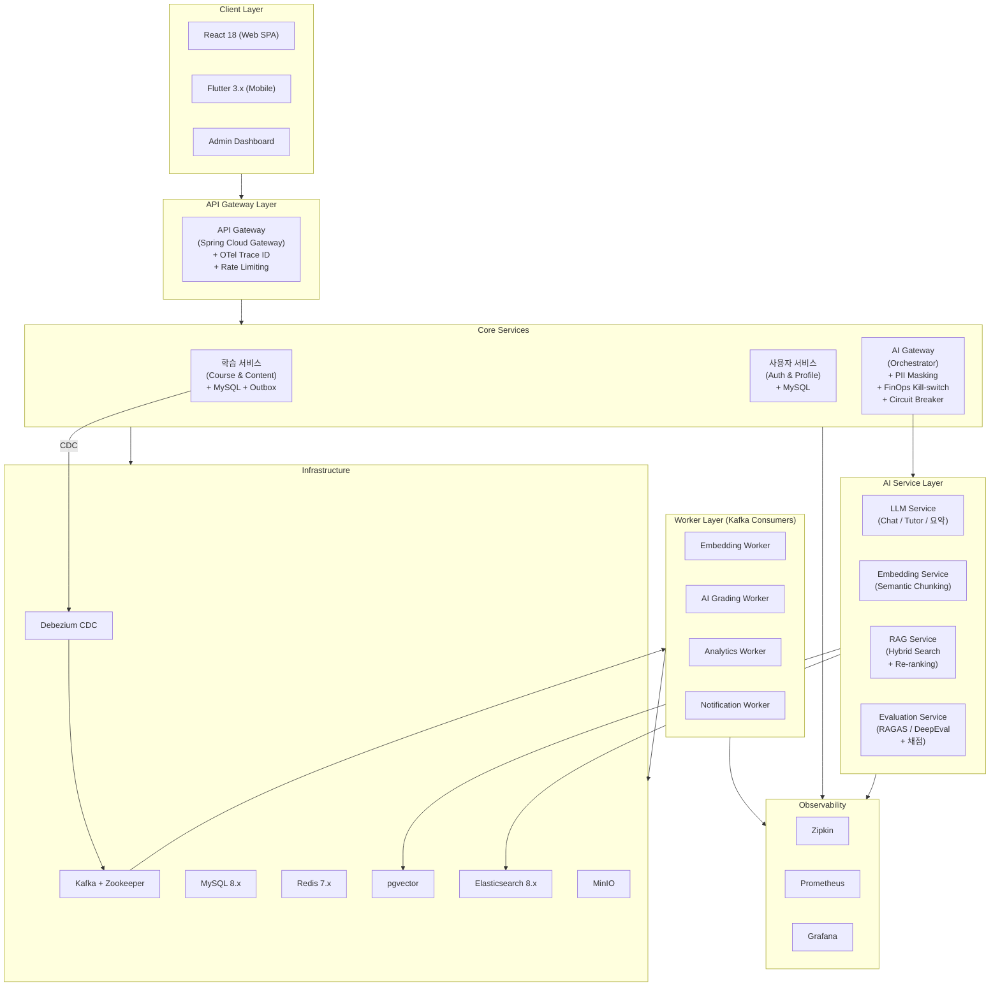
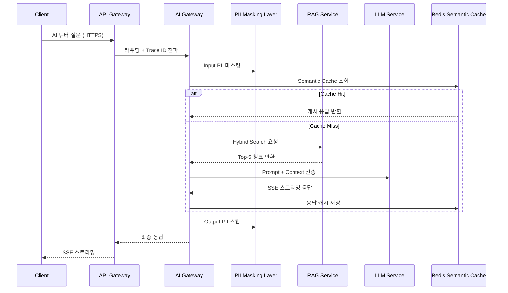
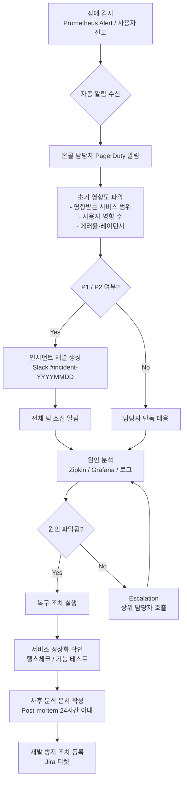
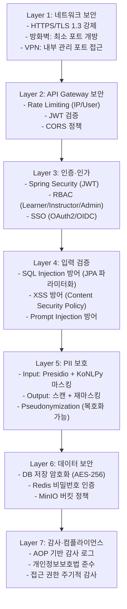

# LearnFlow AI 운영 매뉴얼

## 목차

1. [개요](#1-개요)
2. [시스템 구성](#2-시스템-구성)
3. [인프라 구성](#3-인프라-구성)
4. [일상 운영](#4-일상-운영)
5. [백업 및 복구](#5-백업-및-복구)
6. [장애 대응](#6-장애-대응)
7. [모니터링](#7-모니터링)
8. [보안 운영](#8-보안-운영)
9. [성능 관리](#9-성능-관리)
10. [로그 관리](#10-로그-관리)
11. [변경 이력](#11-변경-이력)

---

## 1. 개요

### 1.1 문서 목적

이 매뉴얼은 LearnFlow AI 시스템의 운영·유지보수 담당자를 위한 운영 절차, 모니터링 기준, 장애 대응 가이드를 제공한다. AI Gateway·Kafka·pgvector 등 AI 특화 컴포넌트의 운영 절차를 포함한다.

### 1.2 대상 독자

| 대상 | 역할 |
|------|------|
| **시스템 운영자** | 서버·컨테이너 관리, 모니터링, 장애 1차 대응 |
| **DBA** | MySQL·pgvector 관리, 백업/복구, 슬로우 쿼리 튜닝 |
| **AI 운영자** | RAGAS 품질 관리, FinOps 비용 통제, 프롬프트 버전 관리 |
| **보안 담당자** | PII Pipeline 운영, API Key 관리, 감사 로그 검토 |

### 1.3 운영 연락처

| 구분 | 담당 | 연락처 | 비고 |
|------|------|--------|------|
| P1 장애 (즉시 대응) | 온콜 운영자 | PagerDuty 알림 | 24×7 |
| AI 품질 이슈 | AI 운영자 | Slack #ai-quality | 평일 09:00~18:00 |
| 보안 사고 | 보안 담당자 | security@learnflow.ai | 24×7 |

---

## 2. 시스템 구성

### 2.1 전체 시스템 구성도



### 2.2 서비스 간 통신 흐름



---

## 3. 인프라 구성

### 3.1 Docker Compose 서비스 목록 (13개)

| 서비스명 | 이미지 | 포트 | 역할 | 의존성 |
|---------|--------|------|------|--------|
| `api` | learnflow/api:latest | 8080 | Spring Boot API 서버 | mysql, redis, kafka, pgvector |
| `web` | learnflow/web:latest | 3000 | React 18 SPA | api |
| `mysql` | mysql:8.0 | 3306 | 사용자·학습 데이터 RDBMS | - |
| `redis` | redis:7-alpine | 6379 | 세션·캐시·Rate Limiting | - |
| `kafka` | confluentinc/cp-kafka:7.5 | 9092 | 이벤트 메시징 브로커 | zookeeper |
| `zookeeper` | confluentinc/cp-zookeeper:7.5 | 2181 | Kafka 코디네이터 | - |
| `debezium` | debezium/connect:2.4 | 8083 | MySQL CDC → Kafka | kafka, mysql |
| `pgvector` | pgvector/pgvector:pg16 | 5432 | 벡터 임베딩 저장소 (RAG) | - |
| `elasticsearch` | elasticsearch:8.11 | 9200, 9300 | BM25 전문 검색 | - |
| `minio` | minio/minio:latest | 9000, 9001 | 파일 오브젝트 스토리지 | - |
| `zipkin` | openzipkin/zipkin:latest | 9411 | 분산 추적 수집기 | - |
| `prometheus` | prom/prometheus:latest | 9090 | 메트릭 수집 및 알림 | - |
| `grafana` | grafana/grafana:latest | 3001 | 대시보드 시각화 | prometheus |

### 3.2 볼륨 및 네트워크 구성

```yaml
# docker-compose.override.yml 핵심 볼륨 구성
volumes:
  mysql_data:        # MySQL 데이터 영구 보존
  redis_data:        # Redis AOF 영구 보존
  kafka_data:        # Kafka 로그 세그먼트
  pgvector_data:     # pgvector 임베딩 데이터
  es_data:           # Elasticsearch 인덱스
  minio_data:        # MinIO 오브젝트 스토리지
  prometheus_data:   # Prometheus TSDB
  grafana_data:      # Grafana 대시보드 설정

networks:
  learnflow_net:
    driver: bridge
    ipam:
      config:
        - subnet: 172.20.0.0/16
```

### 3.3 포트 방화벽 규칙

| 포트 | 서비스 | 외부 노출 | 설명 |
|------|--------|----------|------|
| 443 | API Gateway | ✓ (HTTPS) | 클라이언트 진입점 |
| 3000 | Web SPA | ✓ (HTTPS) | React 앱 |
| 9411 | Zipkin | 내부만 | 분산 추적 UI |
| 3001 | Grafana | 내부만 (VPN) | 모니터링 대시보드 |
| 9090 | Prometheus | 내부만 | 메트릭 조회 |
| 9001 | MinIO Console | 내부만 (VPN) | 파일 관리 |
| 8083 | Debezium | 내부만 | CDC 커넥터 관리 |

### 3.4 환경 변수 관리

민감한 환경 변수는 `.env` 파일 또는 Vault(HashiCorp)로 관리한다. 절대 소스코드 저장소에 커밋하지 않는다.

| 변수 | 설명 | 보관 위치 |
|------|------|----------|
| `ANTHROPIC_API_KEY` | Claude API 키 | Vault / .env (권한 제한) |
| `OPENAI_API_KEY` | OpenAI API 키 (Fallback) | Vault / .env |
| `MYSQL_ROOT_PASSWORD` | MySQL root 비밀번호 | Vault |
| `REDIS_PASSWORD` | Redis 인증 비밀번호 | Vault |
| `JWT_SECRET` | JWT 서명 키 | Vault |
| `MINIO_ACCESS_KEY` | MinIO 접근 키 | Vault |
| `MINIO_SECRET_KEY` | MinIO 비밀 키 | Vault |

---

## 4. 일상 운영

### 4.1 일일 점검 체크리스트

매일 09:00 KST에 다음 항목을 점검한다.

#### 4.1.1 시스템 가용성

```bash
# 헬스체크 API 일괄 확인
curl -sf https://learnflow.ai/actuator/health | jq '.status'
# 기대값: "UP"

# 각 Docker 컨테이너 상태 확인
docker ps --format "table {{.Names}}\t{{.Status}}\t{{.Ports}}"
# 모든 서비스 "Up X hours" 상태여야 함
```

| 점검 항목 | 명령 / 경로 | 정상 기준 |
|----------|------------|----------|
| API 서버 헬스체크 | `GET /actuator/health` | HTTP 200, status=UP |
| MySQL 연결 | `SHOW STATUS LIKE 'Threads_connected'` | < 80% of max_connections |
| Redis 연결 | `redis-cli ping` | PONG |
| Kafka 브로커 | `kafka-topics.sh --list` | 오류 없음 |
| pgvector 연결 | `pg_isready -h pgvector -p 5432` | accepting connections |
| Elasticsearch | `curl :9200/_cluster/health` | status=green |

#### 4.1.2 AI 특화 점검

| 점검 항목 | 확인 방법 | 정상 기준 |
|----------|----------|----------|
| **RAGAS Faithfulness** | Grafana AI Quality 대시보드 | ≥ 0.7 |
| **Hallucination Score** | Grafana AI Quality 대시보드 | ≤ 0.2 |
| **FinOps 일일 비용** | Grafana FinOps 패널 | Soft Limit 70% 미만 |
| **Semantic Cache 히트율** | Grafana FinOps 패널 | ≥ 40% |
| **PII 탐지 건수** | Grafana PII 패널 | 전일 대비 급증 없음 |
| **Kafka Consumer Lag** | Grafana Outbox 패널 | < 1000 messages |
| **DLQ 메시지 수** | `kafka-consumer-groups.sh` | 0 (신규 유입 없음) |

#### 4.1.3 오류 로그 점검

```bash
# 최근 1시간 ERROR 레벨 로그 확인
docker logs learnflow-api --since 1h 2>&1 | grep -E "ERROR|CRITICAL" | tail -50

# AI Gateway 오류 확인
docker logs learnflow-ai-gateway --since 1h 2>&1 | grep "ERROR" | tail -20

# DLQ 메시지 확인 (신규 유입 감시)
kafka-consumer-groups.sh --bootstrap-server kafka:9092 \
  --describe --group dlq-monitor 2>/dev/null | grep -v "^$"
```

### 4.2 주간 점검 체크리스트

매주 월요일 09:00에 수행한다.

| 점검 항목 | 확인 방법 | 조치 기준 |
|----------|----------|----------|
| **디스크 사용량 추이** | Grafana Storage 패널 | 80% 이상 시 확장 계획 수립 |
| **MySQL 슬로우 쿼리** | `pt-query-digest /var/log/mysql/slow.log` | 실행 시간 > 1초 쿼리 튜닝 검토 |
| **Kafka 토픽 오프셋 추이** | Kafka Manager UI | Consumer Lag 누적 증가 시 Worker 스케일아웃 |
| **pgvector INACTIVE 청크** | `SELECT COUNT(*) FROM content_embeddings WHERE status='INACTIVE'` | 90일 초과 건 `DELETED` 처리 (Soft Delete 정책) |
| **SSL 인증서 만료** | `openssl s_client -connect learnflow.ai:443 2>/dev/null \| openssl x509 -noout -dates` | 30일 이내 갱신 |
| **보안 패치 확인** | `docker images --no-trunc \| awk '{print $1":"$2}'` 후 취약점 스캔 | Critical 취약점 즉시 패치 |
| **RAGAS 주간 추이** | Grafana 7일 차트 | 전주 대비 10% 이상 하락 시 프롬프트 검토 |
| **FinOps 주간 비용** | Grafana FinOps 패널 | 예산 70% 초과 시 라우팅 조정 검토 |
| **A/B 테스트 현황** | Admin → A/B 테스트 | 통계적 유의성 달성 시 결과 적용 |

### 4.3 월간 점검 체크리스트

매월 첫째 월요일에 수행한다.

| 점검 항목 | 방법 | 비고 |
|----------|------|------|
| **백업 복구 테스트** | 스테이징 환경에서 전날 백업으로 복구 리허설 | RTO/RPO 달성 여부 측정 |
| **용량 계획 검토** | 3개월 사용량 추이 분석 → 향후 3개월 예측 | 디스크·메모리·토큰 소비량 |
| **접근 권한 감사** | DB 계정, API Key, Vault 접근 권한 전수 검토 | 불필요 계정·키 즉시 삭제 |
| **AI 품질 3층 평가** | 월간 50개 무작위 AI 응답 → 인간 평가자 5점 척도 | 자동 평가와 상관관계 추적 |
| **프롬프트 버전 정리** | 3개월 이상 미사용 프롬프트 버전 아카이브 | 롤백 필요 버전만 보존 |
| **pgvector HNSW 인덱스 재빌드** | `REINDEX INDEX CONCURRENTLY content_embeddings_embedding_idx` | 청크 추가·삭제 많을 경우 |
| **의존성 취약점 스캔** | `trivy image learnflow/api:latest` | High/Critical 취약점 패치 |

---

## 5. 백업 및 복구

### 5.1 백업 정책

| 대상 | 방식 | 주기 | 보관 기간 | 저장 위치 |
|------|------|------|----------|----------|
| **MySQL Full Backup** | `mysqldump --single-transaction` | 매일 02:00 KST | 30일 | MinIO `backup/mysql/daily/` |
| **MySQL WAL (Binlog)** | `mysqlbinlog` 연속 아카이빙 | 실시간 | 7일 | MinIO `backup/mysql/binlog/` |
| **pgvector Full Backup** | `pg_dump -Fc learnflow_vector` | 매일 03:00 KST | 14일 | MinIO `backup/pgvector/` |
| **Redis** | `BGSAVE` (RDB) + AOF | 매시간 RDB, AOF 실시간 | 7일 | 로컬 + MinIO `backup/redis/` |
| **MinIO 파일** | MinIO Client `mc mirror` | 매일 04:00 KST | 90일 | 외부 S3 버킷 |
| **Kafka 토픽** | MirrorMaker2 또는 토픽별 `kafka-dump-log` | 중요 토픽 매일 | 7일 | MinIO `backup/kafka/` |
| **설정 파일** | Git (IaC, docker-compose, .env 제외) | 변경 시 | 영구 | GitHub 저장소 |

### 5.2 백업 자동화 스크립트

```bash
#!/bin/bash
# /opt/learnflow/backup/daily_backup.sh

set -euo pipefail
BACKUP_DATE=$(date +%Y%m%d_%H%M%S)
MINIO_BUCKET="learnflow-backup"
LOG_FILE="/var/log/learnflow/backup_${BACKUP_DATE}.log"

echo "=== LearnFlow AI 일일 백업 시작: ${BACKUP_DATE} ===" | tee -a "$LOG_FILE"

# 1. MySQL Full Backup
echo "[1/5] MySQL Full Backup 시작..." | tee -a "$LOG_FILE"
docker exec learnflow-mysql mysqldump \
  --single-transaction --routines --triggers \
  -u root -p"${MYSQL_ROOT_PASSWORD}" learnflow \
  > "/tmp/mysql_learnflow_${BACKUP_DATE}.sql"
mc cp "/tmp/mysql_learnflow_${BACKUP_DATE}.sql" \
  "minio/${MINIO_BUCKET}/mysql/daily/mysql_learnflow_${BACKUP_DATE}.sql"
echo "[1/5] MySQL 백업 완료" | tee -a "$LOG_FILE"

# 2. pgvector Backup
echo "[2/5] pgvector Backup 시작..." | tee -a "$LOG_FILE"
docker exec learnflow-pgvector pg_dump \
  -U postgres -Fc learnflow_vector \
  > "/tmp/pgvector_${BACKUP_DATE}.dump"
mc cp "/tmp/pgvector_${BACKUP_DATE}.dump" \
  "minio/${MINIO_BUCKET}/pgvector/pgvector_${BACKUP_DATE}.dump"
echo "[2/5] pgvector 백업 완료" | tee -a "$LOG_FILE"

# 3. Redis RDB Snapshot
echo "[3/5] Redis RDB Snapshot 시작..." | tee -a "$LOG_FILE"
docker exec learnflow-redis redis-cli -a "${REDIS_PASSWORD}" BGSAVE
sleep 5
docker cp learnflow-redis:/data/dump.rdb \
  "/tmp/redis_dump_${BACKUP_DATE}.rdb"
mc cp "/tmp/redis_dump_${BACKUP_DATE}.rdb" \
  "minio/${MINIO_BUCKET}/redis/redis_dump_${BACKUP_DATE}.rdb"
echo "[3/5] Redis 백업 완료" | tee -a "$LOG_FILE"

# 4. 임시 파일 정리
rm -f /tmp/mysql_learnflow_*.sql /tmp/pgvector_*.dump /tmp/redis_dump_*.rdb

# 5. 30일 이상 된 백업 삭제
mc rm --recursive --force \
  --older-than 30d "minio/${MINIO_BUCKET}/mysql/daily/"

echo "=== 백업 완료: ${BACKUP_DATE} ===" | tee -a "$LOG_FILE"
```

### 5.3 복구 절차

**RTO (목표 복구 시간)**: 4시간
**RPO (목표 복구 시점)**: 1시간 (MySQL WAL 기준)

#### 5.3.1 MySQL 전체 복구

```bash
# 1. 최신 Full Backup 파일 확인
mc ls minio/learnflow-backup/mysql/daily/ | sort | tail -5

# 2. 백업 파일 다운로드
mc cp minio/learnflow-backup/mysql/daily/mysql_learnflow_YYYYMMDD_HHMMSS.sql /tmp/restore.sql

# 3. MySQL 컨테이너 복구
docker exec -i learnflow-mysql mysql \
  -u root -p"${MYSQL_ROOT_PASSWORD}" learnflow < /tmp/restore.sql

# 4. WAL(Binlog) 적용 (Full Backup 이후 변경분)
# binlog 파일 목록 확인
mc ls minio/learnflow-backup/mysql/binlog/

# binlog 적용 (Full Backup 시점 이후 이벤트만)
mysqlbinlog --start-datetime="YYYY-MM-DD HH:MM:SS" \
  /path/to/binlog.* | mysql -u root -p"${MYSQL_ROOT_PASSWORD}" learnflow

# 5. 데이터 정합성 검증
docker exec learnflow-mysql mysql -u root -p"${MYSQL_ROOT_PASSWORD}" \
  -e "SELECT COUNT(*) FROM learnflow.users; SELECT COUNT(*) FROM learnflow.enrollments;"
```

#### 5.3.2 pgvector 복구

```bash
# 1. 최신 dump 파일 다운로드
mc cp minio/learnflow-backup/pgvector/pgvector_YYYYMMDD_HHMMSS.dump /tmp/pgvector_restore.dump

# 2. pgvector 컨테이너에서 복구
docker exec learnflow-pgvector pg_restore \
  -U postgres -d learnflow_vector \
  --clean --if-exists /tmp/pgvector_restore.dump

# 3. HNSW 인덱스 재빌드 확인
docker exec learnflow-pgvector psql -U postgres learnflow_vector \
  -c "SELECT schemaname, indexname, indexdef FROM pg_indexes WHERE tablename='content_embeddings';"
```

#### 5.3.3 Redis 복구

```bash
# 1. Redis 컨테이너 중지
docker stop learnflow-redis

# 2. RDB 파일 복원
mc cp minio/learnflow-backup/redis/redis_dump_YYYYMMDD.rdb /tmp/dump.rdb
docker cp /tmp/dump.rdb learnflow-redis:/data/dump.rdb

# 3. Redis 재시작
docker start learnflow-redis
docker exec learnflow-redis redis-cli -a "${REDIS_PASSWORD}" ping
```

---

## 6. 장애 대응

### 6.1 장애 등급 정의

| 등급 | 정의 | 예시 | 초기 대응 시간 | 해결 목표 시간 |
|------|------|------|--------------|--------------|
| **P1 (Critical)** | 서비스 전면 중단 또는 데이터 유실 위험 | API Gateway 다운, MySQL 장애 | 15분 이내 | 2시간 이내 |
| **P2 (High)** | 주요 기능 장애 (AI 튜터, 채점 등) | LLM API 장애, Kafka 다운 | 30분 이내 | 4시간 이내 |
| **P3 (Medium)** | 부분 기능 저하 | Elasticsearch 다운 (BM25 검색 불가), Zipkin 다운 | 2시간 이내 | 8시간 이내 |
| **P4 (Low)** | 성능 저하 또는 비핵심 기능 장애 | Grafana 다운, 알림 지연 | 4시간 이내 | 24시간 이내 |

### 6.2 장애 대응 프로세스



### 6.3 주요 장애 시나리오 및 대응 절차

#### 6.3.1 LLM API 장애 → Circuit Breaker 전환

**증상**: AI 튜터 응답 없음, `/ai/chat` API 5xx 오류 급증

**원인 확인**:
```bash
# Circuit Breaker 상태 확인
curl http://localhost:8080/actuator/circuitbreakers | jq '.circuitBreakers.llmService'
# 기대: state = "OPEN" (장애 시 자동 전환)

# LLM API 직접 호출 테스트
curl -X POST https://api.anthropic.com/v1/messages \
  -H "x-api-key: ${ANTHROPIC_API_KEY}" \
  -H "anthropic-version: 2023-06-01" \
  -H "content-type: application/json" \
  -d '{"model":"claude-3-haiku-20240307","max_tokens":10,"messages":[{"role":"user","content":"ping"}]}'
```

**대응 조치**:
1. Circuit Breaker OPEN 상태 → Fallback 응답 자동 적용 (캐시 응답 또는 "현재 AI 서비스가 일시적으로 지연되고 있습니다. 잠시 후 다시 시도해 주세요." 메시지)
2. Anthropic/OpenAI 상태 페이지 확인 (status.anthropic.com, status.openai.com)
3. Claude API 장애 지속 시 → OpenAI GPT Fallback 라우팅으로 수동 전환:
   ```bash
   # AI Gateway 환경 변수에서 기본 LLM 모델 변경
   docker exec learnflow-ai-gateway \
     curl -X POST http://localhost:8081/admin/llm/routing \
     -d '{"primary":"openai","model":"gpt-4o-mini"}'
   ```
4. Circuit Breaker는 60초마다 HALF-OPEN 상태로 전환 후 자동 재시도한다. 성공 시 CLOSED(정상) 복귀.

#### 6.3.2 Kafka 다운 → Outbox 보관

**증상**: 이벤트 기반 기능 정지 (임베딩 생성, 채점 지연, 알림 미발송)

**원인 확인**:
```bash
# Kafka 컨테이너 상태 확인
docker ps | grep kafka
docker logs learnflow-kafka --tail 50

# Zookeeper 연결 확인
echo ruok | nc zookeeper 2181
```

**대응 조치**:
1. Outbox Pattern에 의해 모든 이벤트는 MySQL `outbox_events` 테이블에 `PENDING` 상태로 보관된다. **이벤트 유실 없음** 보장.
2. Kafka 재시작:
   ```bash
   docker restart learnflow-zookeeper
   sleep 10
   docker restart learnflow-kafka
   ```
3. Kafka 정상화 후 Debezium CDC가 자동으로 미처리 Outbox 이벤트를 폴링하여 전송한다.
4. Consumer Lag 해소까지 일시적으로 처리 지연이 발생할 수 있다. Grafana Consumer Lag 패널로 해소 추이를 모니터링한다.
5. `outbox_events`에서 `retry_count ≥ max_retries(5)` 건은 `DEAD_LETTER` 상태로 변경되어 DLQ 토픽으로 이관된다.

#### 6.3.3 AI 비용 폭주 → Kill-switch 발동

**증상**: Grafana FinOps 패널에서 Hard Limit 임박 알림, `CostThresholdReached` 이벤트 발생

**원인 확인**:
```bash
# 최근 1시간 AI 비용 상위 서비스 조회
docker exec learnflow-mysql mysql -u root -p"${MYSQL_ROOT_PASSWORD}" learnflow \
  -e "SELECT service, SUM(cost_usd) as total_cost, COUNT(*) as calls
      FROM ai_cost_logs
      WHERE created_at >= NOW() - INTERVAL 1 HOUR
      GROUP BY service ORDER BY total_cost DESC;"

# Semantic Cache 히트율 확인
docker exec learnflow-mysql mysql -u root -p"${MYSQL_ROOT_PASSWORD}" learnflow \
  -e "SELECT SUM(cache_hit)/COUNT(*) as hit_rate FROM ai_cost_logs WHERE created_at >= NOW() - INTERVAL 1 HOUR;"
```

**대응 조치**:
1. **Soft Limit 도달**: 관리자에게 Slack 알림 발송. 자동으로 고비용 모델 → 경량 모델로 라우팅 전환.
2. **Hard Limit 도달**: Kill-switch 자동 발동 → AI 기능이 "현재 AI 서비스가 일시 중단되었습니다" 안내로 전환.
3. 수동 Kill-switch 해제 (Hard Limit 조정 또는 예산 추가 후):
   ```bash
   # Admin API로 Kill-switch 해제
   curl -X POST http://localhost:8080/admin/finops/kill-switch \
     -H "Authorization: Bearer ${ADMIN_TOKEN}" \
     -d '{"enabled": false, "service": "ALL"}'
   ```
4. 비용 급증 원인(특정 사용자 과다 요청, 프롬프트 비효율 등) 파악 후 근본 조치.

#### 6.3.4 PII 유출 의심 → Output 스캔 및 격리

**증상**: Grafana PII 패널에서 Output PII 탐지 건수 급증, 보안 알림 수신

**원인 확인**:
```bash
# 최근 PII 탐지 로그 조회
docker logs learnflow-ai-gateway --since 1h 2>&1 | grep "PII_DETECTED"

# 감사 로그에서 해당 사용자·메시지 조회
docker exec learnflow-mysql mysql -u root -p"${MYSQL_ROOT_PASSWORD}" learnflow \
  -e "SELECT * FROM audit_logs WHERE entity_type='AI_MESSAGE' AND action='PII_DETECTED' ORDER BY created_at DESC LIMIT 20;"
```

**대응 조치**:
1. PII가 포함된 AI 응답이 탐지되면 Output 스캔 레이어(Presidio + KoNLPy)가 자동으로 마스킹 처리 후 응답한다.
2. 탐지된 PII 유형(이름, 이메일, 전화번호 등)과 원문 컨텍스트를 분석하여 강의 콘텐츠에 포함된 PII 여부를 확인한다.
3. 강의 콘텐츠 내 PII 발견 시 해당 청크를 `INACTIVE` 처리하고 콘텐츠 수정을 강사에게 요청한다.
4. 개인정보보호법 위반 소지 시 보안 담당자 및 법무팀에 즉시 보고한다.
5. 사고 대응 보고서를 72시간 이내 작성한다.

---

## 7. 모니터링

### 7.1 Grafana 대시보드 구성

Grafana 접속 URL: `http://grafana:3001` (VPN 또는 내부 네트워크)

#### 7.1.1 AI Quality 대시보드

| 패널명 | 지표 | 쿼리 예시 |
|--------|------|----------|
| RAGAS Faithfulness 추이 | `ragas_faithfulness_avg` (7일 라인차트) | `avg_over_time(ragas_faithfulness[1d])` |
| RAGAS Context Precision | `ragas_context_precision_avg` | `avg_over_time(ragas_context_precision[1d])` |
| Hallucination Score | `deepeval_hallucination_avg` | `avg_over_time(deepeval_hallucination[1d])` |
| 사용자 피드백 비율 | `ai_feedback_positive_ratio` | `rate(ai_feedback_positive_total[1h]) / rate(ai_feedback_total[1h])` |
| 프롬프트 버전별 품질 | `ragas_score by (prompt_version)` | `avg by(prompt_version)(ragas_overall_score)` |

#### 7.1.2 RAG Performance 대시보드

| 패널명 | 지표 | 임계치 |
|--------|------|--------|
| RAG 파이프라인 P95 레이턴시 | `rag_pipeline_latency_p95` | < 2500ms |
| Query Rewrite 처리 시간 | `rag_query_rewrite_ms` | < 150ms |
| Hybrid Search 처리 시간 | `rag_hybrid_search_ms` | < 200ms |
| Re-ranking 처리 시간 | `rag_reranking_ms` | < 300ms |
| pgvector HNSW 검색 시간 | `pgvector_search_ms` | < 100ms |
| Elasticsearch BM25 검색 시간 | `es_search_ms` | < 100ms |
| 청크 검색 수 (Top-K) | `rag_retrieved_chunks_avg` | 20 (Vector) + 20 (BM25) → 5 (최종) |

#### 7.1.3 FinOps 대시보드

| 패널명 | 지표 |
|--------|------|
| 오늘 누적 AI 비용 (서비스별) | `ai_cost_usd_today by (service)` |
| 이번 달 AI 비용 vs 예산 | `ai_cost_usd_month` vs `finops_budget_monthly` |
| Semantic Cache 히트율 | `ai_cache_hit_ratio` |
| 모델 라우팅 분포 | `ai_model_usage_ratio by (model)` |
| Unit Economics (세션당 비용) | `ai_cost_per_session` |
| Kill-switch 상태 | `finops_kill_switch_active` |

#### 7.1.4 PII 대시보드

| 패널명 | 지표 |
|--------|------|
| Input PII 탐지 건수 (유형별) | `pii_detected_input by (entity_type)` |
| Output PII 탐지 건수 (유형별) | `pii_detected_output by (entity_type)` |
| PII 마스킹 처리 시간 | `pii_masking_latency_ms` |
| Pseudonymization 매핑 수 | `pii_pseudonym_mappings_total` |

#### 7.1.5 Outbox + Consumer Lag 대시보드

| 패널명 | 지표 | 알림 임계치 |
|--------|------|------------|
| Outbox PENDING 건수 | `outbox_pending_count` | > 100 건 5분 지속 |
| Consumer Lag (워커별) | `kafka_consumer_lag by (group, topic)` | > 1000 messages |
| DLQ 메시지 수 (토픽별) | `kafka_dlq_message_count` | > 0 (즉시 알림) |
| Outbox 릴레이 성공률 | `outbox_relay_success_rate` | < 99% |
| 이벤트 처리 지연 (P99) | `event_processing_latency_p99` | > 30초 |

### 7.2 Prometheus 알림 규칙

```yaml
# /etc/prometheus/rules/learnflow_alerts.yml
groups:
  - name: learnflow_critical
    rules:
      # P1: 서비스 다운
      - alert: APIGatewayDown
        expr: up{job="learnflow-api"} == 0
        for: 1m
        labels:
          severity: critical
          priority: P1
        annotations:
          summary: "API Gateway 다운"
          description: "API Gateway가 1분 이상 응답하지 않습니다."

      # P1: MySQL 연결 실패
      - alert: MySQLConnectionFailure
        expr: mysql_up == 0
        for: 1m
        labels:
          severity: critical
          priority: P1
        annotations:
          summary: "MySQL 연결 불가"

      # P2: LLM API 오류율 급증
      - alert: LLMAPIErrorRateHigh
        expr: rate(llm_api_errors_total[5m]) / rate(llm_api_requests_total[5m]) > 0.1
        for: 5m
        labels:
          severity: high
          priority: P2
        annotations:
          summary: "LLM API 오류율 10% 초과"

      # P2: Kafka Consumer Lag 임계치 초과
      - alert: KafkaConsumerLagHigh
        expr: kafka_consumer_group_lag > 1000
        for: 5m
        labels:
          severity: high
          priority: P2
        annotations:
          summary: "Kafka Consumer Lag {{ $value }} messages"

      # P2: DLQ 메시지 유입
      - alert: DLQMessageReceived
        expr: increase(kafka_dlq_message_count[5m]) > 0
        labels:
          severity: high
          priority: P2
        annotations:
          summary: "DLQ에 신규 메시지 유입"

      # P2: FinOps Hard Limit 90% 도달
      - alert: FinOpsHardLimitApproaching
        expr: ai_cost_usd_today / finops_hard_limit_daily > 0.9
        labels:
          severity: high
          priority: P2
        annotations:
          summary: "AI 일일 비용이 Hard Limit의 90%에 도달"

      # P3: RAGAS Faithfulness 하락
      - alert: RAGASFaithfulnessLow
        expr: avg_over_time(ragas_faithfulness[1h]) < 0.7
        for: 30m
        labels:
          severity: medium
          priority: P3
        annotations:
          summary: "RAGAS Faithfulness {{ $value }} (임계치: 0.7)"

      # P3: PII 탐지 급증
      - alert: PIIDetectionSpike
        expr: increase(pii_detected_output[1h]) > 10
        labels:
          severity: medium
          priority: P3
        annotations:
          summary: "Output PII 탐지 건수 급증: {{ $value }}건/시간"
```

### 7.3 Zipkin 분산 추적

Zipkin UI: `http://zipkin:9411`

#### 7.3.1 AI 요청 추적

AI 요청은 100% 샘플링으로 추적된다 (일반 요청: prod 10~30%).

| 추적 시나리오 | Zipkin 검색 방법 |
|-------------|----------------|
| AI 튜터 응답 지연 원인 파악 | `serviceName=ai-gateway AND duration>3000ms` |
| RAG 파이프라인 병목 | `serviceName=rag-service AND spanName=hybrid_search` |
| LLM API 호출 비용 추적 | `tags[ai.cost_usd]>0.01` |
| PII 마스킹 처리 시간 | `spanName=pii_masking` |
| 5xx 오류 전체 추적 | `tags[http.status_code]=500` |

#### 7.3.2 주요 Span Attributes

```
user.id              - 사용자 ID (PII 마스킹 적용)
course.id            - 강의 ID
ai.model             - 사용된 LLM 모델명
ai.tokens.input      - 입력 토큰 수
ai.tokens.output     - 출력 토큰 수
ai.cost_usd          - 해당 요청 AI 비용 (USD)
rag.chunks_retrieved - RAG 검색 결과 청크 수
rag.rerank_score     - Re-ranking 최고 점수
cache.hit            - Semantic Cache 적중 여부
pii.detected         - PII 탐지 여부
```

---

## 8. 보안 운영

### 8.1 7 Layer 보안 모델



### 8.2 PII Pipeline 운영

#### 8.2.1 PII 처리 흐름

```
사용자 AI 입력
    → [Input PII 스캔] Presidio (영어) + KoNLPy (한국어)
    → PII 발견 시: Pseudonymization (가역적 치환)
       예: "홍길동이 물어봤는데" → "[PERSON_001]이 물어봤는데"
    → LLM API 전송 (마스킹된 텍스트)
    → LLM 응답 수신
    → [Output PII 스캔]: 응답에 PII 포함 여부 재검사
    → PII 발견 시: 마스킹 처리 후 사용자에게 전달
    → Pseudonymization 매핑 테이블에서 역복원 (필요한 경우만)
```

#### 8.2.2 PII 탐지 규칙 관리

```bash
# Presidio 커스텀 인식기 설정 확인 (한국 전화번호, 주민번호 등)
docker exec learnflow-ai-gateway \
  curl http://localhost:8082/recognizers | jq '.[] | {name:.name, supported_entities:.supported_entities}'

# KoNLPy NER 모델 상태 확인
docker exec learnflow-ai-gateway python3 -c \
  "from konlpy.tag import Kkma; k=Kkma(); print(k.pos('홍길동 씨가 서울에서'))"
```

### 8.3 API Key 관리

| API | 키 위치 | 교체 주기 | 교체 절차 |
|-----|--------|----------|----------|
| **Anthropic Claude API** | Vault → 환경 변수 주입 | 90일 또는 유출 의심 시 | 신키 발급 → Vault 업데이트 → 컨테이너 재시작 (무중단) |
| **OpenAI GPT API** | Vault → 환경 변수 주입 | 90일 | 동일 |
| **MinIO Access Key** | Vault | 180일 | MinIO Console에서 신키 생성 후 교체 |
| **JWT Secret** | Vault | 정기 교체 불필요 (유출 시 즉시) | 교체 시 모든 활성 세션 무효화 |

```bash
# API Key 교체 절차 (Claude API 예시)
# 1. Vault에 신규 키 저장
vault kv put secret/learnflow/anthropic ANTHROPIC_API_KEY="sk-ant-NEW_KEY"

# 2. 무중단 교체: 신규 컨테이너 시작 후 구형 교체
docker service update --env-add ANTHROPIC_API_KEY="sk-ant-NEW_KEY" learnflow_api-service

# 3. 구 키 즉시 비활성화 (Anthropic 콘솔에서)
echo "Anthropic Console에서 구 API Key 비활성화 필요"
```

### 8.4 접근 제어

| 자원 | 접근 제어 방식 |
|------|-------------|
| MySQL | 역할별 DB 사용자 (app_user, readonly_user, dba_user); 최소 권한 원칙 |
| pgvector | `app_vector` 사용자: SELECT, INSERT, UPDATE만 허용 |
| Redis | 비밀번호 인증 + ACL (서비스별 키 네임스페이스 분리) |
| MinIO | 버킷별 IAM 정책 (API 서버: 읽기+쓰기, 백업 계정: 쓰기 전용) |
| Grafana | OAuth2 SSO 연동, 역할별 대시보드 접근 제한 |
| Prometheus | 내부 네트워크만 접근 허용 |

---

## 9. 성능 관리

### 9.1 SLA 목표

| 지표 | 목표 | 측정 방법 |
|------|------|----------|
| **서비스 가용률** | 99.9% (월간 다운타임 ≤ 43.8분) | Prometheus `up` 메트릭 |
| **API P95 응답시간** | < 500ms (AI 요청 제외) | `http_request_duration_p95` |
| **AI 튜터 P95 응답시간** | < 3000ms (첫 토큰) | `ai_first_token_latency_p95` |
| **RAG 파이프라인 P95** | < 2500ms | `rag_pipeline_latency_p95` |
| **Kafka 이벤트 처리 P99** | < 30초 | `event_processing_latency_p99` |
| **RAGAS Faithfulness** | ≥ 0.7 | Grafana AI Quality 패널 |

### 9.2 스케일링 전략

#### 9.2.1 수평 스케일아웃 조건

| 서비스 | 스케일아웃 조건 | 방법 |
|--------|--------------|------|
| API 서버 | CPU > 70% (5분 지속) 또는 P95 > 500ms | `docker service scale learnflow_api=N` |
| AI Gateway | AI 요청 큐 > 50 또는 P95 > 2000ms | 레플리카 추가 |
| Embedding Worker | Kafka Consumer Lag > 500 | Worker 레플리카 추가 |
| AI Grading Worker | 채점 대기 > 100건 | Worker 레플리카 추가 |

#### 9.2.2 캐싱 전략 최적화

```bash
# Semantic Cache 히트율 낮을 경우 (< 40%) 조정
# Redis에서 Semantic Cache 통계 확인
docker exec learnflow-redis redis-cli -a "${REDIS_PASSWORD}" \
  INFO stats | grep -E "keyspace_hits|keyspace_misses"

# 유사도 임계치 조정 (기본 0.92 → 히트율 낮으면 0.88로 낮춤)
# AI Gateway 설정
curl -X PUT http://localhost:8081/admin/cache/semantic-threshold \
  -H "Authorization: Bearer ${ADMIN_TOKEN}" \
  -d '{"threshold": 0.88}'
```

#### 9.2.3 DB 쿼리 최적화

```sql
-- 슬로우 쿼리 상위 10개 확인
SELECT query, calls, total_exec_time, mean_exec_time, rows
FROM pg_stat_statements
ORDER BY mean_exec_time DESC
LIMIT 10;

-- MySQL에서 EXPLAIN으로 실행 계획 확인
EXPLAIN ANALYZE
SELECT cm.concept, cm.mastery_score, cm.confidence
FROM concept_mastery cm
WHERE cm.user_id = ? AND cm.course_id = ?
ORDER BY cm.mastery_score ASC;
```

---

## 10. 로그 관리

### 10.1 로그 유형 및 위치

| 로그 유형 | 위치 | 보관 기간 | 형식 |
|----------|------|----------|------|
| **애플리케이션 로그** | `/var/log/learnflow/app/*.log` + Docker stdout | 30일 | JSON (logback) |
| **AI 요청/응답 로그** | MySQL `ai_chat_messages` + 별도 파일 | 90일 | JSON |
| **감사 로그 (AOP)** | MySQL `audit_logs` | 1년 (법적 요구) | JSON |
| **비용 로그** | MySQL `ai_cost_logs` | 1년 | JSON |
| **PII 탐지 로그** | 별도 보안 로그 (암호화 저장) | 1년 | JSON (암호화) |
| **Kafka Consumer 로그** | Docker stdout | 14일 | JSON |
| **Nginx Access 로그** | `/var/log/nginx/access.log` | 14일 | Combined |

### 10.2 애플리케이션 로그 구조

```json
{
  "timestamp": "2026-04-02T09:00:00.000Z",
  "level": "INFO",
  "service": "learnflow-api",
  "traceId": "abc123def456",
  "spanId": "789ghi",
  "userId": "1234",
  "courseId": "56",
  "message": "AI 튜터 요청 처리 완료",
  "duration_ms": 1850,
  "extra": {}
}
```

### 10.3 AI 요청/응답 로그 구조

```json
{
  "timestamp": "2026-04-02T09:00:01.000Z",
  "traceId": "abc123def456",
  "userId": "1234",
  "sessionId": "sess_789",
  "model": "claude-3-5-sonnet-20241022",
  "service": "TUTOR",
  "input_tokens": 1250,
  "output_tokens": 380,
  "cost_usd": 0.00284,
  "cache_hit": false,
  "rag_chunks": 5,
  "faithfulness": 0.87,
  "latency_ms": 1850,
  "pii_detected_input": false,
  "pii_detected_output": false
}
```

### 10.4 감사 로그 (AOP 기반)

Spring AOP `@AuditLog` 어노테이션이 적용된 모든 서비스 메서드 호출 시 자동 기록된다.

```json
{
  "timestamp": "2026-04-02T09:00:00.000Z",
  "userId": "1234",
  "action": "ASSIGNMENT_APPEAL_SUBMITTED",
  "entityType": "ASSIGNMENT_SUBMISSION",
  "entityId": "7890",
  "beforeValue": {"status": "AI_GRADED", "ai_score": 72},
  "afterValue": {"status": "APPEALED", "appeal_reason": "루브릭 3번 항목 누락"},
  "ipAddress": "203.0.113.42",
  "userAgent": "Mozilla/5.0 ...",
  "traceId": "abc123def456"
}
```

### 10.5 로그 조회 명령어

```bash
# 최근 1시간 ERROR 이상 로그
docker logs learnflow-api --since 1h 2>&1 | grep -E '"level":"ERROR"'

# 특정 traceId로 전체 서비스 로그 추적
TRACE_ID="abc123def456"
for svc in api ai-gateway embedding-worker grading-worker; do
  echo "=== $svc ==="
  docker logs learnflow-${svc} --since 24h 2>&1 | grep "$TRACE_ID"
done

# AI 비용 상위 요청 조회 (지난 24시간)
docker exec learnflow-mysql mysql -u root -p"${MYSQL_ROOT_PASSWORD}" learnflow \
  -e "SELECT user_id, service, model, cost_usd, created_at
      FROM ai_cost_logs
      WHERE created_at >= NOW() - INTERVAL 24 HOUR
      ORDER BY cost_usd DESC LIMIT 20;"

# DLQ 메시지 내용 확인
docker exec learnflow-kafka kafka-console-consumer.sh \
  --bootstrap-server kafka:9092 \
  --topic learnflow.dlq \
  --from-beginning \
  --max-messages 10
```

### 10.6 로그 보관 및 삭제 정책

```bash
# 30일 이상된 애플리케이션 로그 삭제 (cron: 매일 01:00)
find /var/log/learnflow/app/ -name "*.log" -mtime +30 -delete

# MySQL 감사 로그 1년 초과분 아카이브 후 삭제 (cron: 매월 1일 03:00)
docker exec learnflow-mysql mysql -u root -p"${MYSQL_ROOT_PASSWORD}" learnflow \
  -e "DELETE FROM audit_logs WHERE created_at < NOW() - INTERVAL 1 YEAR;"

# AI 비용 로그 1년 초과분 정리 (동일)
docker exec learnflow-mysql mysql -u root -p"${MYSQL_ROOT_PASSWORD}" learnflow \
  -e "DELETE FROM ai_cost_logs WHERE created_at < NOW() - INTERVAL 1 YEAR;"
```

---

## 11. 변경 이력

| 버전 | 날짜 | 작성자 | 변경 내용 |
|------|------|--------|-----------|
| v1.0 | 2026-04-02 | AI Assistant | 최초 작성 |
